# Física — ITA 2008

> 30 questões. Q01–Q20 múltipla escolha; Q21–Q30 discursivas.

## Q01
**Assunto:** circuitos
**Competências:** associação de fontes, circuitos com chave, lâmpadas em paralelo, análise qualitativa de brilho
**Tipo:** múltipla escolha

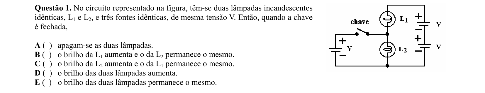

## Q02
**Assunto:** gravitação
**Competências:** terceira lei de Kepler, órbita circular, lei da gravitação universal, razão de massas
**Tipo:** múltipla escolha

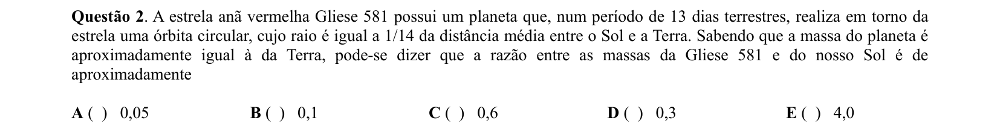

## Q03
**Assunto:** estática
**Competências:** equilíbrio de corpos rígidos, momento de forças, decomposição de forças, vínculos sem atrito
**Tipo:** múltipla escolha

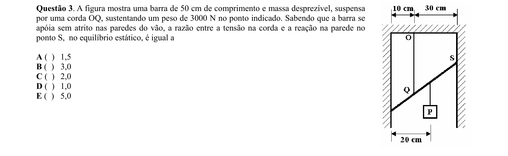

## Q04
**Assunto:** gravitação
**Competências:** aceleração gravitacional aparente, rotação da Terra, força centrípeta, latitude
**Tipo:** múltipla escolha

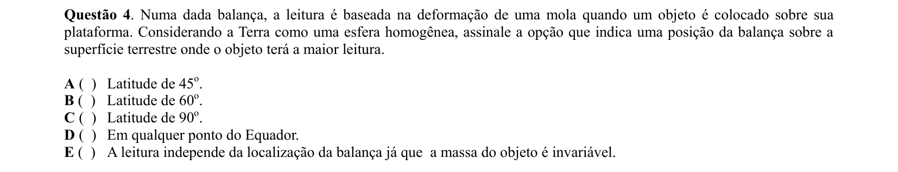

## Q05
**Assunto:** ondulatória
**Competências:** análise dimensional, intensidade de onda, dependência funcional, grandezas físicas
**Tipo:** múltipla escolha

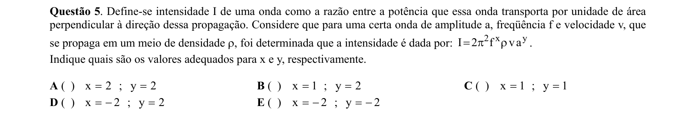

## Q06
**Assunto:** ondulatória
**Competências:** movimento harmônico simples, defasagem entre osciladores, função horária do MHS, amplitude
**Tipo:** múltipla escolha

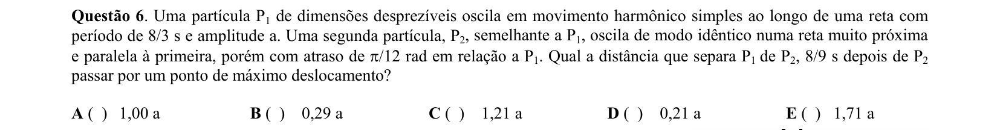

## Q07
**Assunto:** magnetismo
**Competências:** campo magnético de fio retilíneo, regra da mão direita, superposição de campos, simetria
**Tipo:** múltipla escolha

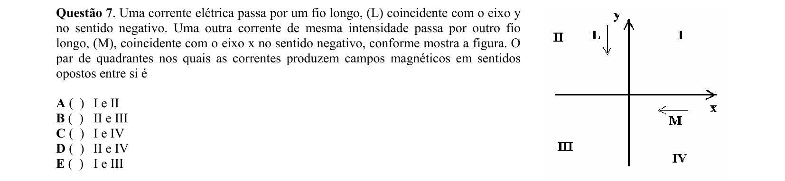

## Q08
**Assunto:** magnetismo
**Competências:** torque em espira, momento magnético, otimização geométrica, espira circular
**Tipo:** múltipla escolha

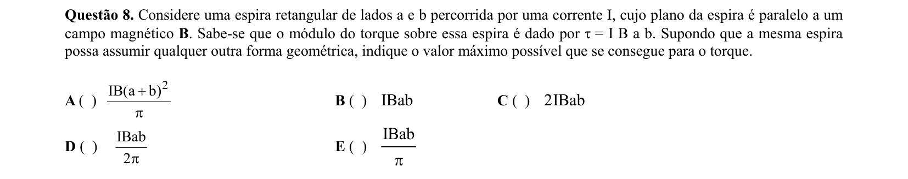

## Q09
**Assunto:** física moderna
**Competências:** aniquilação elétron-pósitron, conservação de energia, dualidade onda-partícula, equivalência massa-energia
**Tipo:** múltipla escolha

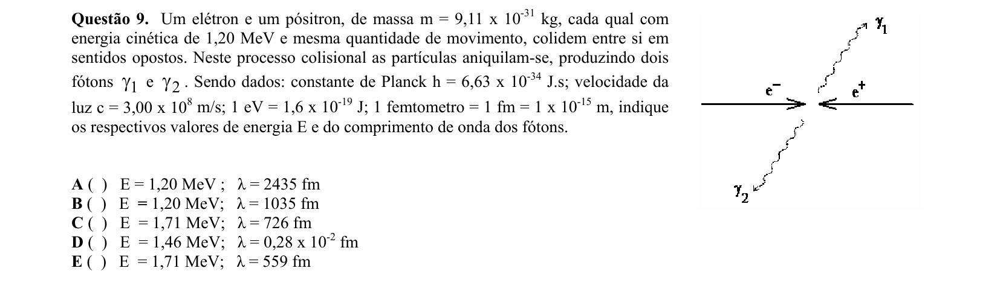

## Q10
**Assunto:** eletromagnetismo
**Competências:** indução eletromagnética, fluxo magnético, lei de Faraday, carga induzida
**Tipo:** múltipla escolha

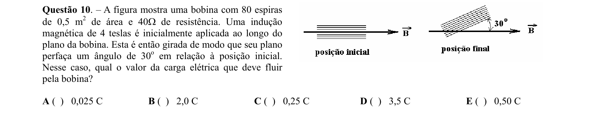

## Q11
**Assunto:** eletromagnetismo
**Competências:** força magnética sobre condutor, gerador de corrente constante, dinâmica em campo magnético, lei de Lenz
**Tipo:** múltipla escolha

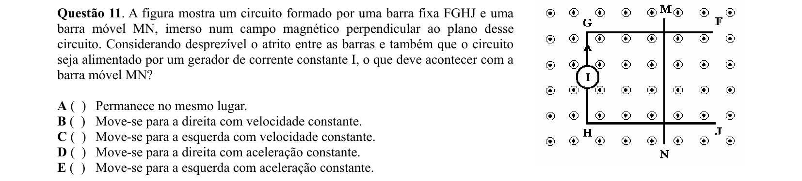

## Q12
**Assunto:** dinâmica
**Competências:** plano inclinado, força de atrito, conservação de energia, leis de Newton
**Tipo:** múltipla escolha

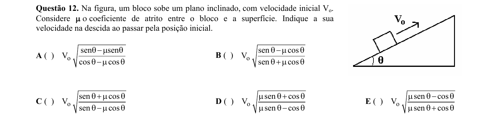

## Q13
**Assunto:** dinâmica
**Competências:** conservação do momento linear, lançamento oblíquo, sistemas de partículas, referencial do CM
**Tipo:** múltipla escolha

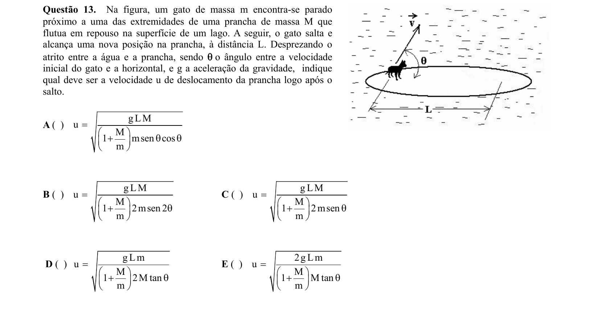

## Q14
**Assunto:** trabalho e energia
**Competências:** conservação de energia mecânica, energia potencial elástica, mola deformada, geometria do sistema
**Tipo:** múltipla escolha

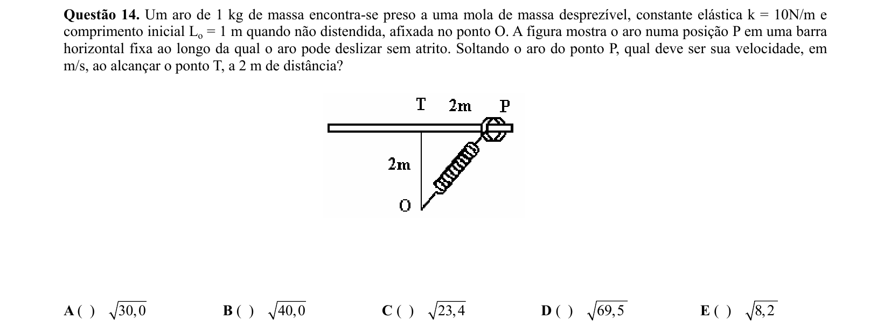

## Q15
**Assunto:** ondulatória
**Competências:** impedância acústica, reflexão e transmissão de ondas, velocidade em meios elásticos, inversão de fase
**Tipo:** múltipla escolha

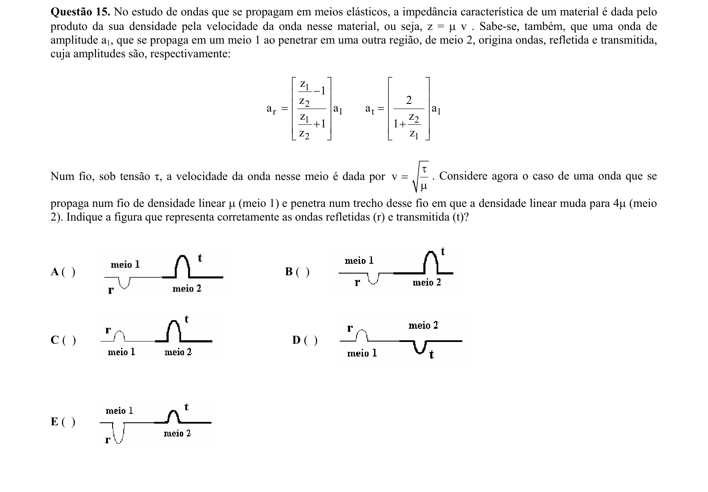

## Q16
**Assunto:** ondulatória
**Competências:** análise de Fourier, harmônicos, superposição de ondas, leitura de gráficos
**Tipo:** múltipla escolha

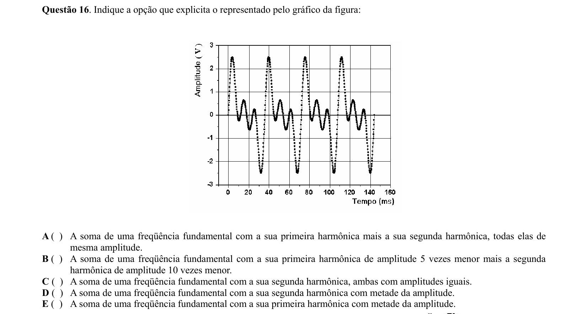

## Q17
**Assunto:** dinâmica
**Competências:** movimento circular, tensão em corda, conservação de energia, colisão perfeitamente inelástica
**Tipo:** múltipla escolha

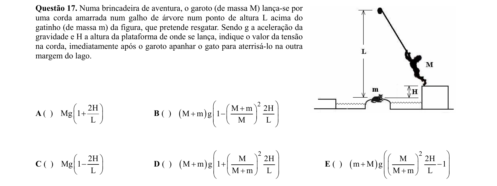

## Q18
**Assunto:** óptica física
**Competências:** interferência de dupla fenda, máximos e mínimos, comprimento de onda, padrão de interferência
**Tipo:** múltipla escolha

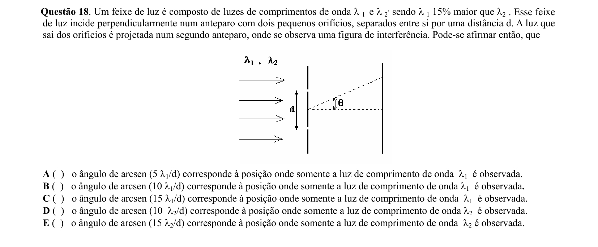

## Q19
**Assunto:** eletrostática
**Competências:** capacitância de placas paralelas, dielétricos, associação em série, constante dielétrica
**Tipo:** múltipla escolha

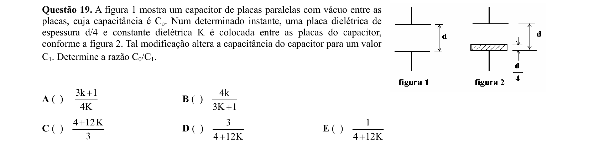

## Q20
**Assunto:** termodinâmica
**Competências:** processo adiabático quase-estático, trabalho em gás ideal, gás diatômico, coeficiente adiabático
**Tipo:** múltipla escolha

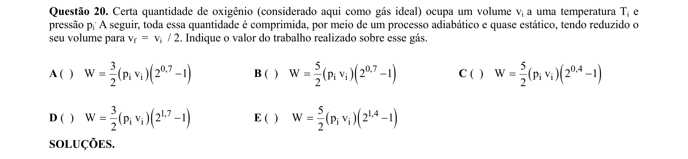

## Q21
**Assunto:** eletrostática
**Competências:** potencial em condutor esférico, transferência de carga por contato, indução eletrostática, aproximação binomial
**Tipo:** discursiva

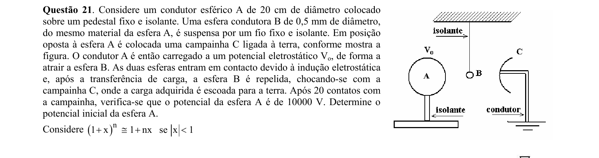

## Q22
**Assunto:** dinâmica
**Competências:** equilíbrio de balança, terceira lei de Newton, sistemas fechados, sustentação aerodinâmica
**Tipo:** discursiva

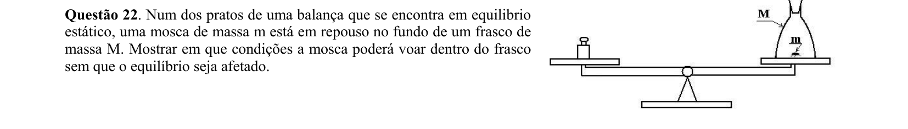

## Q23
**Assunto:** dinâmica
**Competências:** coeficiente de restituição, colisão obliqua, decomposição de velocidades, geometria do choque
**Tipo:** discursiva

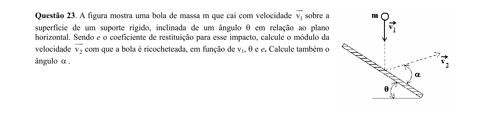

## Q24
**Assunto:** acústica
**Competências:** reflexão sonora, velocidade do som, geometria de trajetórias, diferença de tempo
**Tipo:** discursiva

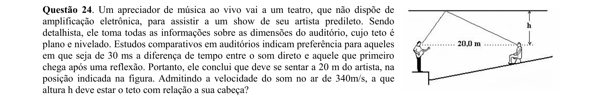

## Q25
**Assunto:** eletrodinâmica
**Competências:** ponte de Wheatstone, resistividade e temperatura, segunda lei de Ohm, leitura de gráficos
**Tipo:** discursiva

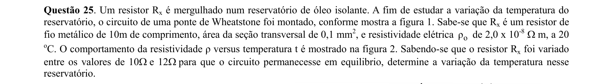

## Q26
**Assunto:** dinâmica
**Competências:** movimento circular uniforme, condição de tombamento, condição de deslizamento, força de atrito estático
**Tipo:** discursiva

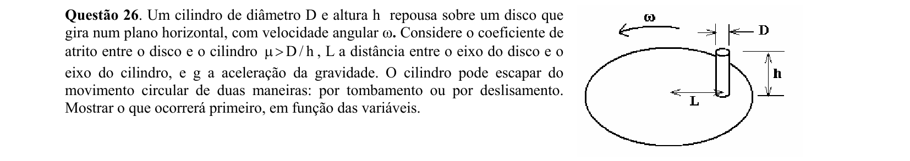

## Q27
**Assunto:** calorimetria
**Competências:** calor sensível e latente, rendimento energético, calor de vaporização, potência elétrica
**Tipo:** discursiva

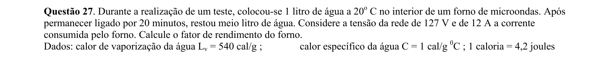

## Q28
**Assunto:** circuitos
**Competências:** transformador ideal, razão de espiras, conservação de potência, corrente alternada
**Tipo:** discursiva

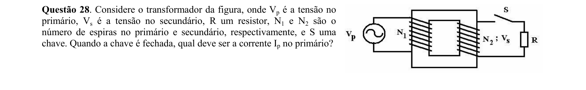

## Q29
**Assunto:** termodinâmica
**Competências:** lei de Stefan-Boltzmann, balanço radiativo, emissividade, aproximação binomial
**Tipo:** discursiva

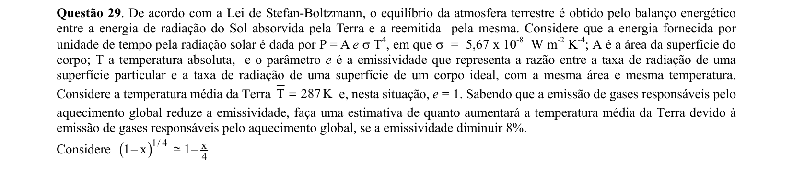

## Q30
**Assunto:** óptica geométrica
**Competências:** refração da luz, lei de Snell, formação do arco-íris, geometria de trajetórias
**Tipo:** discursiva

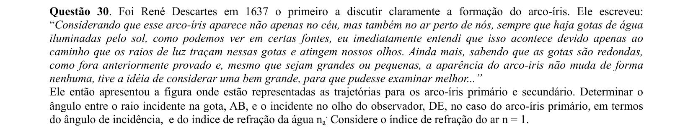
