# Física — ITA 2009

> 30 questões. Q01–Q20 múltipla escolha; Q21–Q30 discursivas.

## Q01
**Assunto:** dinâmica
**Competências:** análise dimensional, momento angular, produto vetorial, grandezas físicas
**Tipo:** múltipla escolha

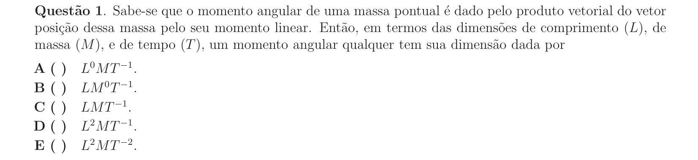

## Q02
**Assunto:** eletrodinâmica
**Competências:** movimento de carga em campo elétrico, MRUV, força elétrica, cinemática, interpretação de gráficos
**Tipo:** múltipla escolha

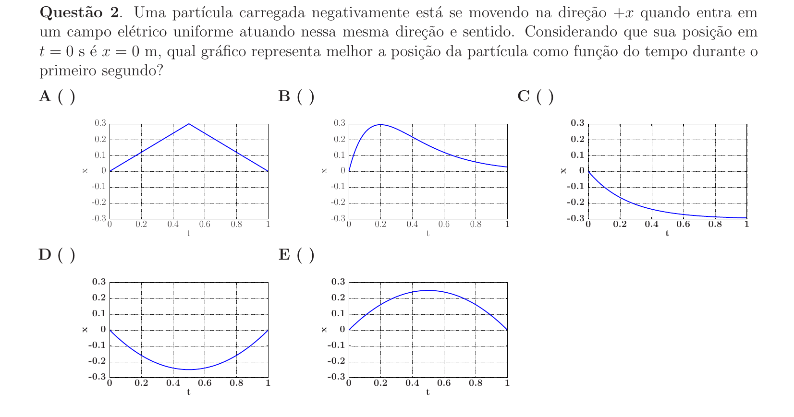

## Q03
**Assunto:** cinemática
**Competências:** velocidade relativa, movimento em correnteza, velocidade média, sistema de equações
**Tipo:** múltipla escolha

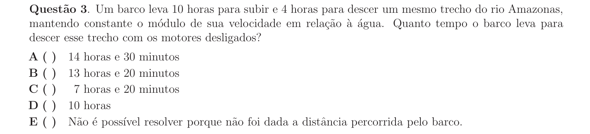

## Q04
**Assunto:** cinemática
**Competências:** velocidade média escalar, velocidade média vetorial, deslocamento, geometria vetorial
**Tipo:** múltipla escolha

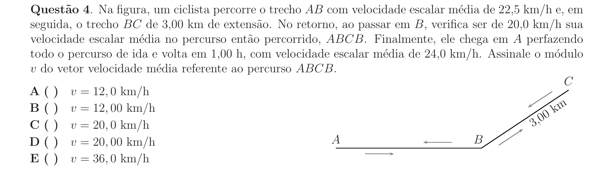

## Q05
**Assunto:** dinâmica
**Competências:** atrito cinético, conservação de energia, movimento circular, força centrípeta, loop
**Tipo:** múltipla escolha

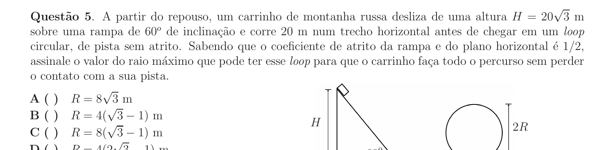

## Q06
**Assunto:** gravitação
**Competências:** força gravitacional, órbitas circulares, matéria escura, velocidade orbital, análise qualitativa
**Tipo:** múltipla escolha

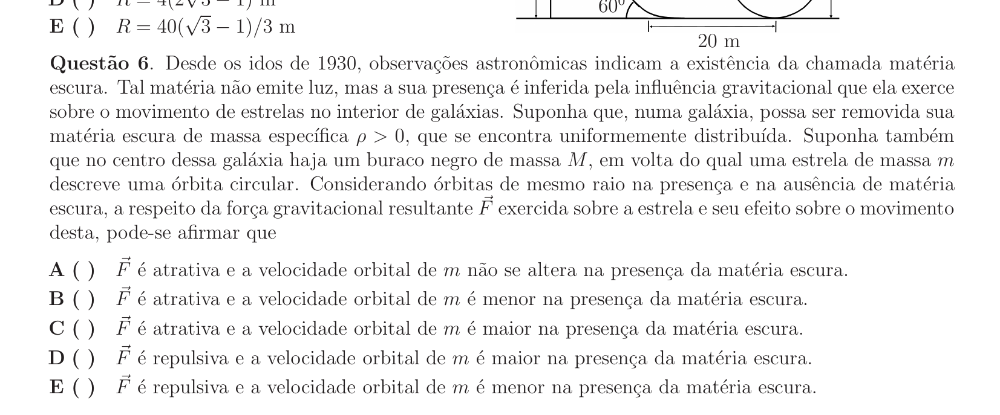

## Q07
**Assunto:** dinâmica
**Competências:** oscilador harmônico, relação causal entre grandezas, MHS, aceleração e posição
**Tipo:** múltipla escolha

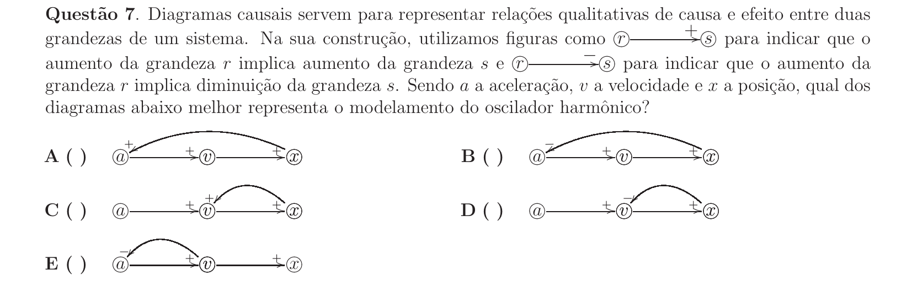

## Q08
**Assunto:** hidrostática
**Competências:** princípio de Arquimedes, empuxo, geometria de prisma, equilíbrio hidrostático
**Tipo:** múltipla escolha

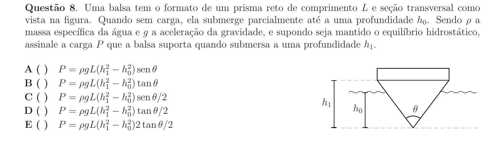

## Q09
**Assunto:** cinemática
**Competências:** lançamento oblíquo, lançamento vertical, decomposição vetorial, distância entre trajetórias
**Tipo:** múltipla escolha

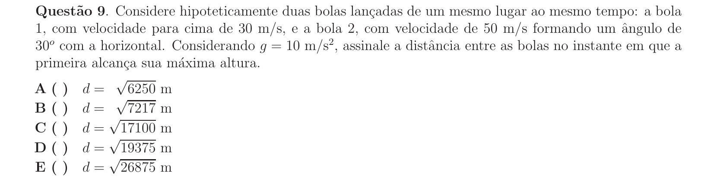

## Q10
**Assunto:** dinâmica
**Competências:** colisão elástica, conservação de momento linear, conservação de energia, queda livre
**Tipo:** múltipla escolha

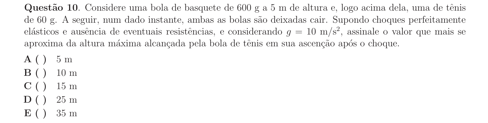

## Q11
**Assunto:** óptica geométrica
**Competências:** espelho esférico convexo, equação de Gauss, ampliação, distância focal
**Tipo:** múltipla escolha

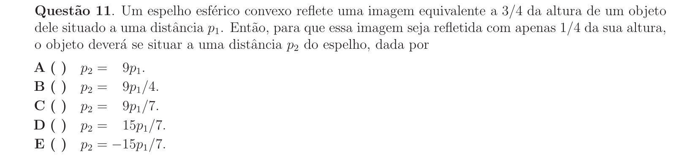

## Q12
**Assunto:** óptica física
**Competências:** interferência em películas finas, lâminas em forma de cunha, franjas de interferência, comprimento de onda
**Tipo:** múltipla escolha

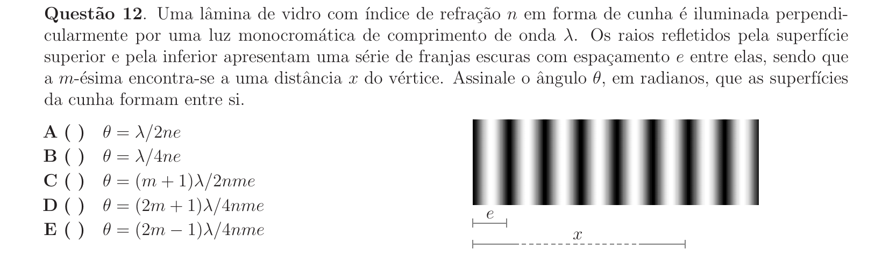

## Q13
**Assunto:** eletrostática
**Competências:** esfera condutora, campo elétrico no interior, potencial elétrico, lei de Gauss
**Tipo:** múltipla escolha

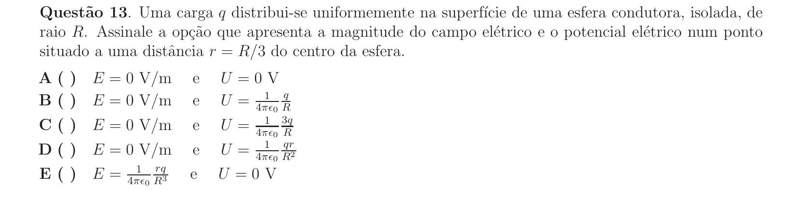

## Q14
**Assunto:** eletromagnetismo
**Competências:** força magnética, indução eletromagnética, equilíbrio em plano inclinado, FEM induzida
**Tipo:** múltipla escolha

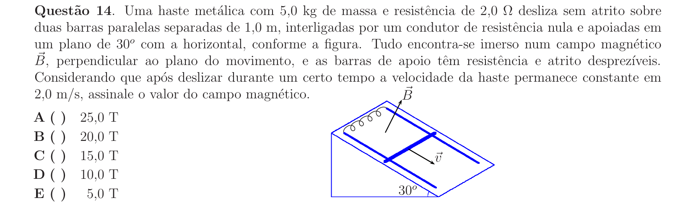

## Q15
**Assunto:** magnetismo
**Competências:** campo magnético de fios paralelos, força magnética entre correntes, regra da mão direita, superposição de campos
**Tipo:** múltipla escolha

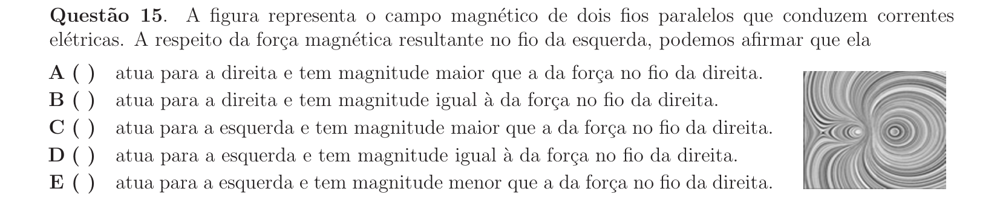

## Q16
**Assunto:** eletrostática
**Competências:** capacitor de placas paralelas, dielétricos, carga induzida, permissividade elétrica
**Tipo:** múltipla escolha

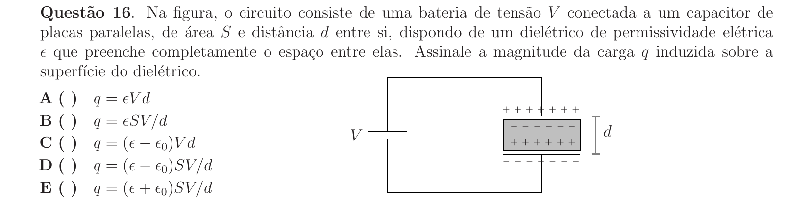

## Q17
**Assunto:** óptica física
**Competências:** difração por fenda única, comprimento de onda, mínimos de difração, geometria de difração
**Tipo:** múltipla escolha

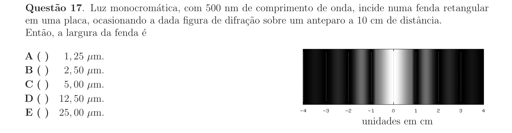

## Q18
**Assunto:** cinemática
**Competências:** queda livre, referencial não inercial, equivalência, equação horária do movimento
**Tipo:** múltipla escolha

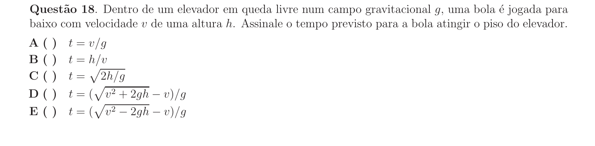

## Q19
**Assunto:** hidrostática
**Competências:** movimento harmônico simples, empuxo, frequência angular, força restauradora
**Tipo:** múltipla escolha

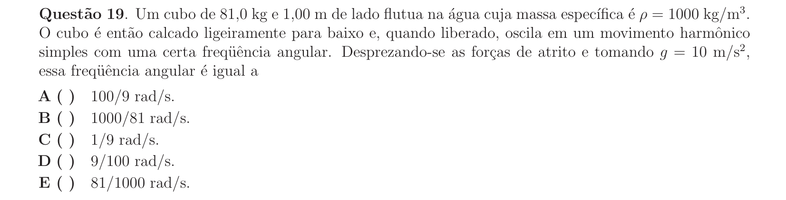

## Q20
**Assunto:** dinâmica
**Competências:** pêndulo simples, força centrípeta, tração no fio, conservação de energia
**Tipo:** múltipla escolha

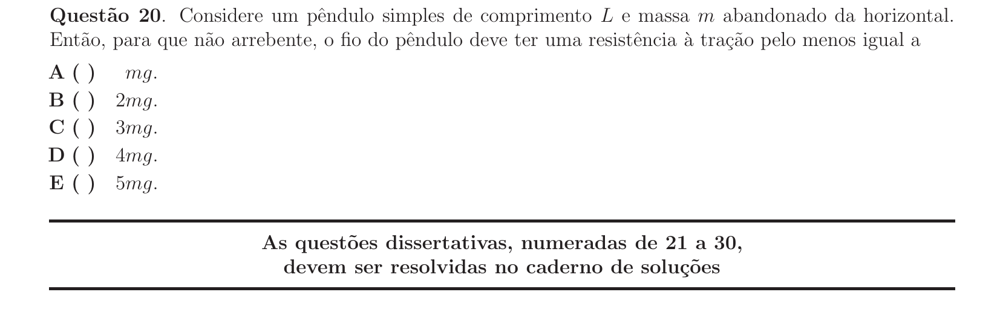

## Q21
**Assunto:** física moderna
**Competências:** momento do fóton, conservação de momento, pêndulo, conservação de energia mecânica
**Tipo:** discursiva

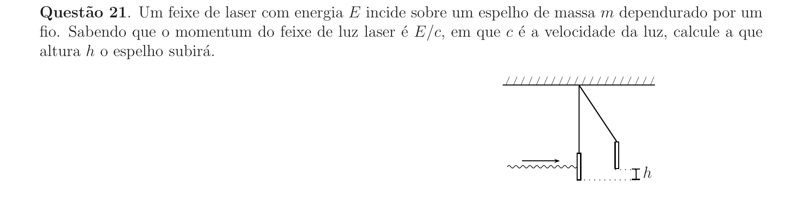

## Q22
**Assunto:** estática
**Competências:** centro de massa, equilíbrio de corpos rígidos, série harmônica, momento de força
**Tipo:** discursiva

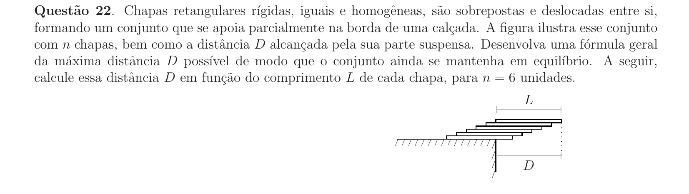

## Q23
**Assunto:** trabalho e energia
**Competências:** potência, energia solar, conversão de unidades, rendimento, fator de capacidade
**Tipo:** discursiva

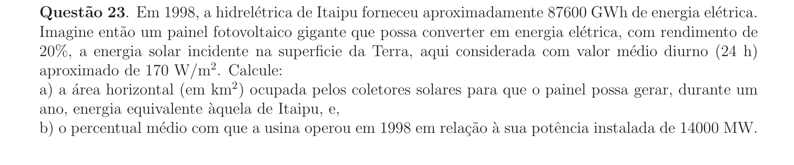

## Q24
**Assunto:** dinâmica
**Competências:** colisão inelástica, conservação de momento, mola, conservação de energia
**Tipo:** discursiva

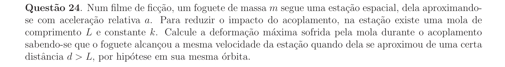

## Q25
**Assunto:** gravitação
**Competências:** forças de maré, força gravitacional, aproximação binomial, diferença de forças
**Tipo:** discursiva

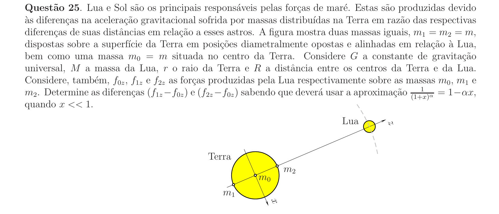

## Q26
**Assunto:** hidrostática
**Competências:** princípio de Pascal, princípio de Arquimedes, lei dos gases, equilíbrio de pressão
**Tipo:** discursiva

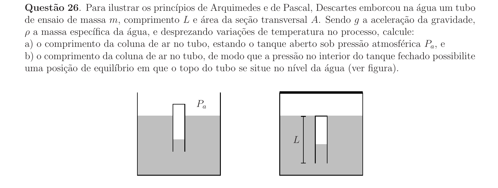

## Q27
**Assunto:** termodinâmica
**Competências:** primeira lei da termodinâmica, ciclo termodinâmico, processo isotérmico, processo adiabático, processo isocórico
**Tipo:** discursiva

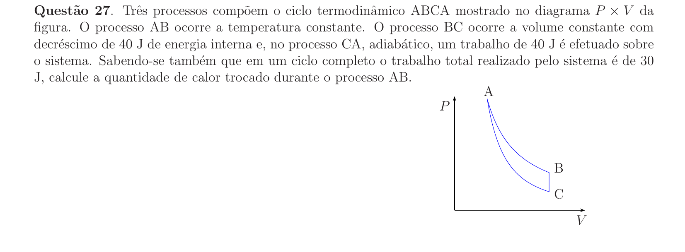

## Q28
**Assunto:** eletrostática
**Competências:** aterramento, potencial elétrico, conservação de carga, esferas condutoras, sistema de equações
**Tipo:** discursiva

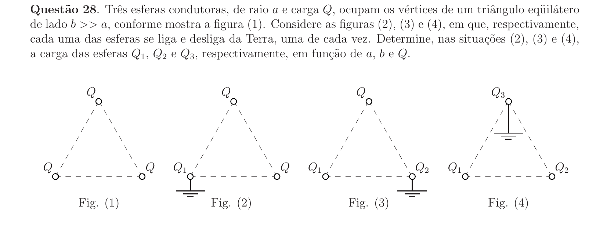

## Q29
**Assunto:** eletromagnetismo
**Competências:** indução eletromagnética, lei de Faraday, solenoide, fluxo magnético, FEM induzida
**Tipo:** discursiva

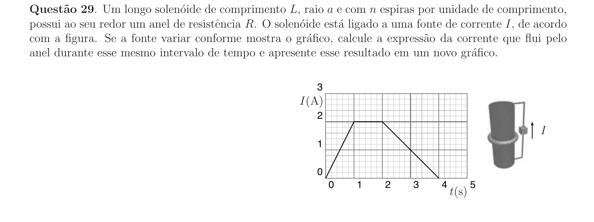

## Q30
**Assunto:** circuitos
**Competências:** lei de Ohm, associação de resistores, potência elétrica, gerador, dissipação em linha de transmissão
**Tipo:** discursiva

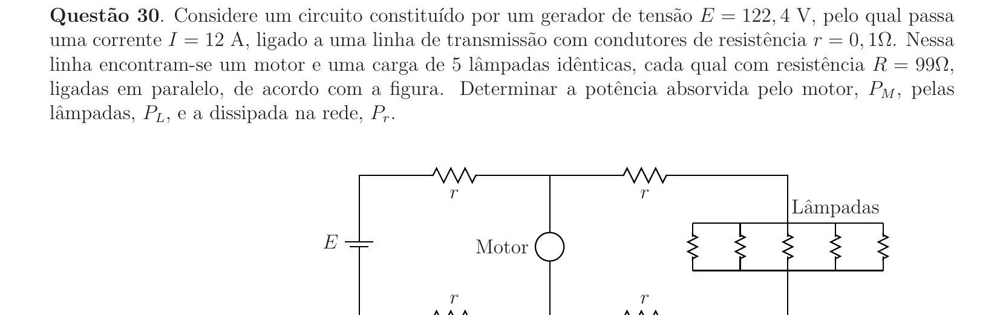
