# Física — ITA 2010

> 30 questões. Q01–Q20 múltipla escolha; Q21–Q30 discursivas.

## Q01
**Assunto:** gravitação
**Competências:** análise dimensional, potencial gravitacional, ordem de grandeza, relatividade
**Tipo:** múltipla escolha

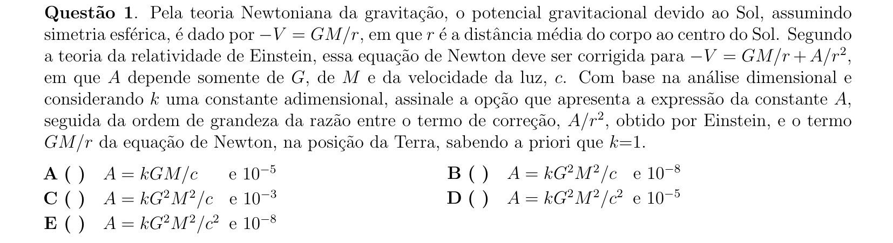

## Q02
**Assunto:** gravitação
**Competências:** peso aparente, força centrípeta, rotação da Terra, latitude
**Tipo:** múltipla escolha

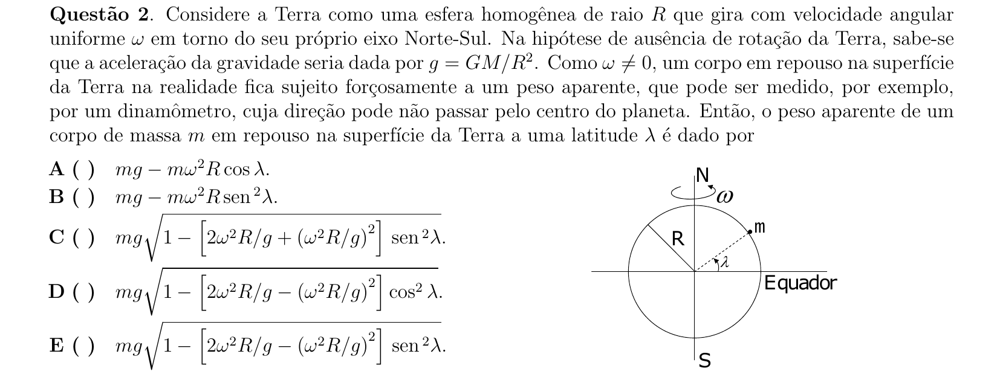

## Q03
**Assunto:** gravitação
**Competências:** leis de Kepler, conservação do momento angular, força central, órbitas
**Tipo:** múltipla escolha

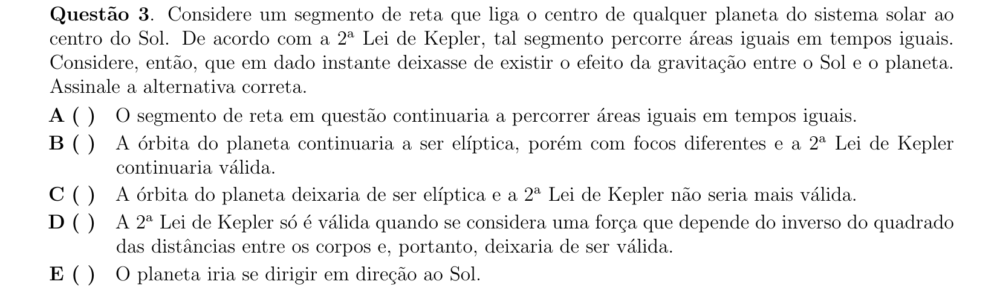

## Q04
**Assunto:** termodinâmica
**Competências:** teoria cinética dos gases, velocidade de escape, energia cinética média, temperatura absoluta
**Tipo:** múltipla escolha

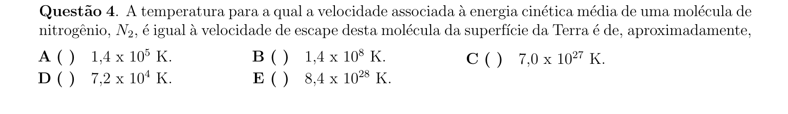

## Q05
**Assunto:** dinâmica
**Competências:** plano inclinado, oscilador massa-mola, conservação de energia, cinemática com aceleração
**Tipo:** múltipla escolha

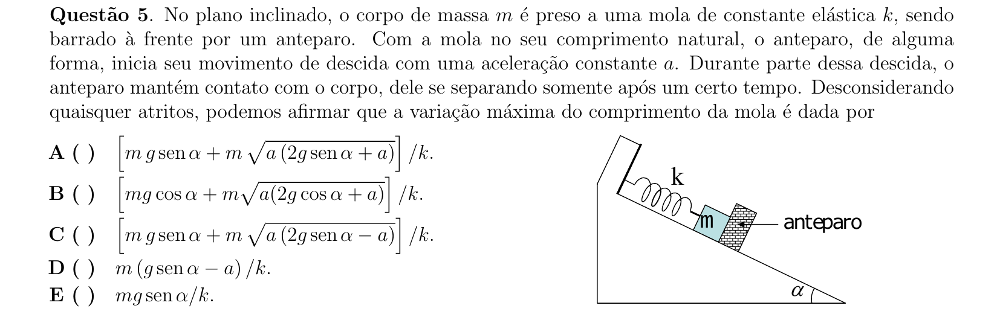

## Q06
**Assunto:** estática
**Competências:** equilíbrio de corpo suspenso, tração em cordas, dilatação superficial, geometria
**Tipo:** múltipla escolha

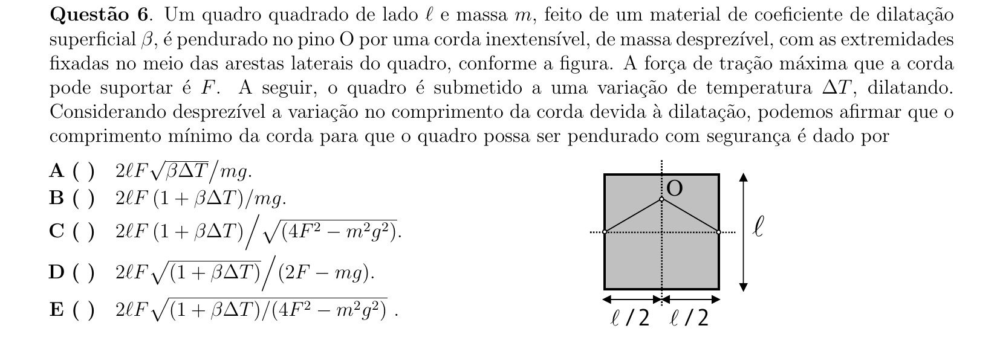

## Q07
**Assunto:** estática
**Competências:** equilíbrio de corpos, torque, atrito estático, força normal
**Tipo:** múltipla escolha

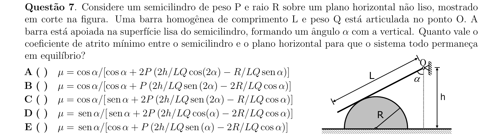

## Q08
**Assunto:** magnetismo
**Competências:** movimento ciclotrônico, força de Lorentz, raio e período em campo magnético, energia cinética por ddp
**Tipo:** múltipla escolha

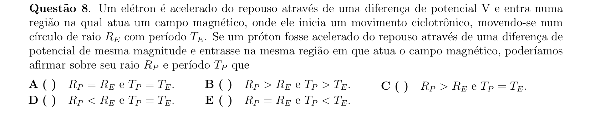

## Q09
**Assunto:** dinâmica
**Competências:** MHS, oscilador massa-mola, força centrípeta, frequência efetiva
**Tipo:** múltipla escolha

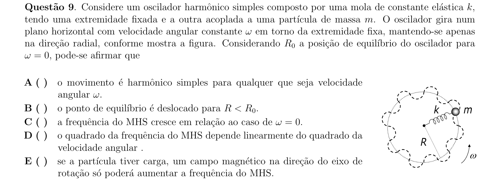

## Q10
**Assunto:** termodinâmica
**Competências:** diagrama T-S, ciclo termodinâmico, rendimento de máquinas térmicas, segunda lei
**Tipo:** múltipla escolha

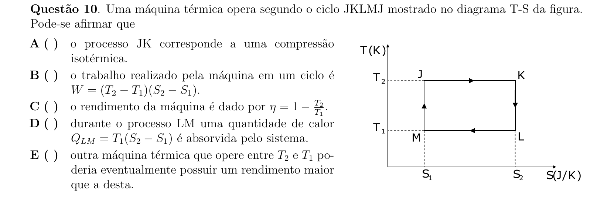

## Q11
**Assunto:** óptica física
**Competências:** anéis de Newton, interferência em filme fino, comprimento de onda, geometria de lente
**Tipo:** múltipla escolha

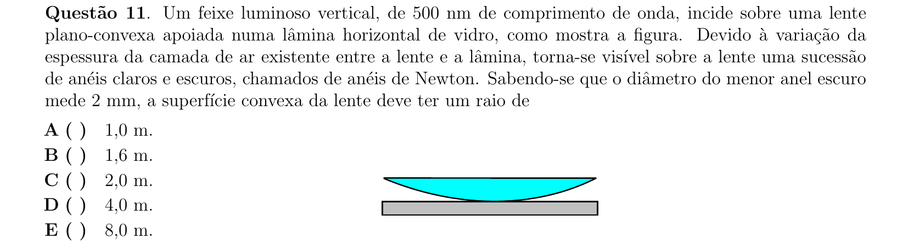

## Q12
**Assunto:** acústica
**Competências:** tubos sonoros abertos, modos de vibração, velocidade do som, frequência fundamental
**Tipo:** múltipla escolha

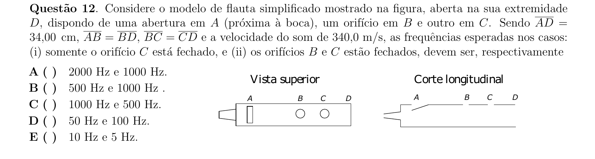

## Q13
**Assunto:** acústica
**Competências:** efeito Doppler, movimento circular, variação de frequência no tempo, fonte fixa observador em rotação
**Tipo:** múltipla escolha

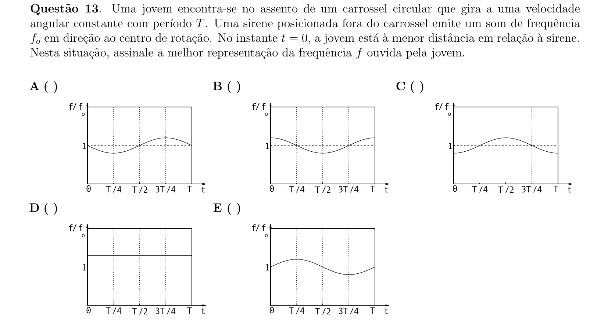

## Q14
**Assunto:** eletrostática
**Competências:** potencial elétrico, superposição, lugar geométrico equipotencial, cargas puntuais
**Tipo:** múltipla escolha

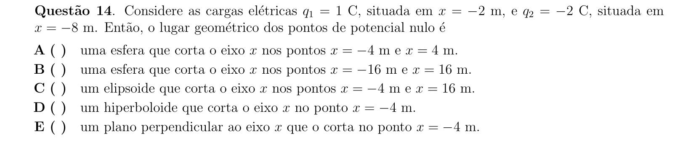

## Q15
**Assunto:** estática
**Competências:** equilíbrio de alavanca, torque, força elétrica de Coulomb, decomposição vetorial
**Tipo:** múltipla escolha

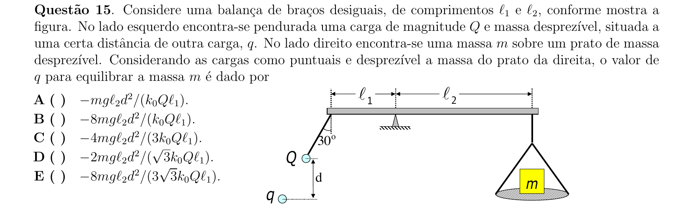

## Q16
**Assunto:** circuitos
**Competências:** resistência elétrica, condutividade, associação em série, lei de Ohm
**Tipo:** múltipla escolha

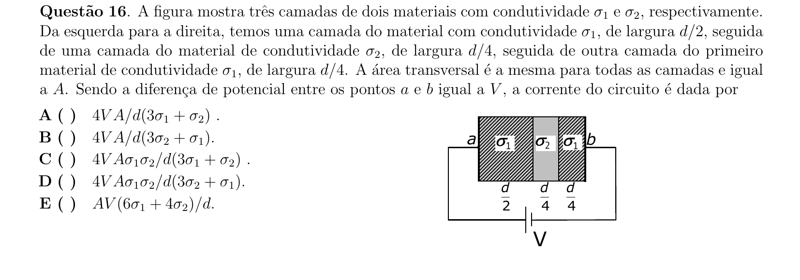

## Q17
**Assunto:** eletrostática
**Competências:** condutor em equilíbrio eletrostático, blindagem eletrostática, indução, cavidades
**Tipo:** múltipla escolha

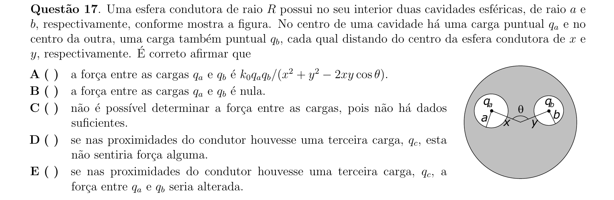

## Q18
**Assunto:** magnetismo
**Competências:** lei de Biot-Savart, superposição de campos magnéticos, simetria, corrente em arestas
**Tipo:** múltipla escolha

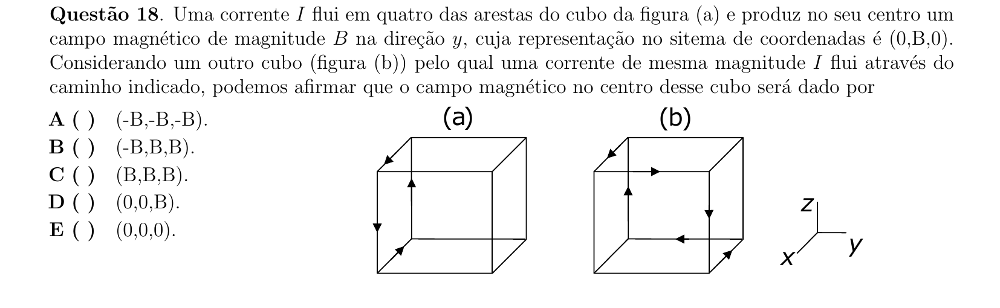

## Q19
**Assunto:** eletromagnetismo
**Competências:** indução eletromagnética, fem induzida em espira, campo de solenoide, força sobre corrente
**Tipo:** múltipla escolha

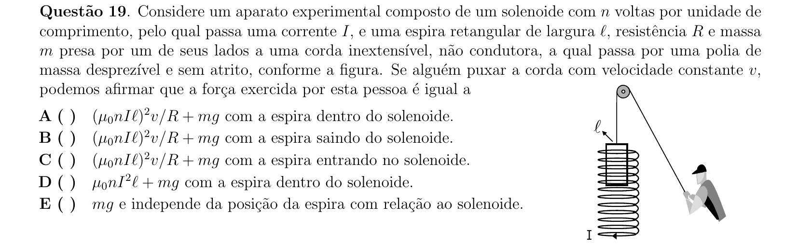

## Q20
**Assunto:** física moderna
**Competências:** energia do fóton, relação E=hc/lambda, mol e número de Avogadro, fotossíntese
**Tipo:** múltipla escolha

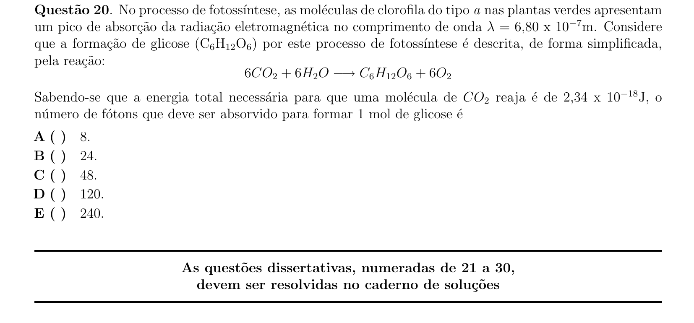

## Q21
**Assunto:** dinâmica
**Competências:** força centrípeta, atrito estático, decomposição em plano inclinado rotativo, força magnética em carga em repouso
**Tipo:** discursiva

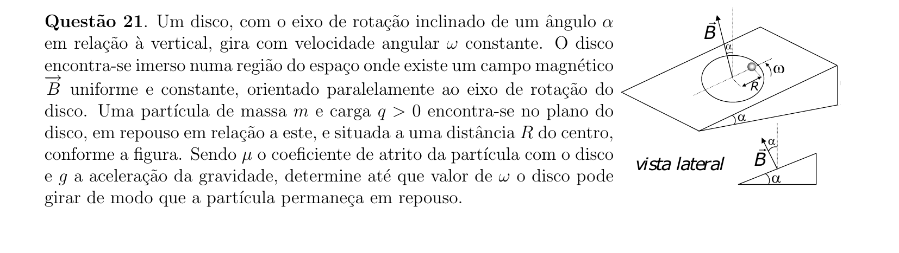

## Q22
**Assunto:** trabalho e energia
**Competências:** conservação de energia mecânica, força centrípeta no loop, lançamento oblíquo, geometria circular
**Tipo:** discursiva

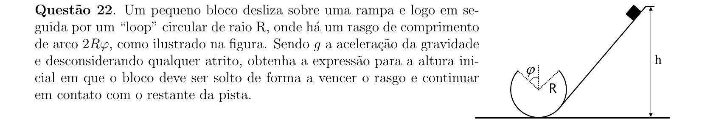

## Q23
**Assunto:** dinâmica
**Competências:** colisão elástica, conservação de momento linear, conservação de energia, sistema massa-mola
**Tipo:** discursiva

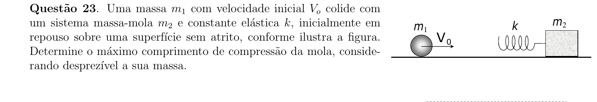

## Q24
**Assunto:** hidrostática
**Competências:** empuxo em dois líquidos, equilíbrio de forças, mola elástica, decomposição vetorial
**Tipo:** discursiva

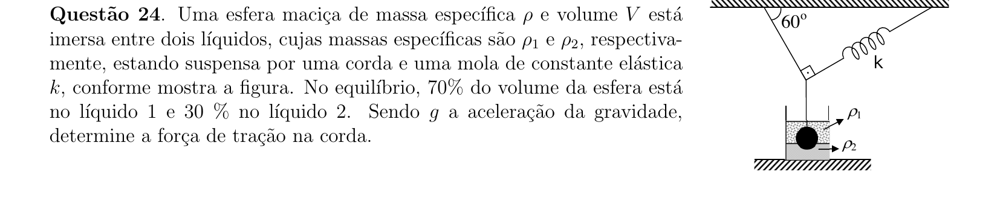

## Q25
**Assunto:** termodinâmica
**Competências:** gás ideal monoatômico, expansão contra mola, primeira lei, conservação de energia
**Tipo:** discursiva

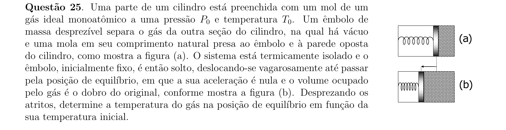

## Q26
**Assunto:** óptica geométrica
**Competências:** lente divergente, equação de Gauss, aumento linear transversal, formação de imagem
**Tipo:** discursiva

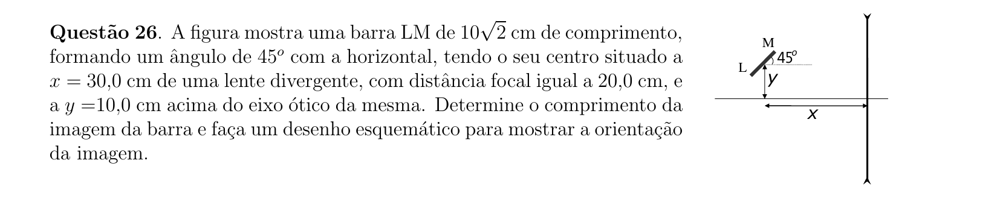

## Q27
**Assunto:** gravitação
**Competências:** lei da gravitação universal, força centrípeta, órbita circular, dedução da 3ª lei de Kepler
**Tipo:** discursiva

## Q28
**Assunto:** magnetismo
**Competências:** campo de fio infinito, força magnética sobre espira, torque magnético, integração
**Tipo:** discursiva

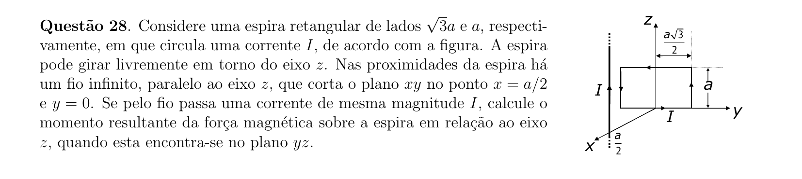

## Q29
**Assunto:** física moderna
**Competências:** energia do fóton, intensidade luminosa, fluxo de fótons, alcance de detecção
**Tipo:** discursiva

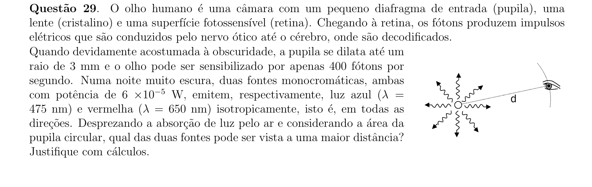

## Q30
**Assunto:** circuitos
**Competências:** gerador e receptor, fem e fcem, resistência interna, rendimento, leitura de gráficos
**Tipo:** discursiva

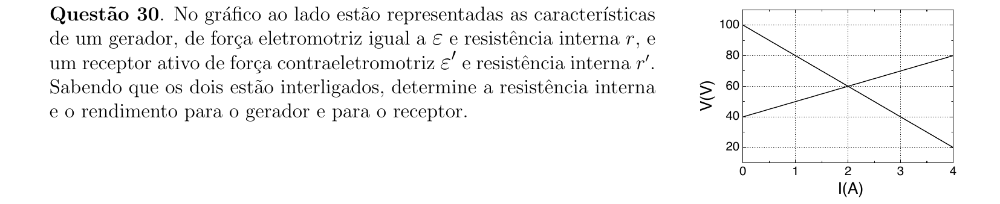
