# Física — ITA 2011

> 30 questões. Q01–Q20 múltipla escolha; Q21–Q30 discursivas.

## Q01
**Assunto:** cinemática
**Competências:** movimento em polígono regular, velocidade vetorial constante em módulo, simetria de movimento, cálculo de tempo de encontro
**Tipo:** múltipla escolha

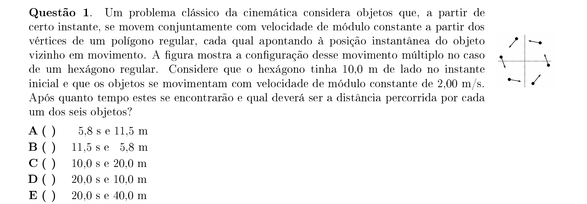

## Q02
**Assunto:** hidrostática
**Competências:** empuxo, equilíbrio de corpos flutuantes, densidade, princípio de Arquimedes
**Tipo:** múltipla escolha

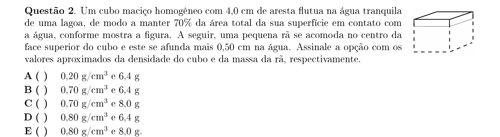

## Q03
**Assunto:** acústica
**Competências:** efeito Doppler, queda livre com força elástica, oscilação amortecida, percepção de frequência
**Tipo:** múltipla escolha

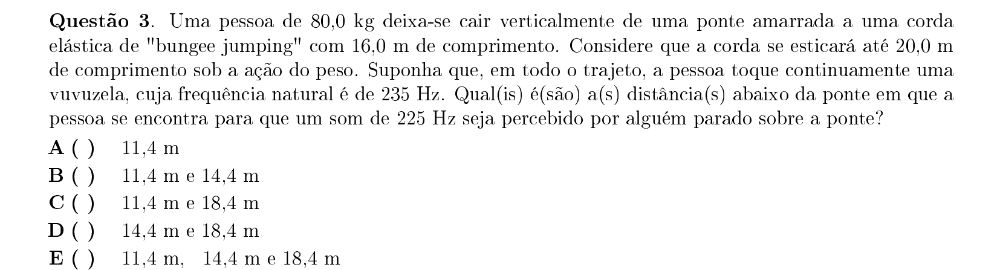

## Q04
**Assunto:** gravitação
**Competências:** terceira lei de Kepler, órbitas planetárias, relação período-raio, mecânica celeste
**Tipo:** múltipla escolha

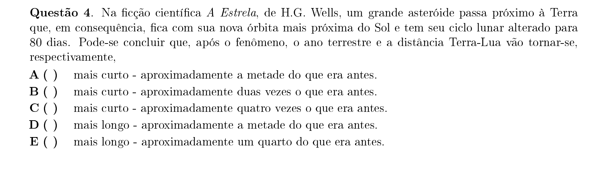

## Q05
**Assunto:** dinâmica
**Competências:** força elástica, aproximação binomial, oscilação não-linear, segunda lei de Newton
**Tipo:** múltipla escolha

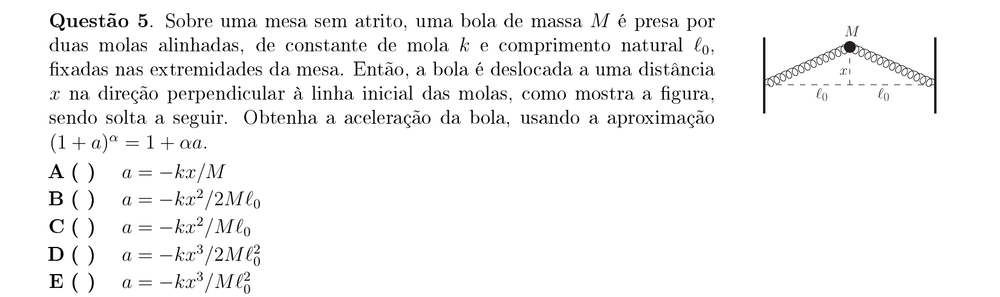

## Q06
**Assunto:** dinâmica
**Competências:** tração máxima em corda, cinemática de aceleração e desaceleração, otimização de tempo, MRUV
**Tipo:** múltipla escolha

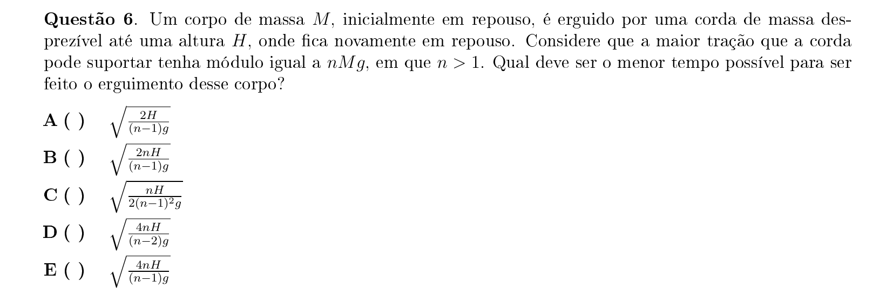

## Q07
**Assunto:** dinâmica
**Competências:** movimento harmônico simples, amplitude e fase, equações horárias do MHS, cálculo de amplitude
**Tipo:** múltipla escolha

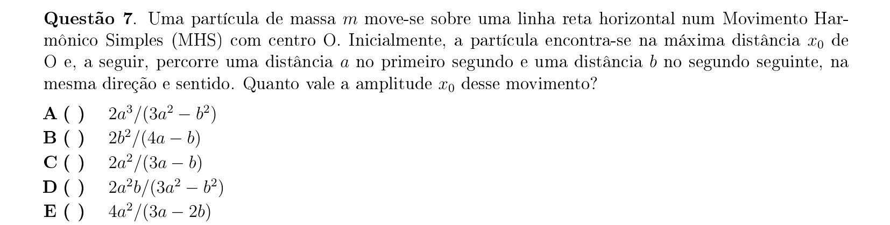

## Q08
**Assunto:** cinemática
**Competências:** lançamento oblíquo, tempo de subida, intersecção de trajetórias, projéteis
**Tipo:** múltipla escolha

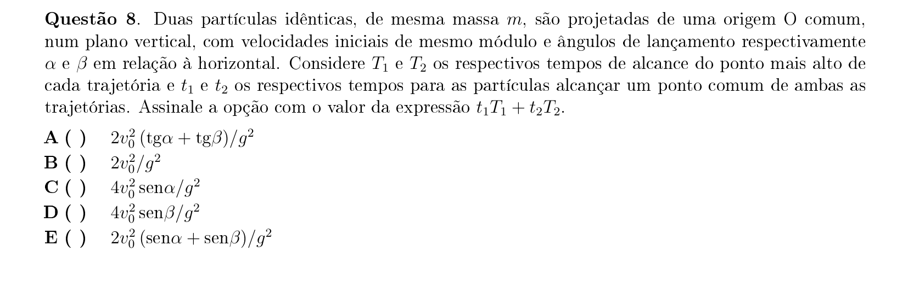

## Q09
**Assunto:** dinâmica
**Competências:** análise dimensional, consistência entre aceleração e velocidade, integração de aceleração, energia mecânica
**Tipo:** múltipla escolha

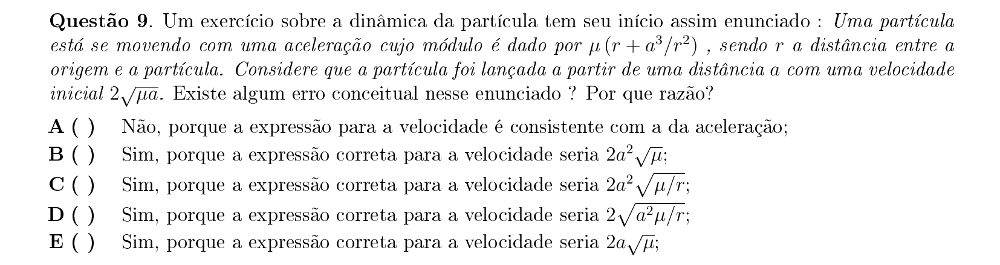

## Q10
**Assunto:** estática
**Competências:** equilíbrio de corpo rígido, torque, centro de massa, ponto de aplicação de força
**Tipo:** múltipla escolha

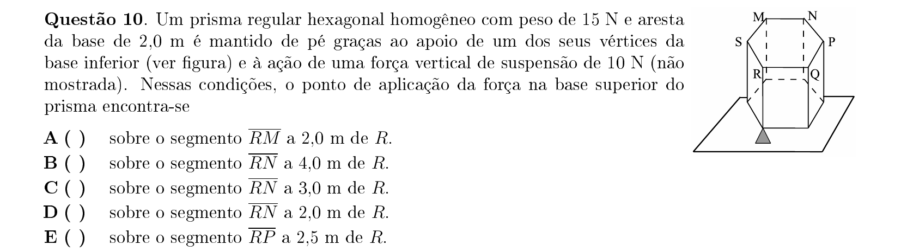

## Q11
**Assunto:** dinâmica
**Competências:** pêndulo simples, período e comprimento, calibração de relógio, pequenas oscilações
**Tipo:** múltipla escolha

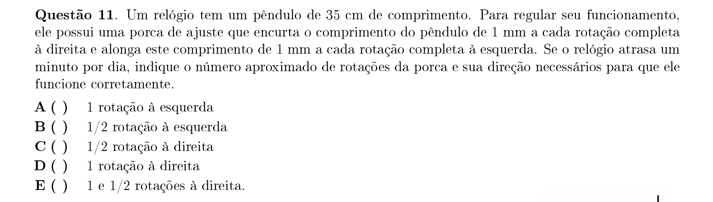

## Q12
**Assunto:** óptica geométrica
**Competências:** refração em superfície esférica, aproximação paraxial, índice de refração, formação de imagem
**Tipo:** múltipla escolha

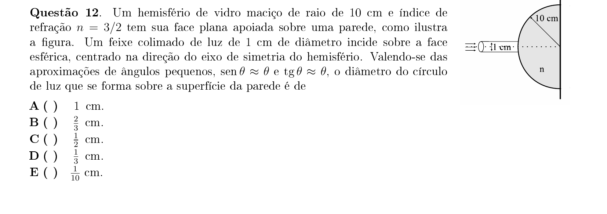

## Q13
**Assunto:** termodinâmica
**Competências:** segunda lei da termodinâmica, reversibilidade, entropia, processos irreversíveis
**Tipo:** múltipla escolha

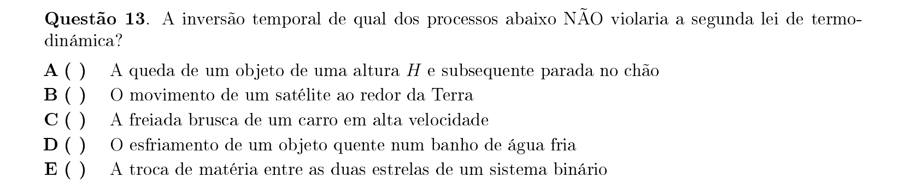

## Q14
**Assunto:** óptica física
**Competências:** difração, limite de resolução de Rayleigh, abertura circular, resolução angular
**Tipo:** múltipla escolha

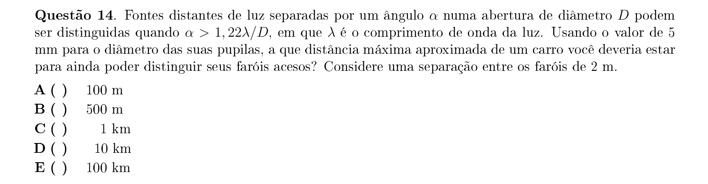

## Q15
**Assunto:** eletrostática
**Competências:** capacitores em rede cúbica, simetria de circuito, associação de capacitores, diferença de potencial
**Tipo:** múltipla escolha

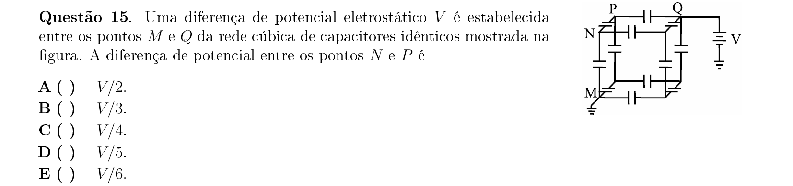

## Q16
**Assunto:** eletrodinâmica
**Competências:** efeito Joule, dissipação de calor, resistência de fio, balanço térmico em condutor
**Tipo:** múltipla escolha

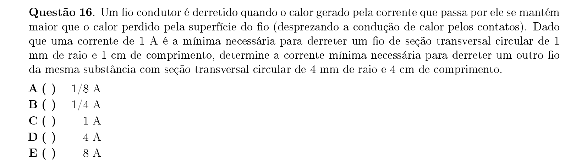

## Q17
**Assunto:** magnetismo
**Competências:** força magnética sobre carga, movimento circular em campo magnético, período de ciclotron, relação carga-massa
**Tipo:** múltipla escolha

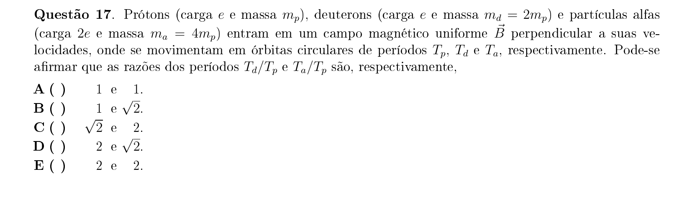

## Q18
**Assunto:** eletromagnetismo
**Competências:** indução eletromagnética, lei de Faraday, fluxo magnético, carga induzida
**Tipo:** múltipla escolha

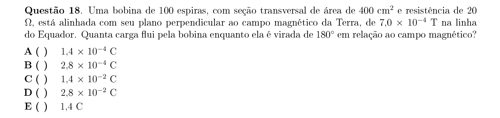

## Q19
**Assunto:** circuitos
**Competências:** carga e descarga de capacitores, energia em capacitor, conservação de carga, dissipação em resistor
**Tipo:** múltipla escolha

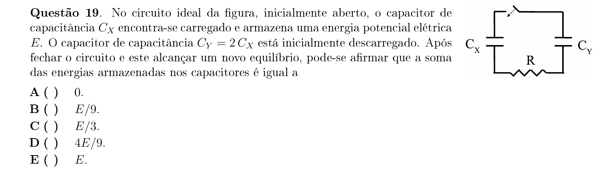

## Q20
**Assunto:** física moderna
**Competências:** efeito fotoelétrico, corrente de saturação vs intensidade, potencial de corte, curva I-V fotoelétrica
**Tipo:** múltipla escolha

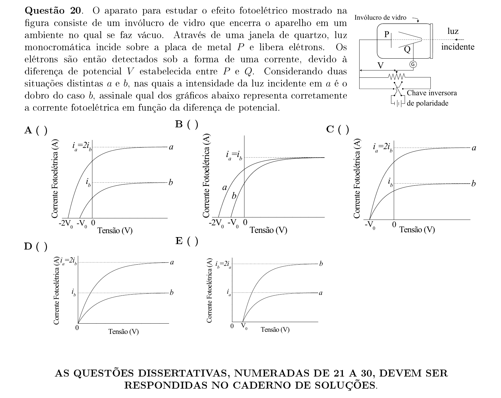

## Q21
**Assunto:** estática
**Competências:** equilíbrio de barra articulada, torque, sistema de polias, força no pino
**Tipo:** discursiva

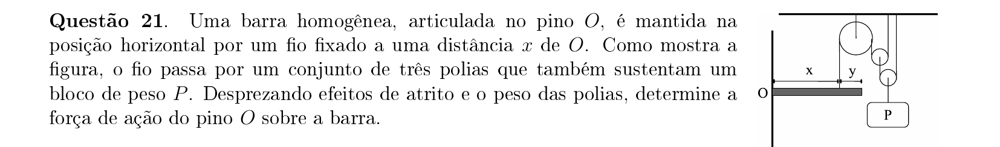

## Q22
**Assunto:** dinâmica
**Competências:** lançamento oblíquo, colisão inelástica, conservação de momento linear, alcance horizontal
**Tipo:** discursiva

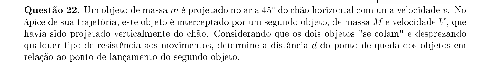

## Q23
**Assunto:** dinâmica
**Competências:** conservação de energia, movimento circular vertical, tensão mínima no topo, pêndulo com obstáculo
**Tipo:** discursiva

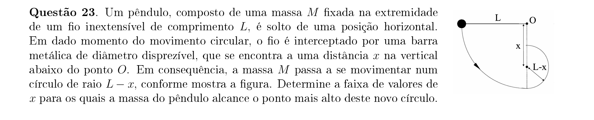

## Q24
**Assunto:** hidrostática
**Competências:** estabilidade de flutuação, posição do centro de massa, posição do centro de empuxo, equilíbrio estável
**Tipo:** discursiva

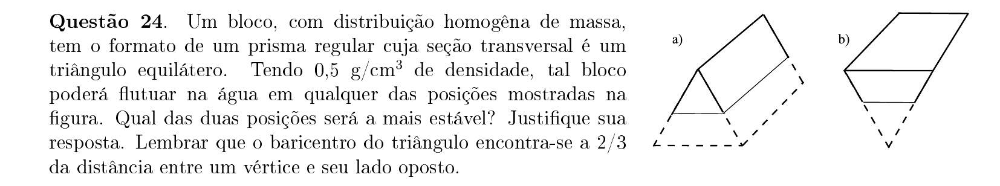

## Q25
**Assunto:** óptica física
**Competências:** interferência em filme fino, diferença de fase por reflexão, condição de interferência destrutiva e construtiva, cor e comprimento de onda
**Tipo:** discursiva

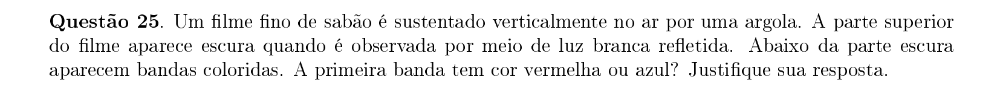

## Q26
**Assunto:** acústica
**Competências:** ondas estacionárias em tubo aberto, harmônicos, frequência fundamental, faixa audível
**Tipo:** discursiva

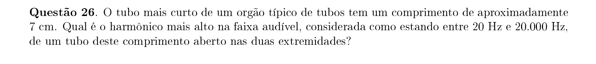

## Q27
**Assunto:** termodinâmica
**Competências:** processo adiabático, gás ideal, pressão hidrostática, relação PV^gamma
**Tipo:** discursiva

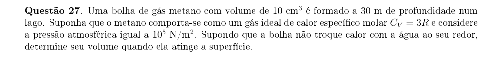

## Q28
**Assunto:** eletromagnetismo
**Competências:** campo magnético de espira circular, campo de fio retilíneo, força magnética sobre carga, superposição de campos
**Tipo:** discursiva

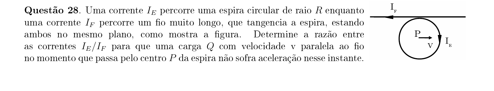

## Q29
**Assunto:** óptica geométrica
**Competências:** reflexão total interna, ângulo crítico, geometria em curva, índice de refração
**Tipo:** discursiva

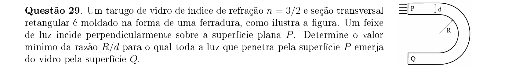

## Q30
**Assunto:** física moderna
**Competências:** modelo de Bohr, dualidade onda-partícula, comprimento de onda de de Broglie, quantização de órbitas
**Tipo:** discursiva

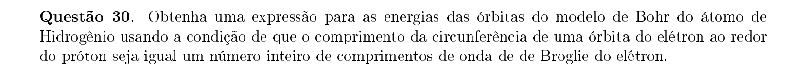
