# Física — ITA 2012

> 30 questões. Q01–Q20 múltipla escolha; Q21–Q30 discursivas.

## Q01
**Assunto:** acústica
**Competências:** análise dimensional, módulo de Young, ondas longitudinais, velocidade do som em sólidos
**Tipo:** múltipla escolha

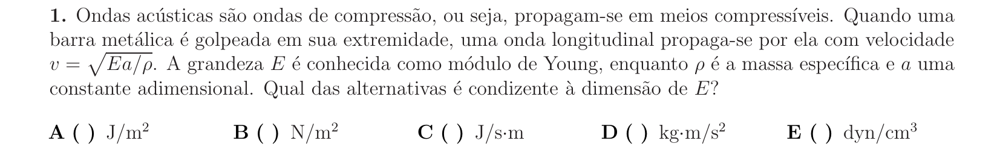

## Q02
**Assunto:** dinâmica
**Competências:** plano inclinado, atrito cinético, MUV, tempo de subida e descida
**Tipo:** múltipla escolha

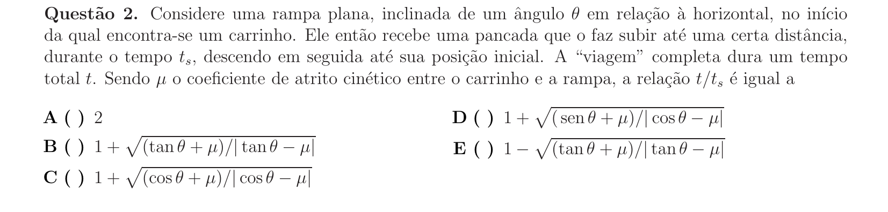

## Q03
**Assunto:** dinâmica
**Competências:** sistema massa-mola, referencial não inercial, equilíbrio em elevador acelerado, lei de Hooke
**Tipo:** múltipla escolha

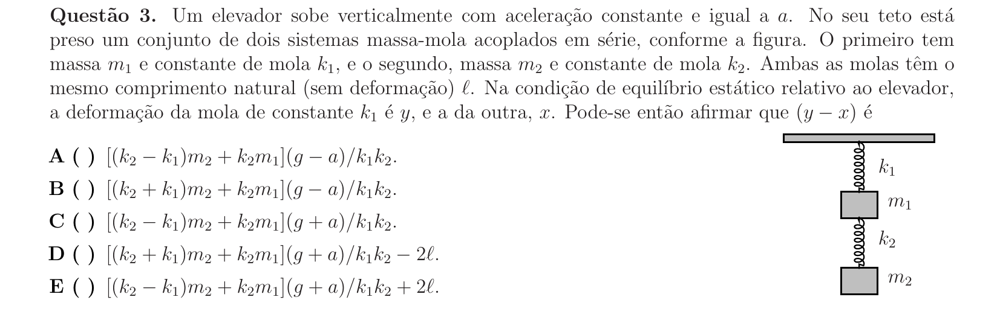

## Q04
**Assunto:** dinâmica
**Competências:** conservação de momento linear, recuo do atirador, velocidade do som, cinemática
**Tipo:** múltipla escolha

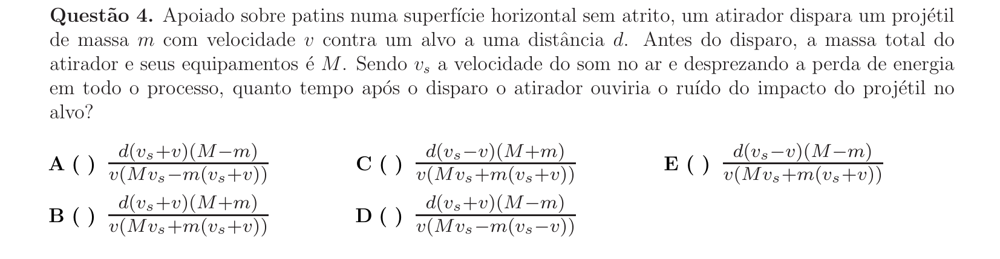

## Q05
**Assunto:** eletrodinâmica
**Competências:** gerador elétrico, força eletromotriz, resistência interna, rendimento, potência máxima
**Tipo:** múltipla escolha

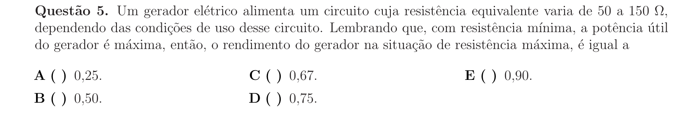

## Q06
**Assunto:** dinâmica
**Competências:** movimento circular uniforme, força centrípeta, geometria do cone, período de rotação
**Tipo:** múltipla escolha

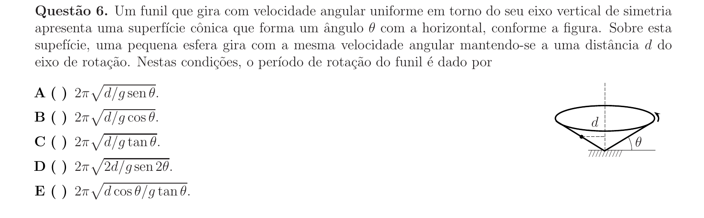

## Q07
**Assunto:** dinâmica
**Competências:** lei de Hooke, segunda lei de Newton, aceleração relativa, conservação de momento
**Tipo:** múltipla escolha

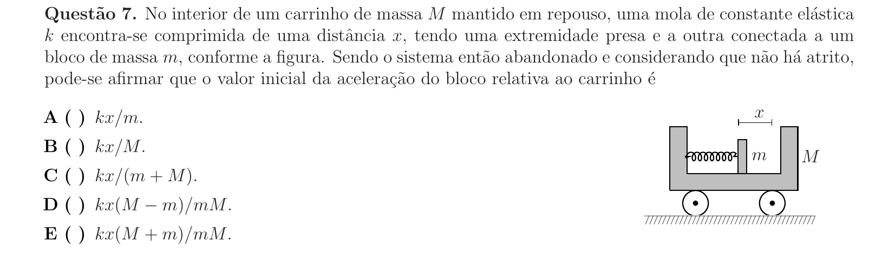

## Q08
**Assunto:** trabalho e energia
**Competências:** potência constante, teorema trabalho-energia, relação v(t), análise de proposições
**Tipo:** múltipla escolha

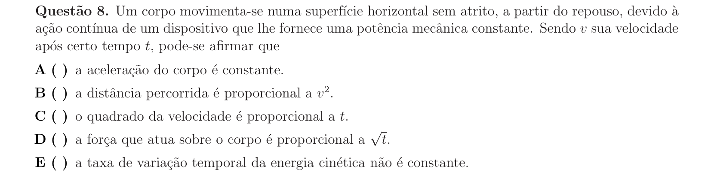

## Q09
**Assunto:** gravitação
**Competências:** energia potencial gravitacional, ordem de grandeza, conversão de energia, queda livre desde infinito
**Tipo:** múltipla escolha

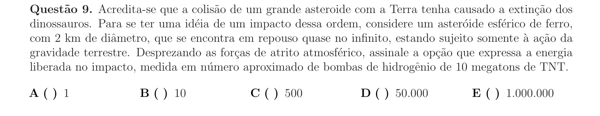

## Q10
**Assunto:** gravitação
**Competências:** sistemas binários, terceira lei de Kepler, lei das áreas, conservação do momento angular
**Tipo:** múltipla escolha

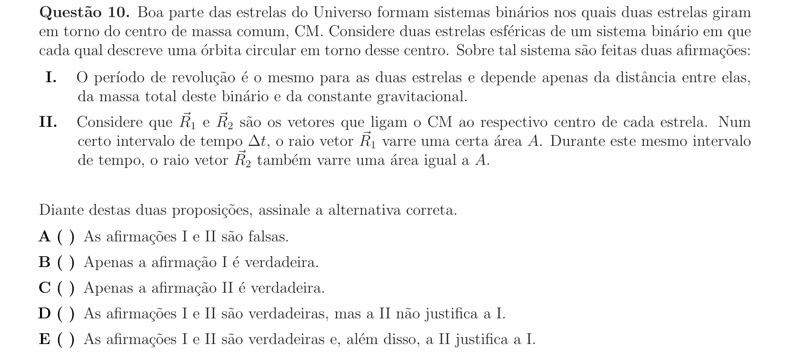

## Q11
**Assunto:** ondulatória
**Competências:** pêndulo simples, ressonância, oscilações forçadas, frequência natural
**Tipo:** múltipla escolha

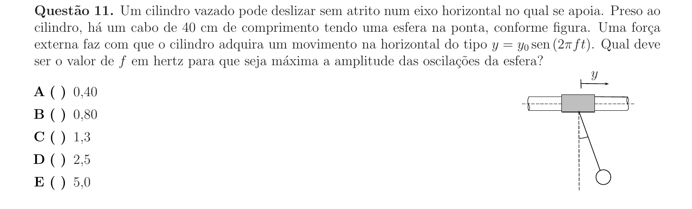

## Q12
**Assunto:** hidrostática
**Competências:** lei de Stevin, referencial acelerado, lei dos gases ideais, gravidade aparente
**Tipo:** múltipla escolha

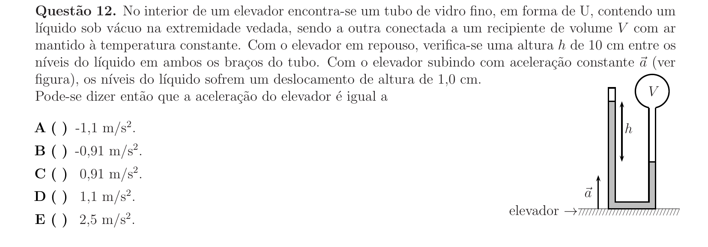

## Q13
**Assunto:** calorimetria
**Competências:** efeito Joule, calor sensível, calor latente de vaporização, associação de resistores
**Tipo:** múltipla escolha

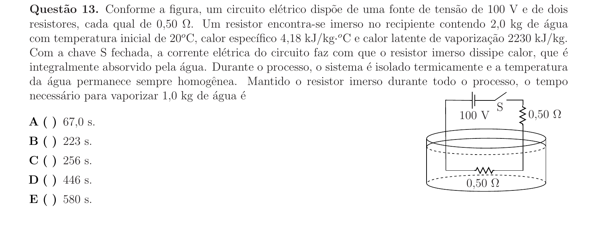

## Q14
**Assunto:** ondulatória
**Competências:** superposição de ondas, ondas circulares, diferença de fase, geometria de cristas
**Tipo:** múltipla escolha

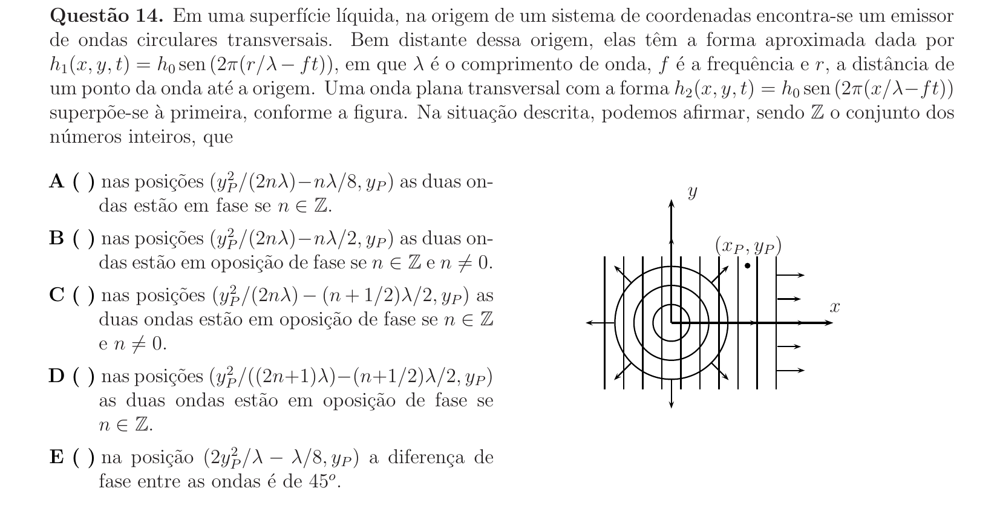

## Q15
**Assunto:** eletrostática
**Competências:** capacitor de placas paralelas, associação em série, indução eletrostática, dielétricos vs condutores
**Tipo:** múltipla escolha

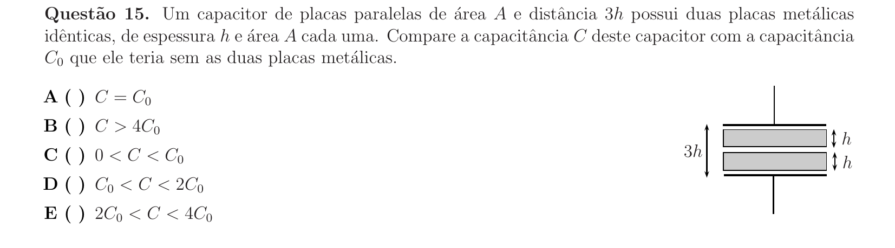

## Q16
**Assunto:** eletrostática
**Competências:** campo elétrico uniforme, trabalho da força elétrica, conservatividade, análise de proposições
**Tipo:** múltipla escolha

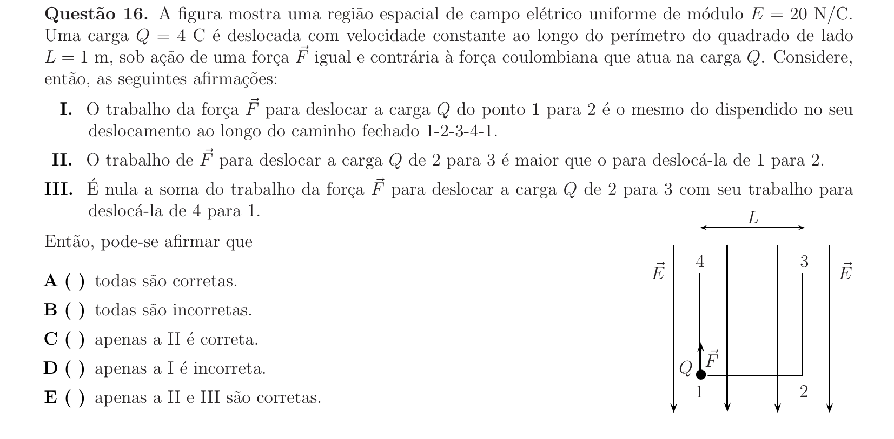

## Q17
**Assunto:** óptica geométrica
**Competências:** iluminamento, fluxo radiante, lei do cosseno (Lambert), geometria do cone
**Tipo:** múltipla escolha

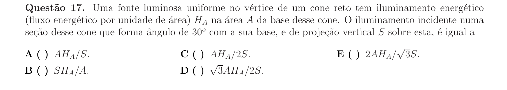

## Q18
**Assunto:** circuitos
**Competências:** ponte de Wheatstone, sensores piezoresistivos, condição de equilíbrio, análise de faixa de operação
**Tipo:** múltipla escolha

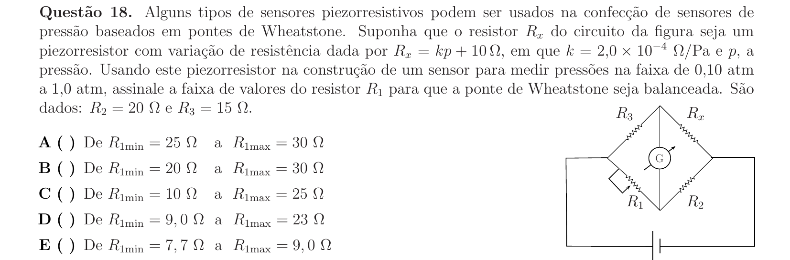

## Q19
**Assunto:** magnetismo
**Competências:** linhas de campo magnético, toroide, solenoide, ímãs e fios retilíneos
**Tipo:** múltipla escolha

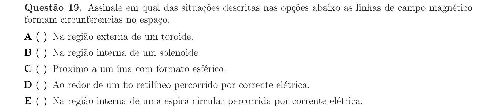

## Q20
**Assunto:** física moderna
**Competências:** modelo de Bohr, efeito fotoelétrico, princípio da incerteza de Heisenberg, quantização de energia
**Tipo:** múltipla escolha

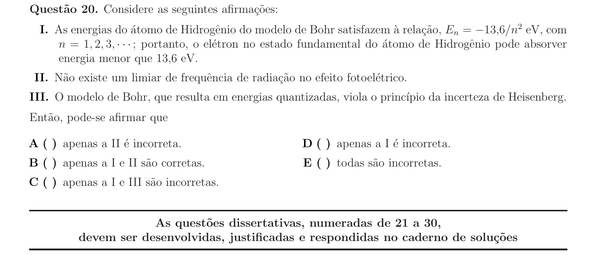

## Q21
**Assunto:** dinâmica
**Competências:** colisão inelástica, variação de momento, força média, fluxo de partículas
**Tipo:** discursiva

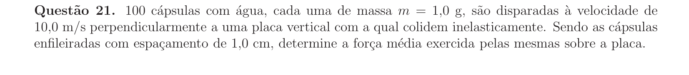

## Q22
**Assunto:** estática
**Competências:** sistema de polias móveis, vantagem mecânica, equilíbrio de forças, trabalho e energia
**Tipo:** discursiva

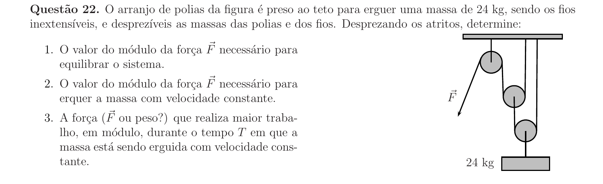

## Q23
**Assunto:** eletrostática
**Competências:** equilíbrio mecânico de corpo rígido, lei de Coulomb, torque, geometria do triângulo equilátero
**Tipo:** discursiva

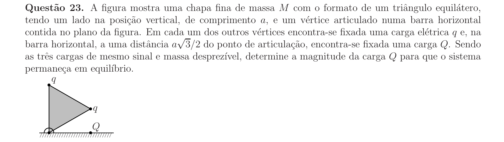

## Q24
**Assunto:** dinâmica
**Competências:** sistemas com vínculos, polia móvel, atrito cinético, segunda lei de Newton
**Tipo:** discursiva

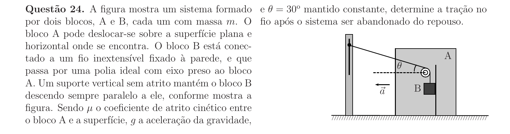

## Q25
**Assunto:** dinâmica
**Competências:** colisão elástica, conservação de momento em planos perpendiculares, conservação de energia cinética, vetores
**Tipo:** discursiva

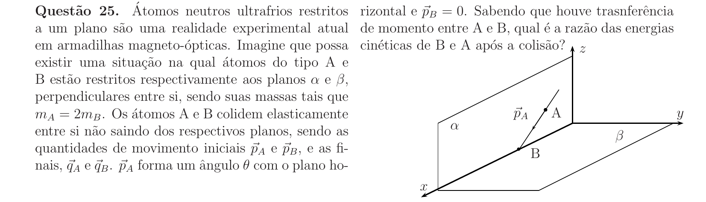

## Q26
**Assunto:** eletrostática
**Competências:** capacitores em série, redistribuição de carga, conservação de carga, equação da capacitância
**Tipo:** discursiva

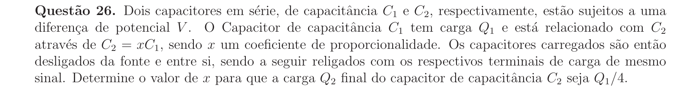

## Q27
**Assunto:** gravitação
**Competências:** momento angular orbital, órbitas elípticas e circulares, leis de Kepler, conservação do momento angular
**Tipo:** discursiva

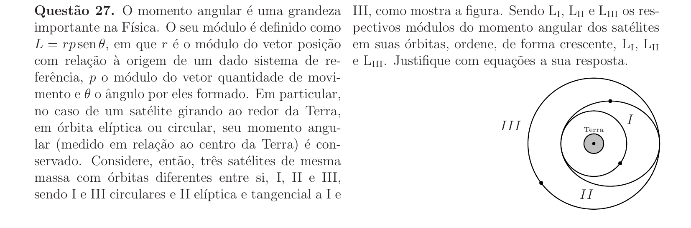

## Q28
**Assunto:** dinâmica
**Competências:** movimento harmônico simples, força restauradora linear, conservação de energia, gráfico F(x)
**Tipo:** discursiva

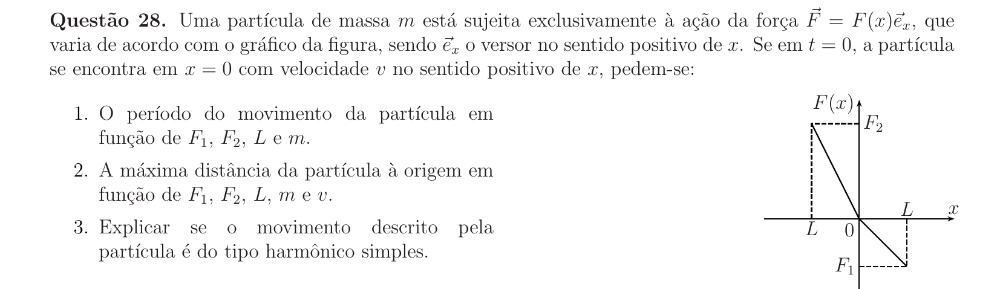

## Q29
**Assunto:** eletromagnetismo
**Competências:** força magnética entre fios paralelos, equilíbrio de forças, lei de Ampère, correntes em sentidos opostos
**Tipo:** discursiva

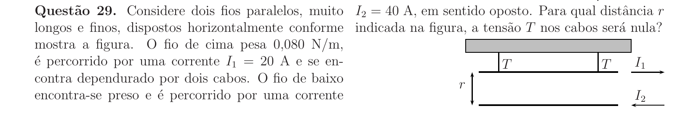

## Q30
**Assunto:** eletromagnetismo
**Competências:** lei de Faraday, fluxo magnético, carga induzida, resistência e corrente induzida
**Tipo:** discursiva

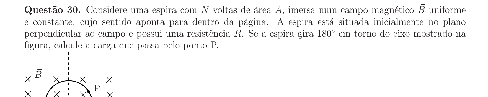
