# Física — ITA 2013

> 30 questões. Q01–Q20 múltipla escolha; Q21–Q30 discursivas.

## Q01
**Assunto:** cinemática
**Competências:** movimento relativo, distância mínima entre trajetórias, decomposição vetorial, velocidade constante
**Tipo:** múltipla escolha

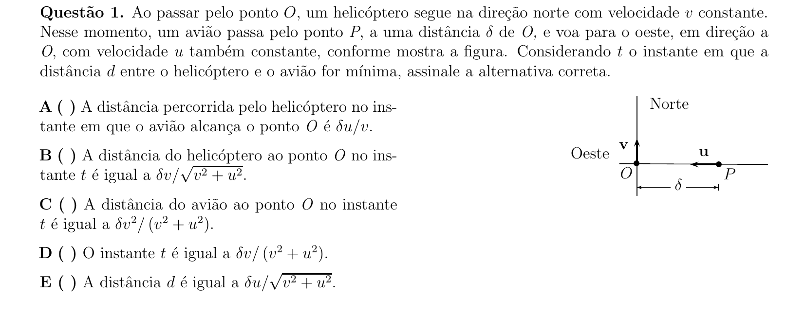

## Q02
**Assunto:** dinâmica
**Competências:** força elástica, equilíbrio vertical, normal e contato, condição de descolamento
**Tipo:** múltipla escolha

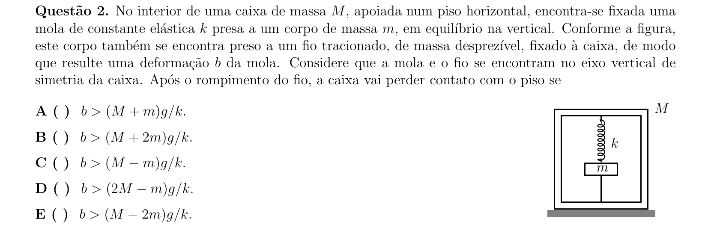

## Q03
**Assunto:** óptica física
**Competências:** experimento de Young, interferência construtiva, índice de refração e comprimento de onda, franjas em meios distintos
**Tipo:** múltipla escolha

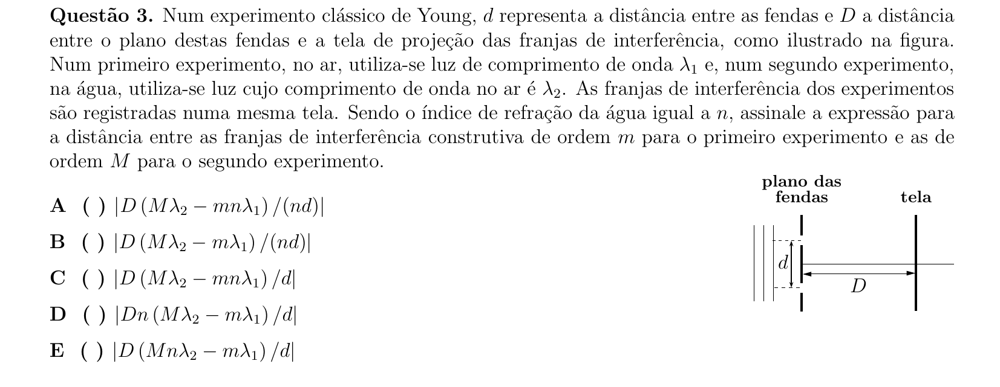

## Q04
**Assunto:** dinâmica
**Competências:** sistemas de corpos em contato, forças de contato sem atrito, geometria de empilhamento, condições de equilíbrio interno
**Tipo:** múltipla escolha

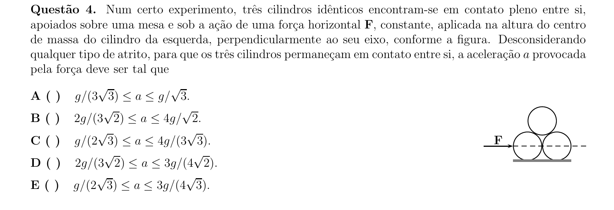

## Q05
**Assunto:** estática
**Competências:** equilíbrio de corpo rígido, momento de força, geometria em superfície hemisférica, razão de massas
**Tipo:** múltipla escolha

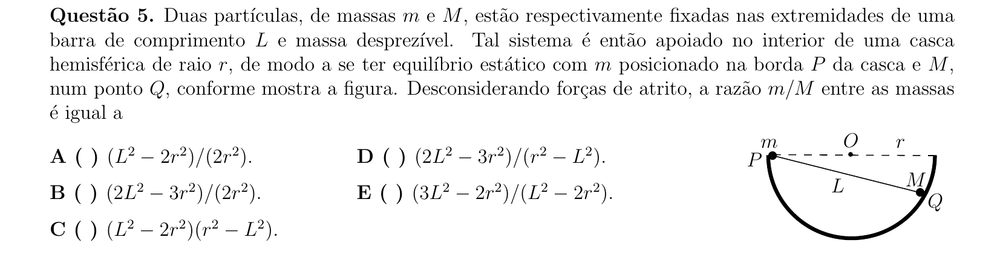

## Q06
**Assunto:** dinâmica
**Competências:** forças em superfície curva, tração em fio, condição de perda de contato, geometria angular
**Tipo:** múltipla escolha

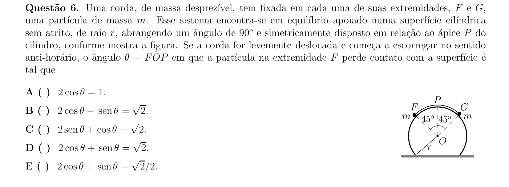

## Q07
**Assunto:** dinâmica
**Competências:** lançamento oblíquo, coeficiente de restituição, colisão com parede, alcance horizontal
**Tipo:** múltipla escolha

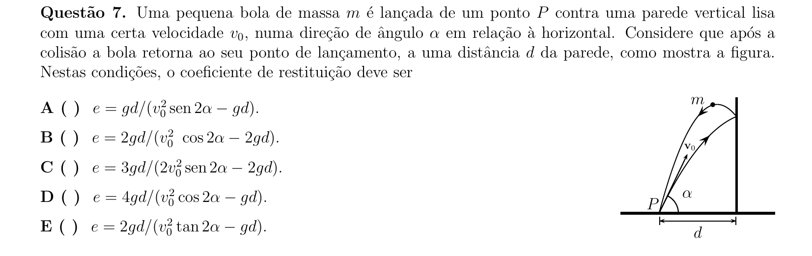

## Q08
**Assunto:** termodinâmica
**Competências:** expansão adiabática, conservação de momento linear, variação de energia interna, gás ideal
**Tipo:** múltipla escolha

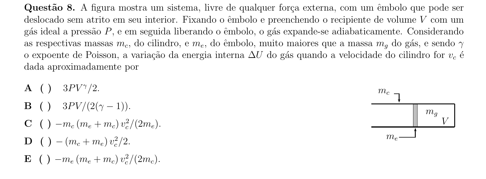

## Q09
**Assunto:** trabalho e energia
**Competências:** conservação de momento linear, conservação de energia, plano inclinado sem atrito, sistema isolado
**Tipo:** múltipla escolha

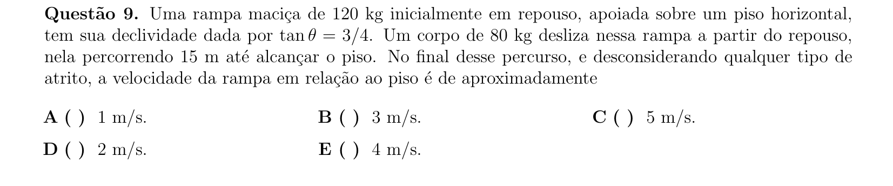

## Q10
**Assunto:** eletrostática
**Competências:** capacitor de placas paralelas, constante dielétrica, associação de capacitores em série, fração de volume
**Tipo:** múltipla escolha

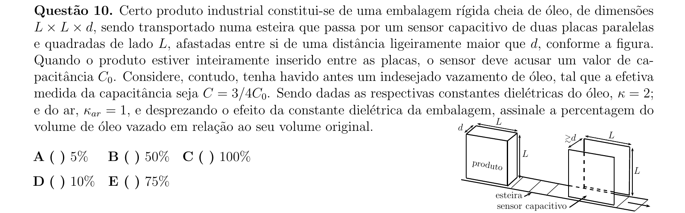

## Q11
**Assunto:** eletromagnetismo
**Competências:** autoindução, lei de Faraday, regime transitório, variação temporal de corrente
**Tipo:** múltipla escolha

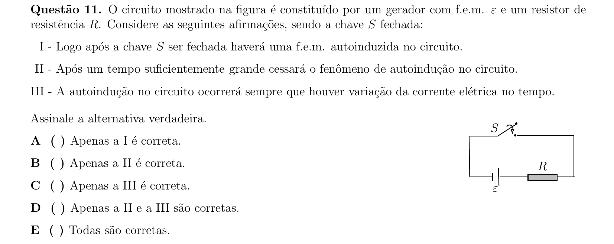

## Q12
**Assunto:** óptica geométrica
**Competências:** desvio em prisma de pequena abertura, reflexão em espelho plano, ângulo de incidência e rotação de espelho, índice de refração
**Tipo:** múltipla escolha

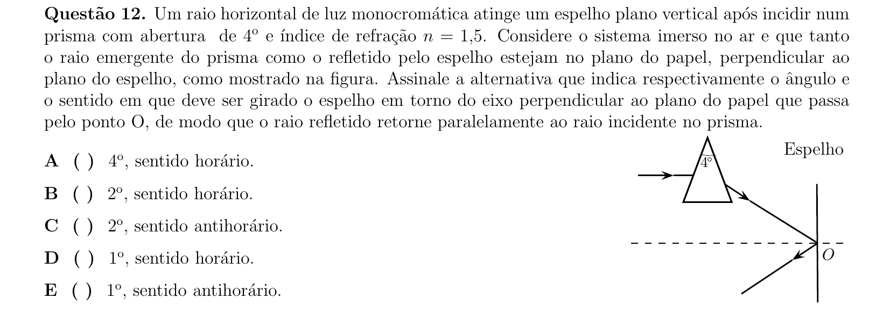

## Q13
**Assunto:** óptica física
**Competências:** interferência em filme fino, reflexão e fase, comprimento de onda em meio, condição de máximo de reflexão
**Tipo:** múltipla escolha

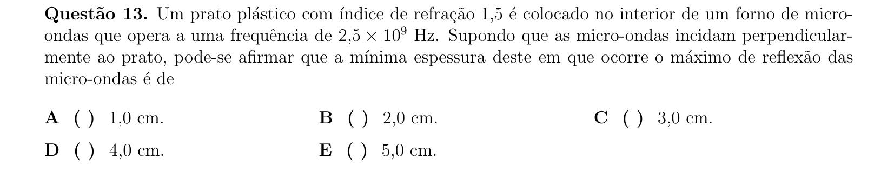

## Q14
**Assunto:** circuitos
**Competências:** leis de Kirchhoff, resolução de malhas, geradores ideais, associação de resistores
**Tipo:** múltipla escolha

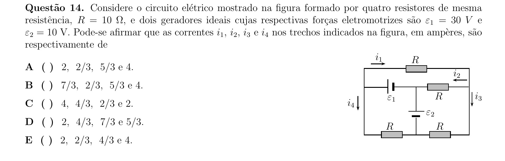

## Q15
**Assunto:** eletrostática
**Competências:** indução em condutores, blindagem eletrostática, potencial em cascas esféricas, distribuição de cargas
**Tipo:** múltipla escolha

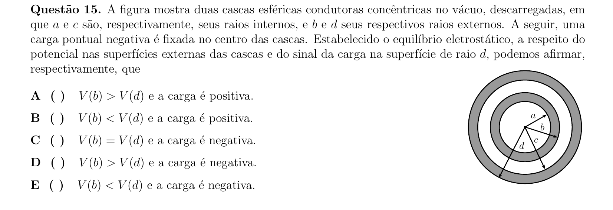

## Q16
**Assunto:** hidrostática
**Competências:** empuxo em fluidos estratificados, equilíbrio com mola, lei de Hooke, densidades distintas
**Tipo:** múltipla escolha

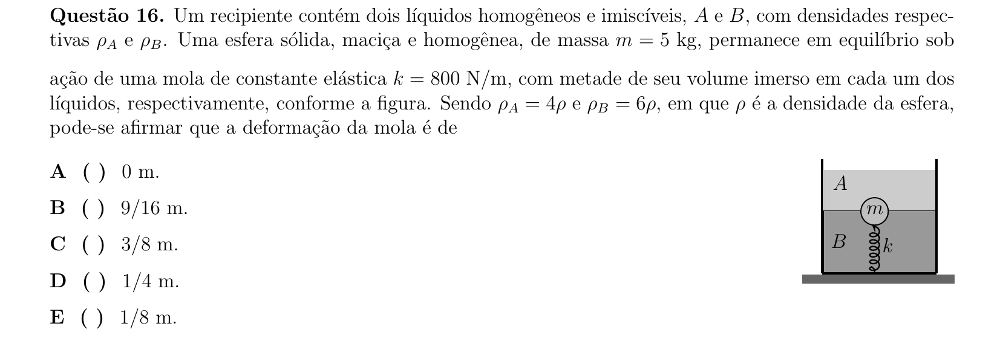

## Q17
**Assunto:** termodinâmica
**Competências:** segunda lei da termodinâmica, irreversibilidade, seta do tempo, processos macroscópicos
**Tipo:** múltipla escolha

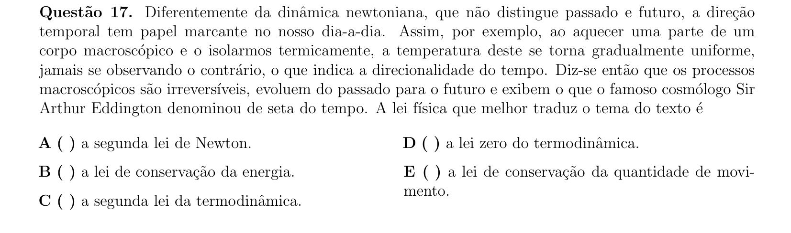

## Q18
**Assunto:** física moderna
**Competências:** efeito fotoelétrico, função trabalho, níveis de energia do hidrogênio, energia cinética máxima
**Tipo:** múltipla escolha

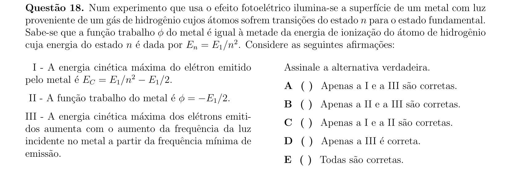

## Q19
**Assunto:** magnetismo
**Competências:** campo magnético de espira circular, campo de fio retilíneo, superposição de campos, regra da mão direita
**Tipo:** múltipla escolha

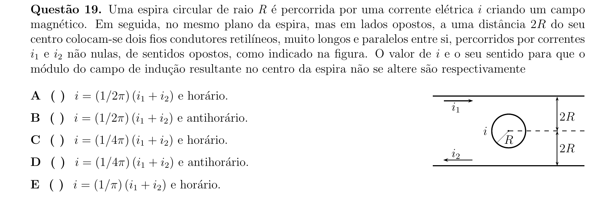

## Q20
**Assunto:** gravitação
**Competências:** leis de Kepler, energia mecânica em órbita elíptica, conservação do momento angular, semieixos e excentricidade
**Tipo:** múltipla escolha

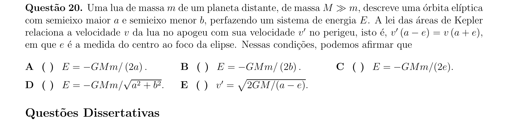

## Q21
**Assunto:** física moderna
**Competências:** dinâmica relativística, relação energia-momento, fator de Lorentz, partículas de massa de repouso nula
**Tipo:** discursiva

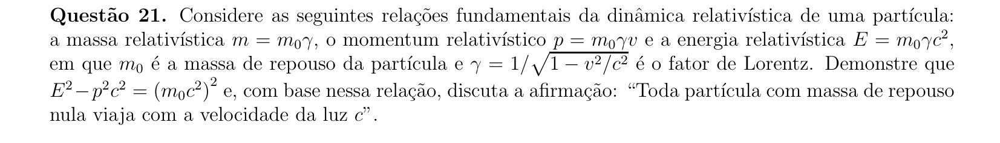

## Q22
**Assunto:** termodinâmica
**Competências:** lei dos gases ideais, transformação isovolumétrica, manômetro de mercúrio, extrapolação ao zero absoluto, teoria cinética
**Tipo:** discursiva

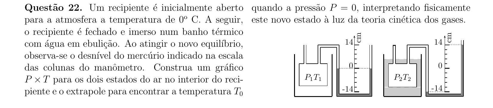

## Q23
**Assunto:** dinâmica
**Competências:** colisão elástica entre partícula e barra, conservação de momento linear e angular, momento de inércia de barra, cinemática pós-colisão
**Tipo:** discursiva

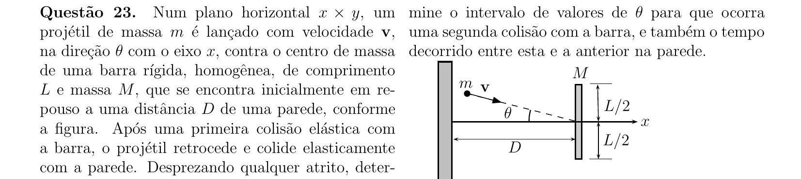

## Q24
**Assunto:** óptica física
**Competências:** interferometria, limite de resolução angular, comprimento de onda de rádio, separação mínima entre detectores
**Tipo:** discursiva

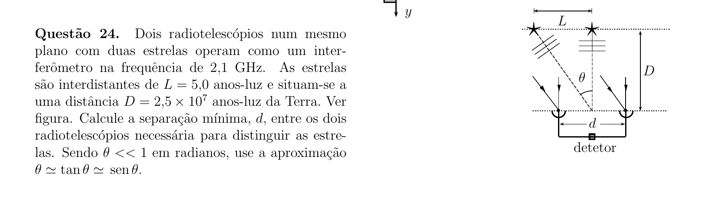

## Q25
**Assunto:** hidrostática
**Competências:** empuxo no ar, segunda lei de Newton, variação de massa e volume, densidade do ar e do balão
**Tipo:** discursiva

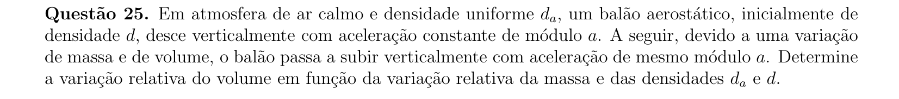

## Q26
**Assunto:** termodinâmica
**Competências:** processo adiabático reversível, expoente de Poisson, primeira lei da termodinâmica, trabalho em gás ideal
**Tipo:** discursiva

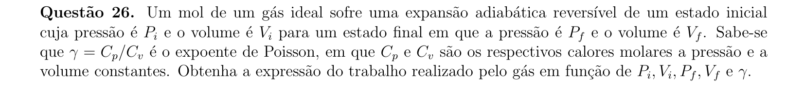

## Q27
**Assunto:** termologia
**Competências:** distribuição de velocidades moleculares, cinemática rotacional, teoria cinética dos gases, sincronização de tempos
**Tipo:** discursiva

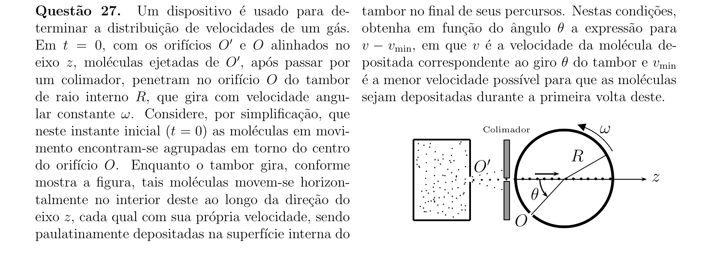

## Q28
**Assunto:** circuitos
**Competências:** equação característica de gerador real, máxima transferência de potência, efeito Joule, calorimetria elétrica
**Tipo:** discursiva

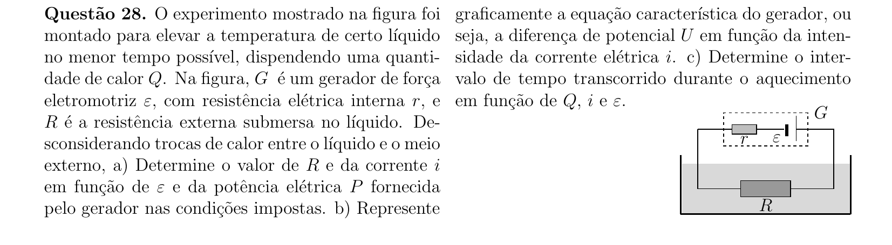

## Q29
**Assunto:** eletrostática
**Competências:** capacitor de placas paralelas, densidade superficial de carga, força elétrica sobre disco condutor, condição de equilíbrio com gravidade
**Tipo:** discursiva

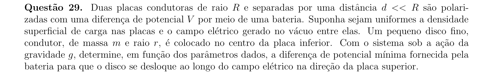

## Q30
**Assunto:** eletromagnetismo
**Competências:** aceleração de carga em campo elétrico, movimento de carga em campo magnético uniforme, teorema do trabalho-energia, trajetória circular
**Tipo:** discursiva

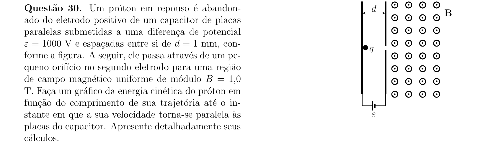
