# Física — ITA 2014

> 30 questões. Q01–Q20 múltipla escolha; Q21–Q30 discursivas.

## Q01
**Assunto:** estática
**Competências:** módulo de Young, deformação elástica, peso próprio, análise dimensional
**Tipo:** múltipla escolha

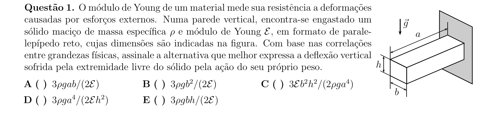

## Q02
**Assunto:** gravitação
**Competências:** leis de Kepler, órbita elíptica, órbita circular, energia mecânica orbital
**Tipo:** múltipla escolha

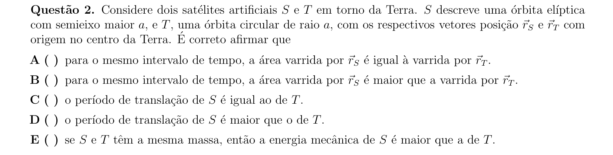

## Q03
**Assunto:** hidrostática
**Competências:** pressão hidrostática, empuxo, equilíbrio de forças, princípio de Stevin
**Tipo:** múltipla escolha

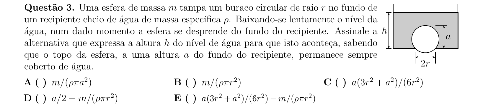

## Q04
**Assunto:** óptica física
**Competências:** interferência em filmes finos, anéis de Newton, distância focal de lente, equação dos fabricantes
**Tipo:** múltipla escolha

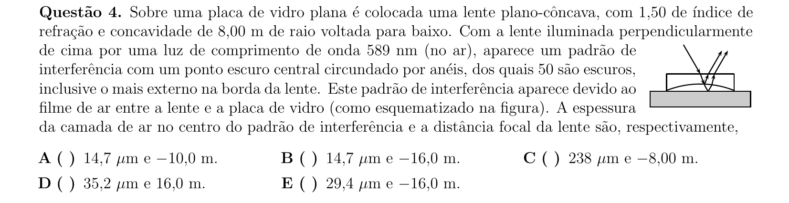

## Q05
**Assunto:** eletrostática
**Competências:** capacitor de placas paralelas, oscilação harmônica, dielétrico, permissividade
**Tipo:** múltipla escolha

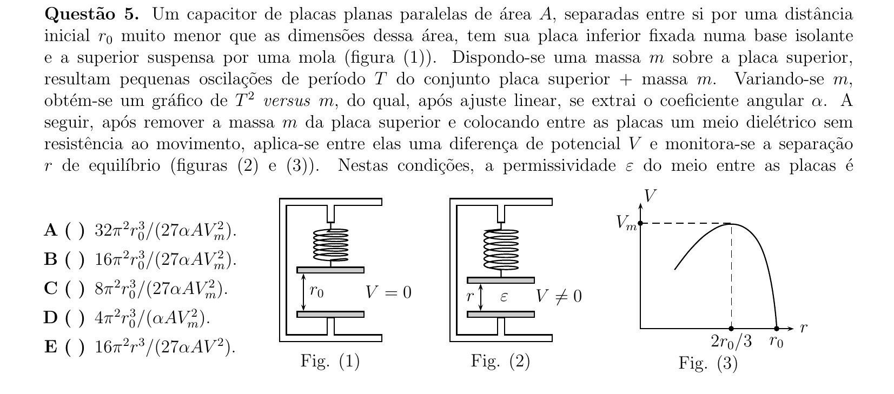

## Q06
**Assunto:** óptica física
**Competências:** interferômetro de Michelson, interferência, índice de refração, contagem de franjas
**Tipo:** múltipla escolha

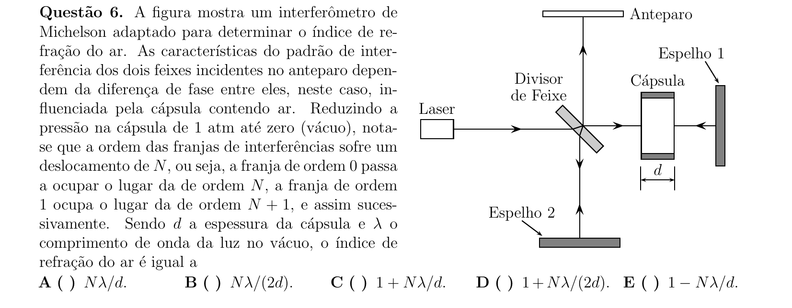

## Q07
**Assunto:** física moderna
**Competências:** modelo de Bohr, energia de ionização, massa efetiva, permissividade relativa
**Tipo:** múltipla escolha

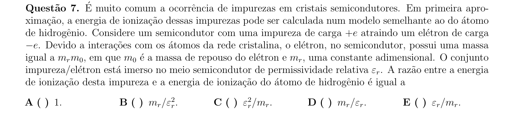

## Q08
**Assunto:** eletromagnetismo
**Competências:** relatividade especial, transformação de campos, fator de Lorentz, referenciais inerciais
**Tipo:** múltipla escolha

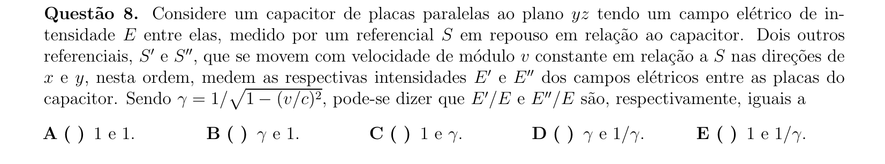

## Q09
**Assunto:** eletrostática
**Competências:** equilíbrio eletrostático, superfície equipotencial, indução eletrostática, potencial elétrico
**Tipo:** múltipla escolha

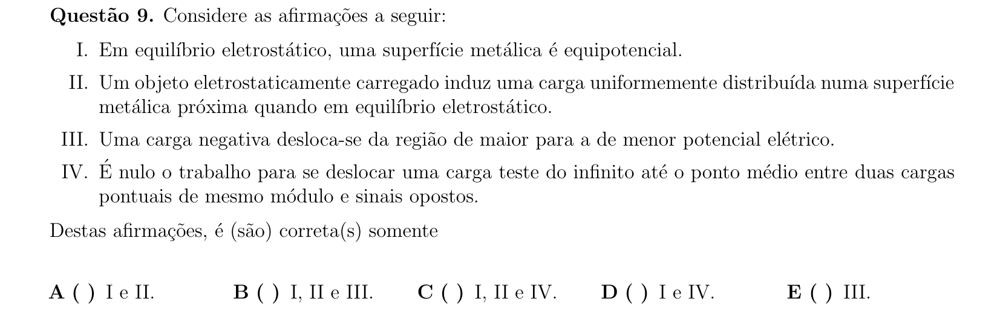

## Q10
**Assunto:** termodinâmica
**Competências:** gás ideal monoatômico, ciclo termodinâmico, primeira lei, trabalho e calor em ciclos
**Tipo:** múltipla escolha

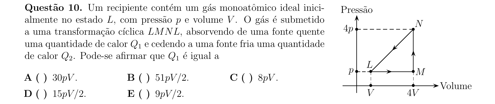

## Q11
**Assunto:** eletromagnetismo
**Competências:** indução eletromagnética, lei de Lenz, fluxo magnético, corrente induzida
**Tipo:** múltipla escolha

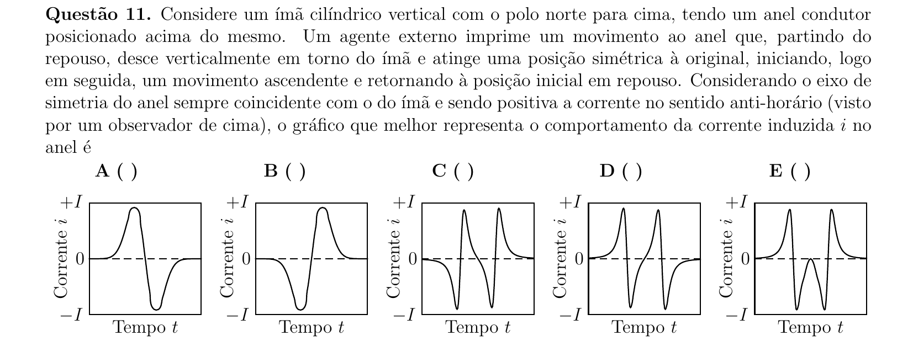

## Q12
**Assunto:** circuitos
**Competências:** quadripolo, matriz de impedância, associação de resistores, análise de redes
**Tipo:** múltipla escolha

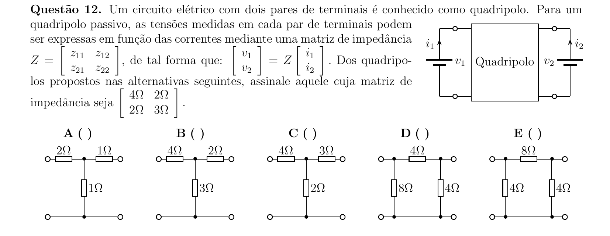

## Q13
**Assunto:** gravitação
**Competências:** sistema binário, centro de massa, efeito Doppler, movimento circular
**Tipo:** múltipla escolha

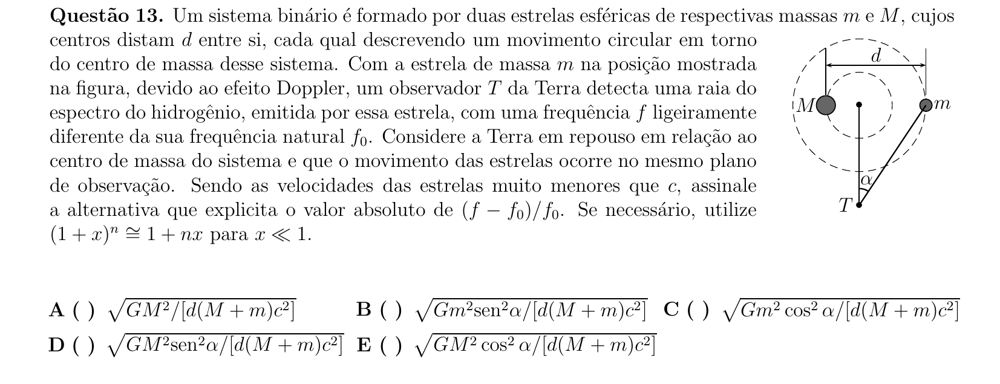

## Q14
**Assunto:** óptica física
**Competências:** interferência de múltiplas fontes, superposição de ondas, intensidade luminosa
**Tipo:** múltipla escolha

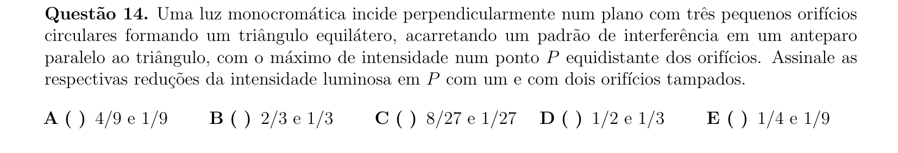

## Q15
**Assunto:** termodinâmica
**Competências:** segunda lei da termodinâmica, degradação de energia, máquina térmica, entropia
**Tipo:** múltipla escolha

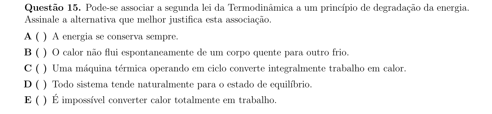

## Q16
**Assunto:** mecânica dos fluidos
**Competências:** referencial não inercial, força centrífuga, superfície de fluido em rotação, energia potencial
**Tipo:** múltipla escolha

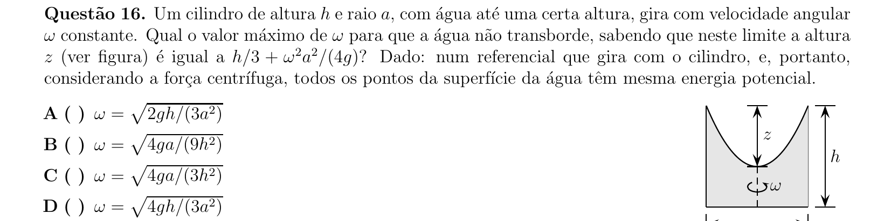

## Q17
**Assunto:** dinâmica
**Competências:** colisão inelástica, conservação do momento angular, energia mecânica, corpo rígido
**Tipo:** múltipla escolha

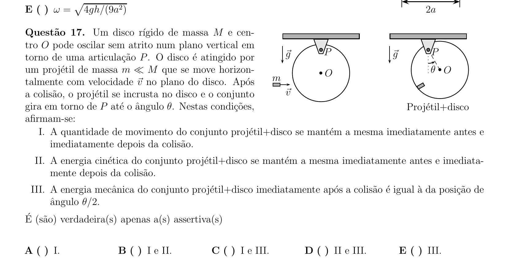

## Q18
**Assunto:** magnetismo
**Competências:** campo magnético de espira circular, lei de Biot-Savart, superposição de campos
**Tipo:** múltipla escolha

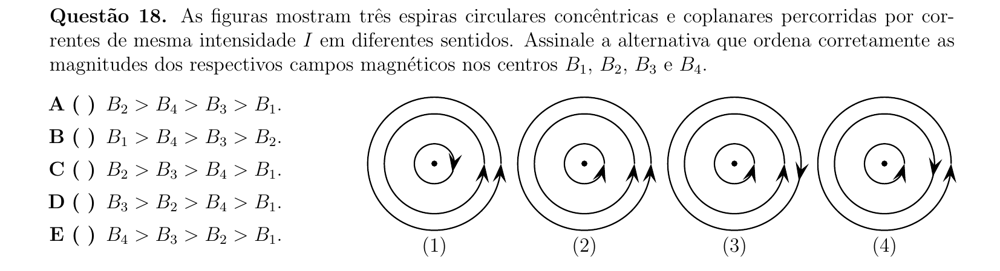

## Q19
**Assunto:** física moderna
**Competências:** efeito fotoelétrico, função trabalho, corrente de saturação, intensidade de radiação
**Tipo:** múltipla escolha

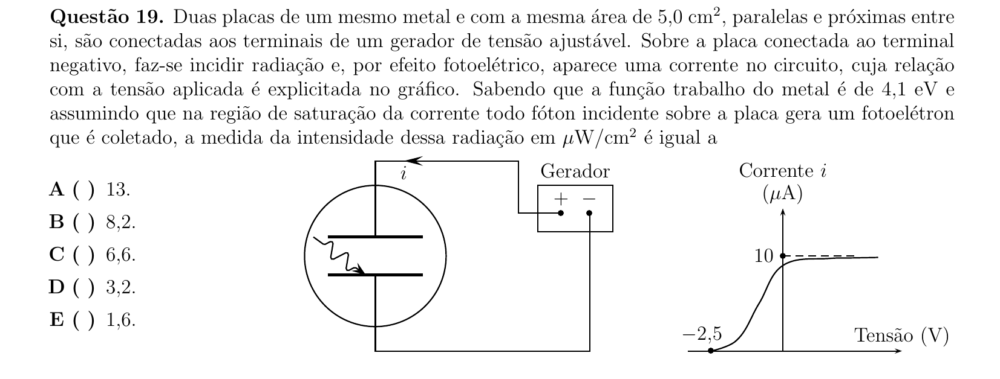

## Q20
**Assunto:** física moderna
**Competências:** efeito Doppler relativístico, redshift gravitacional, energia do fóton, massa efetiva
**Tipo:** múltipla escolha

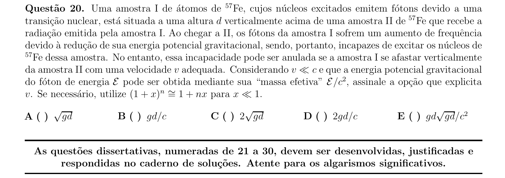

## Q21
**Assunto:** eletrostática
**Competências:** unidades atômicas de Hartree, análise dimensional, constantes fundamentais, conversão de unidades
**Tipo:** discursiva

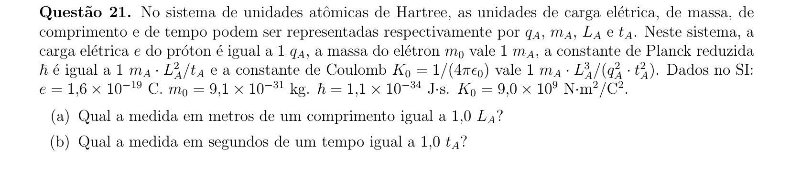

## Q22
**Assunto:** termodinâmica
**Competências:** primeira lei, dilatação volumétrica, calor específico, trabalho contra pressão atmosférica
**Tipo:** discursiva

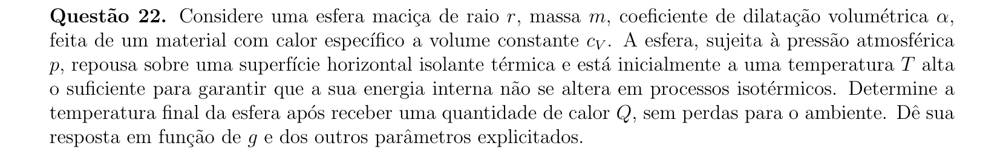

## Q23
**Assunto:** eletrostática
**Competências:** lei de Coulomb, soma vetorial de forças, rede cristalina, defeitos pontuais
**Tipo:** discursiva

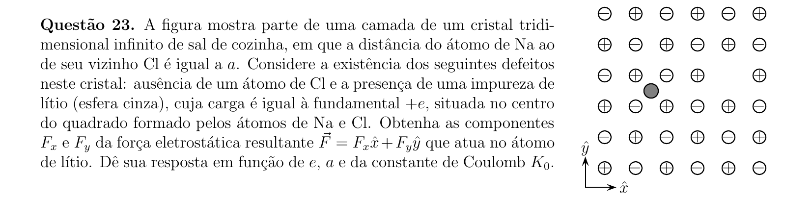

## Q24
**Assunto:** óptica física
**Competências:** experiência de Young, interferência de duas fontes, dupla fenda, máximos de interferência
**Tipo:** discursiva

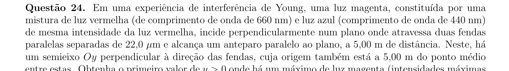

## Q25
**Assunto:** cinemática
**Competências:** queda livre, colisão elástica, plano inclinado, progressão aritmética
**Tipo:** discursiva

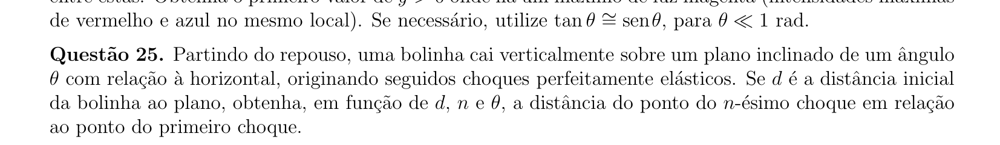

## Q26
**Assunto:** óptica geométrica
**Competências:** método de Foucault, reflexão em espelho rotativo, velocidade da luz, índice de refração
**Tipo:** discursiva

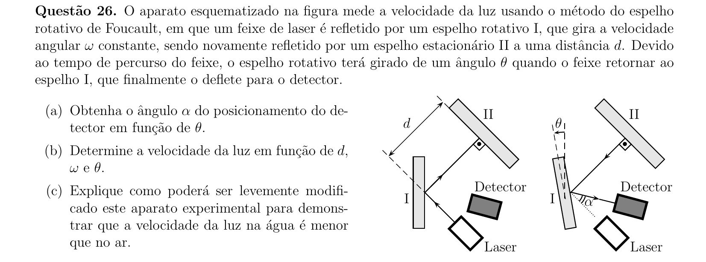

## Q27
**Assunto:** física moderna
**Competências:** oscilador harmônico quântico, energia de ponto zero, princípio da incerteza, quantização de energia
**Tipo:** discursiva

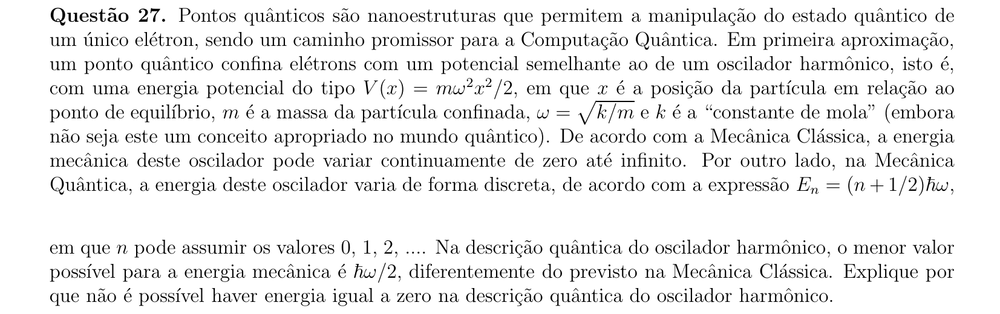

## Q28
**Assunto:** eletromagnetismo
**Competências:** campo magnético de espiras, torque magnético, indução, frequências altas
**Tipo:** discursiva

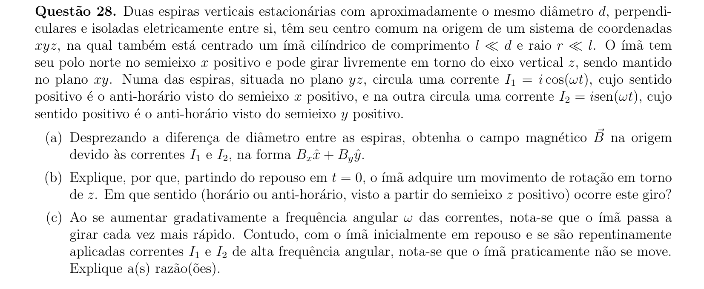

## Q29
**Assunto:** circuitos
**Competências:** fonte de corrente dependente, transferência de carga entre capacitores, leis de Kirchhoff, série geométrica
**Tipo:** discursiva

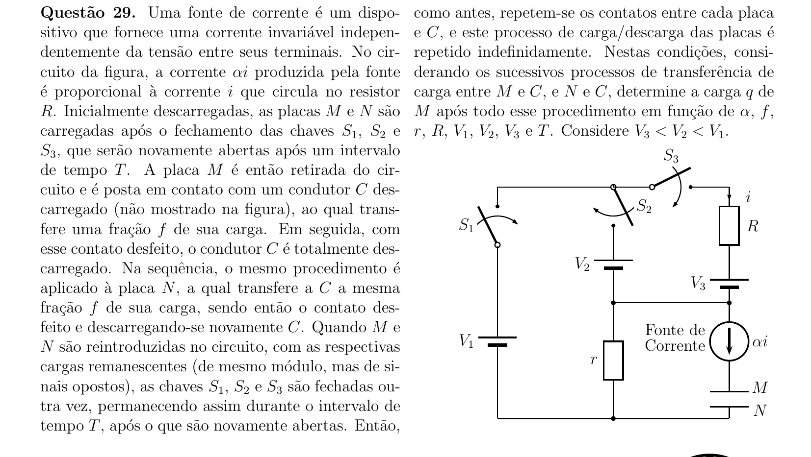

## Q30
**Assunto:** estática
**Competências:** equilíbrio de corpos rígidos, decomposição de forças normais, geometria espacial, simetria
**Tipo:** discursiva

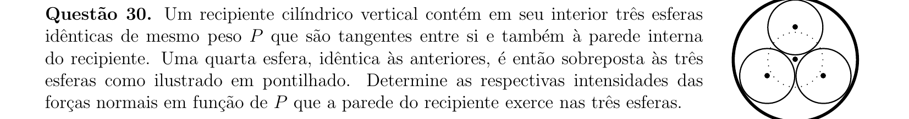
