# Física — ITA 2015

> 30 questões. Q01–Q20 múltipla escolha; Q21–Q30 discursivas.

## Q01
**Assunto:** ondulatória
**Competências:** ondas em cordas, velocidade de pulso, densidade linear, tensão em fio esticado
**Tipo:** múltipla escolha

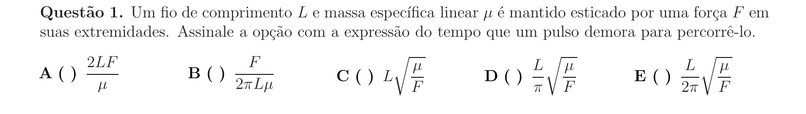

## Q02
**Assunto:** eletrostática
**Competências:** força elétrica em campo uniforme, lançamento vertical, conservação de energia, cinemática com força resultante constante
**Tipo:** múltipla escolha

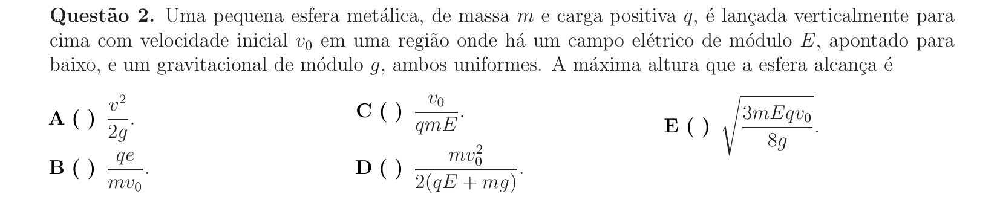

## Q03
**Assunto:** dinâmica
**Competências:** movimento em superfície curva, normal e descolamento, atrito, referenciais não inerciais, conservação de energia
**Tipo:** múltipla escolha

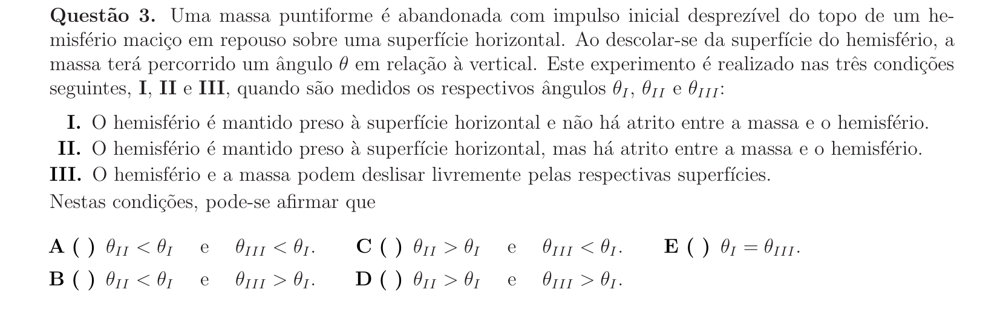

## Q04
**Assunto:** eletrostática
**Competências:** lei de Coulomb, equilíbrio de cargas, estabilidade de equilíbrio, análise qualitativa de configurações
**Tipo:** múltipla escolha

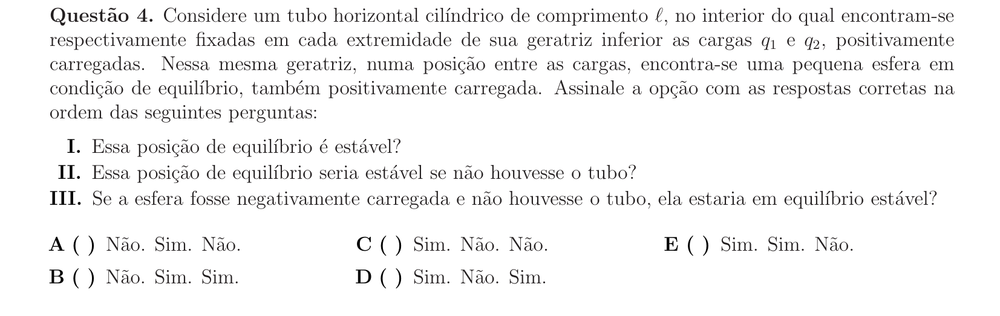

## Q05
**Assunto:** magnetismo
**Competências:** campo magnético de carga em movimento, força magnética e trabalho, força entre fios paralelos, análise de proposições
**Tipo:** múltipla escolha

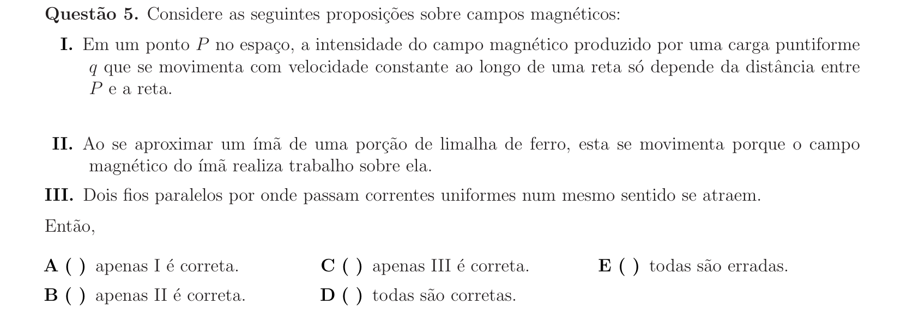

## Q06
**Assunto:** dinâmica
**Competências:** centro de massa, corpo composto, simetria, áreas e massas equivalentes
**Tipo:** múltipla escolha

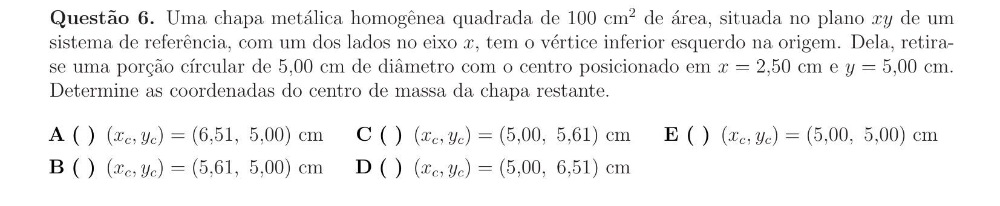

## Q07
**Assunto:** termodinâmica
**Competências:** calorimetria, mudança de fase, pressão de radiação, conservação de momento, calor latente
**Tipo:** múltipla escolha

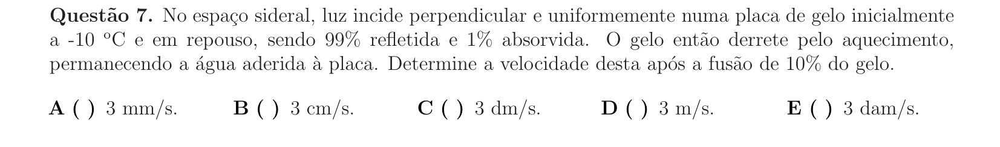

## Q08
**Assunto:** dinâmica
**Competências:** estática, torque, condição de tombamento, centro de gravidade de sólido cônico
**Tipo:** múltipla escolha

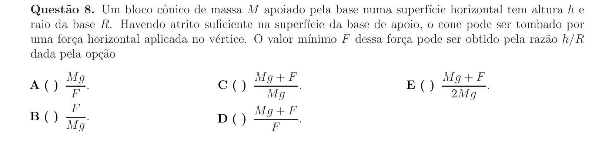

## Q09
**Assunto:** óptica física
**Competências:** interferência em filme fino, cunha de vidro, condição de interferência destrutiva, índice de refração
**Tipo:** múltipla escolha

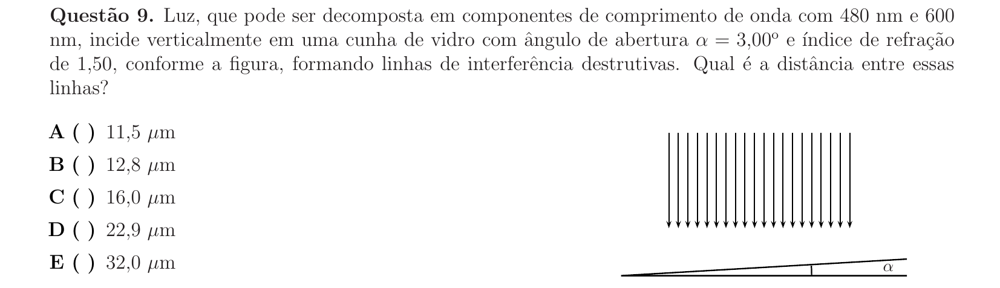

## Q10
**Assunto:** mecânica dos fluidos
**Competências:** hidrostática em referencial acelerado, pressão em fluido, superfície livre inclinada, tubo em U
**Tipo:** múltipla escolha

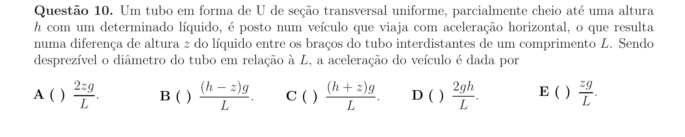

## Q11
**Assunto:** dinâmica
**Competências:** módulo de Young, elongação de fio, movimento harmônico simples, polia e suspensão
**Tipo:** múltipla escolha

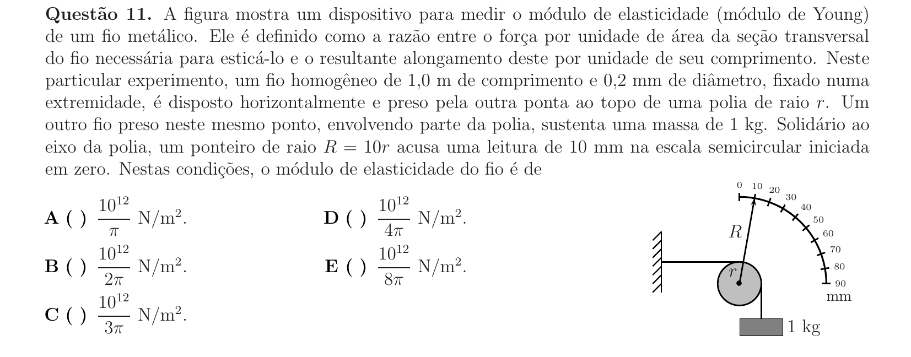

## Q12
**Assunto:** gravitação
**Competências:** campo gravitacional de corpos com simetria, geometria de campos vetoriais, análise de proposições
**Tipo:** múltipla escolha

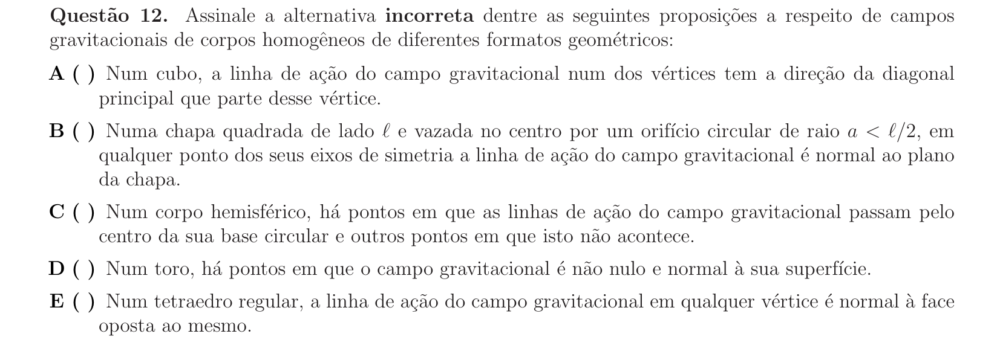

## Q13
**Assunto:** dinâmica
**Competências:** referencial girante, força centrífuga, equilíbrio de barras articuladas, mola
**Tipo:** múltipla escolha

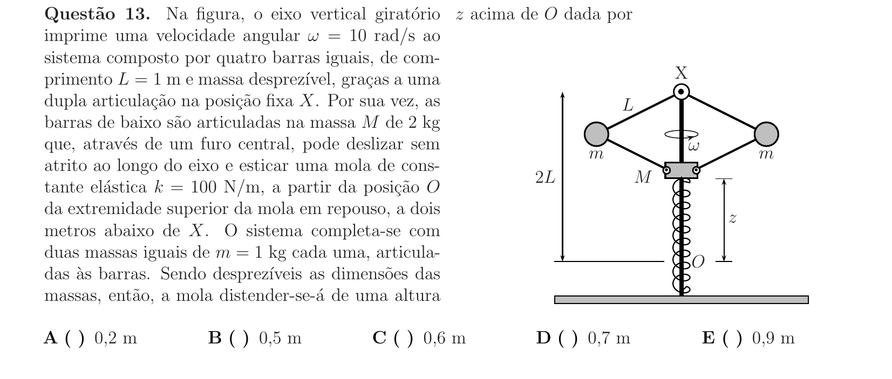

## Q14
**Assunto:** física moderna
**Competências:** isótopos, decaimento radioativo e meia-vida, decaimento beta, efeito fotoelétrico
**Tipo:** múltipla escolha

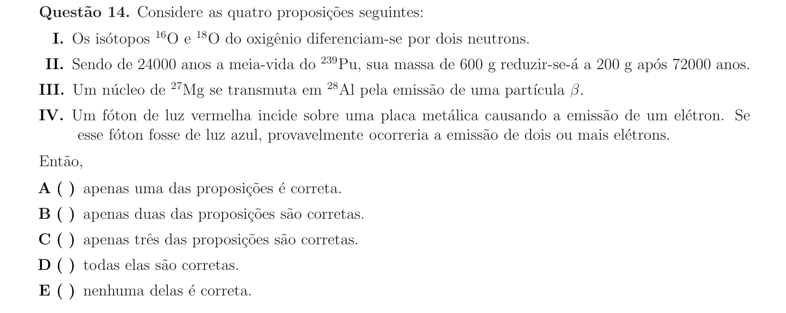

## Q15
**Assunto:** ondulatória
**Competências:** movimento harmônico simples, relações entre posição, velocidade e aceleração, gráficos senoidais
**Tipo:** múltipla escolha

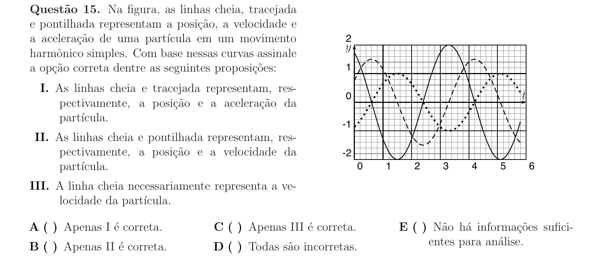

## Q16
**Assunto:** termodinâmica
**Competências:** processo adiabático, trabalho em gás ideal, manipulação algébrica de relações PVT, logaritmos
**Tipo:** múltipla escolha

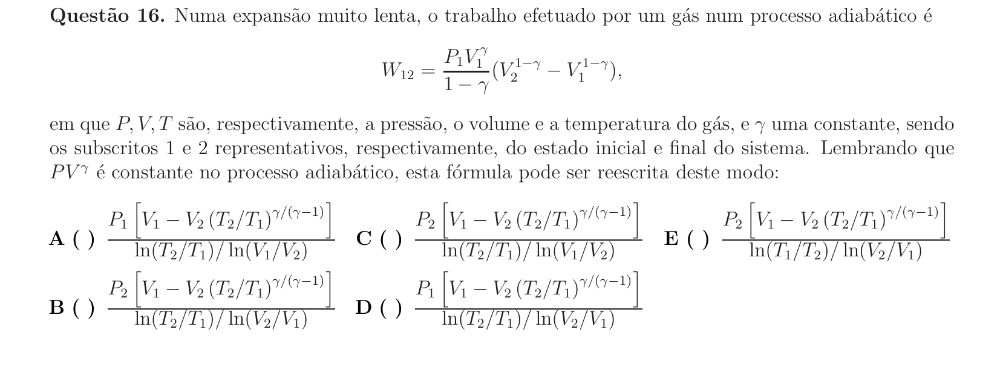

## Q17
**Assunto:** eletrostática
**Competências:** energia potencial eletrostática, configuração de cargas em retângulo, soma de contribuições de pares
**Tipo:** múltipla escolha

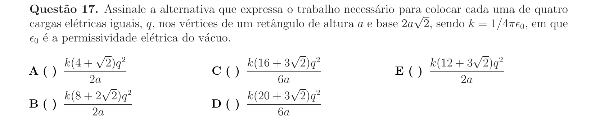

## Q18
**Assunto:** magnetismo
**Competências:** força e torque magnético em espira, indução eletromagnética, equilíbrio em campo não uniforme
**Tipo:** múltipla escolha

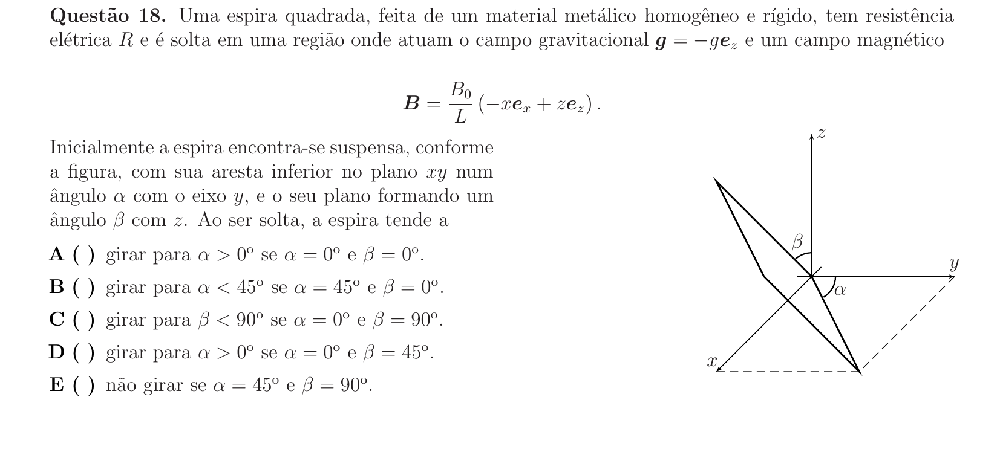

## Q19
**Assunto:** física moderna
**Competências:** dilatação temporal, meia-vida relativística, fator de Lorentz, decaimento de múons
**Tipo:** múltipla escolha

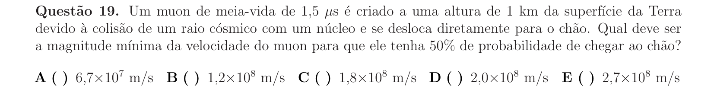

## Q20
**Assunto:** óptica física
**Competências:** experimento tipo Fizeau, interferência com índice de refração móvel, condição destrutiva, arraste de éter
**Tipo:** múltipla escolha

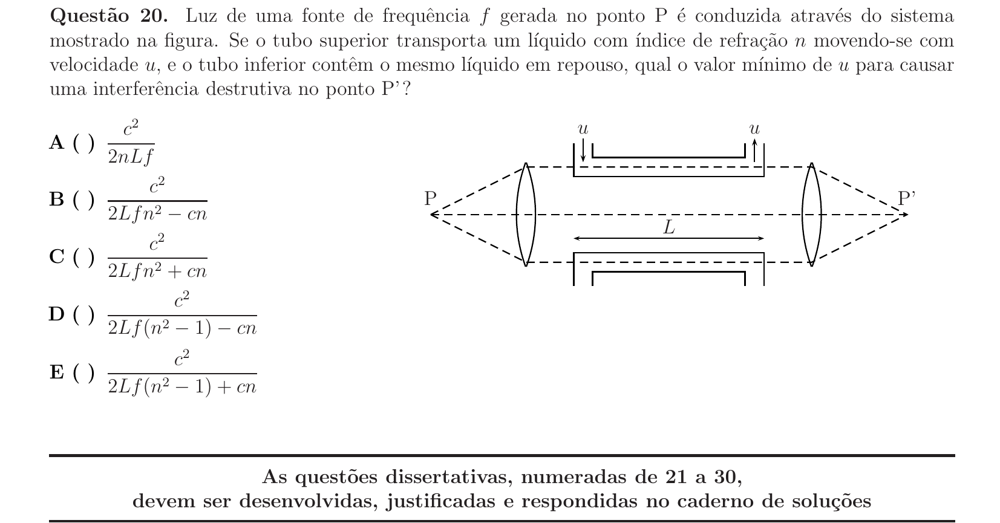

## Q21
**Assunto:** dinâmica
**Competências:** estática de corpos rígidos, equilíbrio com atrito, contato entre esferas e parede cilíndrica, torque
**Tipo:** discursiva

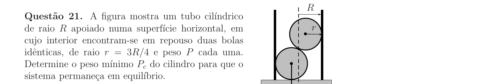

## Q22
**Assunto:** gravitação
**Competências:** órbitas keplerianas, transferência de Hohmann, conservação do momento angular, energia orbital
**Tipo:** discursiva

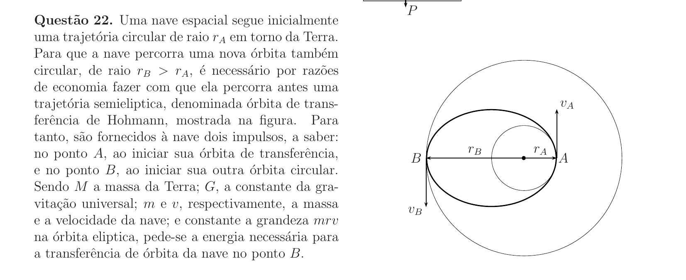

## Q23
**Assunto:** mecânica dos fluidos
**Competências:** empuxo, lei de Arquimedes, modelagem física, estimativas numéricas, densidade
**Tipo:** discursiva

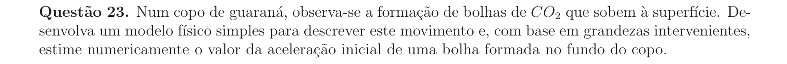

## Q24
**Assunto:** eletrostática
**Competências:** lei de Coulomb, simetria hexagonal, equilíbrio de forças em fios, soma vetorial
**Tipo:** discursiva

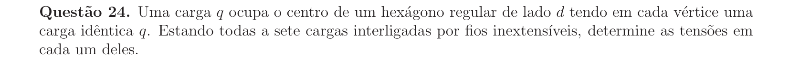

## Q25
**Assunto:** dinâmica
**Competências:** colisão elástica unidimensional, conservação de momento e energia, transferência de energia entre massas
**Tipo:** discursiva

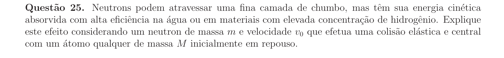

## Q26
**Assunto:** óptica geométrica
**Competências:** lei de Snell, ângulo limite, reflexão total, refração em prisma, índice de refração
**Tipo:** discursiva

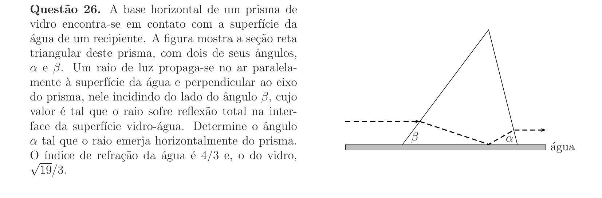

## Q27
**Assunto:** eletromagnetismo
**Competências:** circuitos em série, potência elétrica, resistência de lâmpadas incandescentes, divisão de tensão
**Tipo:** discursiva

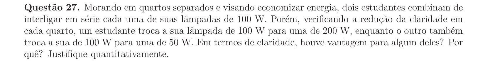

## Q28
**Assunto:** ondulatória
**Competências:** movimento harmônico simples, oscilação assimétrica (mola não atua para z<0), composição MHS + queda livre, período
**Tipo:** discursiva

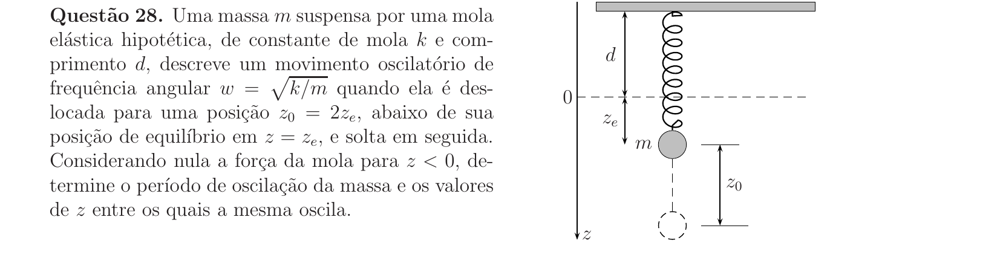

## Q29
**Assunto:** magnetismo
**Competências:** força de Lorentz, movimento circular em campo magnético, trajetória em regiões distintas, raio de giro
**Tipo:** discursiva

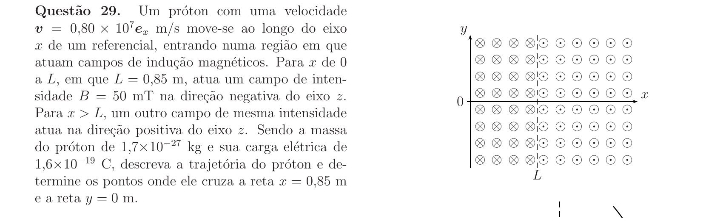

## Q30
**Assunto:** física moderna
**Competências:** radiação Cherenkov, frente de onda cônica, índice de refração, geometria de reflexão em espelho esférico
**Tipo:** discursiva

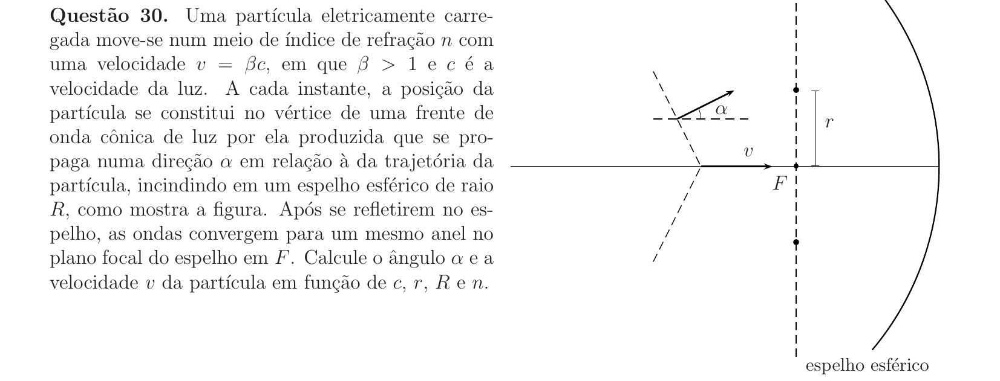
