# Física — ITA 2016

> 30 questões. Q01–Q20 múltipla escolha; Q21–Q30 discursivas.

## Q01
**Assunto:** mecânica dos fluidos
**Competências:** análise dimensional, lei de Stokes, força de arrasto viscoso, viscosidade
**Tipo:** múltipla escolha

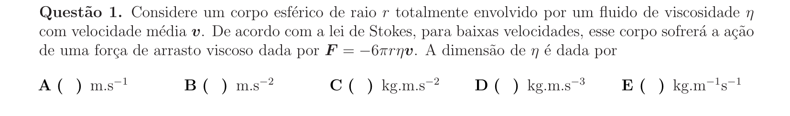

## Q02
**Assunto:** estática
**Competências:** equilíbrio de corpos rígidos, treliças, decomposição de forças, tração e compressão
**Tipo:** múltipla escolha

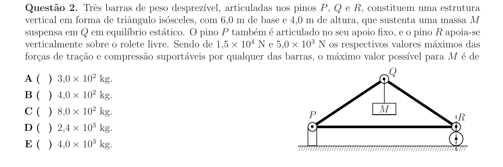

## Q03
**Assunto:** cinemática
**Competências:** movimento uniforme, encontro de móveis, conversão de unidades
**Tipo:** múltipla escolha

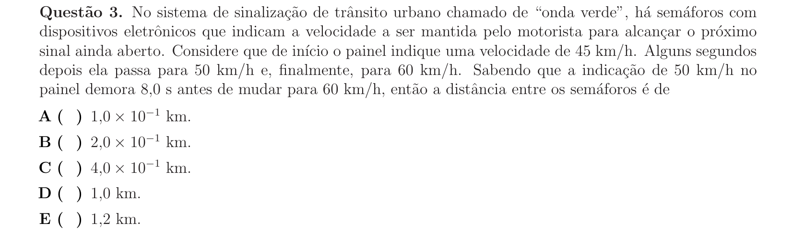

## Q04
**Assunto:** trabalho e energia
**Competências:** colisão inelástica, conservação de momento, conservação de energia, oscilação massa-mola
**Tipo:** múltipla escolha

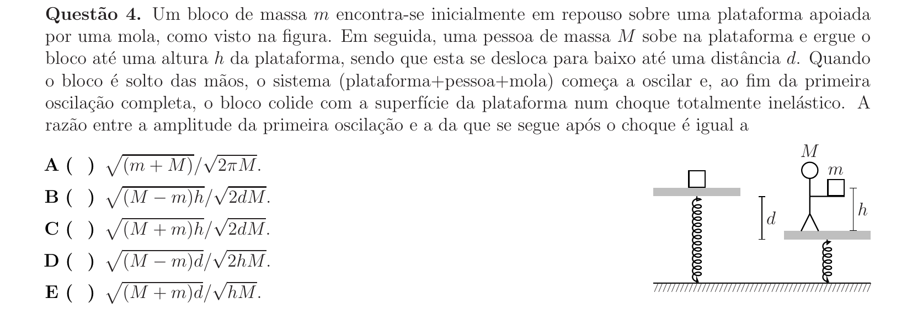

## Q05
**Assunto:** cinemática
**Competências:** MRUV, lançamento vertical, queda livre, altura máxima e tempo de voo
**Tipo:** múltipla escolha

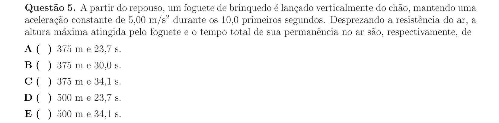

## Q06
**Assunto:** dinâmica
**Competências:** movimento circular, força centrípeta, estabilidade de veículos, momento de tombamento
**Tipo:** múltipla escolha

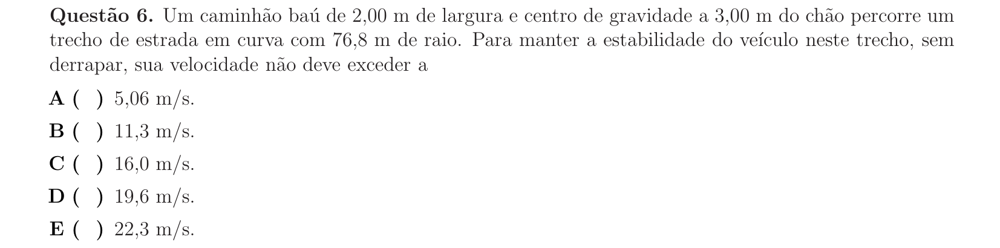

## Q07
**Assunto:** gravitação
**Competências:** sistema binário, terceira lei de Kepler, centro de massa, segunda lei de Kepler
**Tipo:** múltipla escolha

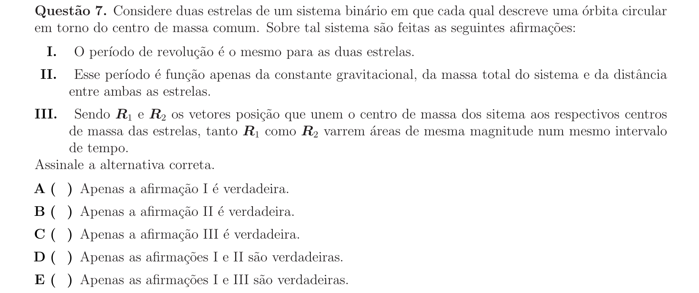

## Q08
**Assunto:** hidrostática
**Competências:** empuxo, princípio de Arquimedes, densidade, volume submerso
**Tipo:** múltipla escolha

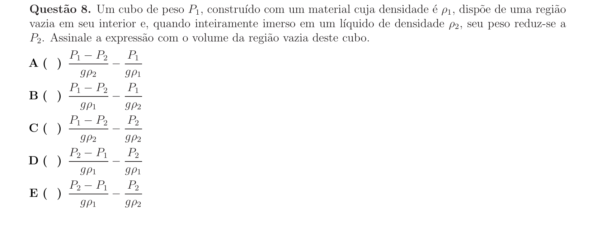

## Q09
**Assunto:** termologia
**Competências:** dilatação térmica linear, período do pêndulo simples, análise gráfica
**Tipo:** múltipla escolha

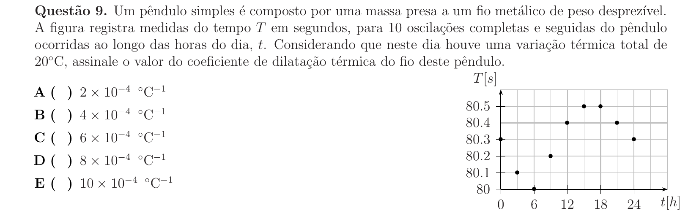

## Q10
**Assunto:** dinâmica
**Competências:** pêndulo simples, conservação de energia, força centrípeta, tração no fio
**Tipo:** múltipla escolha

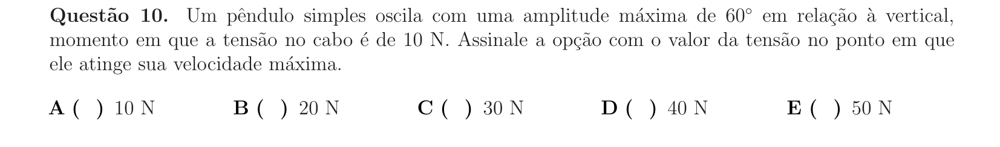

## Q11
**Assunto:** eletromagnetismo
**Competências:** força de Lorentz, FEM induzida em fluido condutor, equilíbrio eletrostático em campo magnético
**Tipo:** múltipla escolha

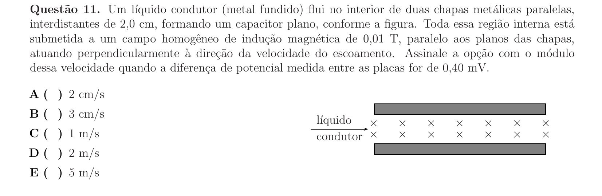

## Q12
**Assunto:** mecânica dos fluidos
**Competências:** equação de Bernoulli, tubo de Pitot, pressão dinâmica, manômetro
**Tipo:** múltipla escolha

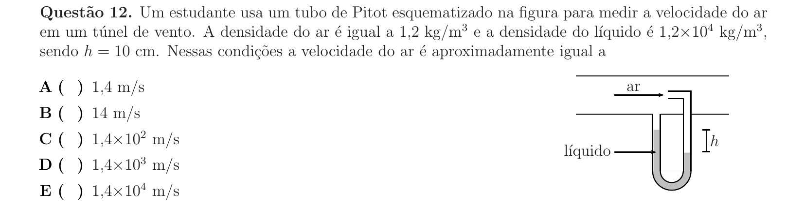

## Q13
**Assunto:** termodinâmica
**Competências:** equação de Clapeyron, gás ideal, empuxo em gases, transformação geral
**Tipo:** múltipla escolha

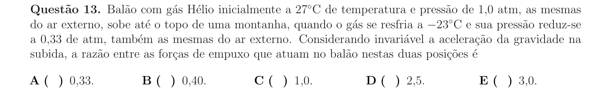

## Q14
**Assunto:** hidrostática
**Competências:** empuxo, flutuação em líquidos imiscíveis, densidade, equilíbrio
**Tipo:** múltipla escolha

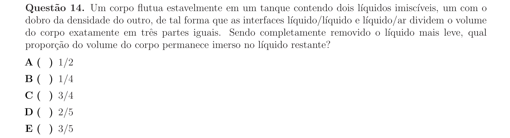

## Q15
**Assunto:** estática
**Competências:** atrito estático, equilíbrio em superfícies curvas, geometria, decomposição de forças
**Tipo:** múltipla escolha

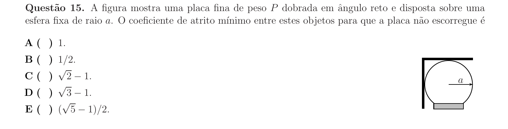

## Q16
**Assunto:** ondulatória
**Competências:** ondas em cordas, modo fundamental, velocidade de propagação, densidade linear
**Tipo:** múltipla escolha

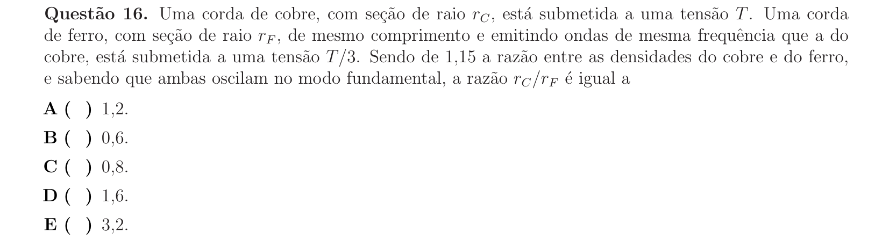

## Q17
**Assunto:** óptica geométrica
**Competências:** reflexão total, índice de refração, ângulo crítico, fibra óptica, geometria
**Tipo:** múltipla escolha

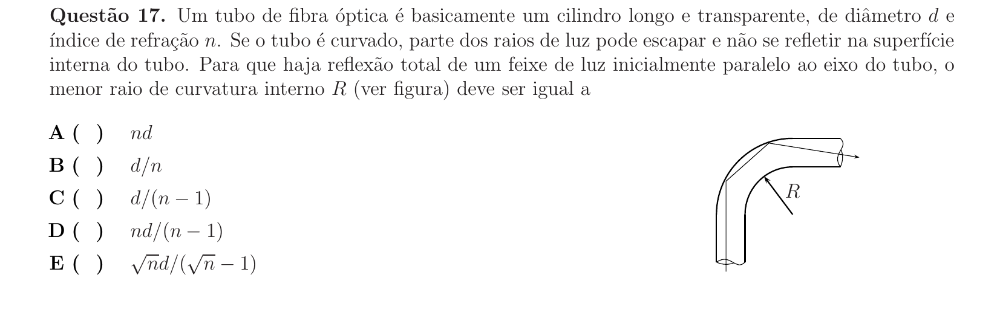

## Q18
**Assunto:** circuitos
**Competências:** carga e descarga de capacitores, associação de capacitores, RC, análise gráfica
**Tipo:** múltipla escolha

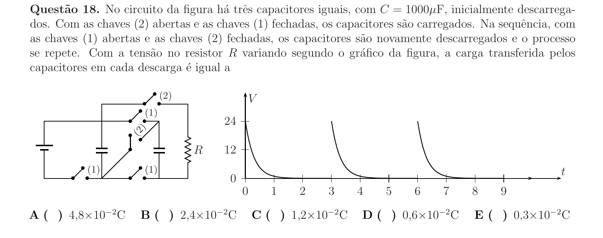

## Q19
**Assunto:** eletromagnetismo
**Competências:** lei de Faraday, FEM induzida, fluxo magnético, lei de Ohm
**Tipo:** múltipla escolha

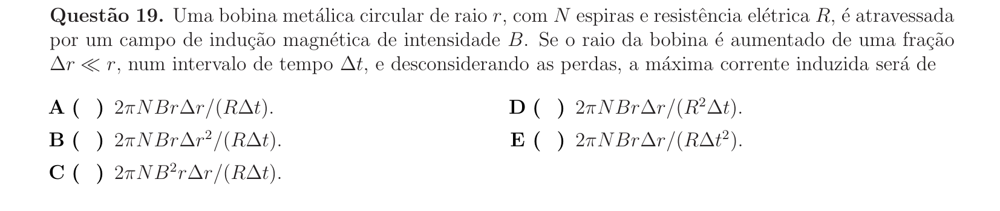

## Q20
**Assunto:** física moderna
**Competências:** efeito Doppler relativístico, relatividade restrita, comprimento de onda
**Tipo:** múltipla escolha

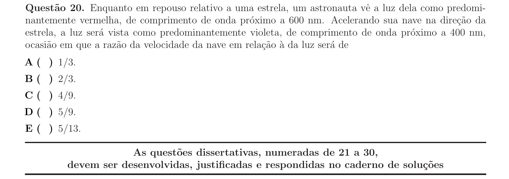

## Q21
**Assunto:** circuitos
**Competências:** lei de Ohm, instrumentos reais (voltímetro/amperímetro), resistência interna, associação de resistores
**Tipo:** discursiva

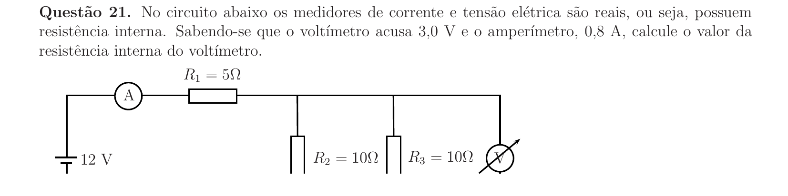

## Q22
**Assunto:** dinâmica
**Competências:** atrito cinético, MRUV, frenagem, modelagem física, gráficos v×t
**Tipo:** discursiva

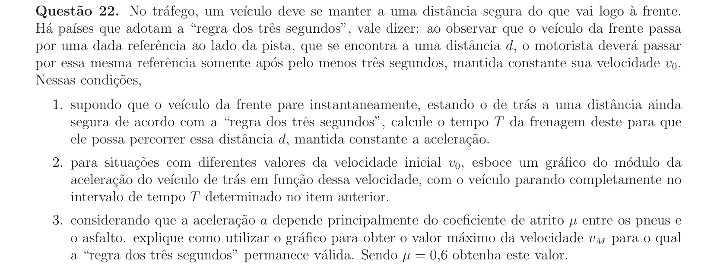

## Q23
**Assunto:** mecânica dos fluidos
**Competências:** equação de Torricelli, conservação de momento, vazão, segunda lei de Newton
**Tipo:** discursiva

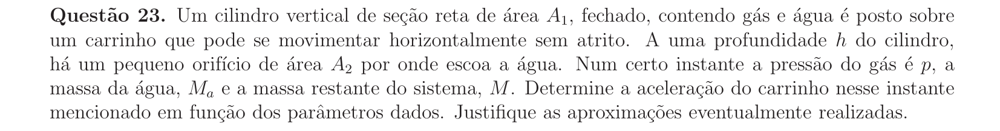

## Q24
**Assunto:** acústica
**Competências:** efeito Doppler, queda livre, análise gráfica, frequência sonora
**Tipo:** discursiva

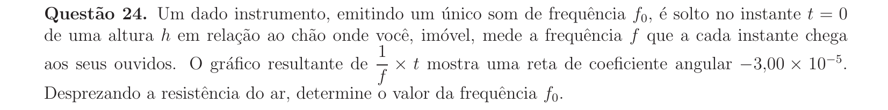

## Q25
**Assunto:** dinâmica
**Competências:** conservação do momento linear, terceira lei de Newton, atrito cinético, cinemática
**Tipo:** discursiva

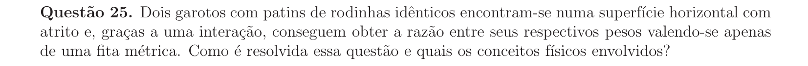

## Q26
**Assunto:** calorimetria
**Competências:** conversão energia cinética em calor, calor sensível, calor latente de vaporização, queda livre
**Tipo:** discursiva

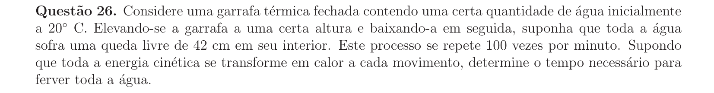

## Q27
**Assunto:** eletrodinâmica
**Competências:** resistividade, associação de resistores, geometria variável no tempo, esboço de gráfico
**Tipo:** discursiva

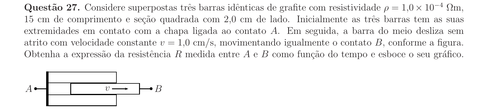

## Q28
**Assunto:** dinâmica
**Competências:** colisão elástica, conservação de momento, conservação de energia, distribuição de carga em condutores
**Tipo:** discursiva

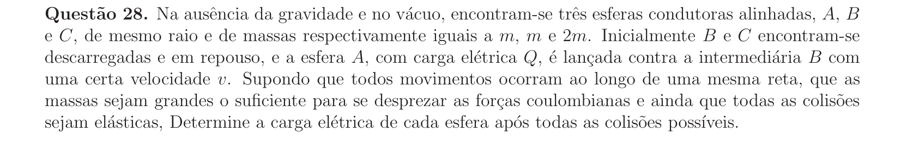

## Q29
**Assunto:** dinâmica
**Competências:** oscilações, lei de Hooke, vínculos geométricos, frequência angular, equilíbrio
**Tipo:** discursiva

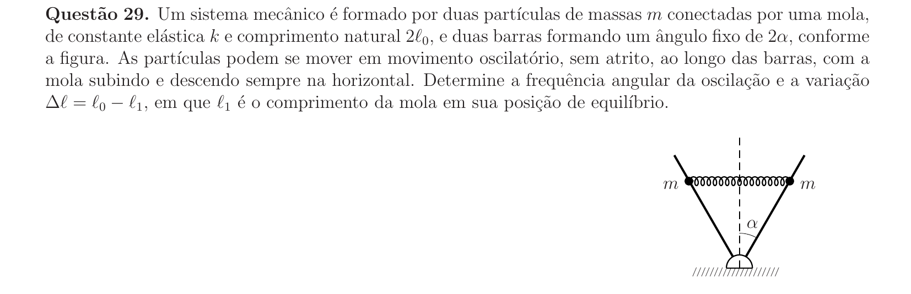

## Q30
**Assunto:** circuitos
**Competências:** circuito RC, carga e descarga de capacitor, lei de Ohm, regime transitório e permanente
**Tipo:** discursiva

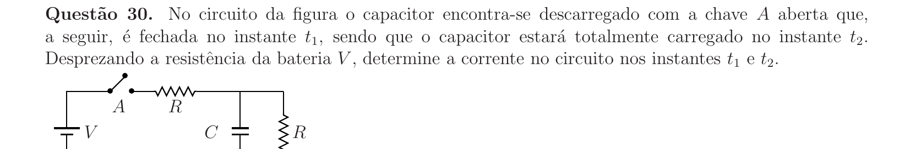
