# Física — ITA 2017

> 30 questões. Q01–Q20 múltipla escolha; Q21–Q30 discursivas.

## Q01
**Assunto:** gravitação
**Competências:** análise dimensional, ondas gravitacionais, constantes fundamentais, expoentes de grandezas físicas
**Tipo:** múltipla escolha

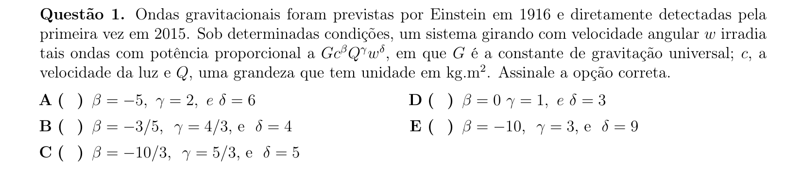

## Q02
**Assunto:** estática
**Competências:** equilíbrio de corpo rígido, atrito estático, torque, plano inclinado
**Tipo:** múltipla escolha

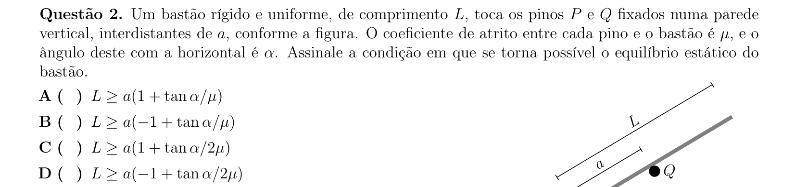

## Q03
**Assunto:** dinâmica
**Competências:** referenciais não inerciais, atrito cinético, segunda lei de Newton, cinemática uniformemente variada
**Tipo:** múltipla escolha

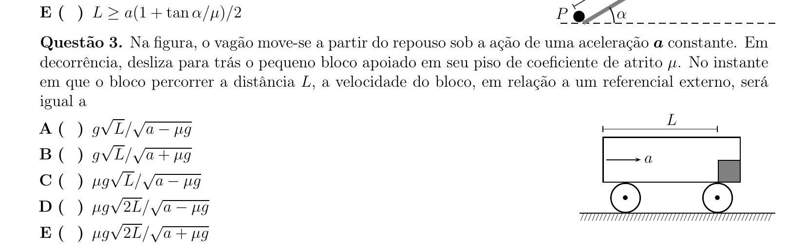

## Q04
**Assunto:** eletrostática
**Competências:** capacitância de esfera condutora, conservação de carga, potencial elétrico, geometria volumétrica
**Tipo:** múltipla escolha

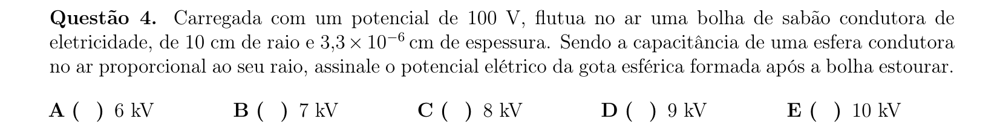

## Q05
**Assunto:** dinâmica
**Competências:** atrito estático versus cinético, tração dianteira, terceira lei de Newton, força de atrito como motriz
**Tipo:** múltipla escolha

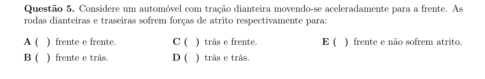

## Q06
**Assunto:** dinâmica
**Competências:** pêndulo simples, massa variável, MHS, hidrostática elementar
**Tipo:** múltipla escolha

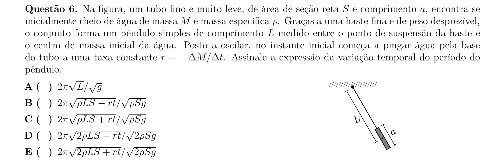

## Q07
**Assunto:** estática
**Competências:** equilíbrio com atrito, decomposição de forças, geometria de barras, pêndulo simples
**Tipo:** múltipla escolha

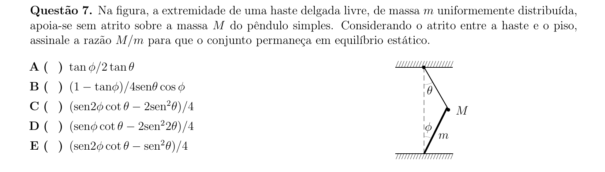

## Q08
**Assunto:** física moderna
**Competências:** interpretação de gráficos, plasma e cargas livres, corrente elétrica, conservação de carga
**Tipo:** múltipla escolha

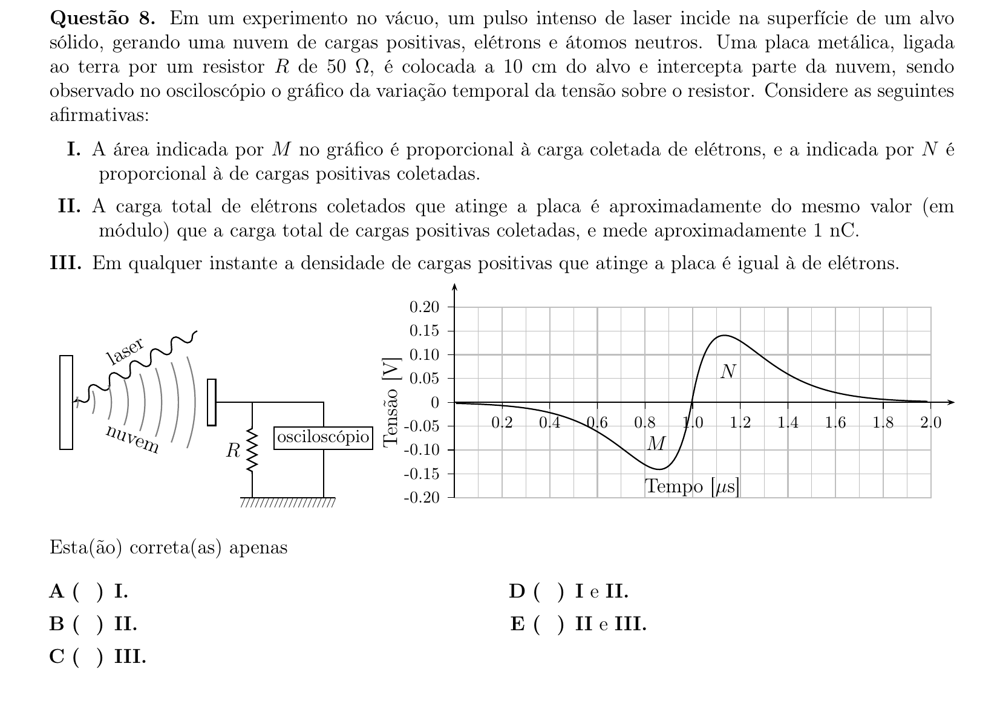

## Q09
**Assunto:** física moderna
**Competências:** efeito fotoelétrico, função trabalho, quantização de energia, fóton
**Tipo:** múltipla escolha

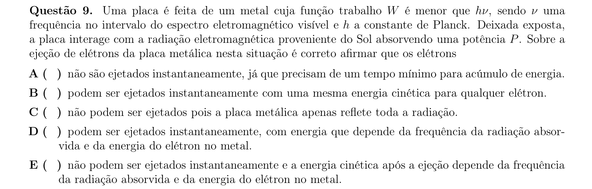

## Q10
**Assunto:** óptica física
**Competências:** difração, óptica geométrica, fendas, comportamento ondulatório da luz
**Tipo:** múltipla escolha

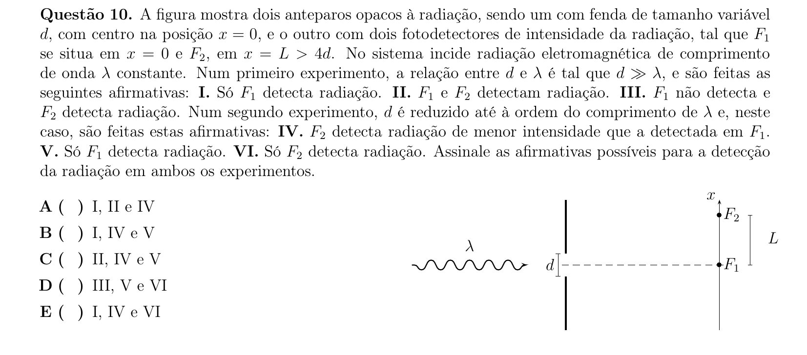

## Q11
**Assunto:** estática
**Competências:** sistema massa-mola, equilíbrio estático, lei de Hooke, somatório de forças em série
**Tipo:** múltipla escolha

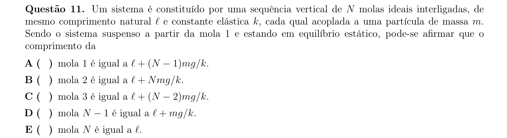

## Q12
**Assunto:** eletromagnetismo
**Competências:** lei de Faraday, bétatron, energia cinética relativística, fem induzida
**Tipo:** múltipla escolha

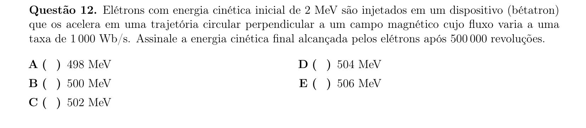

## Q13
**Assunto:** eletromagnetismo
**Competências:** força magnética sobre carga em movimento, movimento de carga em campos cruzados, conservação de energia, cicloide
**Tipo:** múltipla escolha

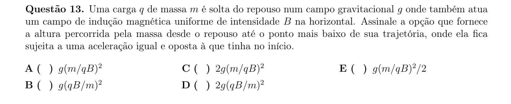

## Q14
**Assunto:** cinemática
**Competências:** leitura de gráfico v-d, velocidade escalar média, distância x deslocamento, MRU em trechos
**Tipo:** múltipla escolha

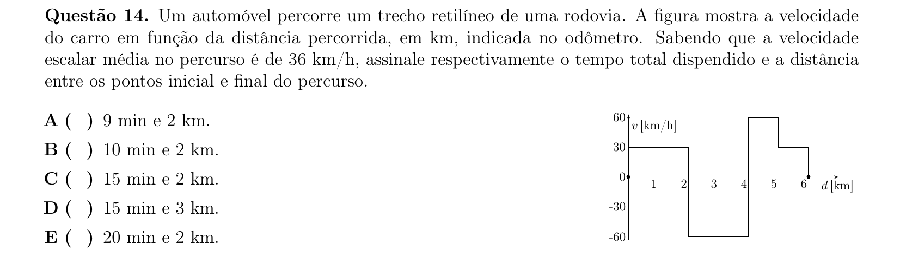

## Q15
**Assunto:** física moderna
**Competências:** modelo de Bohr, espectro do hidrogênio, série de Balmer, fórmula de Rydberg
**Tipo:** múltipla escolha

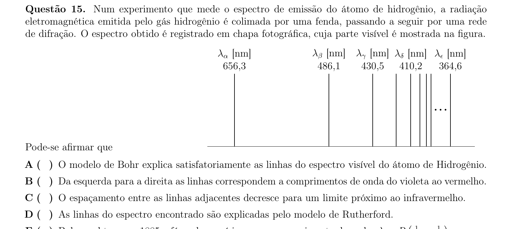

## Q16
**Assunto:** gravitação
**Competências:** terceira lei de Kepler, órbita rasante, densidade média, gravitação universal
**Tipo:** múltipla escolha

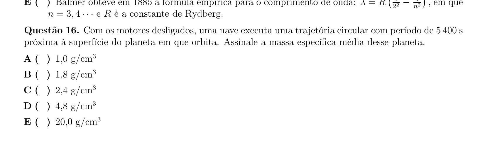

## Q17
**Assunto:** ondulatória
**Competências:** interferência de ondas sonoras, diferença de caminho, geometria de fontes, máximos construtivos
**Tipo:** múltipla escolha

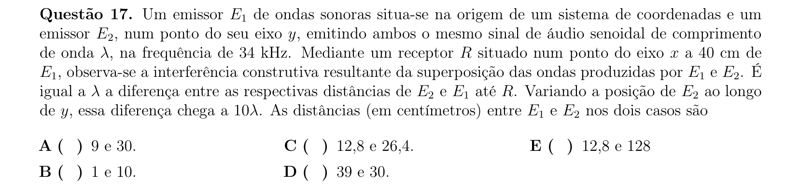

## Q18
**Assunto:** termodinâmica
**Competências:** ciclo termodinâmico, processo adiabático, rendimento, ciclo de Carnot
**Tipo:** múltipla escolha

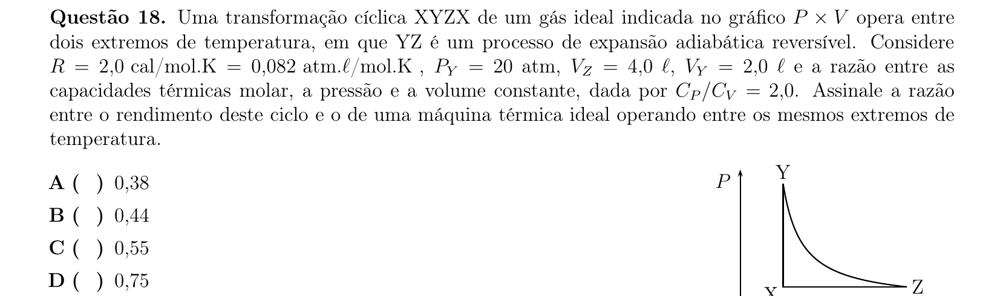

## Q19
**Assunto:** ondulatória
**Competências:** ondas em corda, tensão e densidade linear, velocidade transversal máxima, período e comprimento de onda
**Tipo:** múltipla escolha

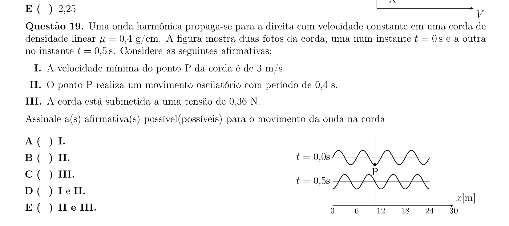

## Q20
**Assunto:** mecânica dos fluidos
**Competências:** teorema de Torricelli, conservação de momento linear, torque, colisão inelástica
**Tipo:** múltipla escolha

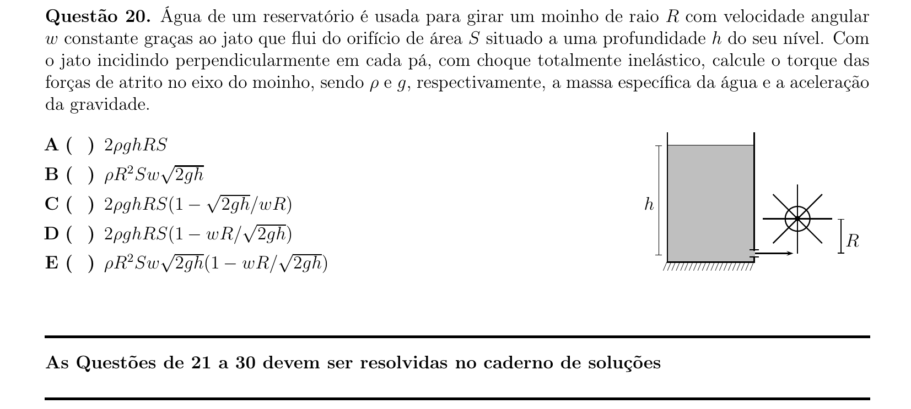

## Q21
**Assunto:** eletromagnetismo
**Competências:** correntes induzidas, correntes de Foucault, lei de Lenz, força sobre ímã em queda
**Tipo:** discursiva

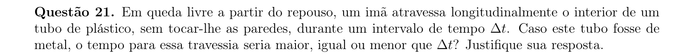

## Q22
**Assunto:** termodinâmica
**Competências:** teoria cinética dos gases, velocidade quadrática média, velocidade de escape, gravitação universal
**Tipo:** discursiva

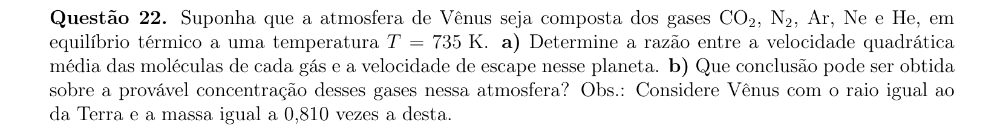

## Q23
**Assunto:** cinemática
**Competências:** lançamento oblíquo, colisão elástica em duas dimensões, conservação de momento, conservação de energia
**Tipo:** discursiva

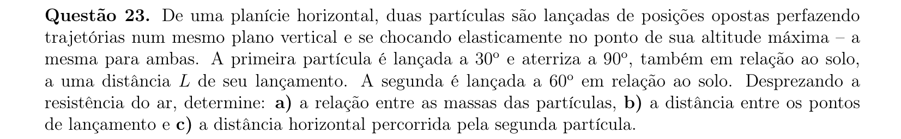

## Q24
**Assunto:** ondulatória
**Competências:** velocidade de pulso em corda, encontro de pulsos, densidade linear variável, cinemática de pulsos
**Tipo:** discursiva

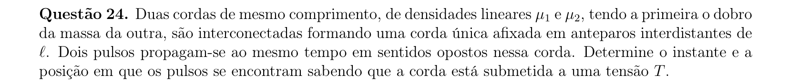

## Q25
**Assunto:** circuitos
**Competências:** associação de resistores, divisor de tensão, leis de Kirchhoff, projeto de circuito
**Tipo:** discursiva

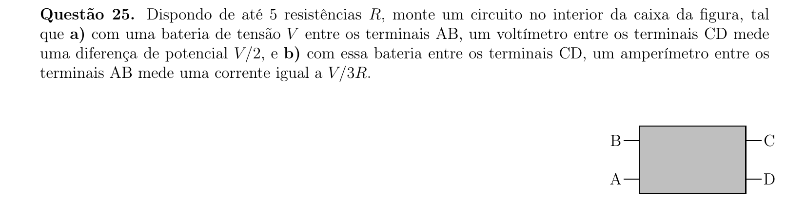

## Q26
**Assunto:** trabalho e energia
**Competências:** centro de massa, colisão inelástica, conservação de momento, máquina de Atwood
**Tipo:** discursiva

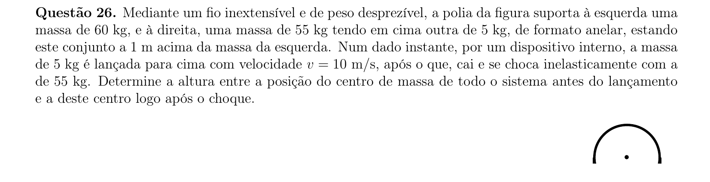

## Q27
**Assunto:** termodinâmica
**Competências:** lei dos gases ideais, equação de Clapeyron, pressão hidrostática, transformação geral
**Tipo:** discursiva

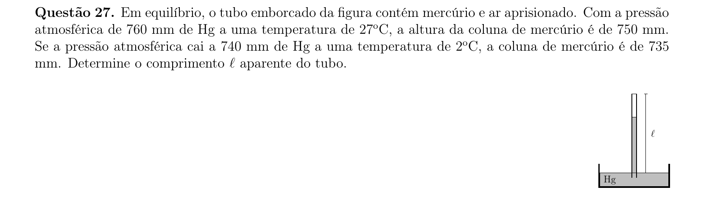

## Q28
**Assunto:** termodinâmica
**Competências:** ciclo de Carnot reverso (bomba de calor), rendimento, troca de calor por condução, equilíbrio térmico estacionário
**Tipo:** discursiva

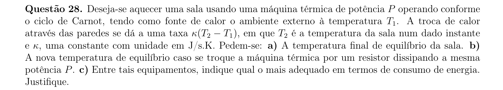

## Q29
**Assunto:** magnetismo
**Competências:** campo magnético de fio retilíneo, lei de Biot-Savart, superposição de campos, geometria vetorial
**Tipo:** discursiva

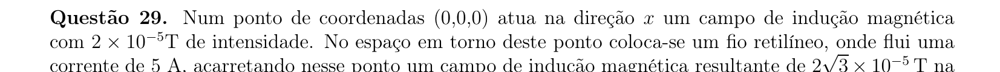

## Q30
**Assunto:** óptica geométrica
**Competências:** refração em dioptro esférico, lei de Snell, ângulo limite, traçado de raios
**Tipo:** discursiva

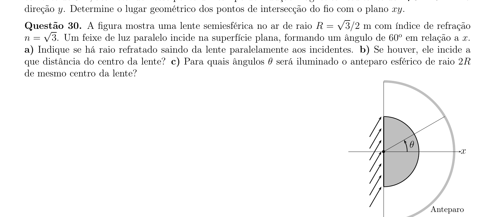
