# Física — ITA 2018

> 30 questões. Q01–Q20 múltipla escolha; Q21–Q30 discursivas.

## Q01
**Assunto:** gravitação
**Competências:** análise dimensional, lei da gravitação universal, ordens de grandeza, densidade
**Tipo:** múltipla escolha

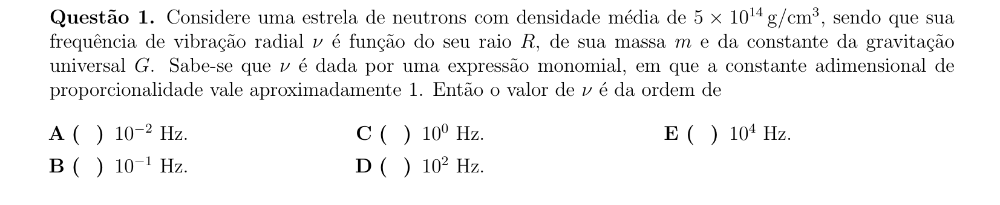

## Q02
**Assunto:** cinemática
**Competências:** lançamento oblíquo, decomposição de velocidades, movimento de projéteis, alcance horizontal
**Tipo:** múltipla escolha

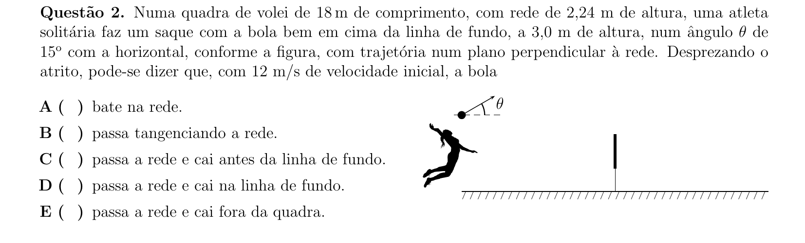

## Q03
**Assunto:** estática
**Competências:** equilíbrio de torques, momento de força, centro de massa, dinâmica de corpos rígidos
**Tipo:** múltipla escolha

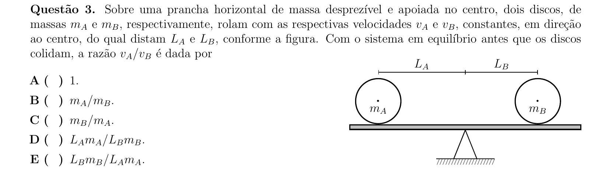

## Q04
**Assunto:** trabalho e energia
**Competências:** conservação da energia mecânica, conservação do momento linear, vínculo geométrico, dinâmica de rotação
**Tipo:** múltipla escolha

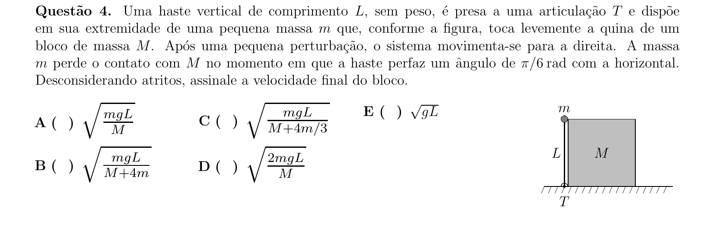

## Q05
**Assunto:** acústica
**Competências:** efeito Doppler, fontes em movimento, notas musicais, velocidade do som
**Tipo:** múltipla escolha

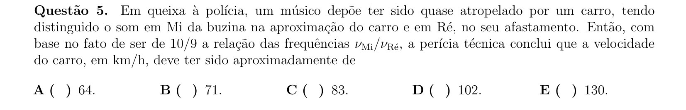

## Q06
**Assunto:** hidrostática
**Competências:** pressão hidrostática, teorema de Stevin, pressão atmosférica, geometria de tronco de cone
**Tipo:** múltipla escolha

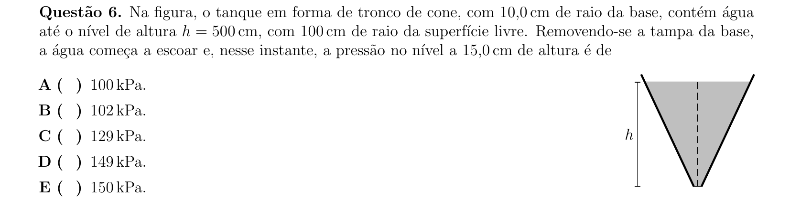

## Q07
**Assunto:** cinemática
**Competências:** queda com resistência do ar, lançamento horizontal, referenciais inerciais, força de arrasto
**Tipo:** múltipla escolha

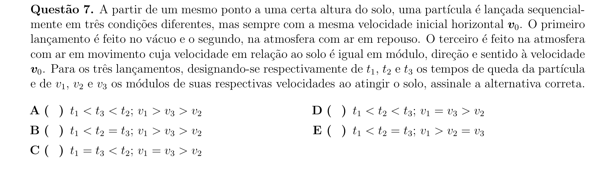

## Q08
**Assunto:** cinemática
**Competências:** velocidade média, velocidade instantânea, interpretação de gráficos, MRUV
**Tipo:** múltipla escolha

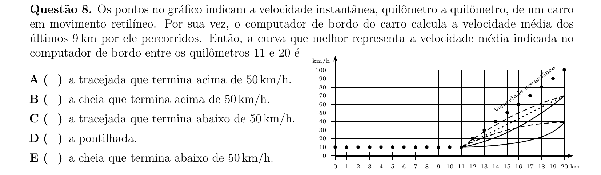

## Q09
**Assunto:** magnetismo
**Competências:** força magnética sobre carga, movimento circular uniforme, dependência radial de campo, terceira lei de Kepler análoga
**Tipo:** múltipla escolha

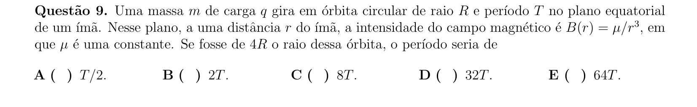

## Q10
**Assunto:** dinâmica
**Competências:** conservação do momento linear, conservação da energia, sistema isolado, referencial do centro de massa
**Tipo:** múltipla escolha

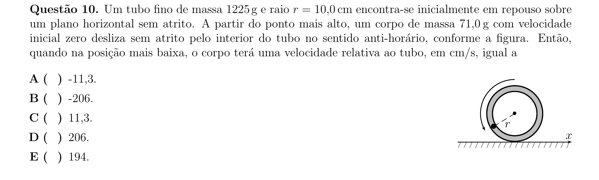

## Q11
**Assunto:** dinâmica
**Competências:** colisão elástica unidimensional, conservação do momento, movimento circular uniforme, força centrípeta
**Tipo:** múltipla escolha

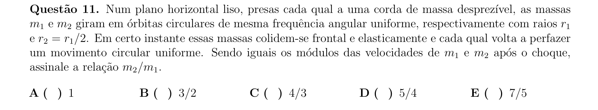

## Q12
**Assunto:** eletrostática
**Competências:** força entre dipolos elétricos, expansão em série, lei de Coulomb, aproximação multipolar
**Tipo:** múltipla escolha

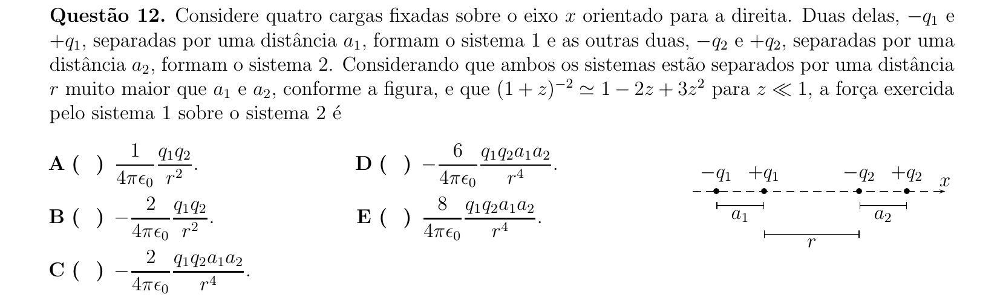

## Q13
**Assunto:** gravitação
**Competências:** força gravitacional entre múltiplos corpos, movimento circular, terceira lei de Kepler, geometria de polígonos
**Tipo:** múltipla escolha

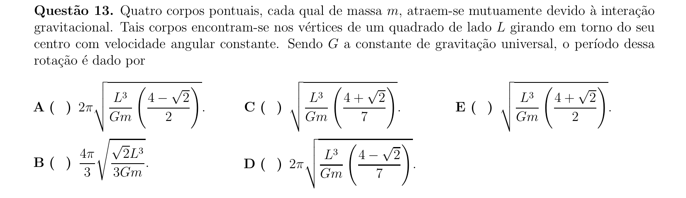

## Q14
**Assunto:** óptica geométrica
**Competências:** equação dos espelhos esféricos, aumento linear transversal, espelhos côncavos e convexos, distância focal
**Tipo:** múltipla escolha

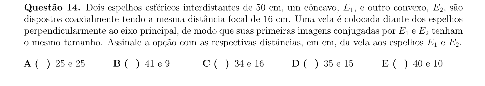

## Q15
**Assunto:** física moderna
**Competências:** difração de raios X (lei de Bragg), difração de elétrons (de Broglie), dualidade onda-partícula, comprimento de onda
**Tipo:** múltipla escolha

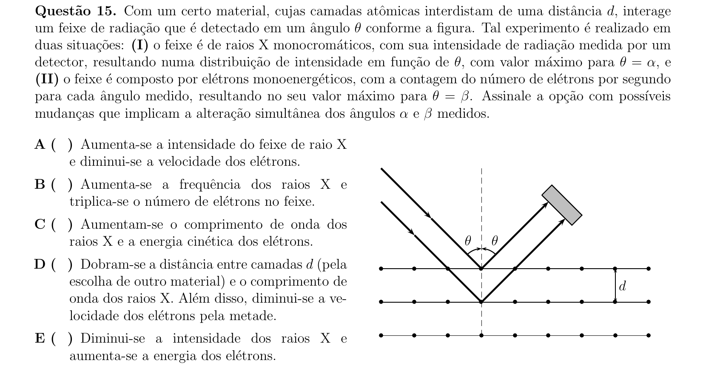

## Q16
**Assunto:** dinâmica
**Competências:** lei de Hooke, associação de molas em série e paralelo, equilíbrio estático, deformação elástica
**Tipo:** múltipla escolha

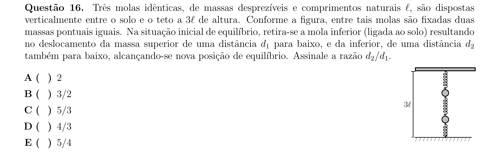

## Q17
**Assunto:** termodinâmica
**Competências:** segunda lei da termodinâmica, demônio de Maxwell, entropia, teoria cinética dos gases
**Tipo:** múltipla escolha

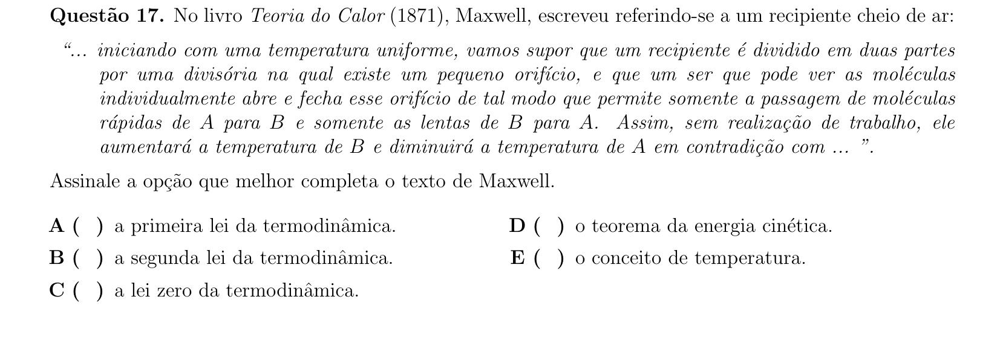

## Q18
**Assunto:** eletromagnetismo
**Competências:** força magnética entre fios paralelos, lei de Ampère, dependência angular, regra da mão direita
**Tipo:** múltipla escolha

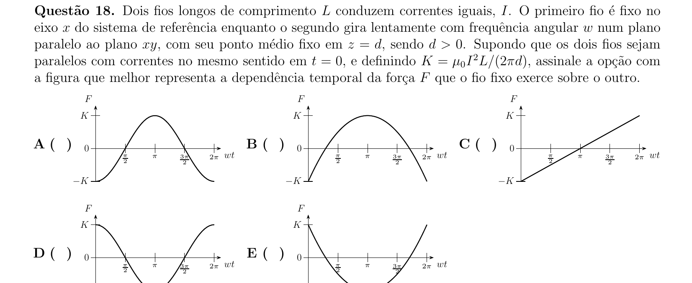

## Q19
**Assunto:** ondulatória
**Competências:** ondas estacionárias em tubo aberto, harmônica fundamental, conservação da energia, impulso e momento
**Tipo:** múltipla escolha

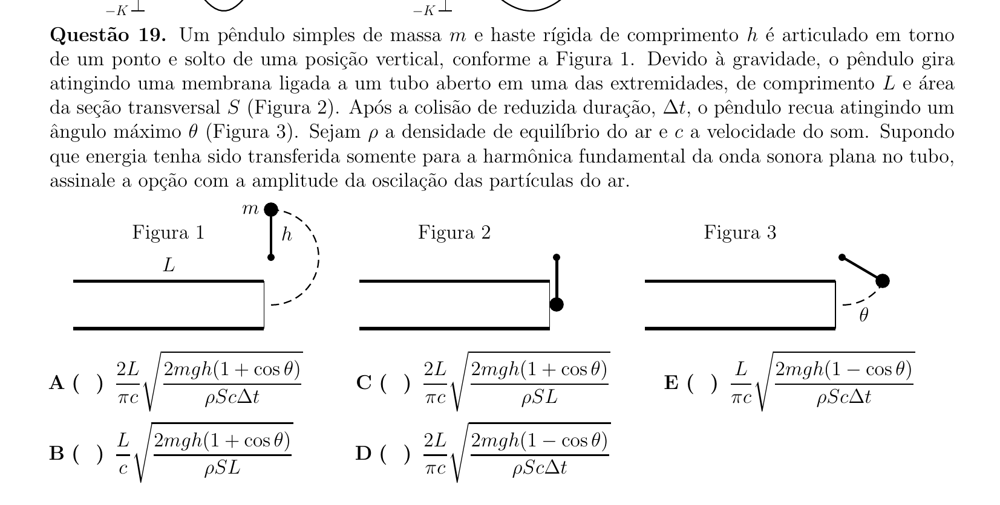

## Q20
**Assunto:** termodinâmica
**Competências:** equação de estado dos gases ideais, conservação do número de mols, processos isotérmicos, sistemas conectados
**Tipo:** múltipla escolha

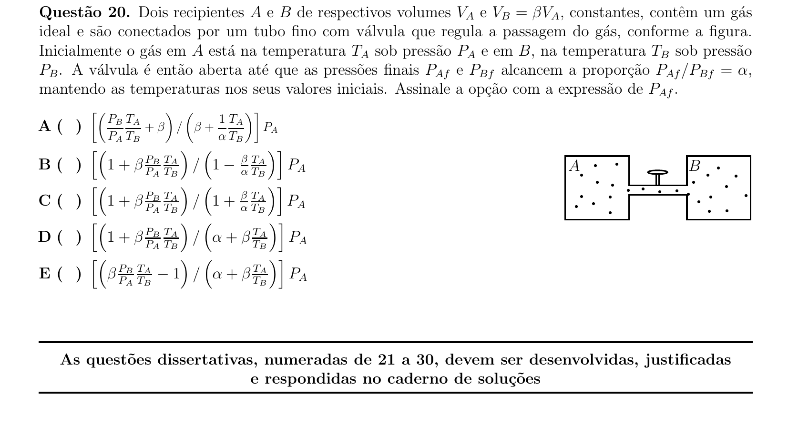

## Q21
**Assunto:** dinâmica
**Competências:** atrito cinético, equação diferencial do MHS, segunda lei de Newton, oscilações
**Tipo:** discursiva

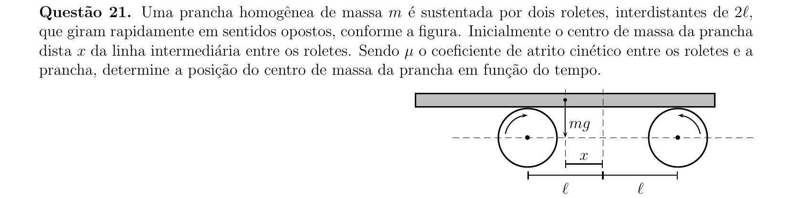

## Q22
**Assunto:** hidrostática
**Competências:** empuxo, princípio de Arquimedes, equilíbrio de corpos imersos, densidades relativas
**Tipo:** discursiva

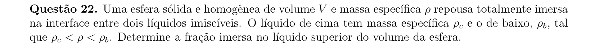

## Q23
**Assunto:** eletrostática
**Competências:** capacitores em paralelo, dielétricos, conservação de carga, energia armazenada em capacitores
**Tipo:** discursiva

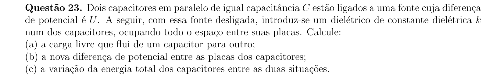

## Q24
**Assunto:** gravitação
**Competências:** órbitas elípticas, leis de Kepler, coordenadas polares, excentricidade
**Tipo:** discursiva

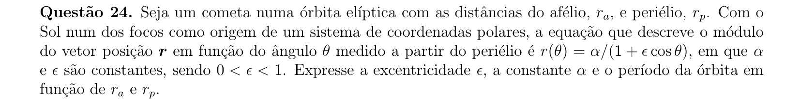

## Q25
**Assunto:** eletromagnetismo
**Competências:** indução eletromagnética, lei de Faraday, fem de movimento, circuito com resistência variável
**Tipo:** discursiva

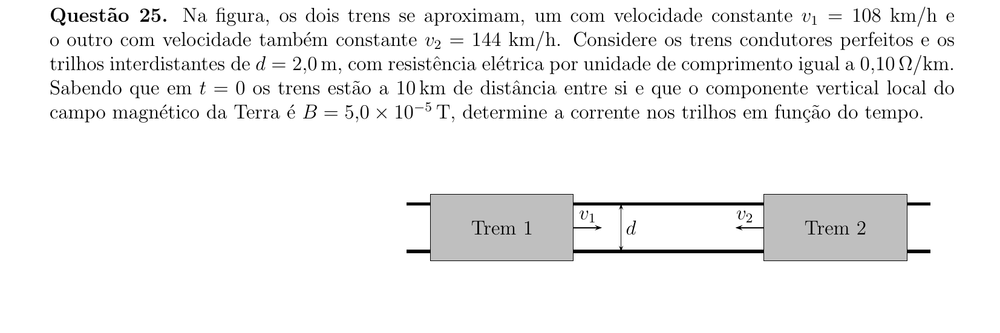

## Q26
**Assunto:** física moderna
**Competências:** radiação de corpo negro, lei de Wien, lei de Planck, espectroscopia
**Tipo:** discursiva

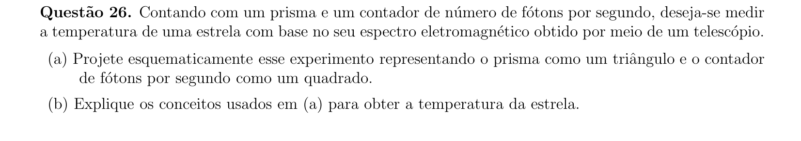

## Q27
**Assunto:** circuitos
**Competências:** leis de Kirchhoff, associação de resistores, resistência interna de medidores, divisor de tensão
**Tipo:** discursiva

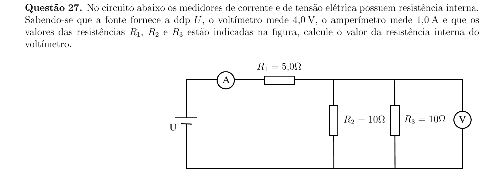

## Q28
**Assunto:** dinâmica
**Competências:** movimento circular em plano vertical, tração máxima, lançamento oblíquo, conservação da energia
**Tipo:** discursiva

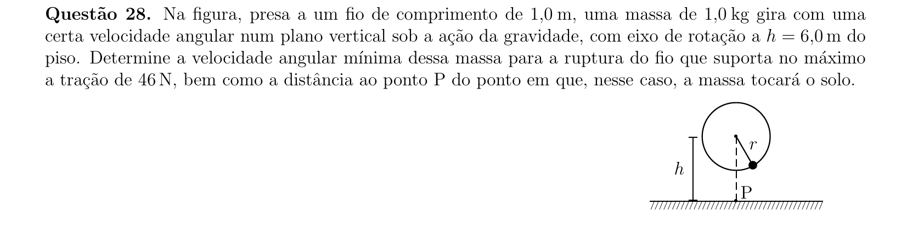

## Q29
**Assunto:** física moderna
**Competências:** modelo de Bohr, transições eletrônicas, energia total e potencial, teorema do virial
**Tipo:** discursiva

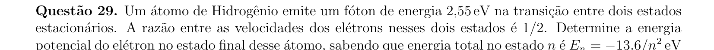

## Q30
**Assunto:** eletromagnetismo
**Competências:** campo magnético de espira circular, lei de Biot-Savart, divisor de corrente, associação de resistores
**Tipo:** discursiva

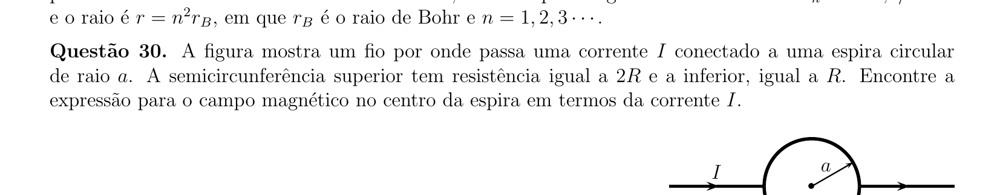
