# Física — ITA 2019 (1ª fase)

> 12 questões múltipla escolha.

## Q01
**Assunto:** óptica geométrica, ondulatória, acústica
**Competências:** análise conceitual de observações cotidianas
**Tipo:** múltipla escolha

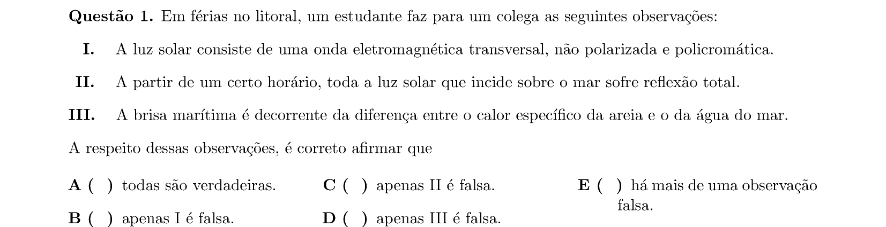

## Q02
**Assunto:** dinâmica, movimento circular
**Competências:** análise de duas partículas presas em corda; forças e tensões
**Tipo:** múltipla escolha

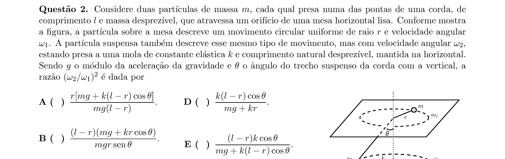

## Q03
**Assunto:** gravitação
**Competências:** corpo celeste esférico atravessado por túnel; aceleração gravitacional
**Tipo:** múltipla escolha

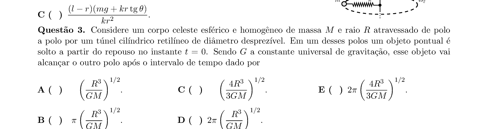

## Q04
**Assunto:** óptica geométrica
**Competências:** espelho côncavo; relações de tamanho objeto-imagem
**Tipo:** múltipla escolha

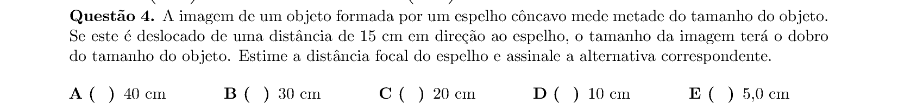

## Q05
**Assunto:** eletrodinâmica, circuitos
**Competências:** bateria de células voltaicas em série; carga por fonte de corrente
**Tipo:** múltipla escolha

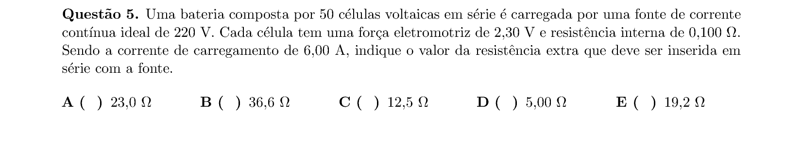

## Q06
**Assunto:** estática
**Competências:** equilíbrio de barra rígida presa por corda horizontal
**Tipo:** múltipla escolha

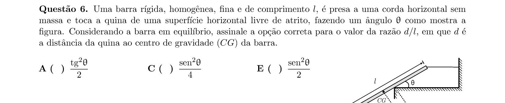

## Q07
**Assunto:** dinâmica, trabalho e energia
**Competências:** bola em rotação e queda; conservação de energia/momento angular
**Tipo:** múltipla escolha

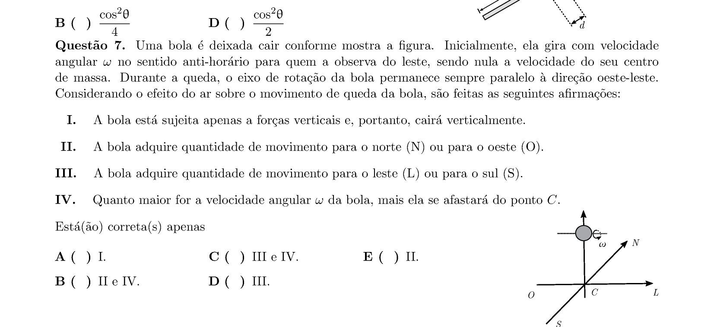

## Q08
**Assunto:** termodinâmica
**Competências:** mistura de gases hélio e oxigênio; equilíbrio térmico
**Tipo:** múltipla escolha

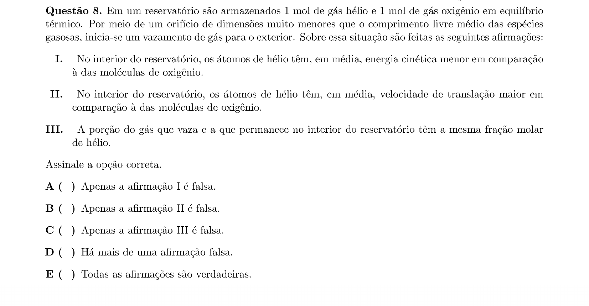

## Q09
**Assunto:** eletrostática
**Competências:** potencial elétrico em diferentes pontos
**Tipo:** múltipla escolha

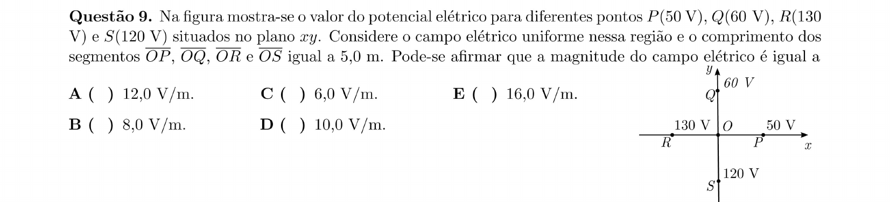

## Q10
**Assunto:** magnetismo, eletromagnetismo
**Competências:** partícula carregada em campo magnético uniforme
**Tipo:** múltipla escolha

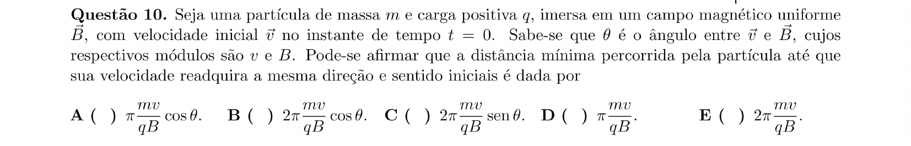

## Q11
**Assunto:** física moderna, eletromagnetismo
**Competências:** filamento em câmara de vácuo; emissão termiônica
**Tipo:** múltipla escolha

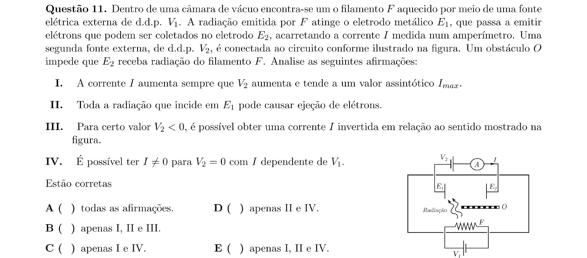

## Q12
**Assunto:** eletromagnetismo
**Competências:** espira circular; fluxo magnético e indução
**Tipo:** múltipla escolha

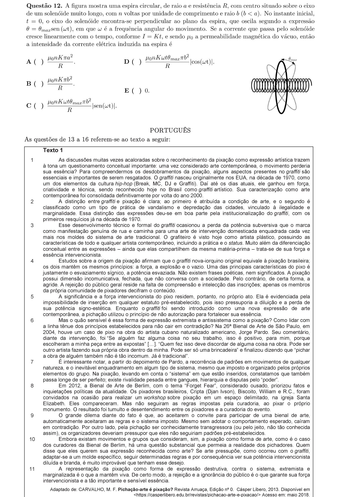
