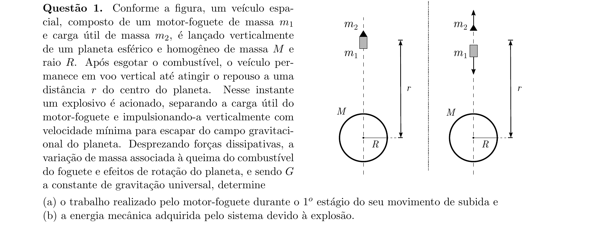
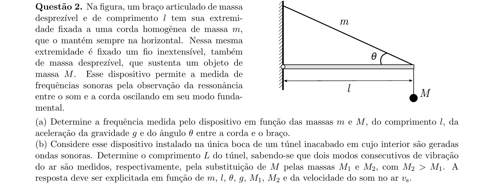
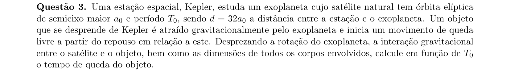
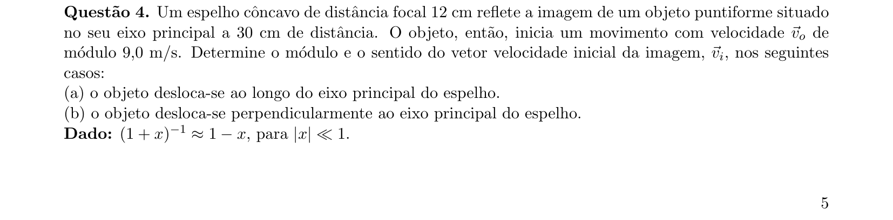
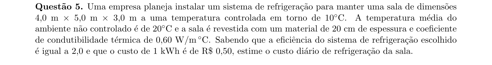
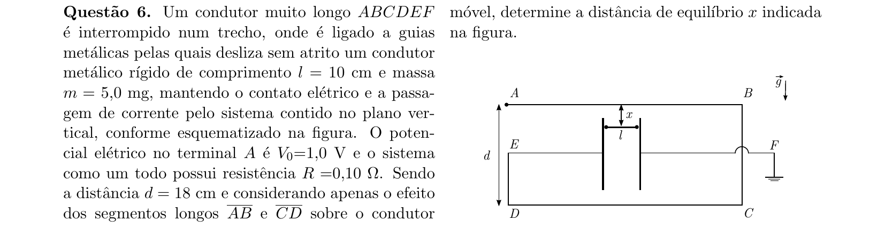
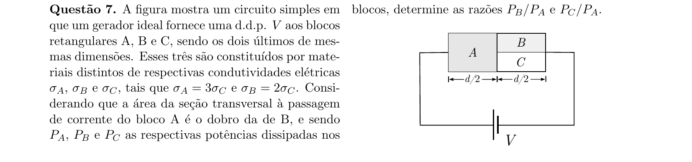
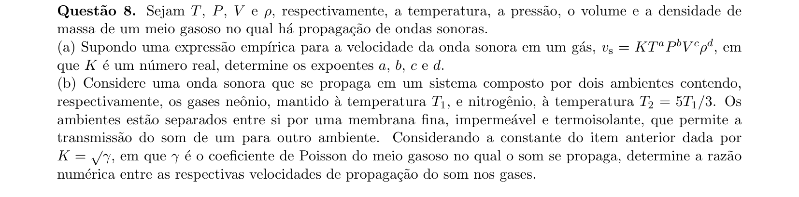
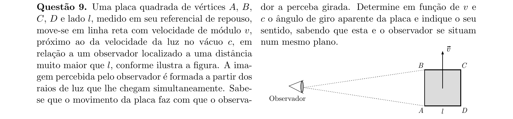
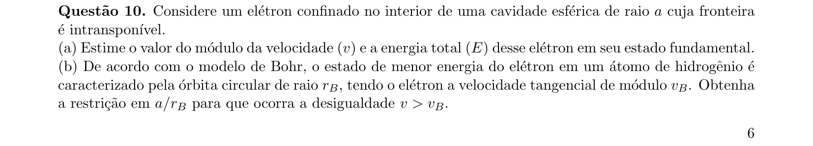

# Física — ITA 2019 (2ª fase)

> 10 questões discursivas.

## Q01
**Assunto:** gravitação
**Competências:** energia potencial gravitacional, velocidade de escape, trabalho de força variável, conservação de energia, lançamento vertical em campo gravitacional
**Tipo:** discursiva

## Q02
**Assunto:** ondulatória
**Competências:** ondas estacionárias em corda, frequência fundamental, ressonância acústica, tubo sonoro, tensão em corda
**Tipo:** discursiva

## Q03
**Assunto:** gravitação
**Competências:** terceira lei de Kepler, órbita elíptica degenerada, queda livre gravitacional, período orbital, semieixo maior
**Tipo:** discursiva

## Q04
**Assunto:** óptica geométrica
**Competências:** espelho côncavo, equação de Gauss, ampliação transversal, ampliação longitudinal, velocidade da imagem
**Tipo:** discursiva

## Q05
**Assunto:** termodinâmica
**Competências:** condução térmica, lei de Fourier, eficiência de refrigerador, fluxo de calor, conversão de unidades de energia
**Tipo:** discursiva

## Q06
**Assunto:** eletromagnetismo
**Competências:** campo magnético de fio retilíneo, força magnética sobre condutor, equilíbrio de forças, lei de Ampère, gravidade vs força magnética
**Tipo:** discursiva

## Q07
**Assunto:** circuitos
**Competências:** resistência elétrica e condutividade, associação série e paralela, potência dissipada, geometria de condutores, lei de Ohm
**Tipo:** discursiva

## Q08
**Assunto:** ondulatória
**Competências:** análise dimensional, velocidade do som em gases, coeficiente de Poisson, equação de estado dos gases, comparação entre gases
**Tipo:** discursiva

## Q09
**Assunto:** física moderna
**Competências:** relatividade restrita, contração do comprimento, tempo de propagação da luz, rotação aparente, simultaneidade
**Tipo:** discursiva

## Q10
**Assunto:** física moderna
**Competências:** princípio da incerteza de Heisenberg, partícula em caixa esférica, modelo de Bohr, estado fundamental, estimativa de energia quântica
**Tipo:** discursiva

