# Física — ITA 2020 (1ª fase)

> 15 questões múltipla escolha.

## Q01
**Assunto:** análise dimensional, eletromagnetismo
**Competências:** análise dimensional de constantes em teoria hipotética N-dimensional
**Tipo:** múltipla escolha

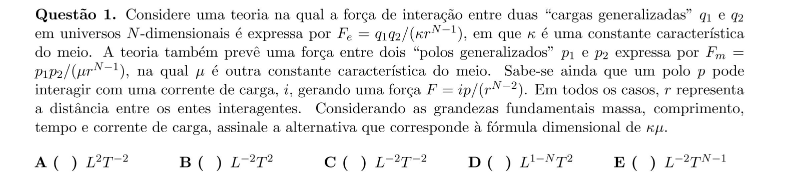

## Q02
**Assunto:** cinemática, perseguição
**Competências:** comparação de trajetórias retilínea e curva para interceptar alvo móvel
**Tipo:** múltipla escolha

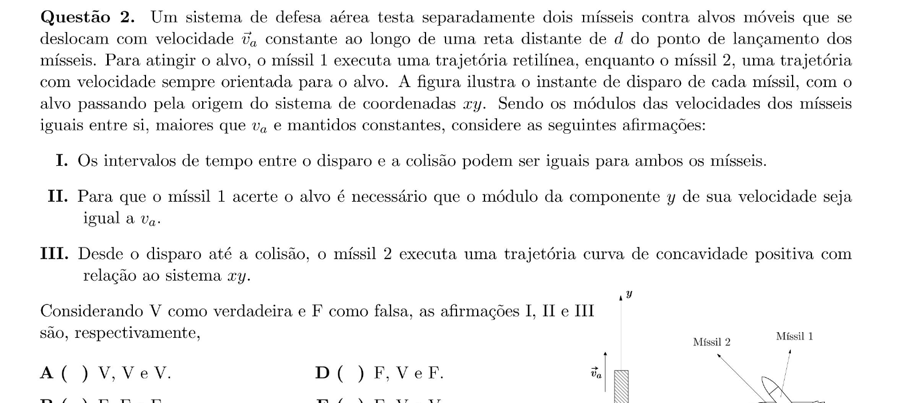

## Q03
**Assunto:** dinâmica, oscilações
**Competências:** bloco suspenso por molas; tensão máxima após travamento súbito
**Tipo:** múltipla escolha

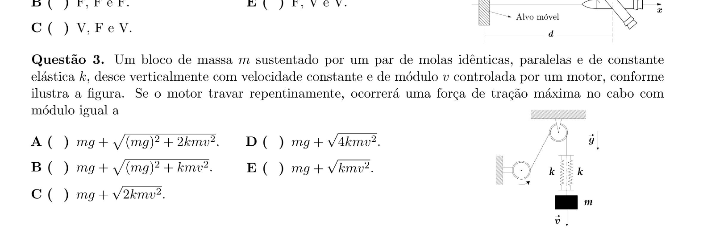

## Q04
**Assunto:** hidrodinâmica, lançamento oblíquo
**Competências:** equação da continuidade; alcance horizontal de jato
**Tipo:** múltipla escolha

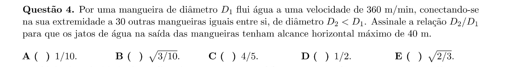

## Q05
**Assunto:** gravitação
**Competências:** trajetória parabólica para elíptica; mudança de velocidade
**Tipo:** múltipla escolha

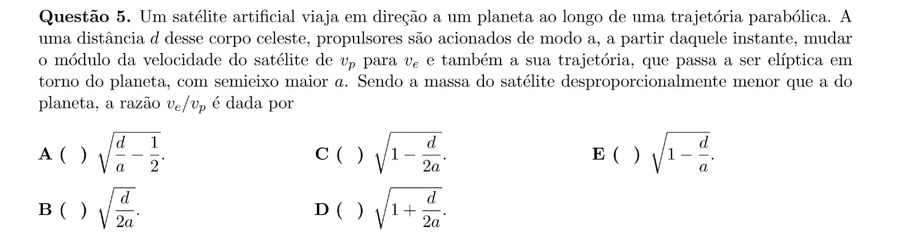

## Q06
**Assunto:** dinâmica, energia, atrito
**Competências:** lançamento vertical com resistência do ar; reflexões elásticas
**Tipo:** múltipla escolha

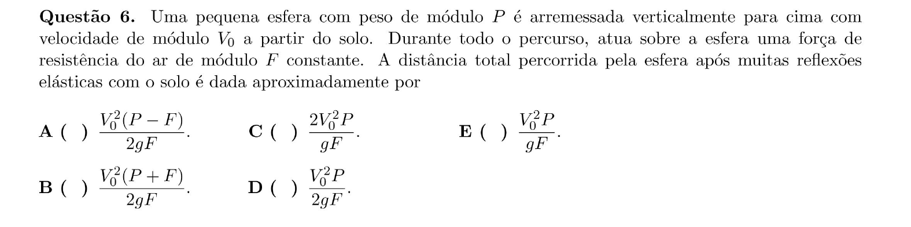

## Q07
**Assunto:** relatividade restrita, óptica
**Competências:** efeito Doppler relativístico; pulso de luz em referenciais
**Tipo:** múltipla escolha

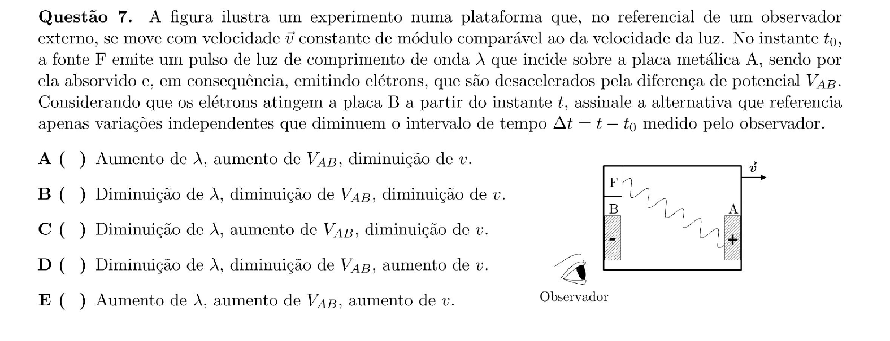

## Q08
**Assunto:** oscilações, dilatação térmica
**Competências:** período de pêndulo com dilatação linear; aproximação binomial
**Tipo:** múltipla escolha

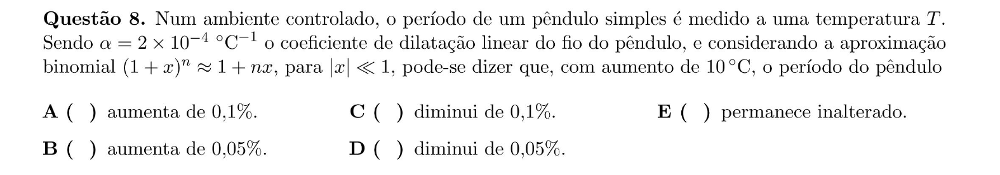

## Q09
**Assunto:** termodinâmica, gases ideais
**Competências:** aquecimento isocórico vs isobárico; trabalho e energia interna
**Tipo:** múltipla escolha

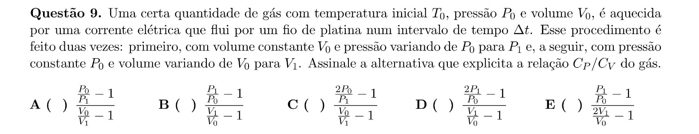

## Q10
**Assunto:** eletromagnetismo, dinâmica
**Competências:** cilindro com espiras em plano inclinado; campo magnético; atrito
**Tipo:** múltipla escolha

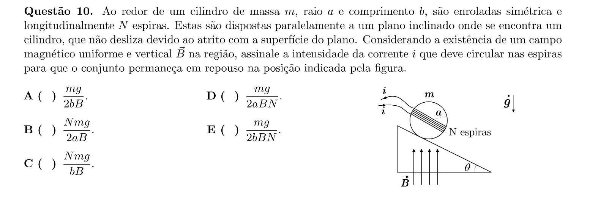

## Q11
**Assunto:** ondulatória, acústica
**Competências:** interferência sonora em tubo com caminhos distintos
**Tipo:** múltipla escolha

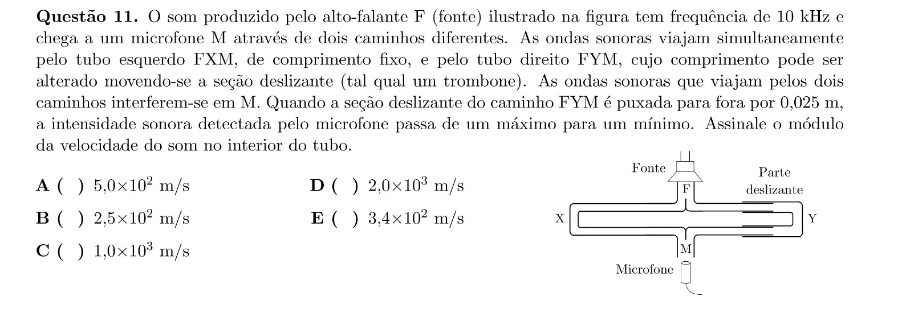

## Q12
**Assunto:** eletrodinâmica
**Competências:** circuito com reostato, capacitor e fonte; carregamento
**Tipo:** múltipla escolha

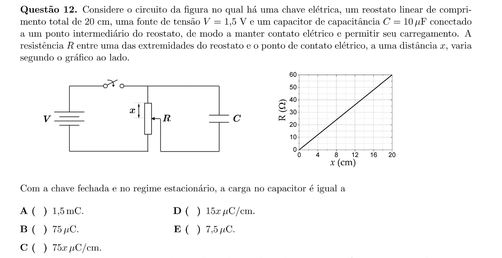

## Q13
**Assunto:** eletrostática, equilíbrio
**Competências:** três esferas carregadas em fios; ângulo de equilíbrio
**Tipo:** múltipla escolha

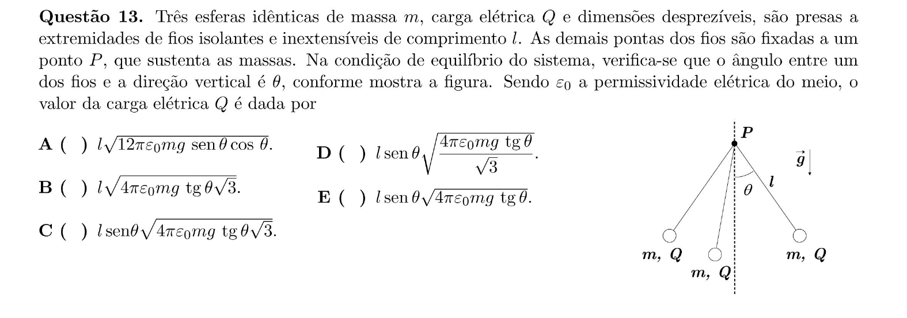

## Q14
**Assunto:** óptica geométrica
**Competências:** lente convergente; foco em meio com índice de refração
**Tipo:** múltipla escolha

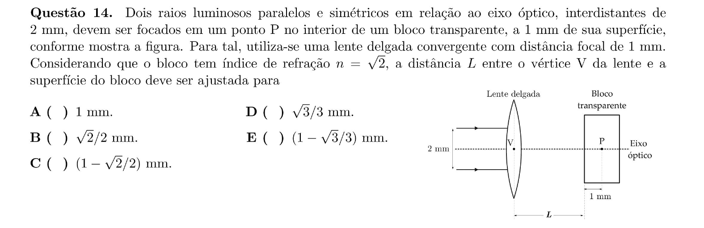

## Q15
**Assunto:** termodinâmica
**Competências:** máquinas térmicas acopladas; rendimento e entropia
**Tipo:** múltipla escolha

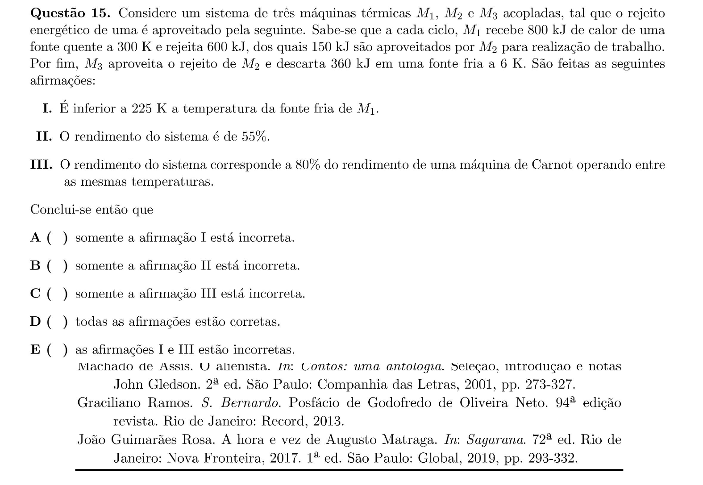
