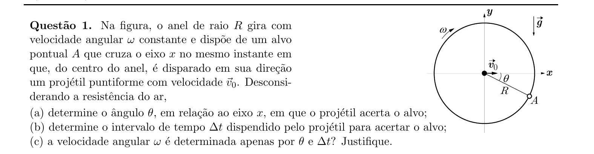
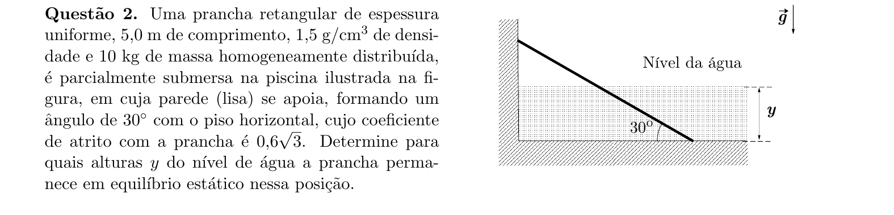
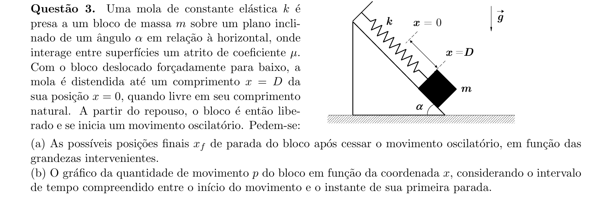
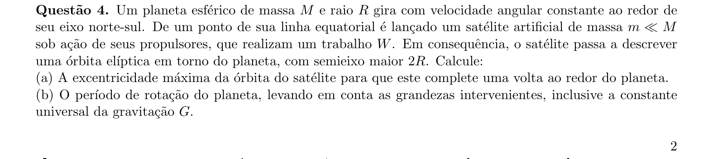
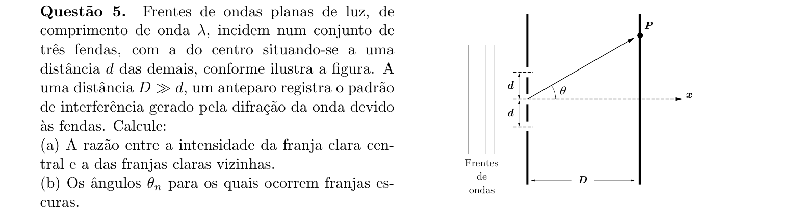
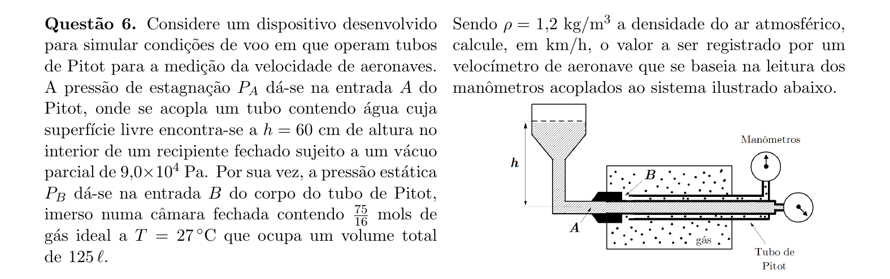
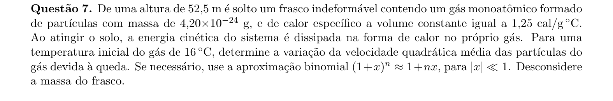
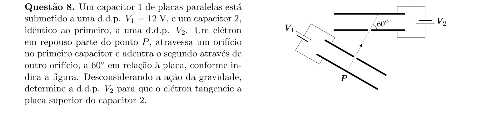
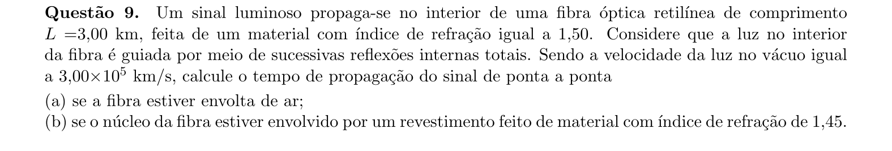
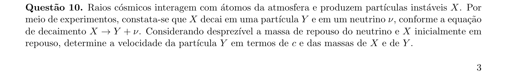

# Física — ITA 2020 (2ª fase)

> 10 questões discursivas.

## Q01
**Assunto:** cinemática, lançamento de projéteis, movimento circular
**Competências:** decomposição de movimentos, cinemática angular, análise de simultaneidade
**Tipo:** discursiva

## Q02
**Assunto:** estática, hidrostática
**Competências:** equilíbrio de corpo extenso, empuxo, torques, atrito estático
**Tipo:** discursiva

## Q03
**Assunto:** dinâmica, oscilações, trabalho e energia
**Competências:** MHS amortecido por atrito, conservação de energia, quantidade de movimento
**Tipo:** discursiva

## Q04
**Assunto:** gravitação
**Competências:** órbitas elípticas, leis de Kepler, energia em campo gravitacional, excentricidade
**Tipo:** discursiva

## Q05
**Assunto:** óptica física, ondulatória
**Competências:** interferência e difração por múltiplas fendas, padrão de intensidade
**Tipo:** discursiva

## Q06
**Assunto:** mecânica dos fluidos, termodinâmica
**Competências:** equação de Bernoulli, tubo de Pitot, lei dos gases ideais, pressão estática e dinâmica
**Tipo:** discursiva

## Q07
**Assunto:** termodinâmica, teoria cinética dos gases
**Competências:** energia cinética molecular, velocidade quadrática média, calor específico, conservação de energia
**Tipo:** discursiva

## Q08
**Assunto:** eletrostática, eletrodinâmica
**Competências:** capacitor de placas paralelas, campo elétrico uniforme, movimento de carga em campo elétrico
**Tipo:** discursiva

## Q09
**Assunto:** óptica geométrica
**Competências:** reflexão interna total, índice de refração, tempo de propagação em fibra óptica
**Tipo:** discursiva

## Q10
**Assunto:** física moderna
**Competências:** relatividade especial, decaimento de partículas, conservação de energia-momento relativístico
**Tipo:** discursiva

