# Física — ITA 2021 (1ª fase)

> 15 questões múltipla escolha.

## Q01
**Assunto:** análise dimensional, sistemas de unidades
**Competências:** unidades atômicas de Hartree, ordem de grandeza da velocidade da luz
**Tipo:** múltipla escolha

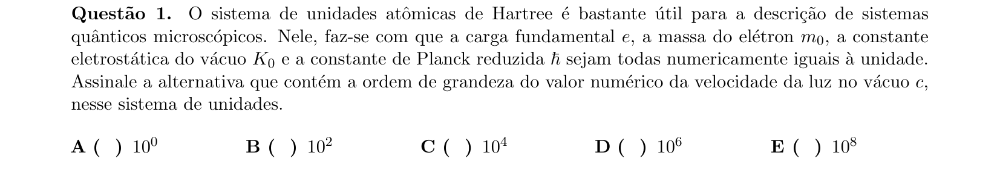

## Q02
**Assunto:** dinâmica, energia
**Competências:** trem com aceleração constante, resistências passivas, esforço médio da locomotiva
**Tipo:** múltipla escolha

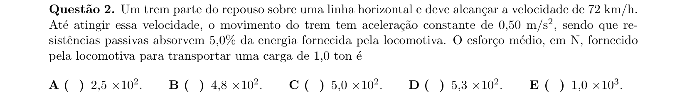

## Q03
**Assunto:** cinemática, colisões
**Competências:** lançamento horizontal, colisões elásticas entre esferas, deslocamento até o solo
**Tipo:** múltipla escolha

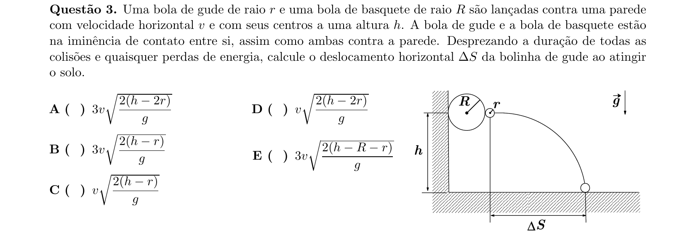

## Q04
**Assunto:** gravitação
**Competências:** sistema de três satélites em triângulo equilátero, velocidade orbital
**Tipo:** múltipla escolha

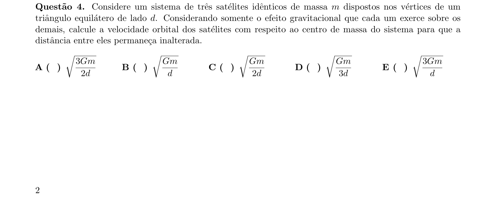

## Q05
**Assunto:** hidrostática, hidrodinâmica
**Competências:** pressão sob pistão, Torricelli, alcance horizontal de jato de líquido
**Tipo:** múltipla escolha

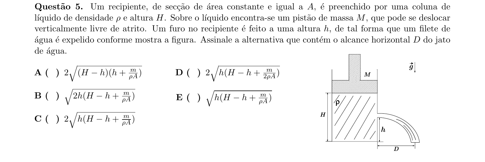

## Q06
**Assunto:** termodinâmica
**Competências:** expansão livre de gás ideal, temperatura de equilíbrio
**Tipo:** múltipla escolha

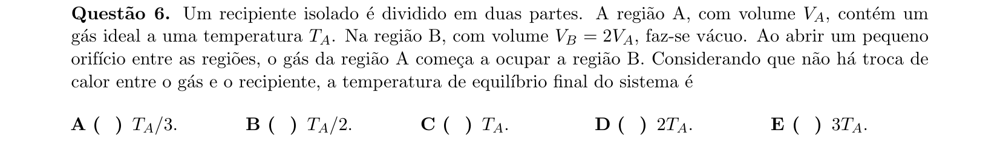

## Q07
**Assunto:** oscilações
**Competências:** MHS massa-mola, variação de frequência com adição de massa, aproximação linear
**Tipo:** múltipla escolha

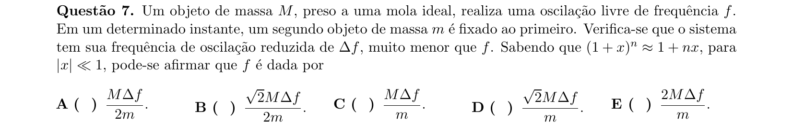

## Q08
**Assunto:** ondas, acústica
**Competências:** ondas em cordas, frequência fundamental, tensão, timbre, comprimento efetivo
**Tipo:** múltipla escolha

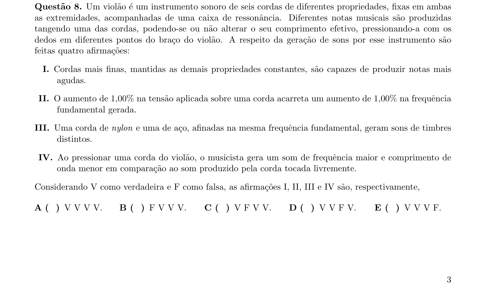

## Q09
**Assunto:** óptica geométrica
**Competências:** lente biconvexa imersa, equação dos fabricantes, formação de imagem
**Tipo:** múltipla escolha

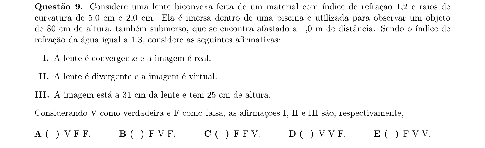

## Q10
**Assunto:** óptica ondulatória
**Competências:** dupla fenda de Young, número de máximos em faixa angular
**Tipo:** múltipla escolha

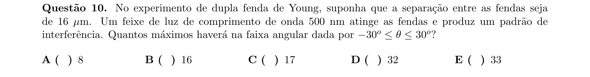

## Q11
**Assunto:** eletrostática
**Competências:** distribuição de cargas entre esferas condutoras, equilíbrio eletrostático, proporção de massas
**Tipo:** múltipla escolha

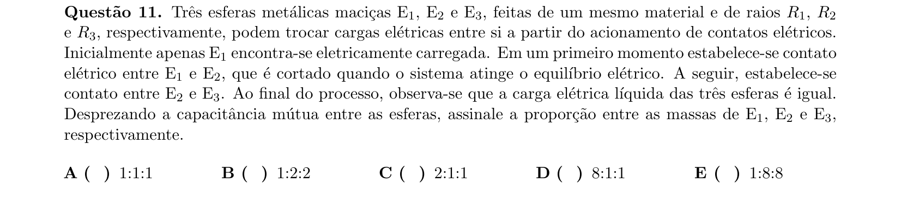

## Q12
**Assunto:** eletrodinâmica
**Competências:** curvas características de resistores, associações em série e paralelo
**Tipo:** múltipla escolha

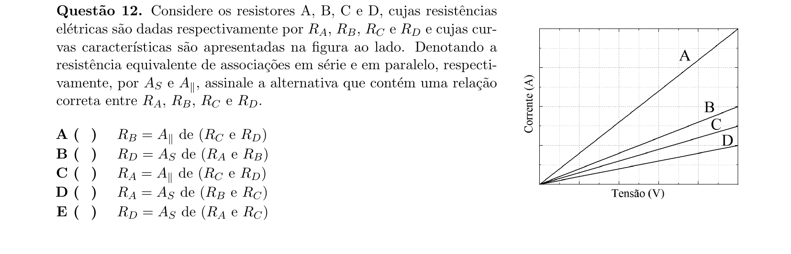

## Q13
**Assunto:** circuitos RC
**Competências:** descarga de capacitor, constante de tempo, escala temporal de flash
**Tipo:** múltipla escolha

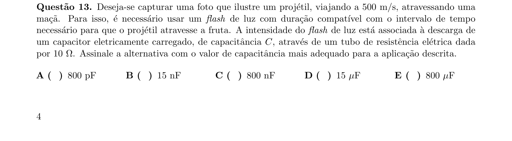

## Q14
**Assunto:** magnetismo
**Competências:** lei de Ampère, cilindro condutor oco, campo magnético em função do raio
**Tipo:** múltipla escolha

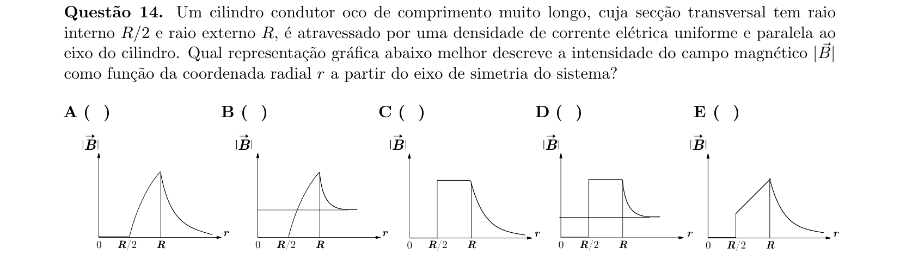

## Q15
**Assunto:** indução eletromagnética
**Competências:** força eletromotriz média induzida em bobina girante, lei de Faraday
**Tipo:** múltipla escolha

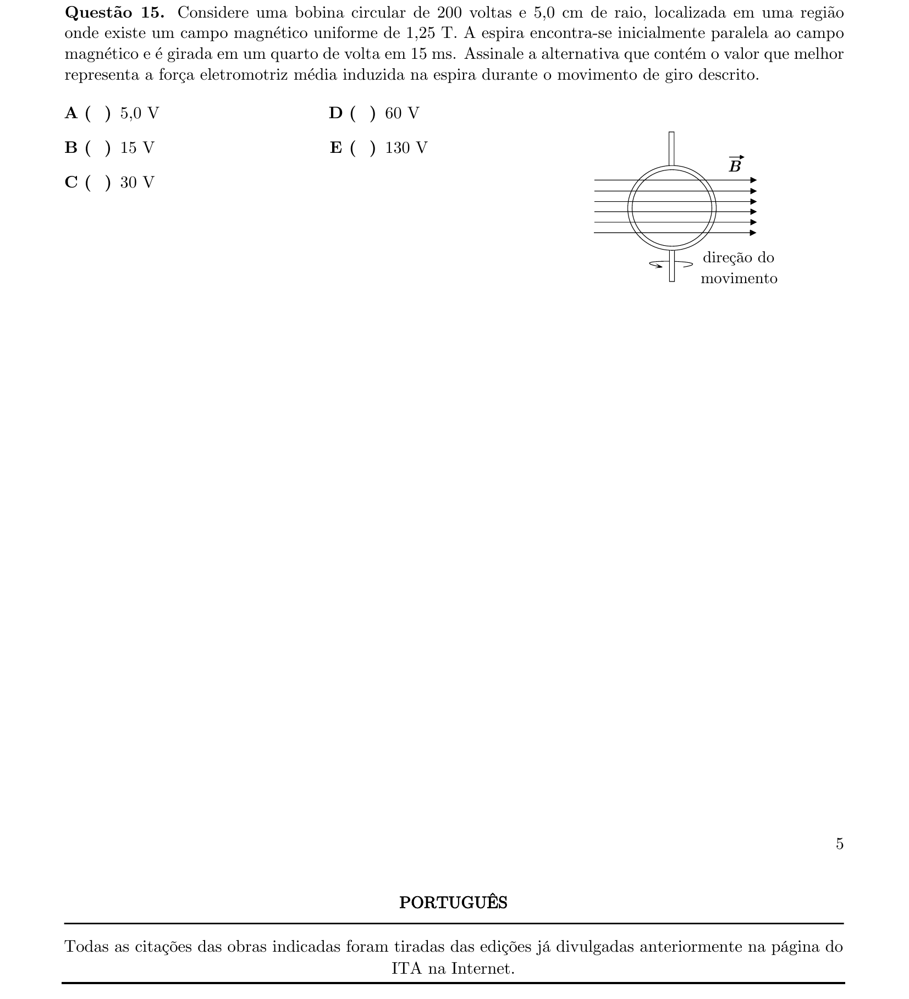
