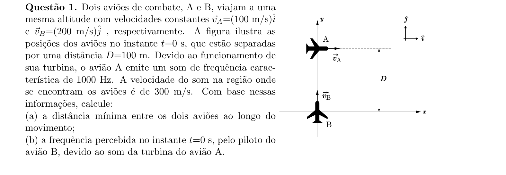
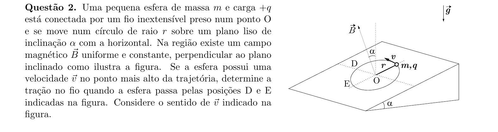
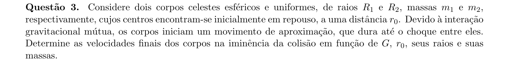
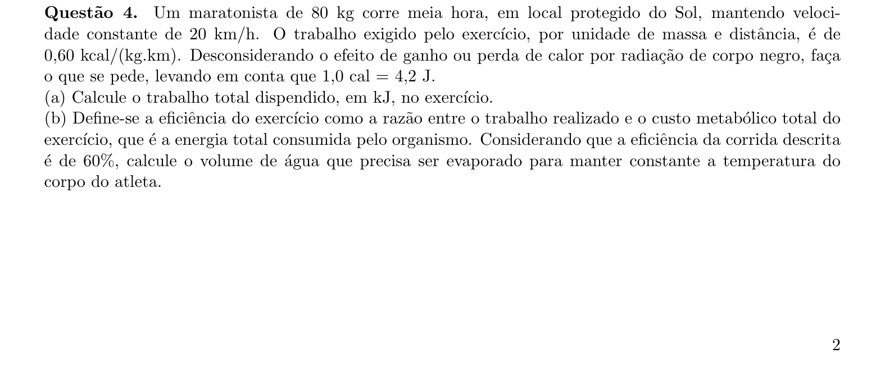
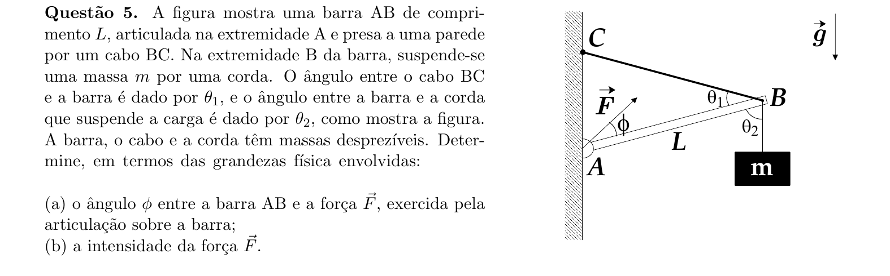
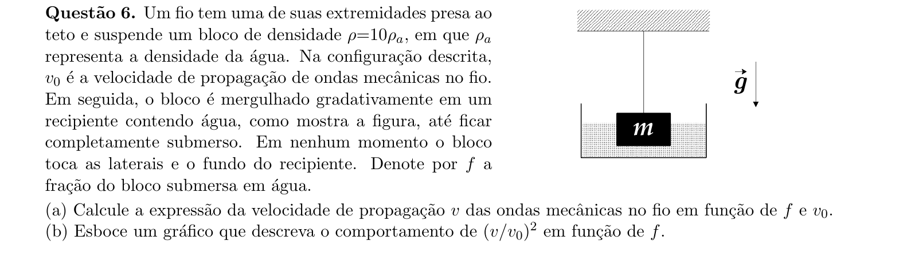
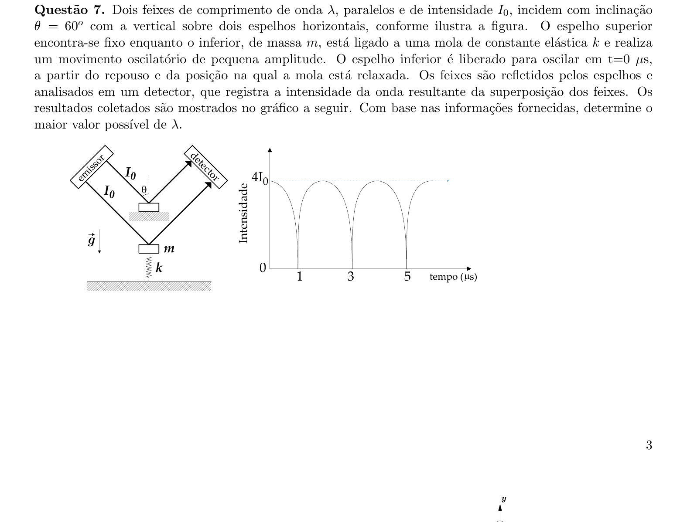
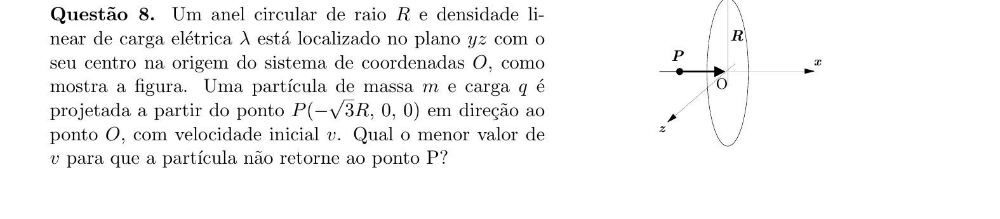
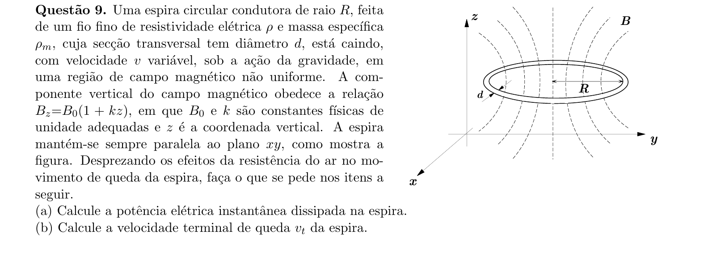
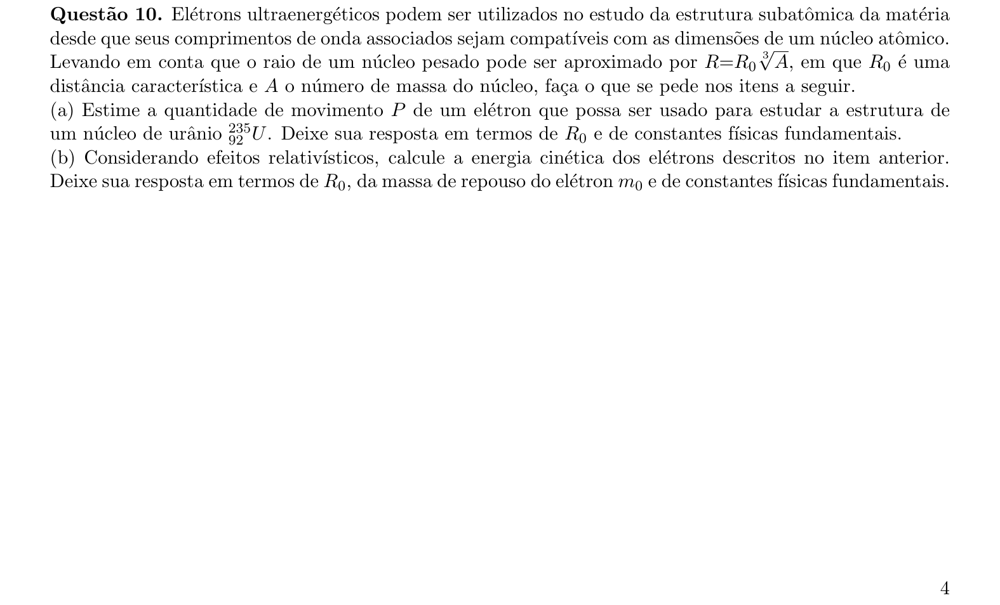

# Física — ITA 2021 (2ª fase)

> 10 questões discursivas.

## Q01
**Assunto:** cinemática, acústica
**Competências:** movimento relativo, distância mínima entre trajetórias, efeito Doppler
**Tipo:** discursiva

## Q02
**Assunto:** dinâmica, eletromagnetismo
**Competências:** movimento circular em plano inclinado, força magnética sobre carga, tração em fio
**Tipo:** discursiva

## Q03
**Assunto:** gravitação, trabalho e energia
**Competências:** conservação de energia mecânica gravitacional, conservação de quantidade de movimento, atração mútua
**Tipo:** discursiva

## Q04
**Assunto:** termodinâmica, calorimetria
**Competências:** trabalho mecânico e custo metabólico, conversão de unidades, calor latente de vaporização
**Tipo:** discursiva

## Q05
**Assunto:** estática
**Competências:** equilíbrio de corpo extenso, torques, decomposição de forças em barra articulada
**Tipo:** discursiva

## Q06
**Assunto:** ondulatória, hidrostática
**Competências:** velocidade de onda em corda tensionada, empuxo, análise gráfica
**Tipo:** discursiva

## Q07
**Assunto:** ondulatória, óptica física
**Competências:** interferência de ondas, MHS, condição de batimento/franjas, leitura de gráfico
**Tipo:** discursiva

## Q08
**Assunto:** eletrostática
**Competências:** potencial de anel carregado, conservação de energia, velocidade de escape eletrostática
**Tipo:** discursiva

## Q09
**Assunto:** eletromagnetismo
**Competências:** indução eletromagnética, fluxo em campo não uniforme, dissipação por efeito Joule, velocidade terminal
**Tipo:** discursiva

## Q10
**Assunto:** física moderna
**Competências:** comprimento de onda de de Broglie, dimensões nucleares, cinemática relativística, energia cinética relativística
**Tipo:** discursiva

