# Física — ITA 2022 (1ª fase)

> 15 questões múltipla escolha.

## Q01
**Assunto:** unidades, sistema internacional
**Competências:** redefinição do SI de 2019, constantes fundamentais exatas, unidades básicas
**Tipo:** múltipla escolha

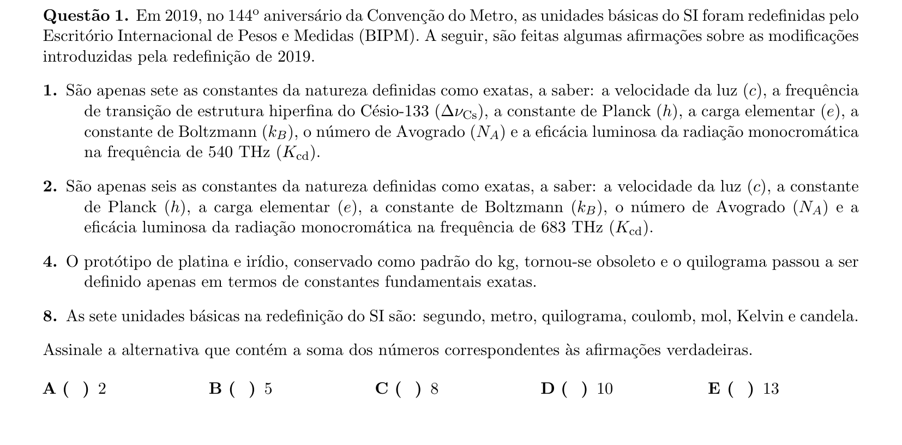

## Q02
**Assunto:** dinâmica, colisões
**Competências:** queda livre, lançamento vertical, coeficiente de restituição, conservação do momento
**Tipo:** múltipla escolha

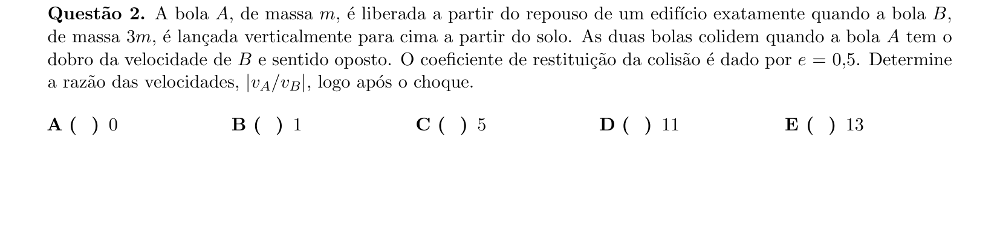

## Q03
**Assunto:** estática, corpos rígidos
**Competências:** ponte levadiça, equilíbrio de torques, tensão máxima da corda, posição de homem em rampa articulada
**Tipo:** múltipla escolha

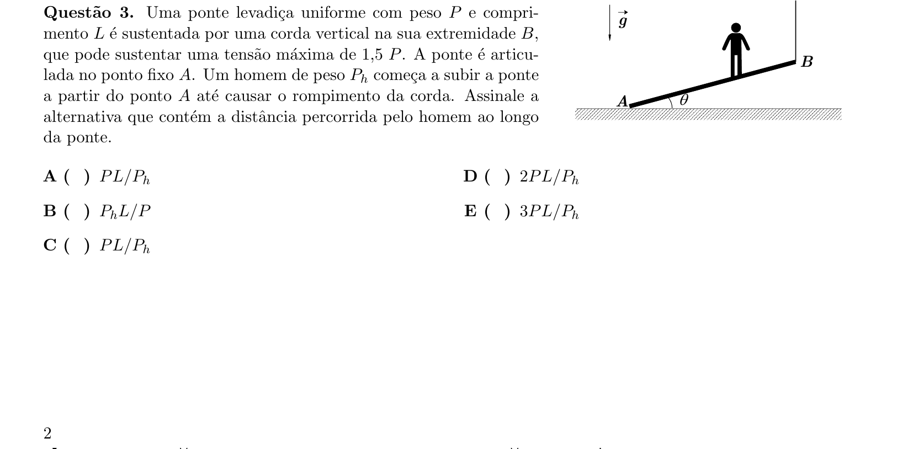

## Q04
**Assunto:** dinâmica, movimento circular
**Competências:** conservação de energia em escorregador curvo, força centrípeta, reação normal
**Tipo:** múltipla escolha

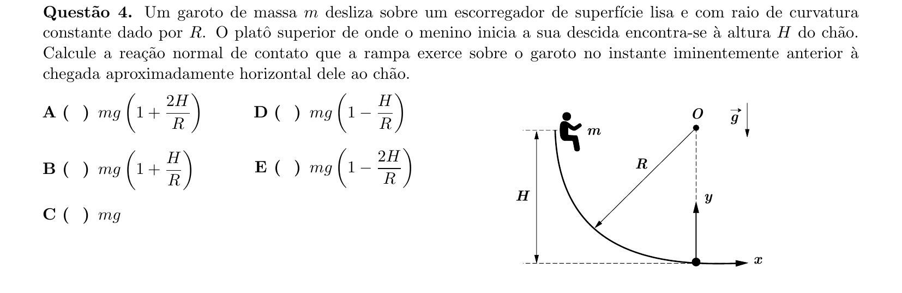

## Q05
**Assunto:** gravitação
**Competências:** experimento de Cavendish, balança de torção, determinação da constante G
**Tipo:** múltipla escolha

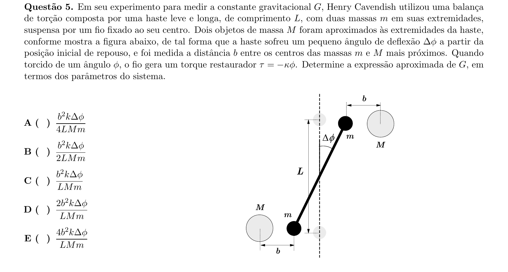

## Q06
**Assunto:** hidrodinâmica
**Competências:** equação de Bernoulli, equação da continuidade, diferença de pressão em tubo com estreitamento
**Tipo:** múltipla escolha

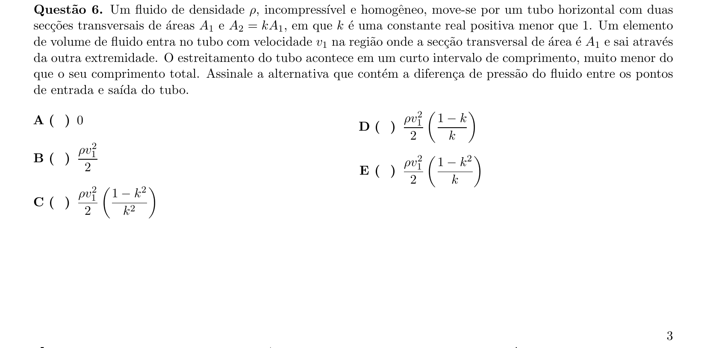

## Q07
**Assunto:** oscilações, conservação de momento
**Competências:** sistema massa-mola, período de oscilação, velocidade do centro de massa após liberação
**Tipo:** múltipla escolha

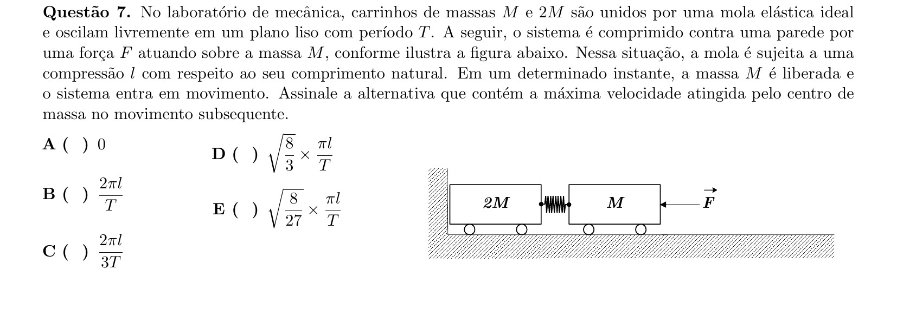

## Q08
**Assunto:** termologia, óptica
**Competências:** dilatação linear, lâmina bimetálica, reflexão de laser, estimativa de temperatura
**Tipo:** múltipla escolha

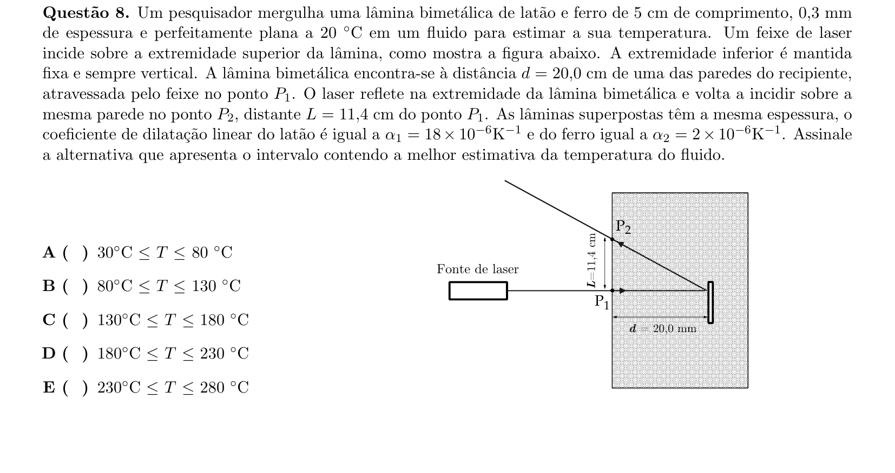

## Q09
**Assunto:** ondas, acústica
**Competências:** cordas vibrantes, harmônicos, decomposição espectral, frequência fundamental
**Tipo:** múltipla escolha

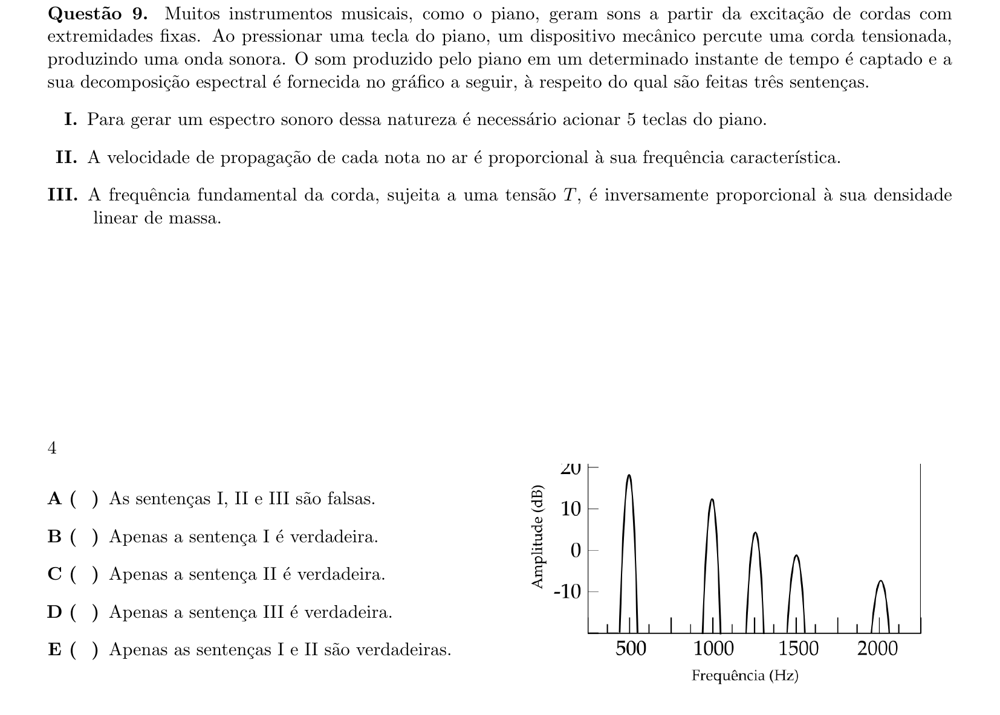

## Q10
**Assunto:** óptica geométrica
**Competências:** lente convergente, espelho côncavo, sistema lente-espelho, formação de imagens
**Tipo:** múltipla escolha

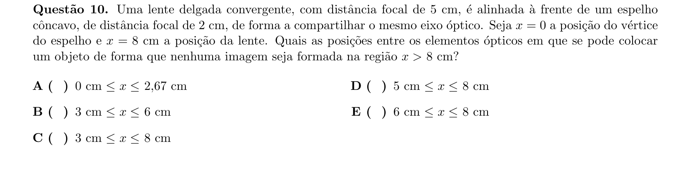

## Q11
**Assunto:** óptica ondulatória
**Competências:** dupla fenda de Young, interferência, condição de franja verde a partir de azul e amarelo
**Tipo:** múltipla escolha

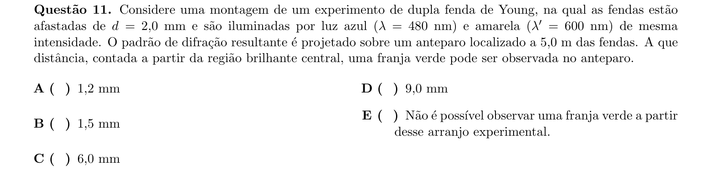

## Q12
**Assunto:** eletromagnetismo
**Competências:** força de Lorentz, movimento de carga em campos E e B cruzados, tempo para atingir altura
**Tipo:** múltipla escolha

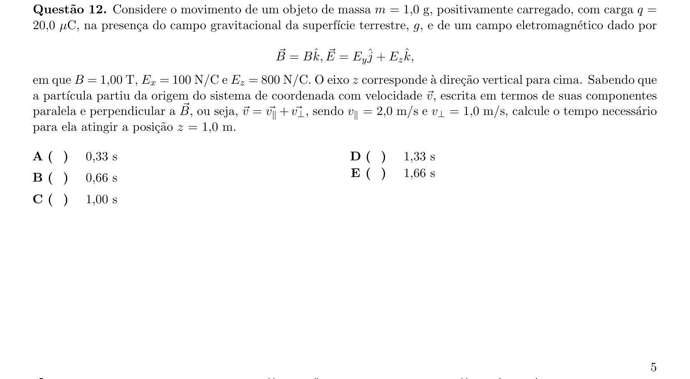

## Q13
**Assunto:** eletrostática
**Competências:** associação de capacitores, simetria do octaedro, capacitância equivalente
**Tipo:** múltipla escolha

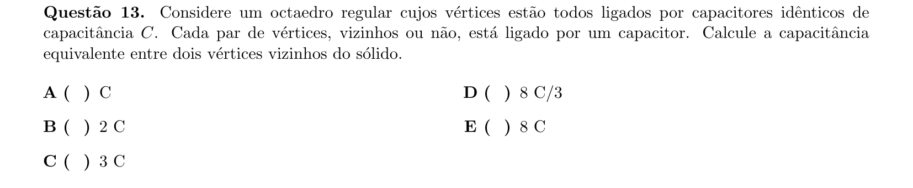

## Q14
**Assunto:** indução eletromagnética
**Competências:** solenoides coaxiais, lei de Faraday, corrente induzida com resistividades distintas
**Tipo:** múltipla escolha

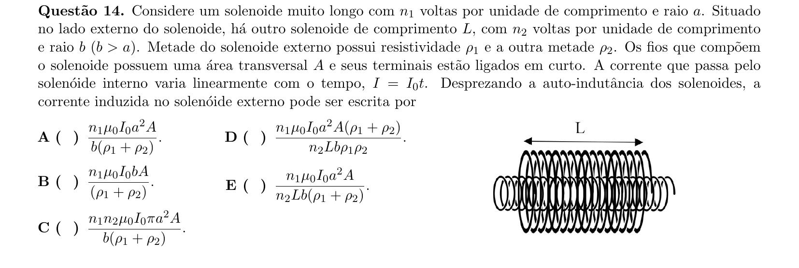

## Q15
**Assunto:** física moderna, energia
**Competências:** fusão nuclear no Sol, conversão massa-energia, estimativa de área de painéis solares
**Tipo:** múltipla escolha

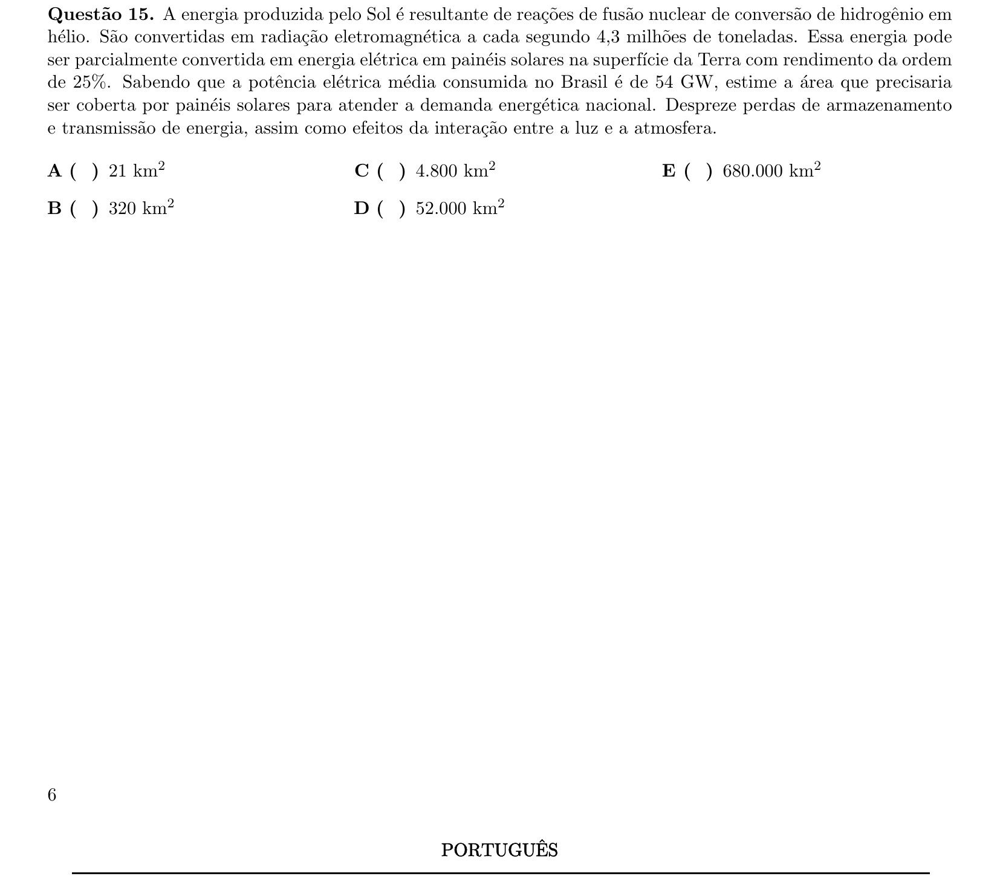
