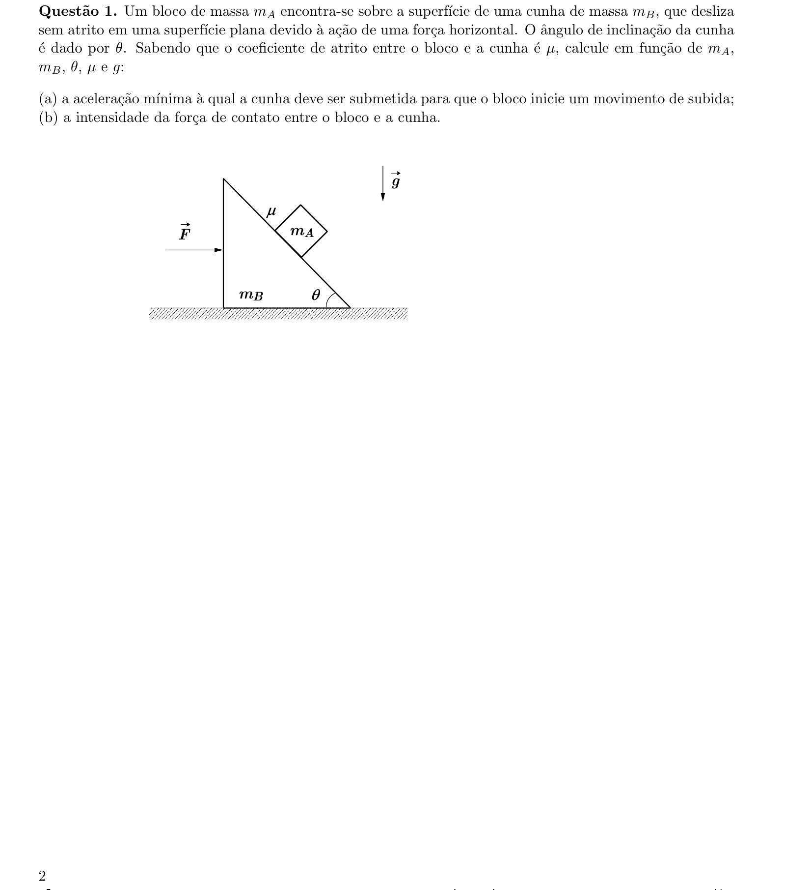
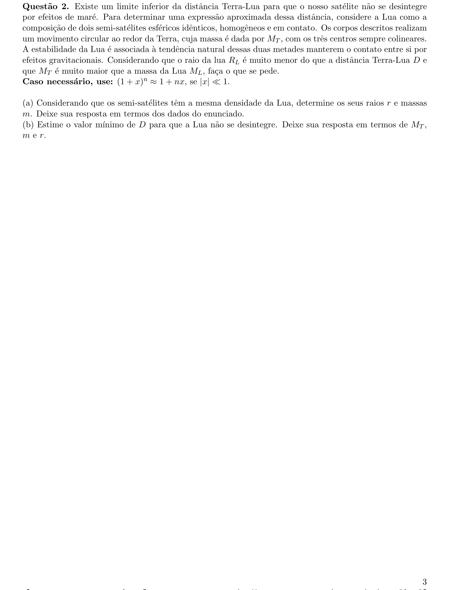
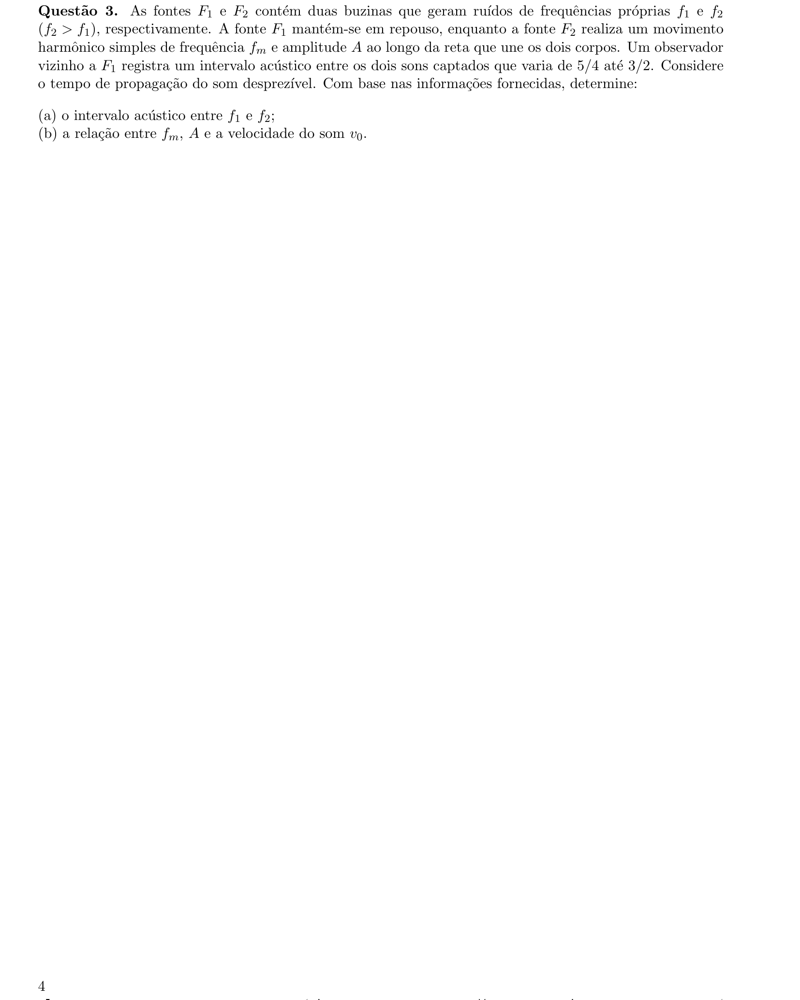
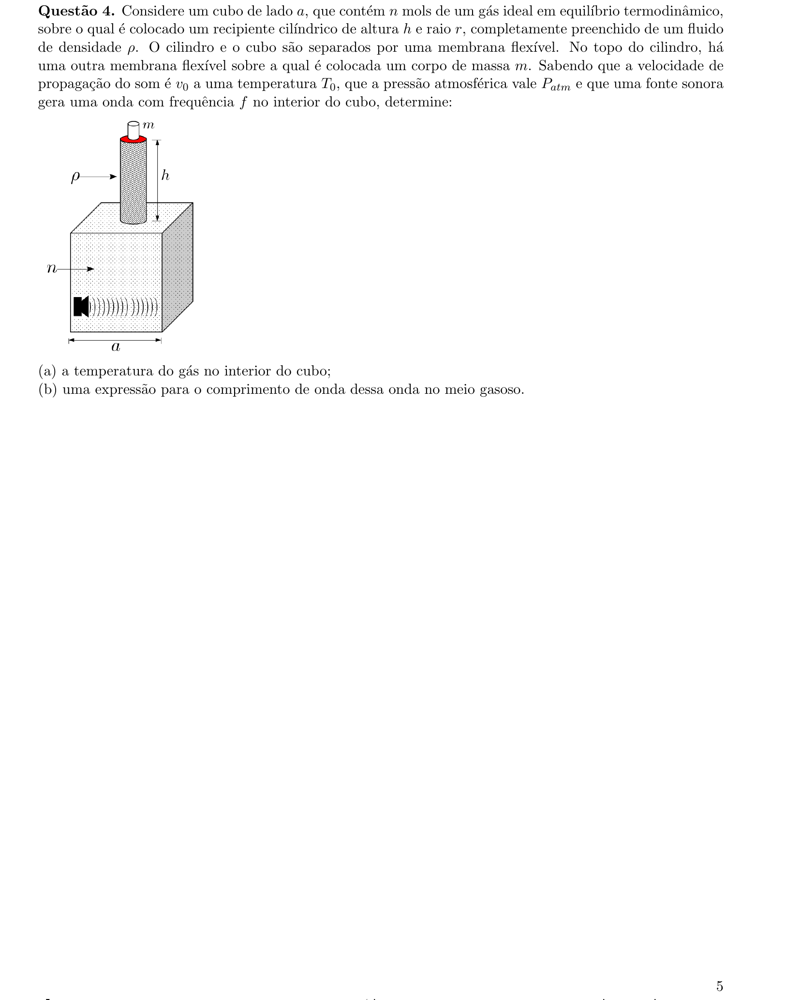
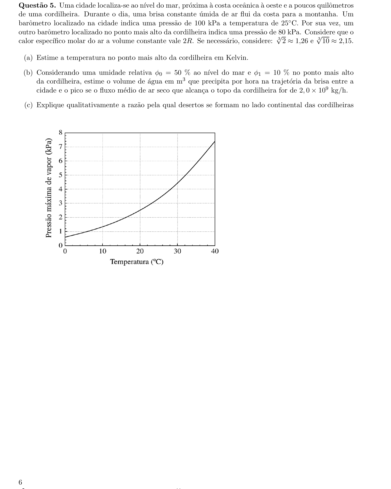
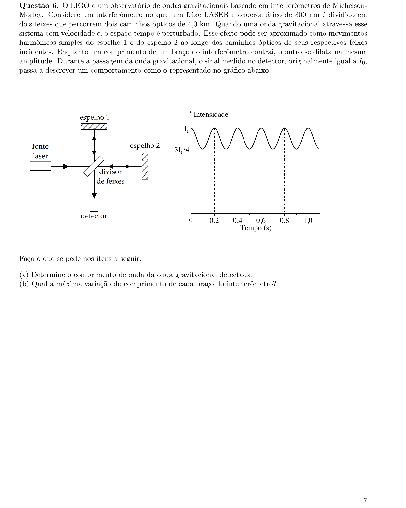
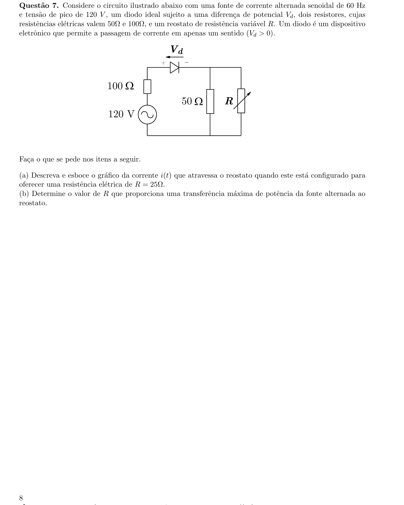
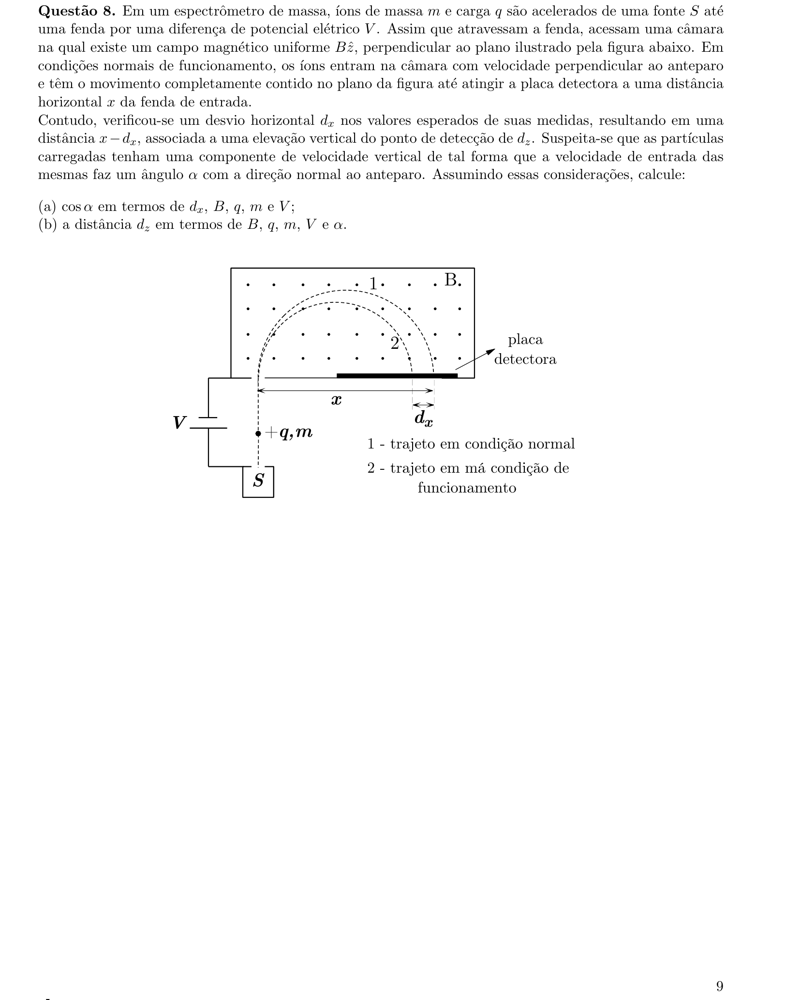
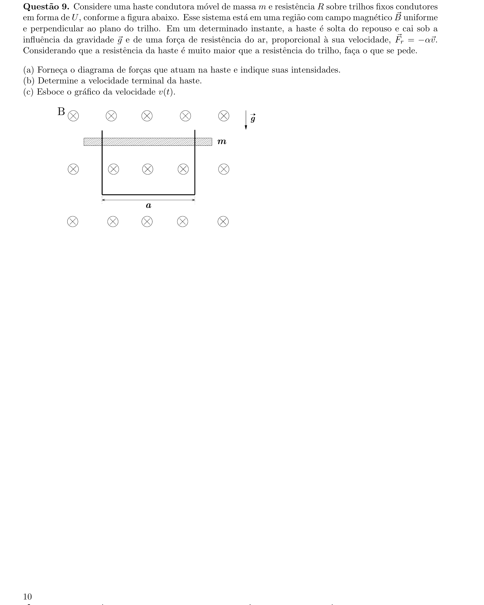
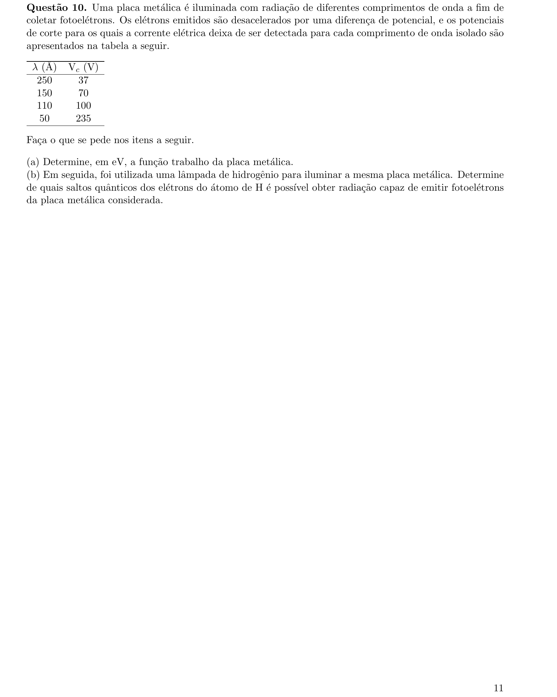

# Física — ITA 2022 (2ª fase)

> 10 questões discursivas.

## Q01
**Assunto:** dinâmica
**Competências:** plano inclinado, atrito, referencial não-inercial, decomposição de forças, força de contato
**Tipo:** discursiva

## Q02
**Assunto:** gravitação
**Competências:** força gravitacional, limite de Roche, movimento circular, densidade e volume de esferas, aproximação binomial
**Tipo:** discursiva

## Q03
**Assunto:** acústica
**Competências:** efeito Doppler, MHS, intervalo acústico (razão de frequências), velocidade máxima em MHS
**Tipo:** discursiva

## Q04
**Assunto:** ondulatória
**Competências:** gás ideal, equilíbrio mecânico em membrana, velocidade do som em gás, comprimento de onda
**Tipo:** discursiva

## Q05
**Assunto:** termodinâmica
**Competências:** processo adiabático, gás ideal, umidade relativa, pressão de vapor, efeito Föhn
**Tipo:** discursiva

## Q06
**Assunto:** óptica física
**Competências:** interferômetro de Michelson, interferência, diferença de caminho óptico, leitura de gráfico
**Tipo:** discursiva

## Q07
**Assunto:** circuitos
**Competências:** corrente alternada, diodo (retificação), associação de resistores, transferência máxima de potência
**Tipo:** discursiva

## Q08
**Assunto:** eletromagnetismo
**Competências:** força de Lorentz, movimento de carga em campo magnético, espectrômetro de massa, decomposição de velocidades, raio de Larmor
**Tipo:** discursiva

## Q09
**Assunto:** eletromagnetismo
**Competências:** indução eletromagnética, lei de Faraday, força magnética em condutor, velocidade terminal, equação diferencial linear
**Tipo:** discursiva

## Q10
**Assunto:** física moderna
**Competências:** efeito fotoelétrico, função trabalho, modelo de Bohr, transições atômicas do hidrogênio, relação de Planck-Einstein
**Tipo:** discursiva

