# Física — ITA 2023 (1ª fase)

> 12 questões múltipla escolha (Q01–Q12 da prova consolidada).

## Q01
**Assunto:** cinemática
**Competências:** lançamento horizontal, resistência do ar, análise gráfica
**Tipo:** múltipla escolha

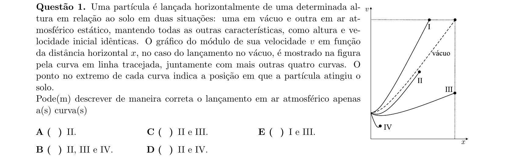

## Q02
**Assunto:** dinâmica, estática
**Competências:** equilíbrio de sistema rotacional com mola, pontos de equilíbrio estável/instável
**Tipo:** múltipla escolha (soma de afirmações)

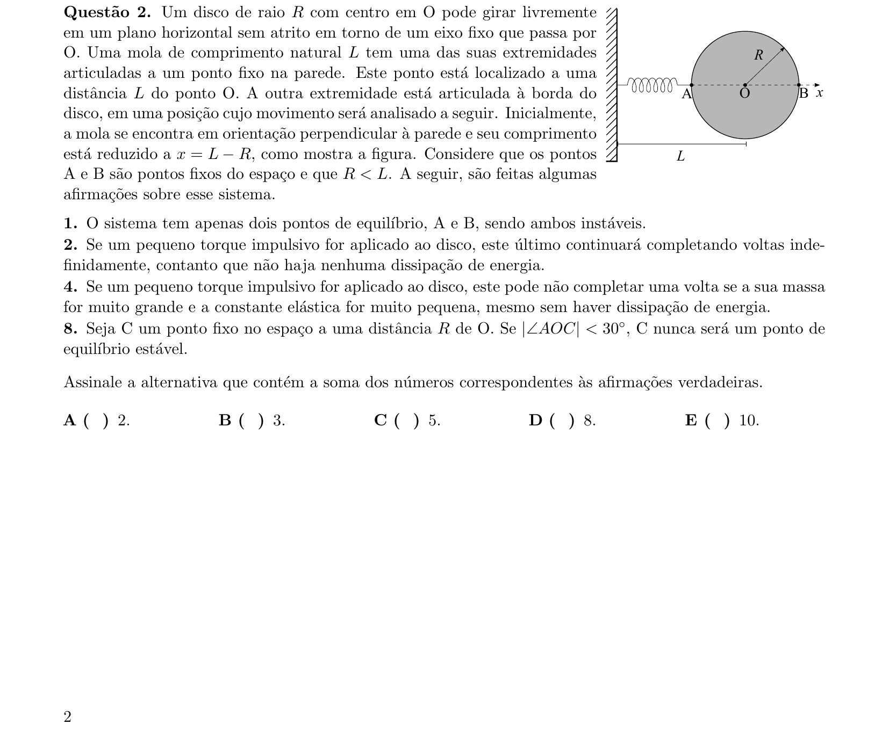

## Q03
**Assunto:** termodinâmica
**Competências:** transformação isentrópica de gás ideal, equilíbrio de forças em êmbolo, sistema acelerado
**Tipo:** múltipla escolha

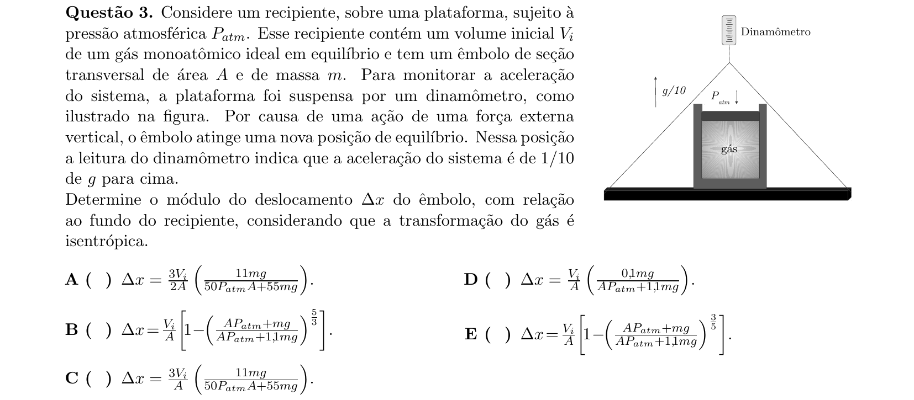

## Q04
**Assunto:** dinâmica, trabalho e energia
**Competências:** movimento circular, conservação de energia, trabalho da força viscosa
**Tipo:** múltipla escolha

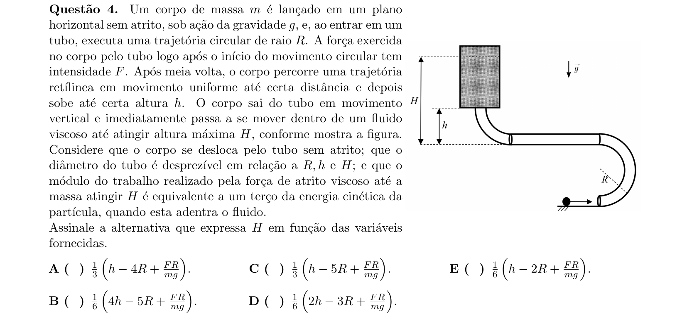

## Q05
**Assunto:** hidrostática, mecânica dos fluidos
**Competências:** pressão em fluido em referencial acelerado, MUV
**Tipo:** múltipla escolha

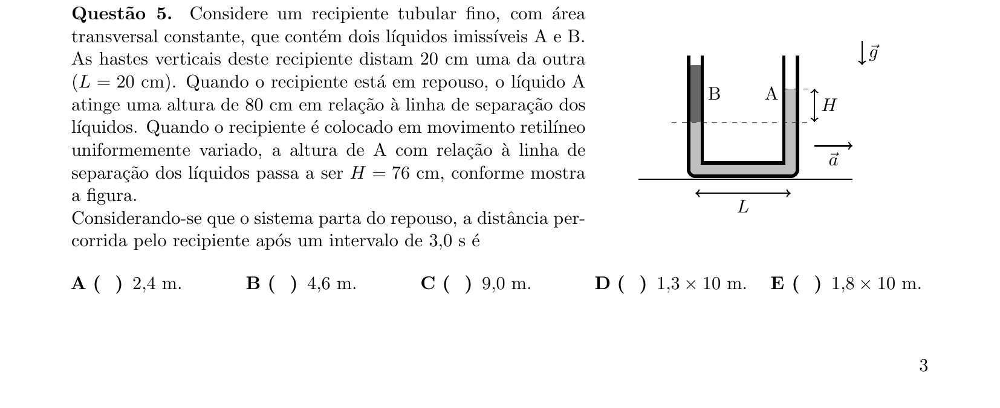

## Q06
**Assunto:** termodinâmica
**Competências:** ciclo termodinâmico, rendimento de máquina térmica, transformações isotérmica e isocórica
**Tipo:** múltipla escolha

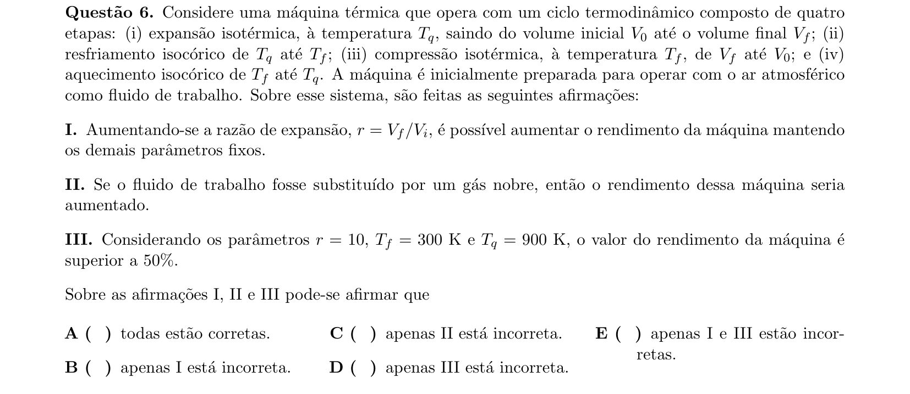

## Q07
**Assunto:** ondulatória, acústica
**Competências:** propagação de ondas, ondas transversais x longitudinais, intensidade sonora em dB
**Tipo:** múltipla escolha

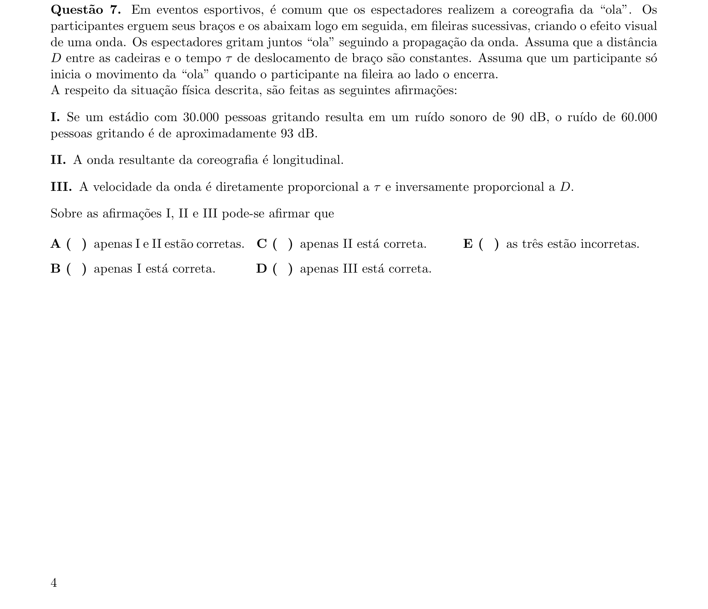

## Q08
**Assunto:** óptica física
**Competências:** polarização da luz, lei de Malus, filtros polarizadores
**Tipo:** múltipla escolha

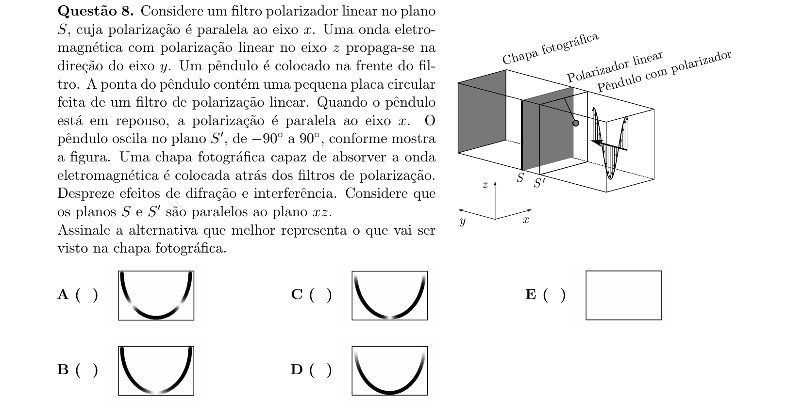

## Q09
**Assunto:** circuitos, eletrodinâmica
**Competências:** modelagem de membrana neuronal por resistor e capacitor, associações em paralelo
**Tipo:** múltipla escolha

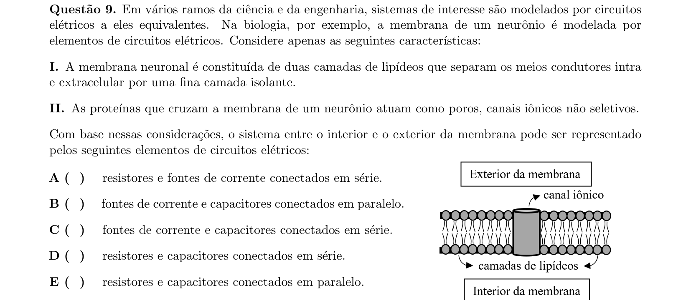

## Q10
**Assunto:** eletromagnetismo, magnetismo
**Competências:** força magnética sobre carga, campo gravitacional, conservação da energia cinética
**Tipo:** múltipla escolha

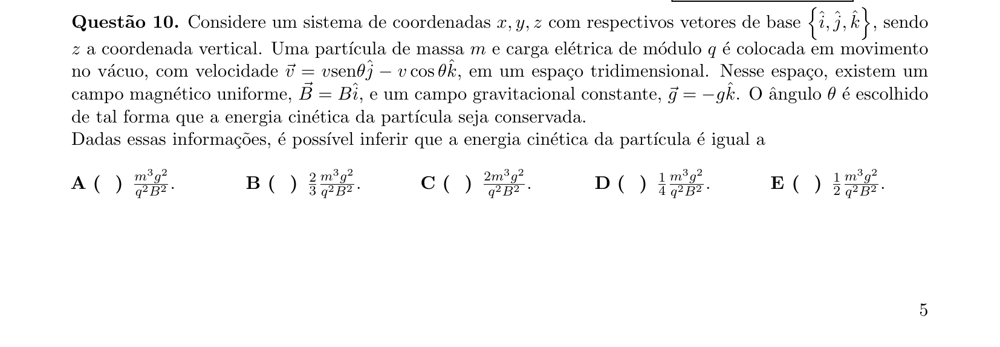

## Q11
**Assunto:** eletromagnetismo
**Competências:** indução eletromagnética, lei de Lenz, fluxo magnético
**Tipo:** múltipla escolha

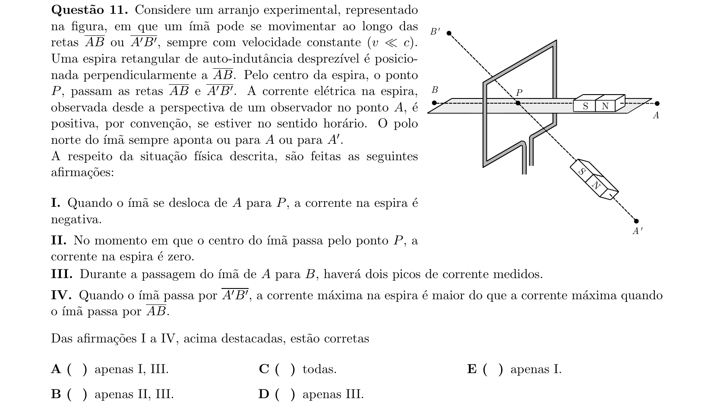

## Q12
**Assunto:** física moderna
**Competências:** dilatação temporal relativística, decaimento de múons
**Tipo:** múltipla escolha

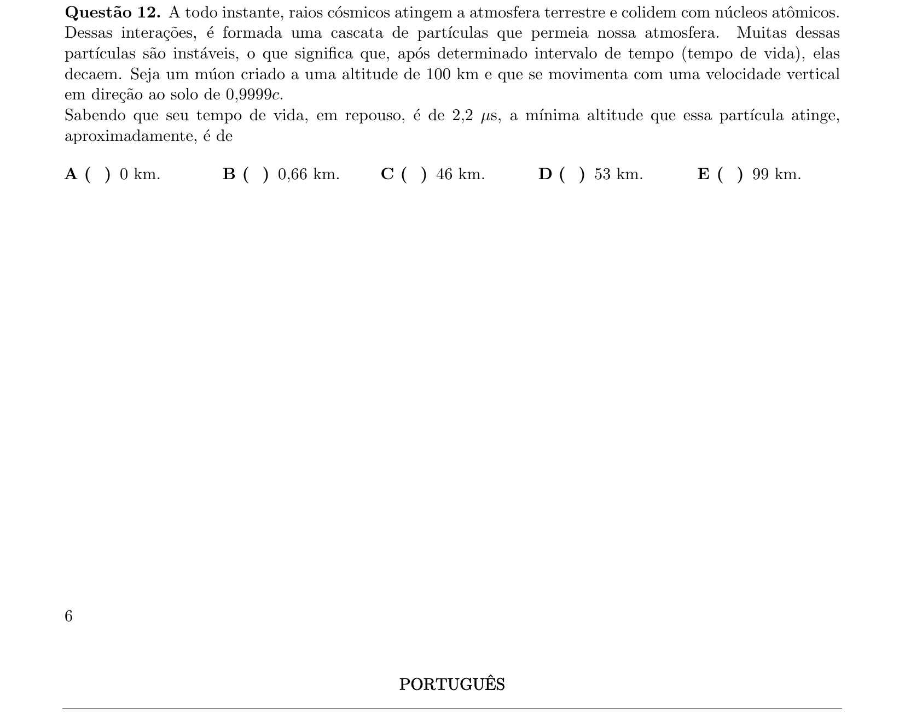
