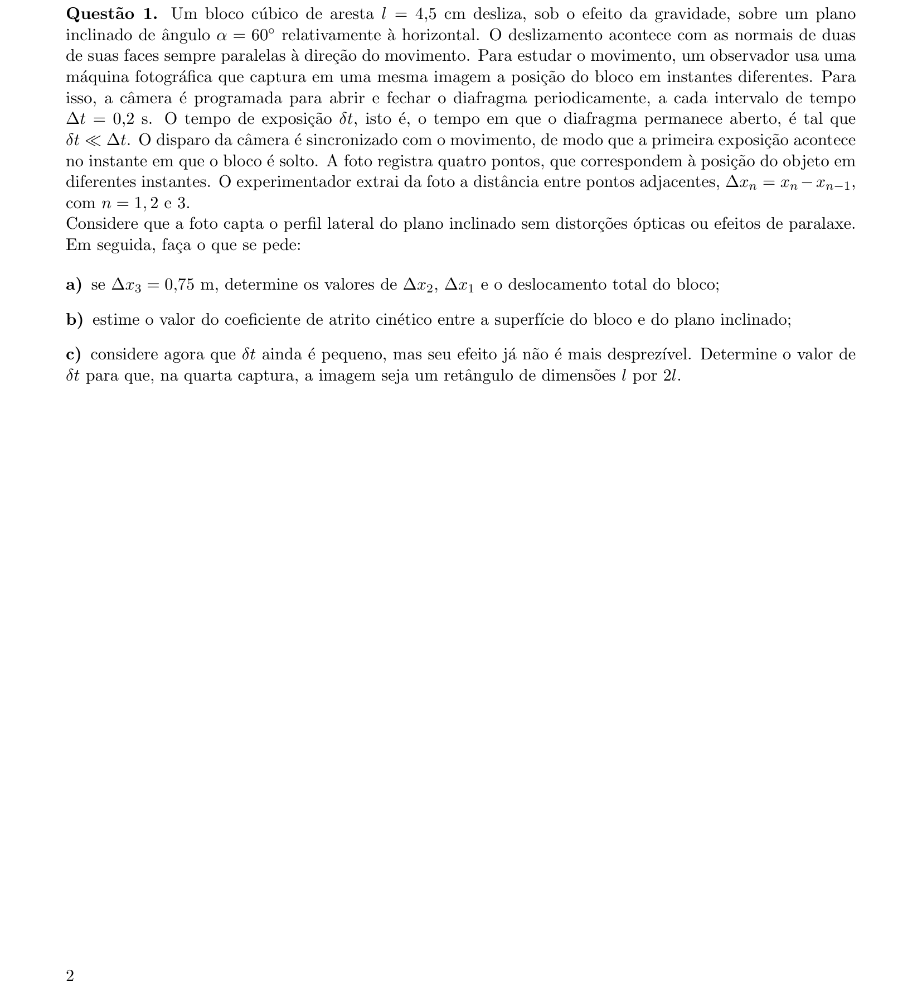
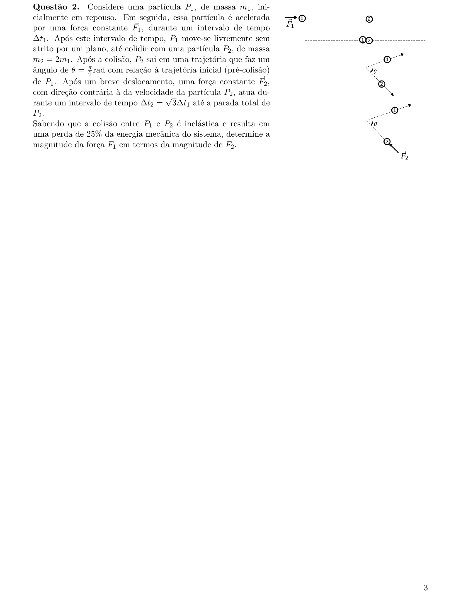
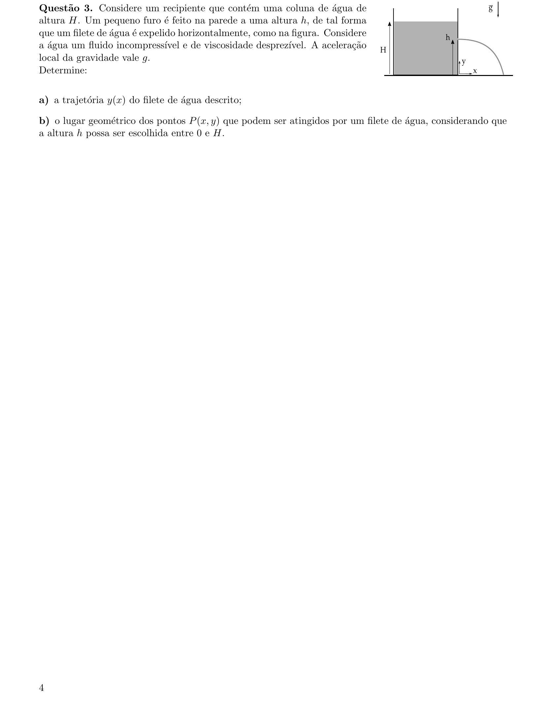
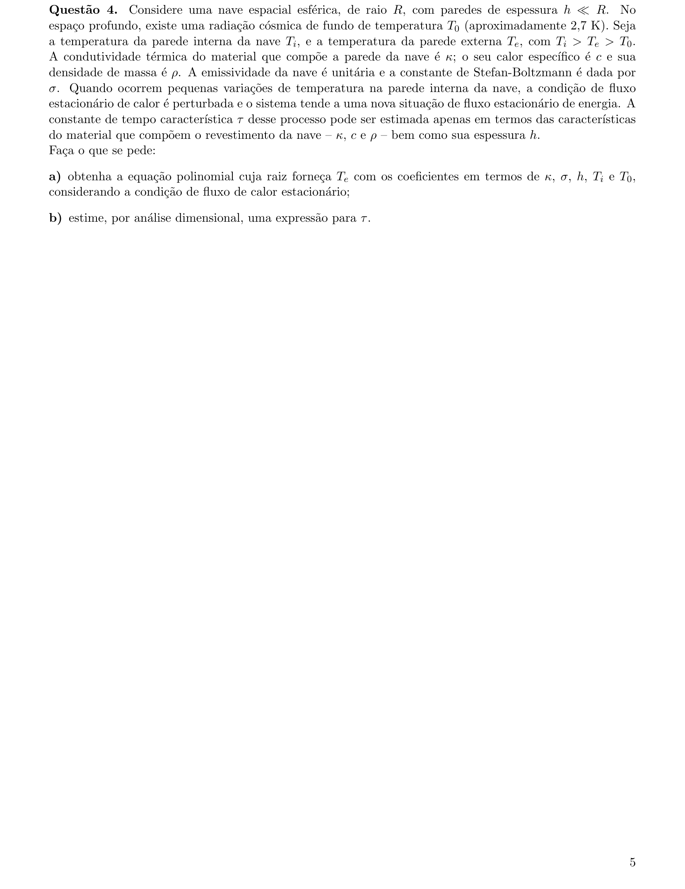
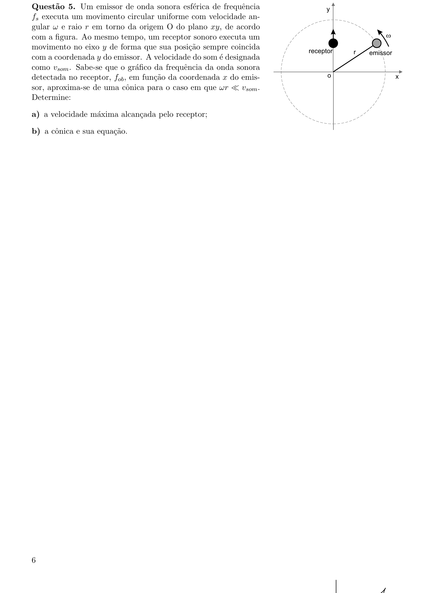
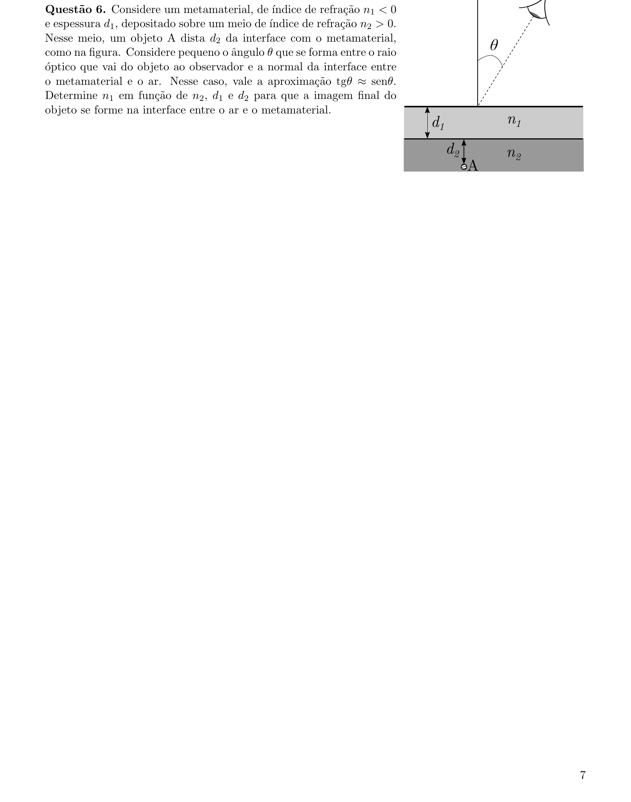
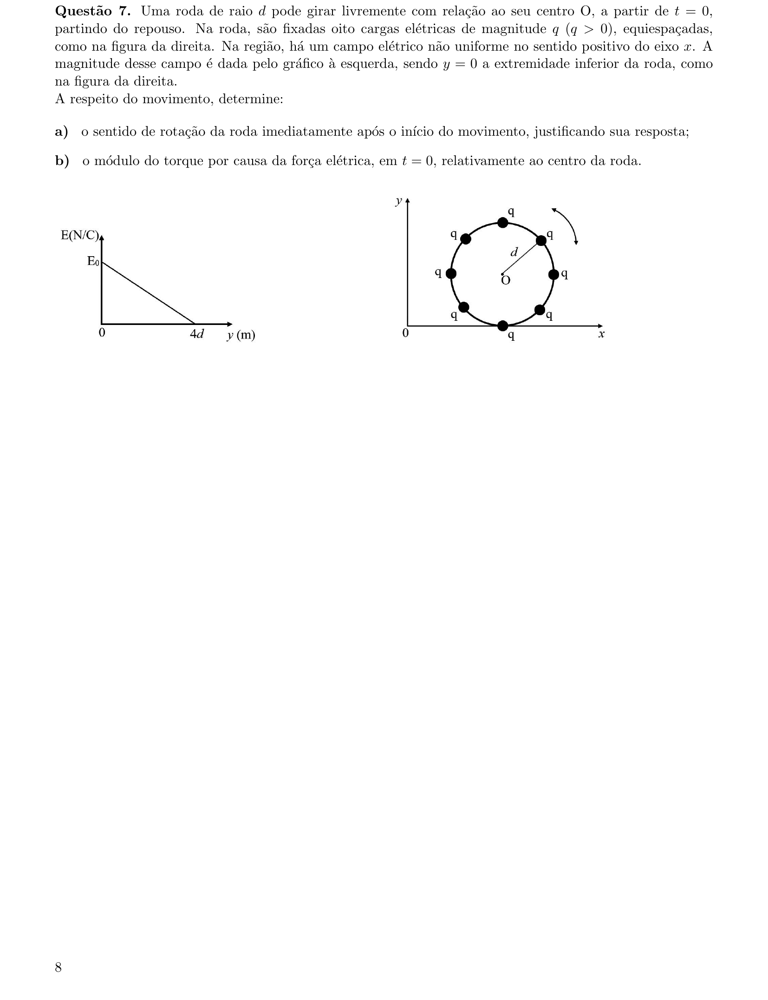
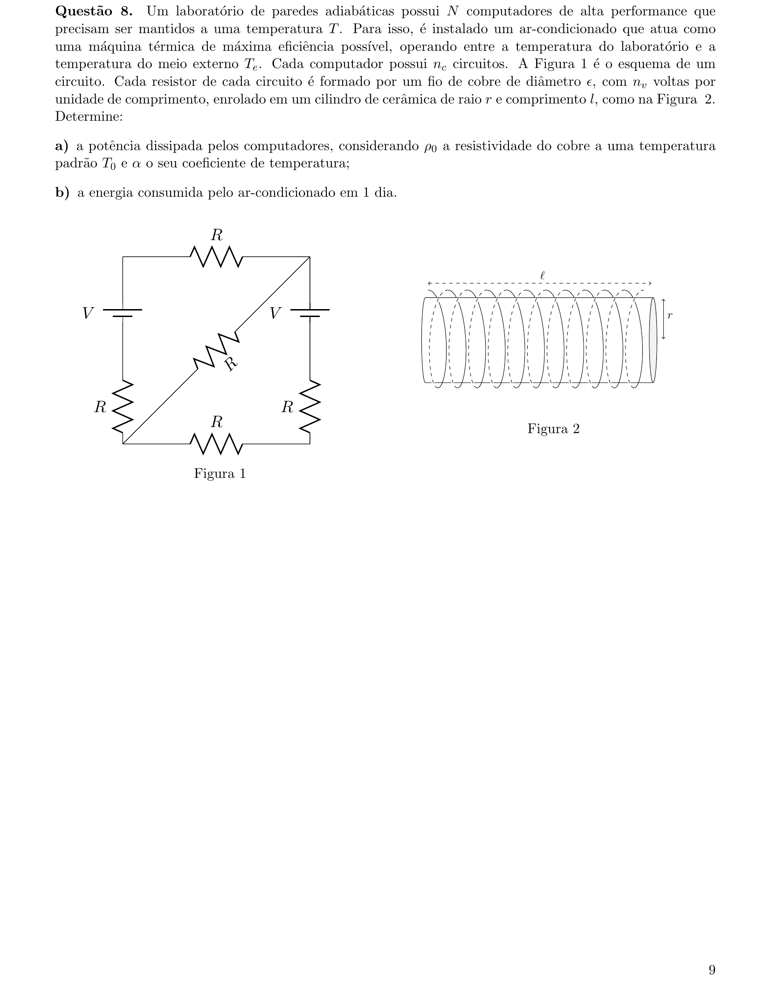
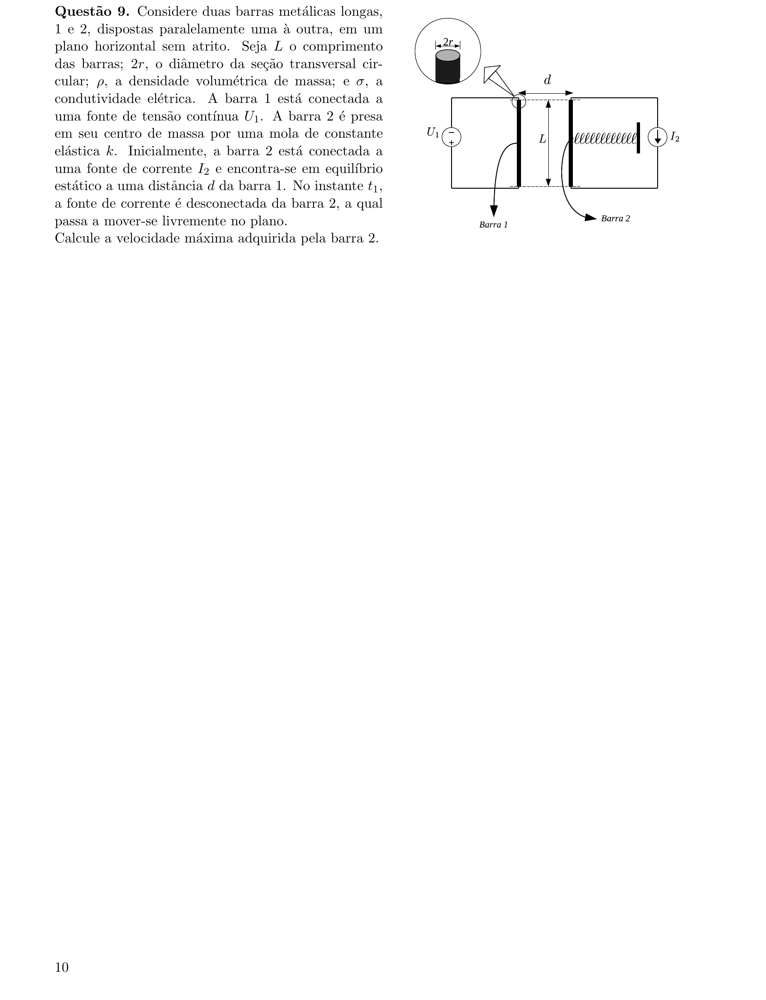
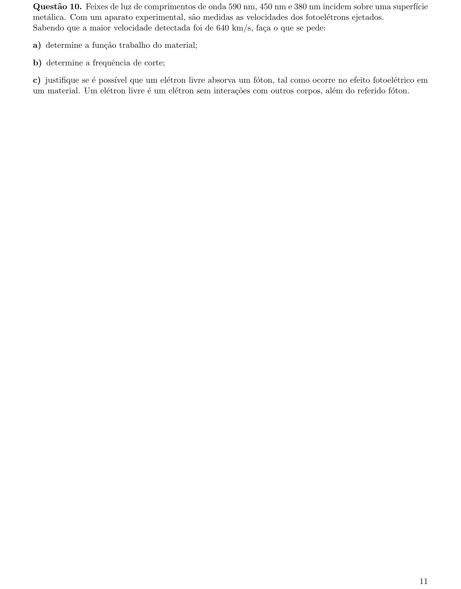

# Física — ITA 2023 (2ª fase)

> 10 questões discursivas.

## Q01
**Assunto:** cinemática
**Competências:** MRUV, plano inclinado, queda com atrito, sequência de espaçamentos de Galileu, tempo de exposição em fotografia estroboscópica
**Tipo:** discursiva

## Q02
**Assunto:** dinâmica
**Competências:** colisão inelástica, conservação do momento linear em 2D, perda percentual de energia mecânica, impulso, MRUV
**Tipo:** discursiva

## Q03
**Assunto:** hidrostática
**Competências:** equação de Torricelli, lançamento horizontal, trajetória parabólica, envoltória (lugar geométrico), pressão hidrostática
**Tipo:** discursiva

## Q04
**Assunto:** termodinâmica
**Competências:** condução de calor (lei de Fourier), radiação de Stefan-Boltzmann, fluxo estacionário, análise dimensional, constante de tempo
**Tipo:** discursiva

## Q05
**Assunto:** acústica
**Competências:** efeito Doppler, movimento circular uniforme, aproximação de baixa velocidade, identificação de cônicas, geometria analítica
**Tipo:** discursiva

## Q06
**Assunto:** óptica geométrica
**Competências:** refração em metamaterial (índice negativo), lei de Snell, formação de imagem por interface plana, aproximação paraxial
**Tipo:** discursiva

## Q07
**Assunto:** eletrostática
**Competências:** força elétrica em campo não uniforme, torque sobre distribuição discreta de cargas, simetria, leitura de gráfico
**Tipo:** discursiva

## Q08
**Assunto:** circuitos
**Competências:** associação de resistores (ponte de Wheatstone), resistividade dependente da temperatura, solenoide (geometria de fio), máquina de Carnot, potência e energia
**Tipo:** discursiva

## Q09
**Assunto:** eletromagnetismo
**Competências:** força magnética entre fios paralelos, indução eletromagnética (fem de movimento), oscilador mola-massa, equilíbrio dinâmico, conservação de energia
**Tipo:** discursiva

## Q10
**Assunto:** física moderna
**Competências:** efeito fotoelétrico, função trabalho, frequência de corte, conservação de energia e momento para fóton-elétron livre, relação de Planck-Einstein
**Tipo:** discursiva

