# Física — ITA 2024 (1ª fase)

> 12 questões múltipla escolha (Q01–Q12 da prova consolidada).

## Q01
**Assunto:** cinemática, energia
**Competências:** leitura de curvas de calibração, MRU, energia cinética
**Tipo:** múltipla escolha

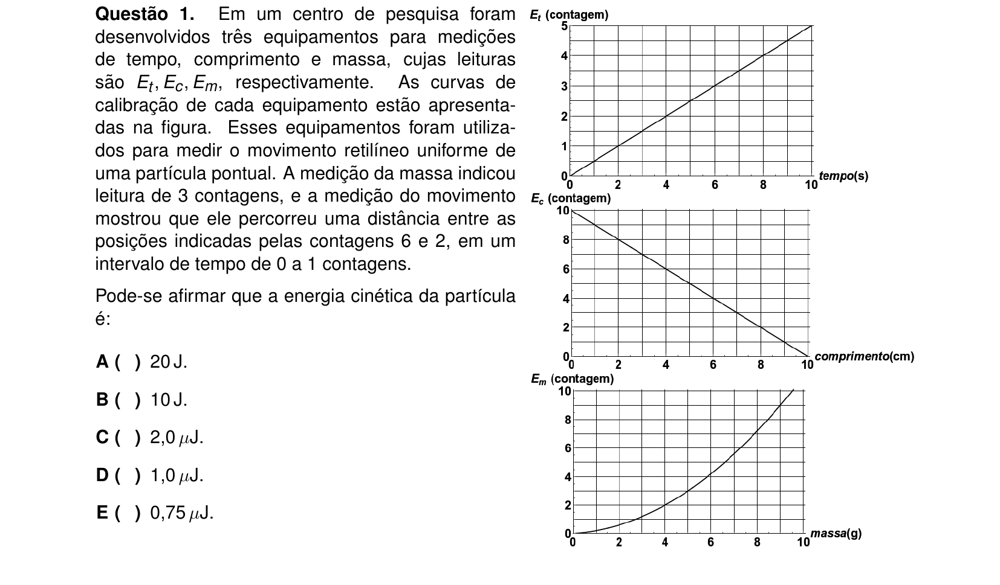

## Q02
**Assunto:** cinemática, óptica geométrica
**Competências:** queda livre, semelhança de triângulos, velocidade da sombra projetada
**Tipo:** múltipla escolha

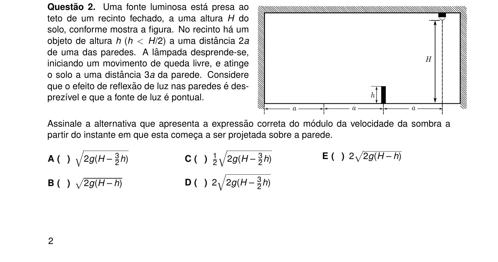

## Q03
**Assunto:** dinâmica, colisões
**Competências:** centro de massa de esfera com cavidade, queda livre, coeficiente de restituição
**Tipo:** múltipla escolha

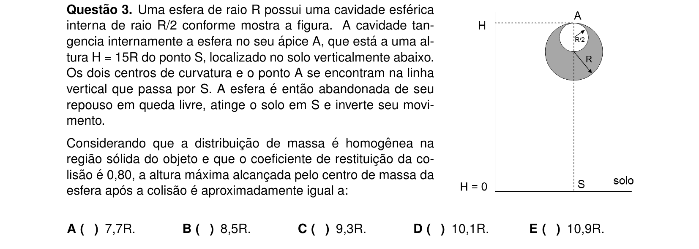

## Q04
**Assunto:** gravitação, dinâmica de rotação
**Competências:** impulso para escape, rotação da Terra, dependência com a latitude
**Tipo:** múltipla escolha

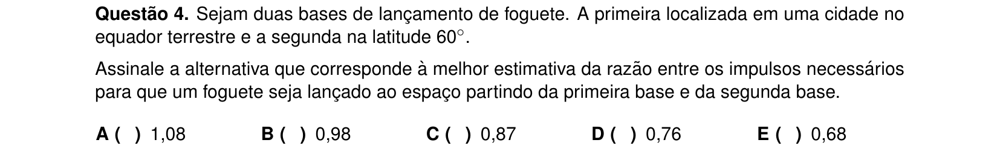

## Q05
**Assunto:** gravitação, astronomia
**Competências:** terceira lei de Kepler, razão de distâncias por área aparente, período orbital
**Tipo:** múltipla escolha

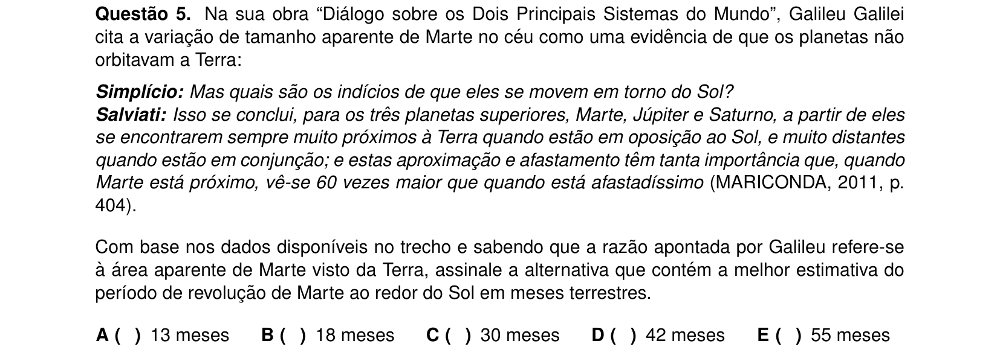

## Q06
**Assunto:** MHS, dilatação térmica
**Competências:** período do pêndulo simples, dilatação linear, defasagem entre osciladores
**Tipo:** múltipla escolha

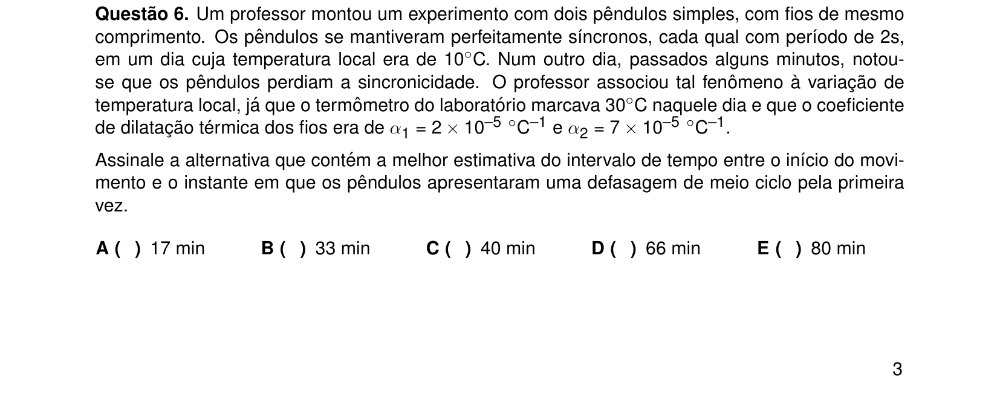

## Q07
**Assunto:** óptica geométrica
**Competências:** microscópio composto, equação de Gauss, aumento linear
**Tipo:** múltipla escolha

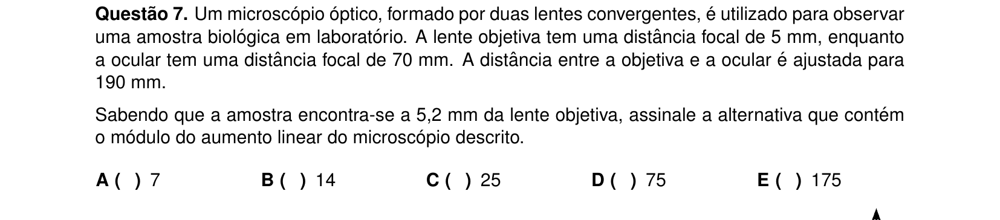

## Q08
**Assunto:** óptica ondulatória
**Competências:** experimento de Young, diferença de caminho óptico, índice de refração
**Tipo:** múltipla escolha

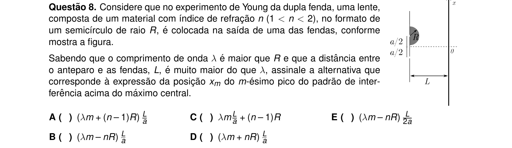

## Q09
**Assunto:** eletrostática
**Competências:** carga induzida em casca metálica aterrada, blindagem eletrostática, lei de Gauss
**Tipo:** múltipla escolha (soma de afirmações)

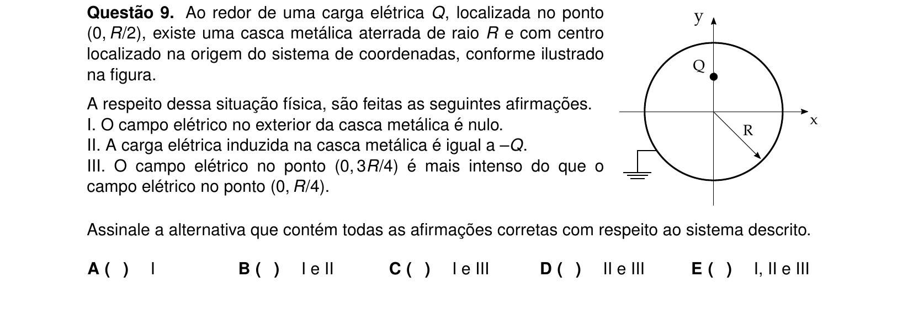

## Q10
**Assunto:** eletromagnetismo
**Competências:** força magnética, movimento circular de partícula carregada, geometria do raio
**Tipo:** múltipla escolha

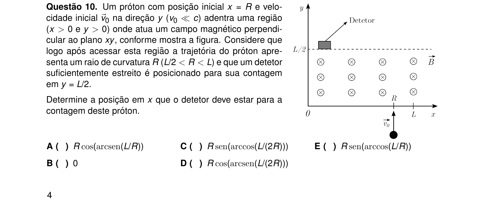

## Q11
**Assunto:** eletromagnetismo
**Competências:** indução, lei de Faraday, campo de solenoide, fluxo magnético em sonda
**Tipo:** múltipla escolha

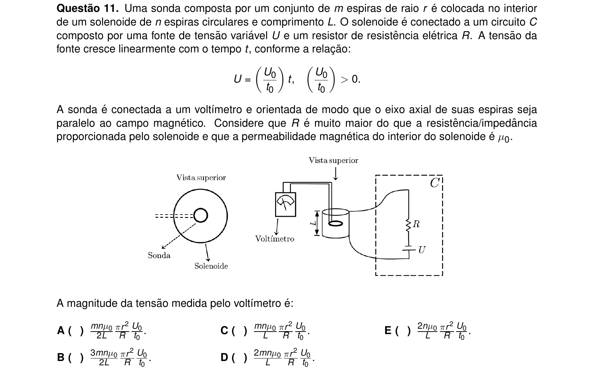

## Q12
**Assunto:** relatividade especial
**Competências:** simultaneidade, relatividade da simultaneidade, contração/dilatação
**Tipo:** múltipla escolha

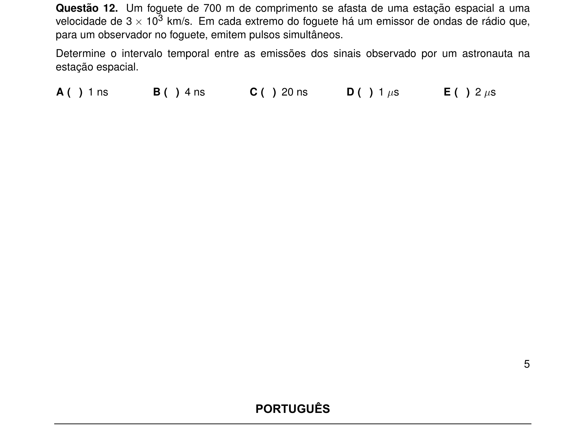
