# Física — ITA 2025 (1ª fase)

> 12 questões múltipla escolha (Q13–Q24 da prova consolidada MAT+FIS+QUI+ING).

## Q13
**Assunto:** cinemática
**Competências:** função horária da posição, velocidade média, distância percorrida
**Tipo:** múltipla escolha

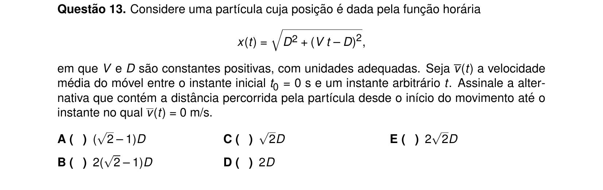

## Q14
**Assunto:** mecânica / colisões
**Competências:** MRUV, trajetória circular, conservação de energia, colisão inelástica
**Tipo:** múltipla escolha

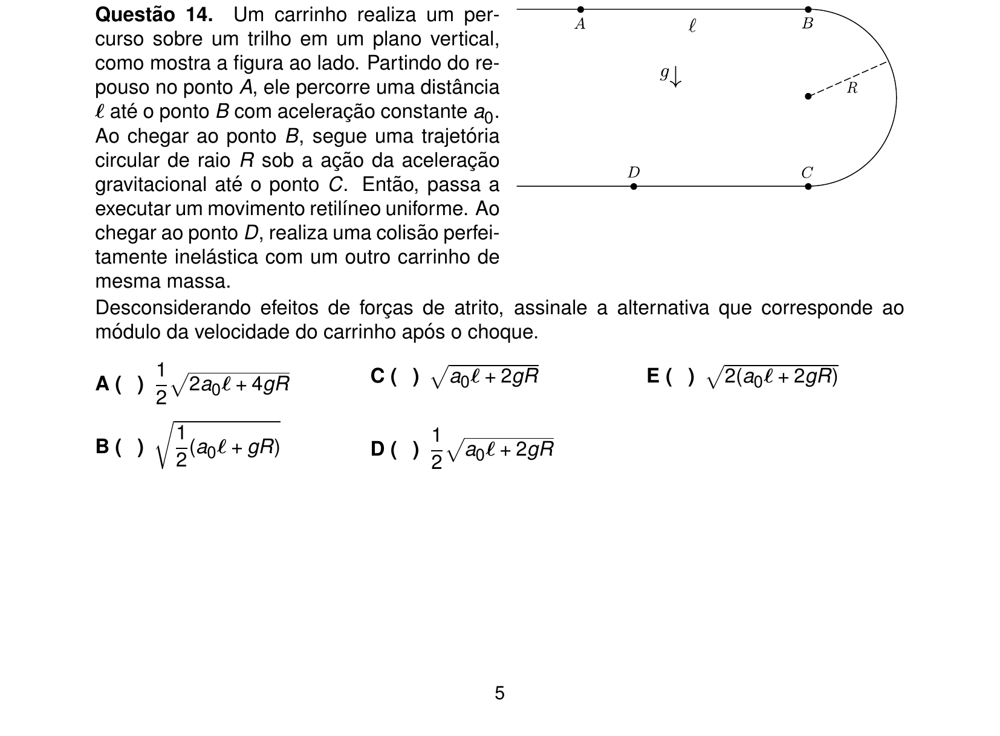

## Q15
**Assunto:** gravitação
**Competências:** terceira lei de Kepler, período orbital, distância de satélite
**Tipo:** múltipla escolha

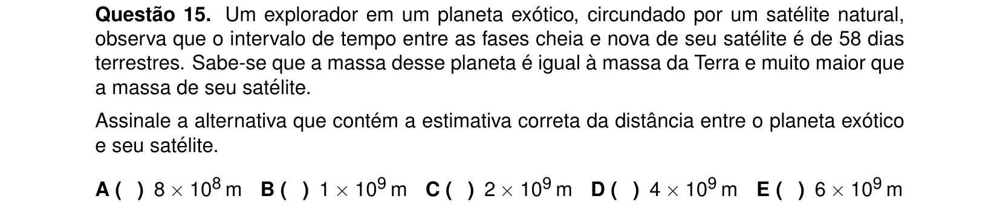

## Q16
**Assunto:** MHS / oscilações
**Competências:** osciladores massa-mola, associação de molas em série, razão de frequências
**Tipo:** múltipla escolha

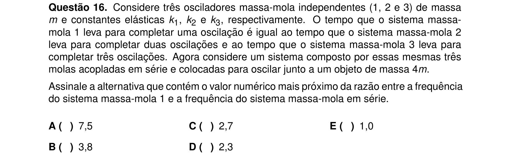

## Q17
**Assunto:** estática / hidrostática
**Competências:** equilíbrio de barra, torques, empuxo, densidades
**Tipo:** múltipla escolha

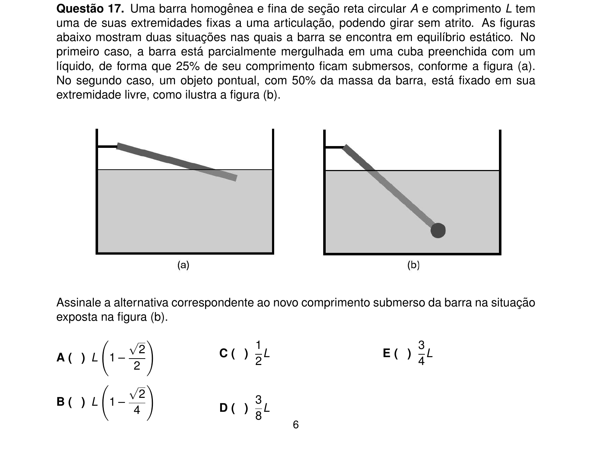

## Q18
**Assunto:** termodinâmica
**Competências:** processo isotérmico, gás ideal, trabalho e energia em mola, calor
**Tipo:** múltipla escolha

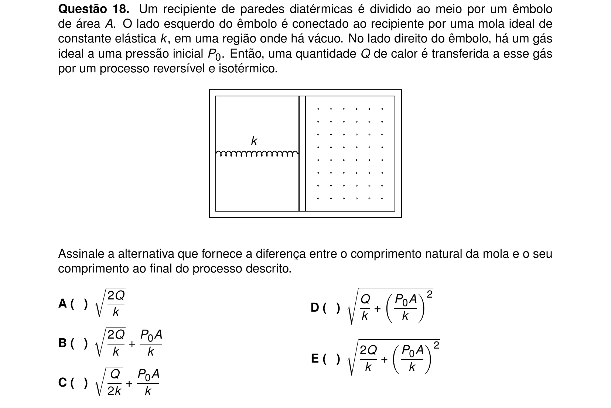

## Q19
**Assunto:** ondas / acústica
**Competências:** intensidade sonora, áreas e amplitude, nível em decibéis
**Tipo:** múltipla escolha

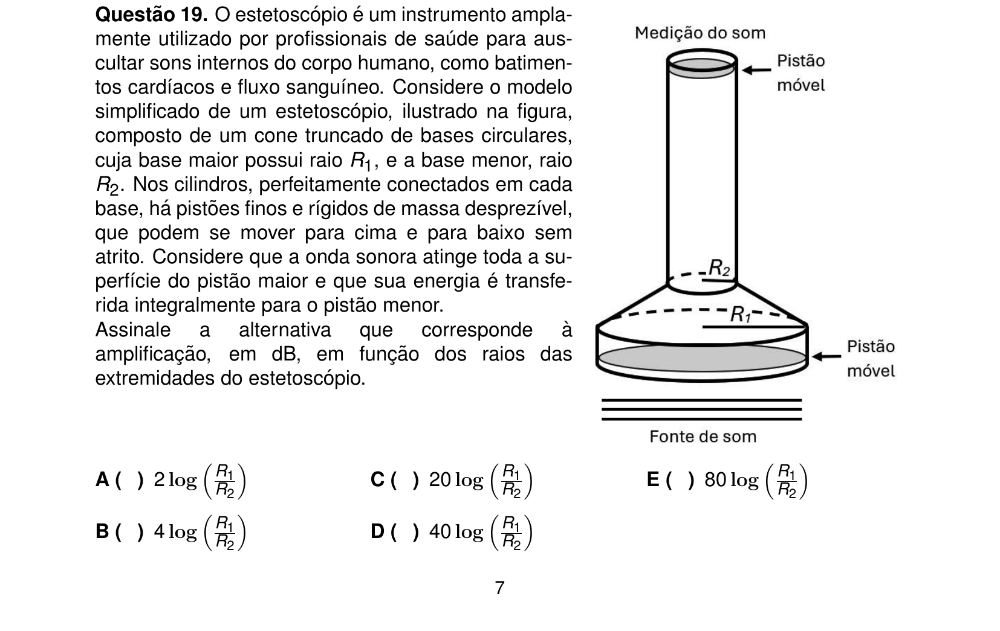

## Q20
**Assunto:** óptica
**Competências:** arco-íris, refração, reflexão, dispersão, asserções I-III
**Tipo:** múltipla escolha (asserções I-III)

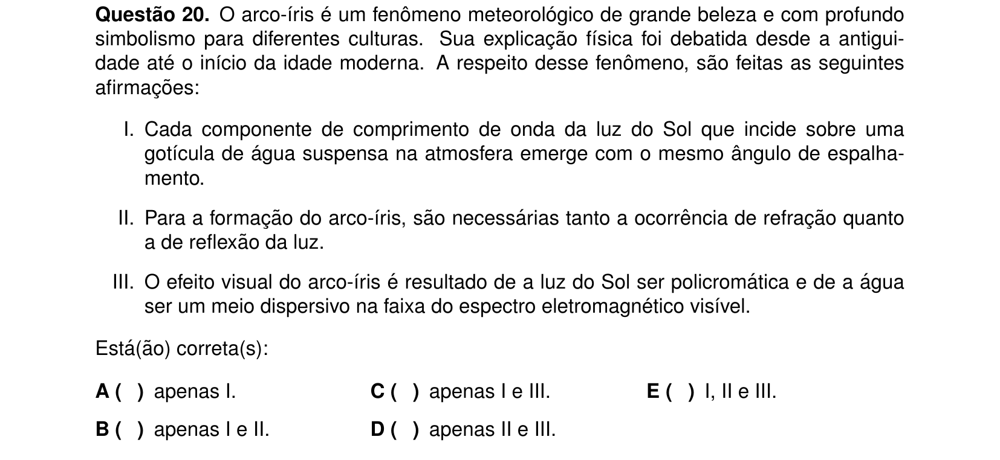

## Q21
**Assunto:** eletrostática / capacitores
**Competências:** capacitor com dielétricos (água e óleo), associações, capacitância equivalente
**Tipo:** múltipla escolha

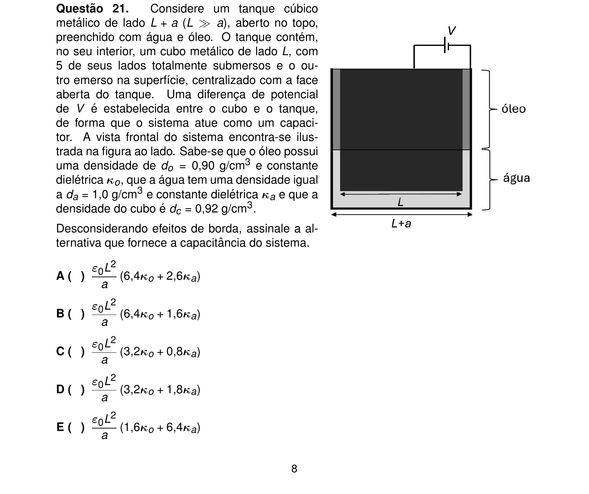

## Q22
**Assunto:** eletricidade / circuitos
**Competências:** ponte de Wheatstone, reostato, análise gráfica, resistência equivalente
**Tipo:** múltipla escolha

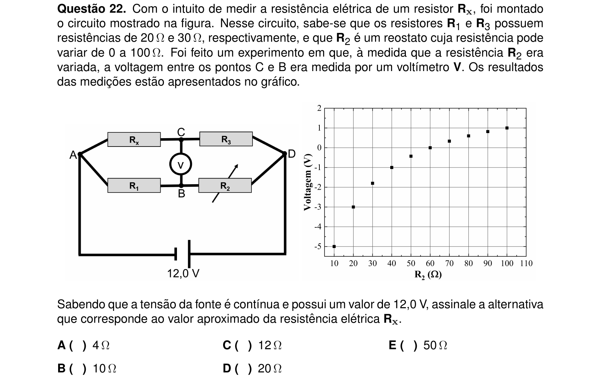

## Q23
**Assunto:** eletromagnetismo
**Competências:** lei de Faraday, fluxo magnético variável, corrente induzida em espira
**Tipo:** múltipla escolha

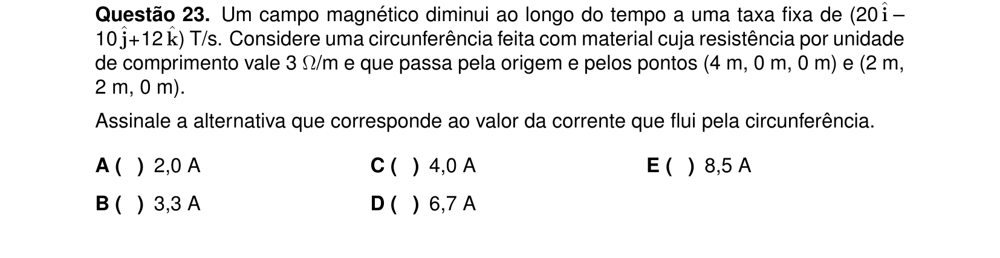

## Q24
**Assunto:** física moderna
**Competências:** efeito Raman, quantização de energia, comprimento de onda do fóton
**Tipo:** múltipla escolha

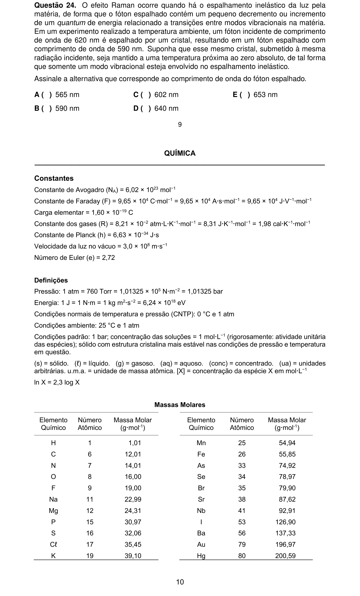
