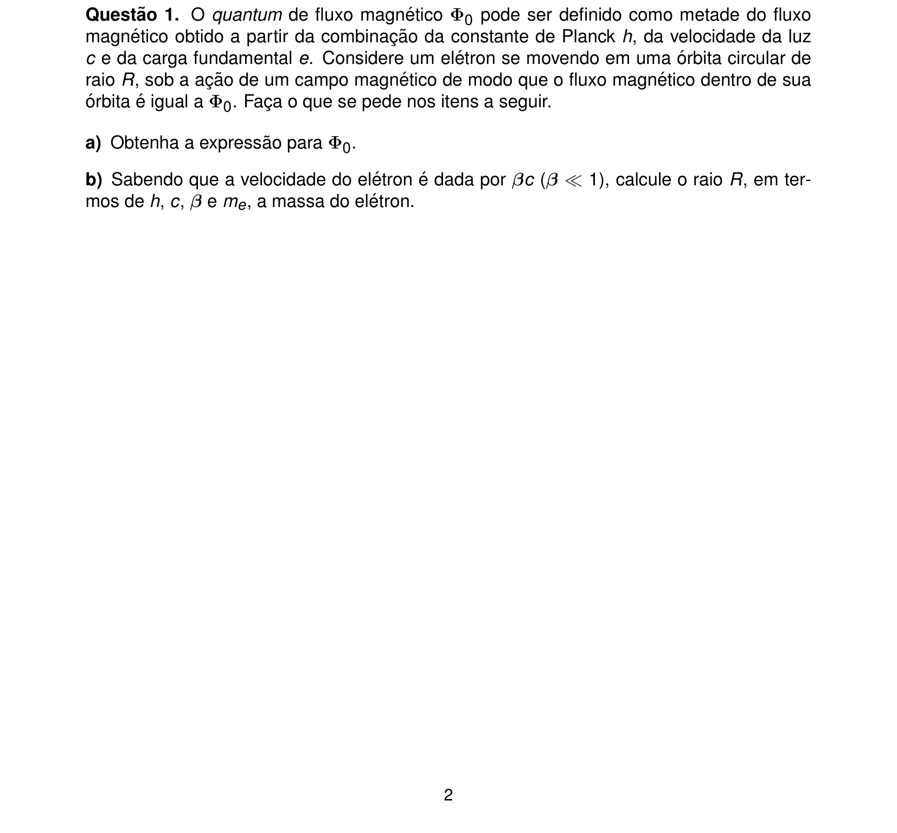
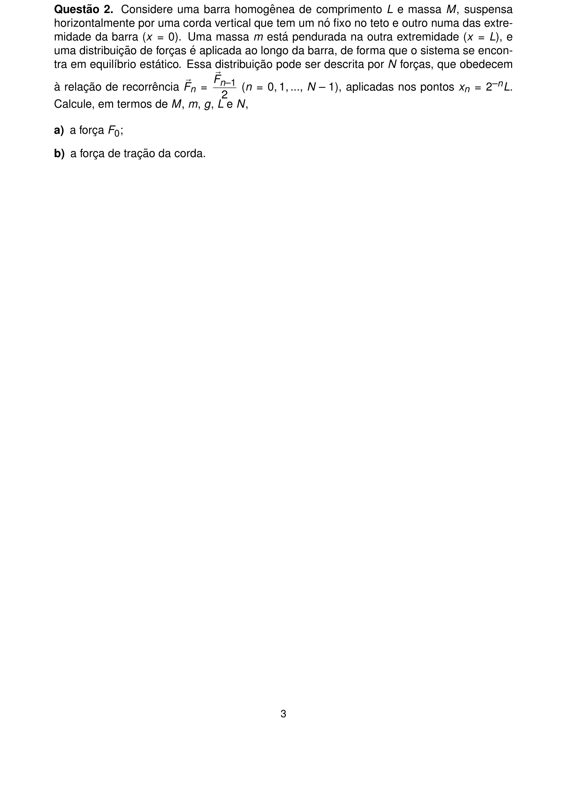
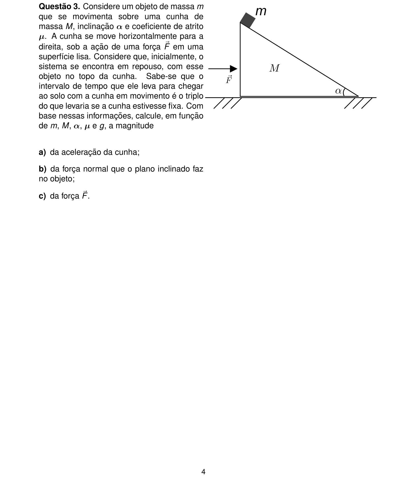
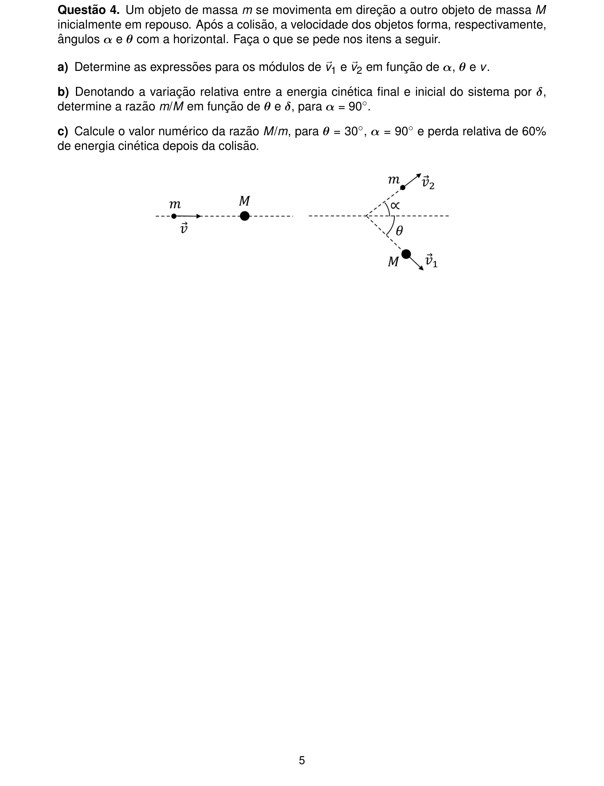
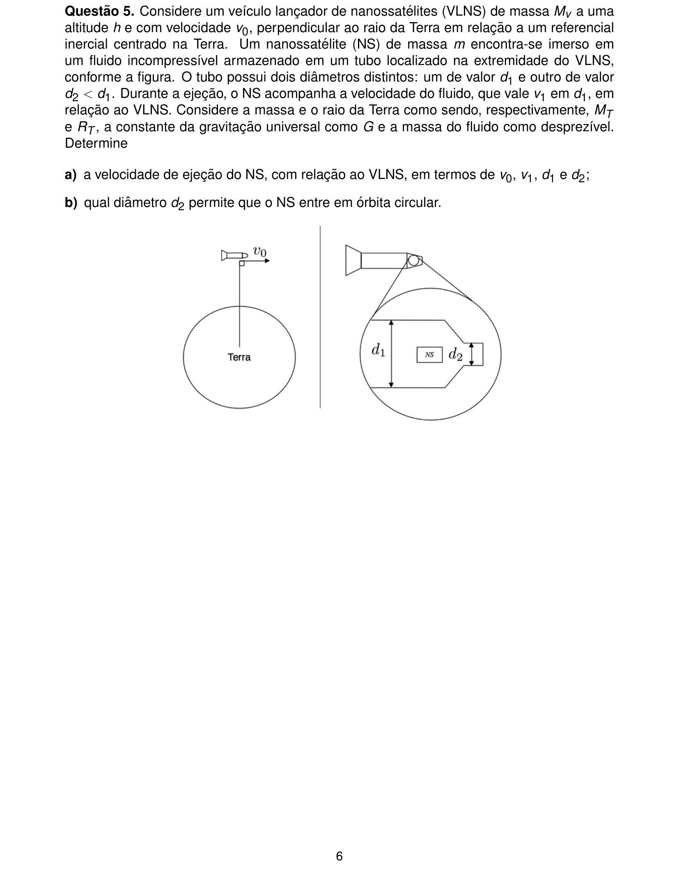
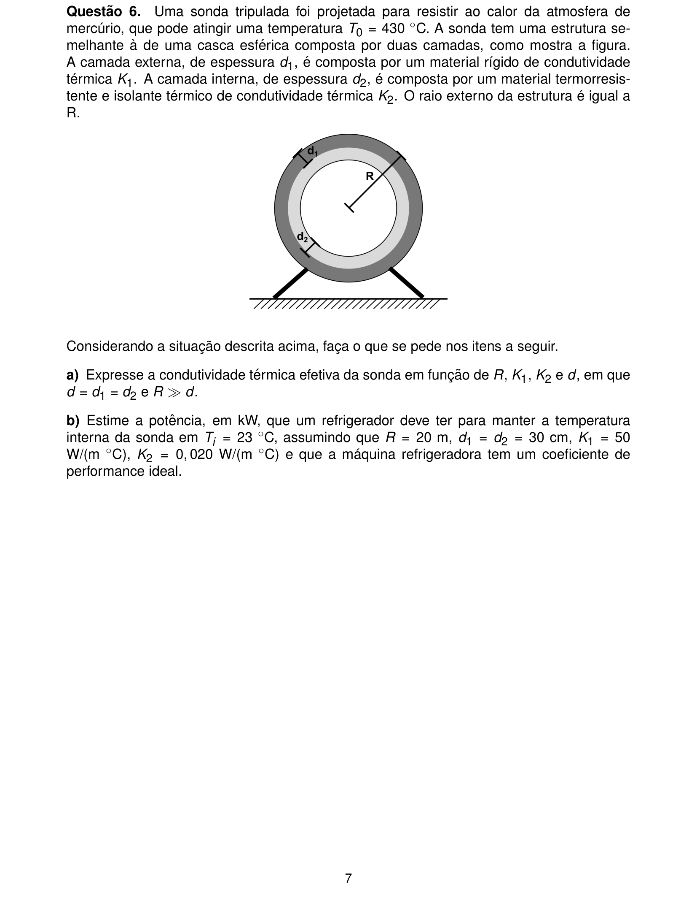
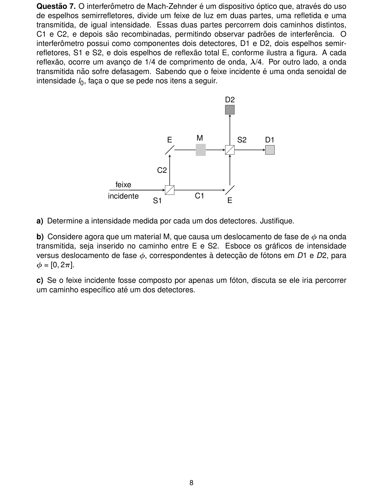
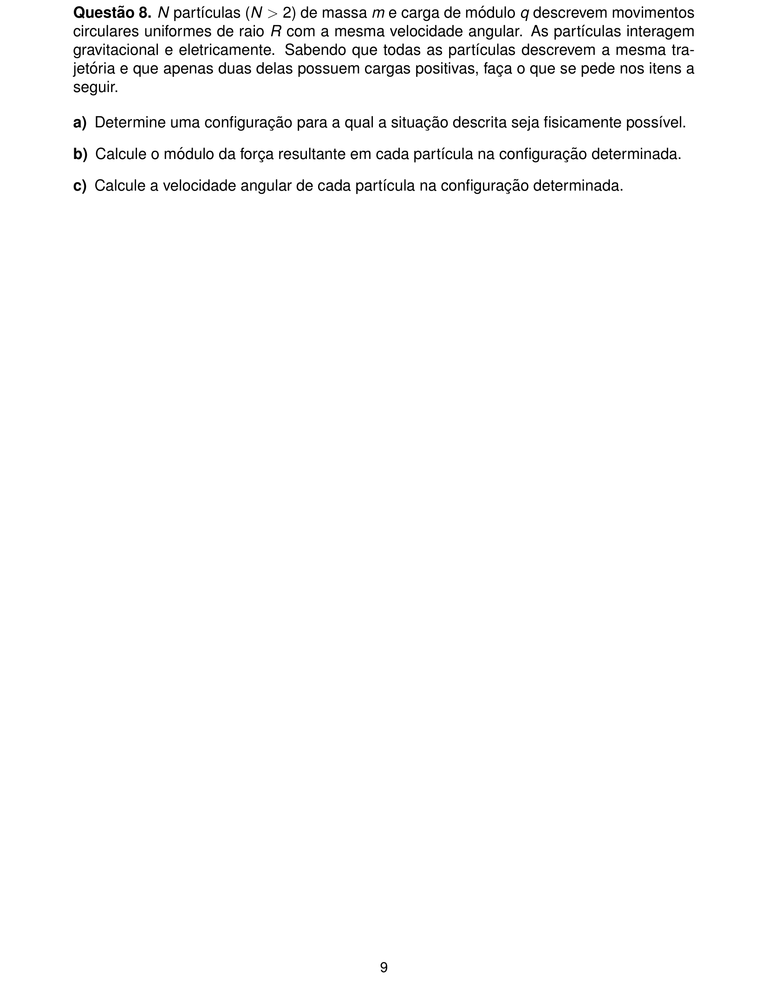
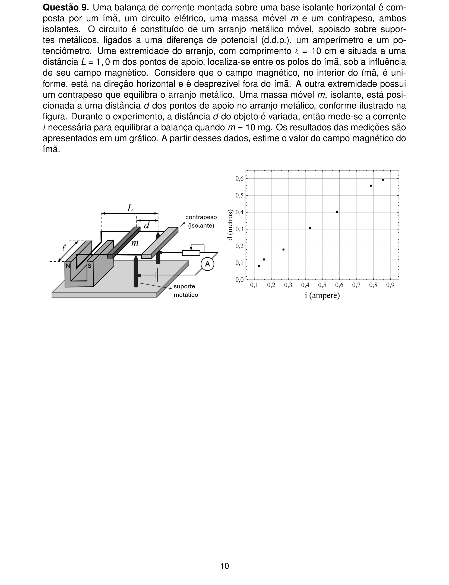
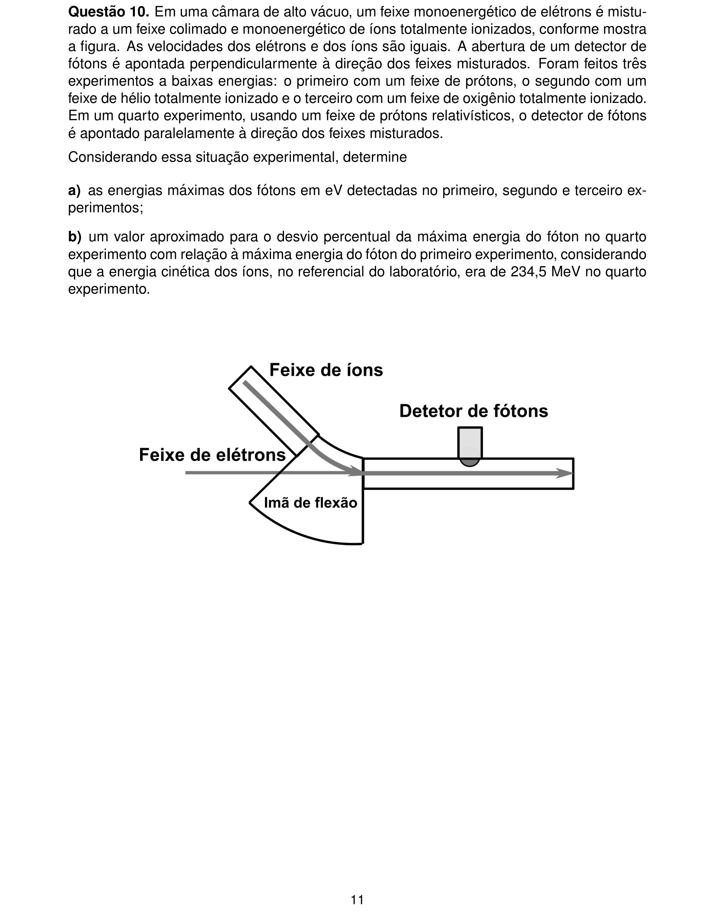

# Física — ITA 2025 (2ª fase)

> 10 questões discursivas.

## Q01
**Assunto:** eletromagnetismo
**Competências:** quantum de fluxo magnético, movimento circular de carga em campo B, fluxo magnético, relação entre h/c/e, dinâmica do elétron
**Tipo:** discursiva

## Q02
**Assunto:** estática
**Competências:** equilíbrio de corpo extenso, torque, relação de recorrência, somatório geométrico, tração em corda
**Tipo:** discursiva

## Q03
**Assunto:** dinâmica
**Competências:** plano inclinado, atrito cinético, sistema acelerado, segunda lei de Newton, cinemática do MUV
**Tipo:** discursiva

## Q04
**Assunto:** dinâmica
**Competências:** colisão bidimensional, conservação do momento linear, energia cinética, coeficiente de restituição, decomposição vetorial
**Tipo:** discursiva

## Q05
**Assunto:** gravitação
**Competências:** órbita circular, conservação de momento, hidrostática (empuxo), velocidade orbital, mecânica dos fluidos
**Tipo:** discursiva

## Q06
**Assunto:** termodinâmica
**Competências:** condução térmica em casca esférica, condutividade efetiva em série, ciclo de Carnot, coeficiente de performance, transferência de calor
**Tipo:** discursiva

## Q07
**Assunto:** óptica física
**Competências:** interferômetro de Mach-Zehnder, interferência, defasagem, dualidade onda-partícula, fóton único
**Tipo:** discursiva

## Q08
**Assunto:** eletrostática
**Competências:** força de Coulomb, força gravitacional, movimento circular uniforme, simetria de configuração, equilíbrio dinâmico
**Tipo:** discursiva

## Q09
**Assunto:** eletromagnetismo
**Competências:** balança de corrente, força magnética sobre condutor, equilíbrio de torques, análise gráfica i×d, estimativa do campo B
**Tipo:** discursiva

## Q10
**Assunto:** física moderna
**Competências:** efeito Compton, conservação de energia/momento relativístico, espalhamento fóton-elétron, espalhamento fóton-íon, energia cinética relativística
**Tipo:** discursiva

