# Física — ITA 2026 (1ª fase)

> 12 questões múltipla escolha (Q13–Q24 da prova consolidada MAT+FIS+QUI+ING).

## Q01
**Assunto:** eletromagnetismo / corrente elétrica
**Competências:** densidade de carga, fluxo de carga, corrente em feixe de elétrons (MEV)
**Tipo:** múltipla escolha

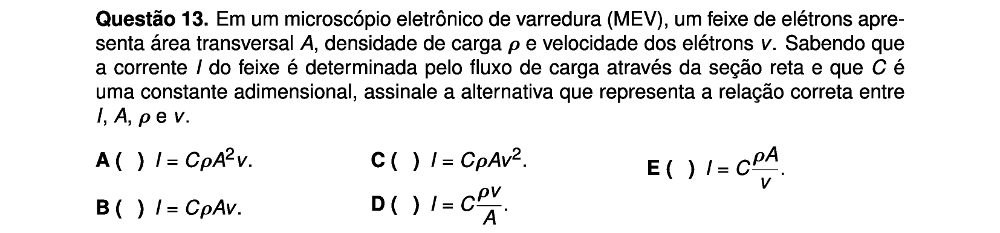

## Q02
**Assunto:** cinemática
**Competências:** queda livre, lançamento oblíquo, encontro de trajetórias
**Tipo:** múltipla escolha

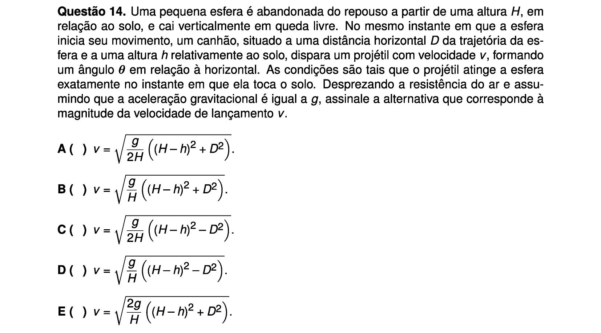

## Q03
**Assunto:** dinâmica / energia
**Competências:** lançamento vertical com resistência do ar, colisão com mola, energia dissipada
**Tipo:** múltipla escolha

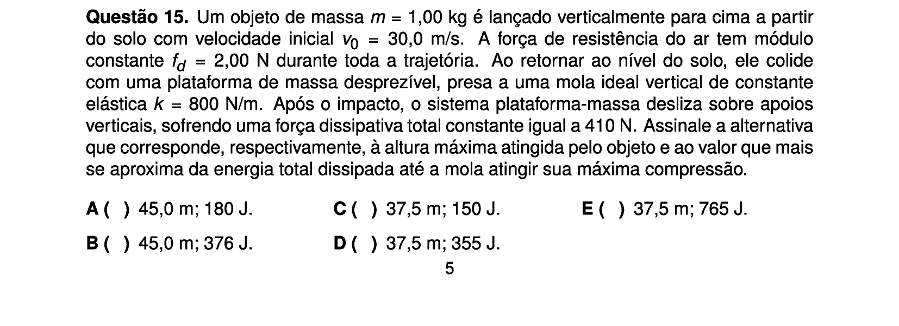

## Q04
**Assunto:** gravitação
**Competências:** força gravitacional entre múltiplos corpos, órbita circular, período de órbita
**Tipo:** múltipla escolha

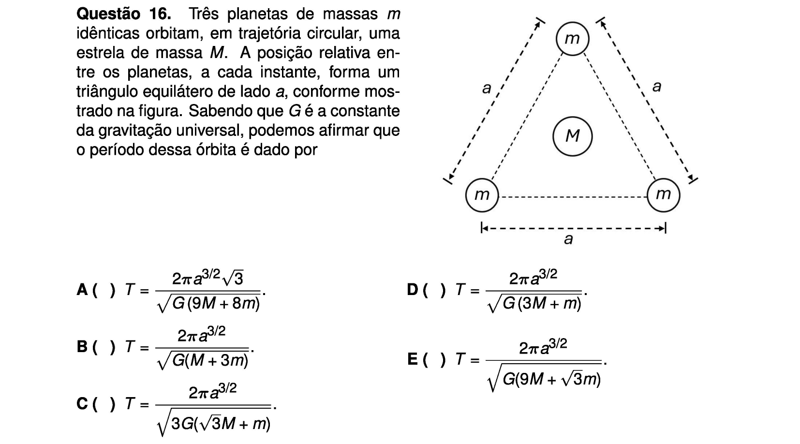

## Q05
**Assunto:** oscilações
**Competências:** pêndulo simples, sistema massa-mola, conservação de energia, colisão
**Tipo:** múltipla escolha

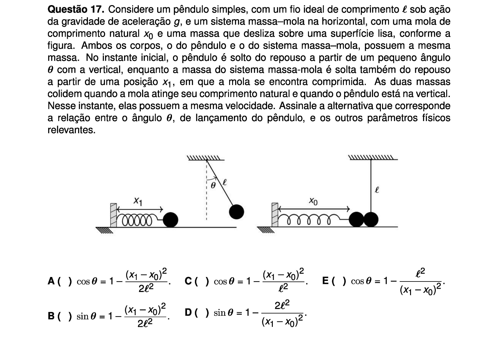

## Q06
**Assunto:** hidrostática
**Competências:** vasos comunicantes, equilíbrio de pressões, áreas diferentes
**Tipo:** múltipla escolha

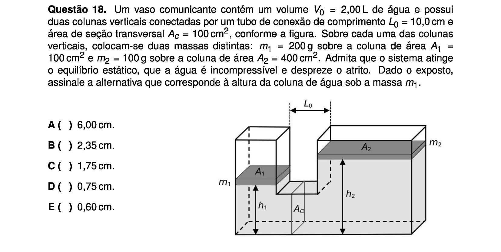

## Q07
**Assunto:** termodinâmica
**Competências:** ar-condicionado, máquinas térmicas, eficiência de Carnot, consumo energético
**Tipo:** múltipla escolha

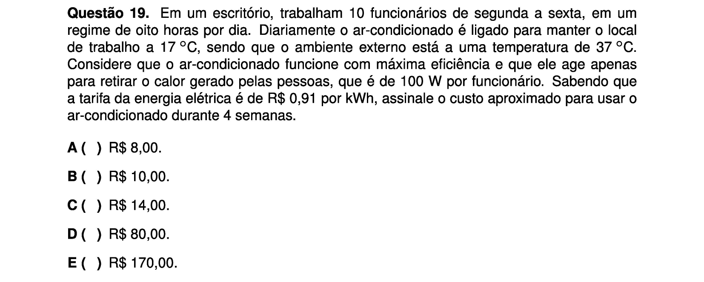

## Q08
**Assunto:** óptica
**Competências:** interferência em películas finas, índices de refração, comprimento de onda, espessura mínima
**Tipo:** múltipla escolha

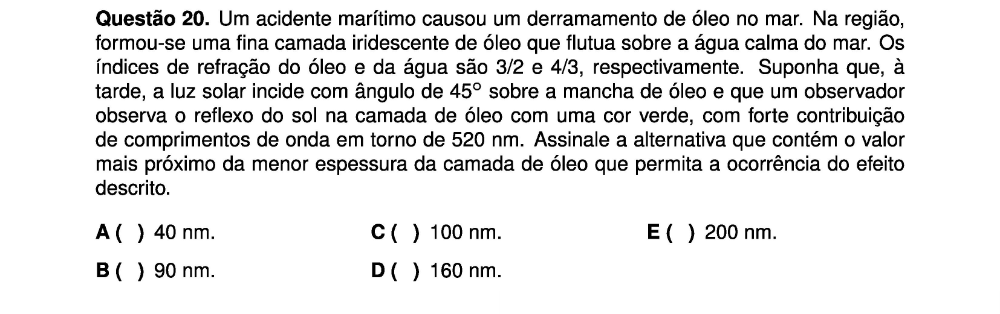

## Q09
**Assunto:** eletricidade / circuitos
**Competências:** potenciômetro, divisor de tensão, voltímetro, análise gráfica V vs R1/R2
**Tipo:** múltipla escolha

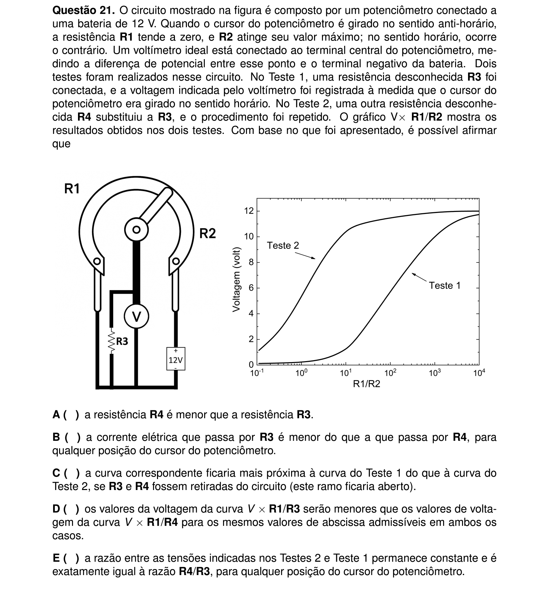

## Q10
**Assunto:** eletromagnetismo
**Competências:** indução eletromagnética, correntes de Foucault, queda de ímã em tubo condutor, asserções I-V
**Tipo:** múltipla escolha (asserções I-V)

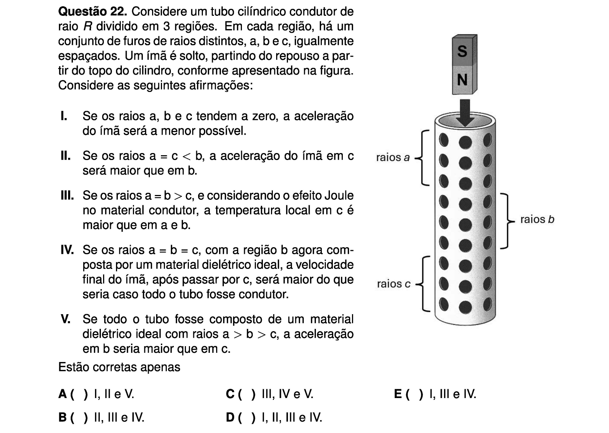

## Q11
**Assunto:** ondas / acústica
**Competências:** efeito Doppler em ultrassom médico, fluxo sanguíneo, Bernoulli, diferença de pressão
**Tipo:** múltipla escolha

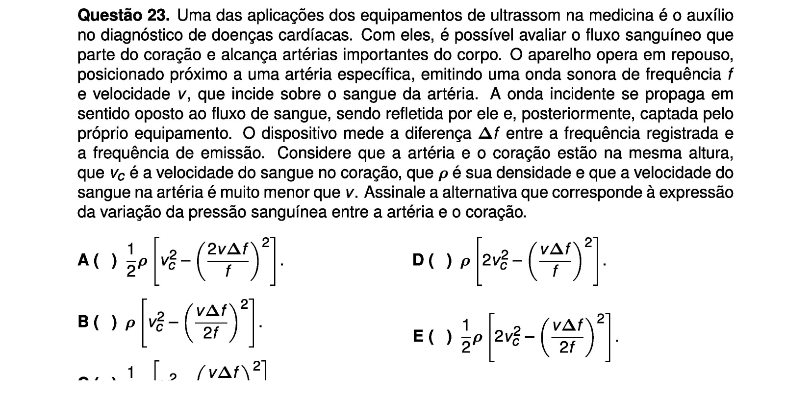

## Q12
**Assunto:** física moderna
**Competências:** efeito fotoelétrico, dupla fenda, gráficos I × V, intensidade e comprimento de onda
**Tipo:** múltipla escolha

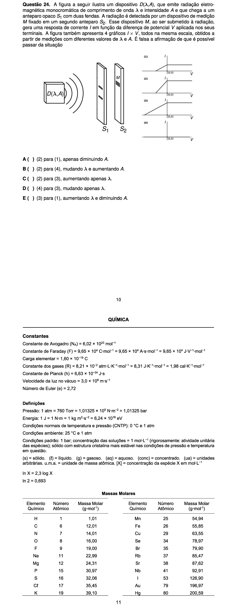
