# Inglês — ITA 2009

> 20 questões múltipla escolha.

## Q01
**Assunto:** leitura e interpretação
**Competências:** main idea, detail
**Tipo:** múltipla escolha

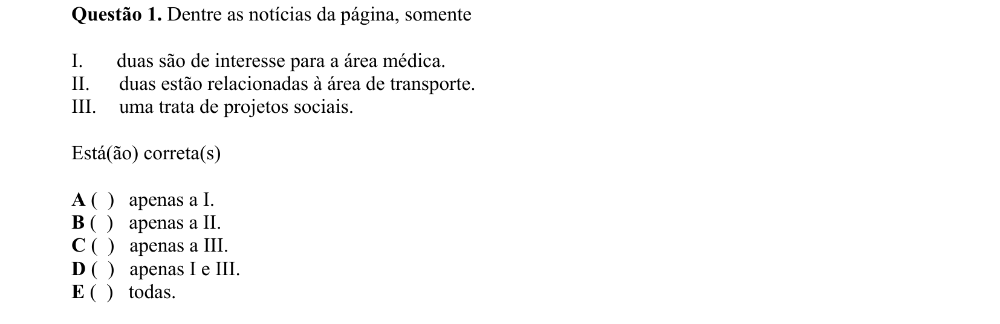

## Q02
**Assunto:** leitura e interpretação
**Competências:** detail, vocabulary in context
**Tipo:** múltipla escolha

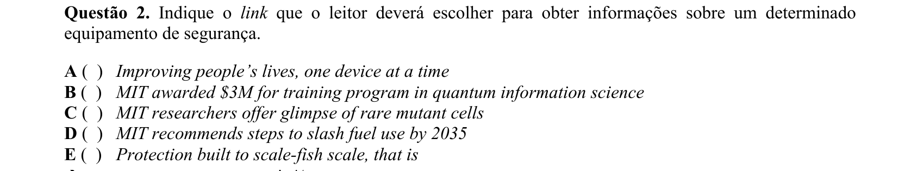

## Q03
**Assunto:** leitura e interpretação
**Competências:** detail, inference
**Tipo:** múltipla escolha

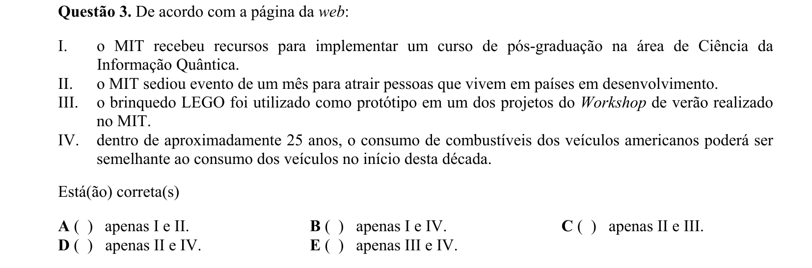

## Q04
**Assunto:** leitura e interpretação
**Competências:** main idea, detail
**Tipo:** múltipla escolha

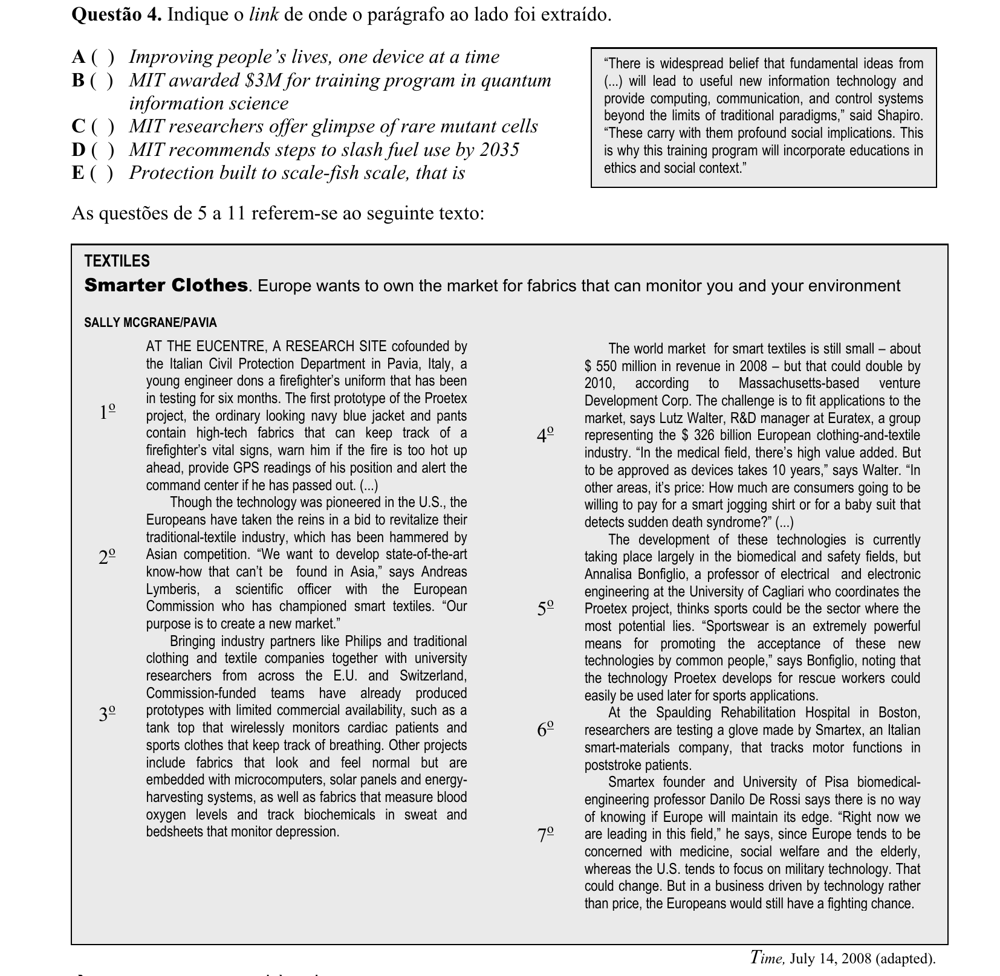

## Q05
**Assunto:** leitura e interpretação
**Competências:** main idea, purpose/tone
**Tipo:** múltipla escolha

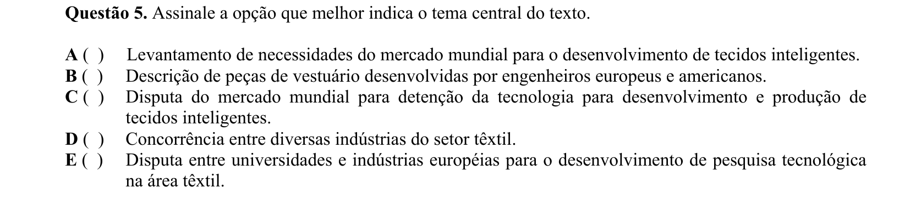

## Q06
**Assunto:** leitura e interpretação
**Competências:** detail, inference
**Tipo:** múltipla escolha

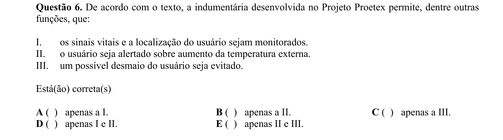

## Q07
**Assunto:** leitura e interpretação
**Competências:** detail, inference
**Tipo:** múltipla escolha

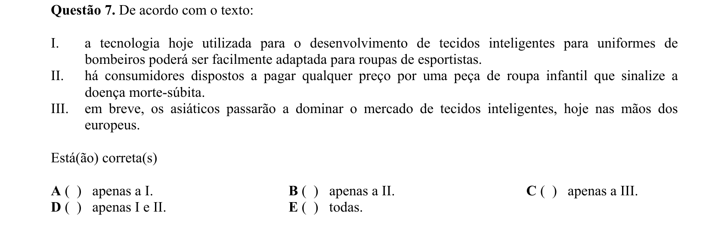

## Q08
**Assunto:** vocabulário
**Competências:** synonyms, vocabulary in context
**Tipo:** múltipla escolha

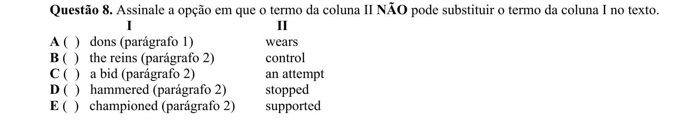

## Q09
**Assunto:** leitura e interpretação
**Competências:** detail, inference
**Tipo:** múltipla escolha

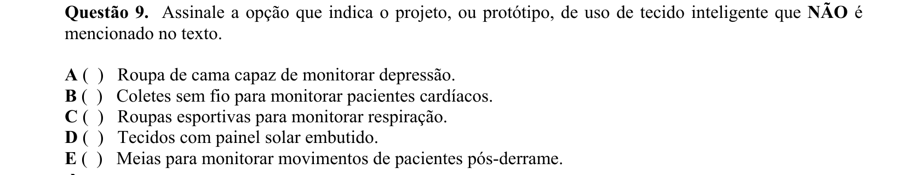

## Q10
**Assunto:** leitura e interpretação
**Competências:** detail, inference
**Tipo:** múltipla escolha

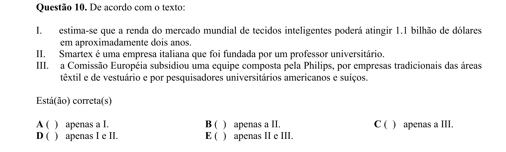

## Q11
**Assunto:** gramática
**Competências:** passive voice
**Tipo:** múltipla escolha

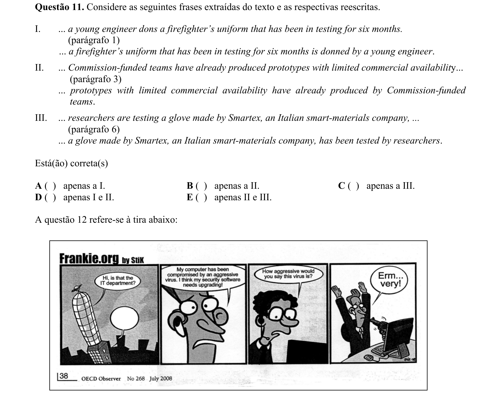

## Q12
**Assunto:** leitura e interpretação
**Competências:** inference, purpose/tone
**Tipo:** múltipla escolha

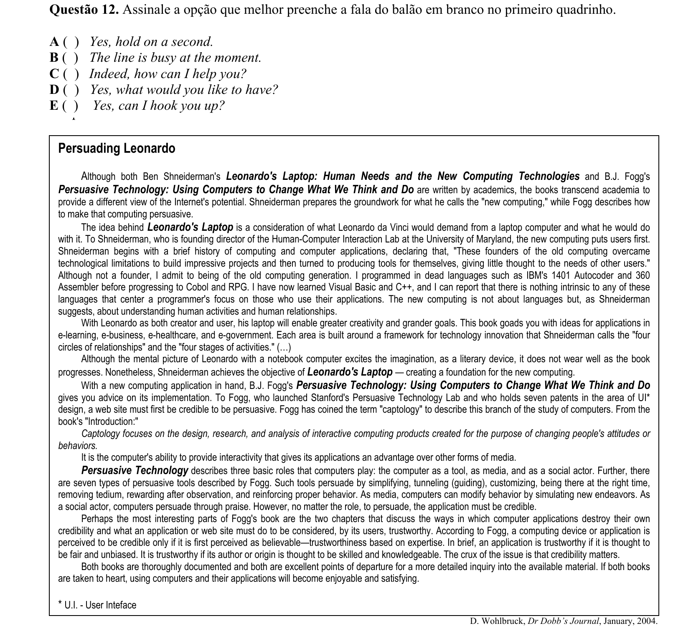

## Q13
**Assunto:** vocabulário
**Competências:** vocabulary in context
**Tipo:** múltipla escolha

## Q14
**Assunto:** leitura e interpretação
**Competências:** main idea, detail
**Tipo:** múltipla escolha

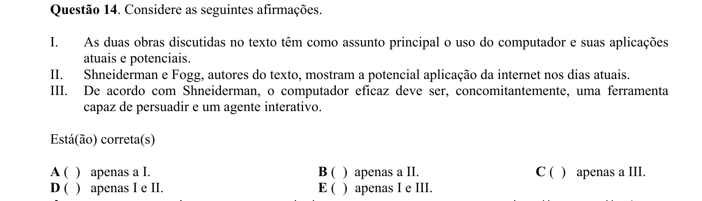

## Q15
**Assunto:** leitura e interpretação
**Competências:** detail, inference
**Tipo:** múltipla escolha

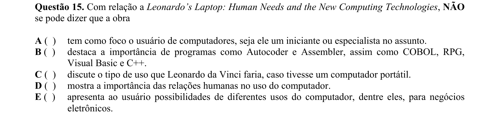

## Q16
**Assunto:** leitura e interpretação
**Competências:** main idea, detail
**Tipo:** múltipla escolha

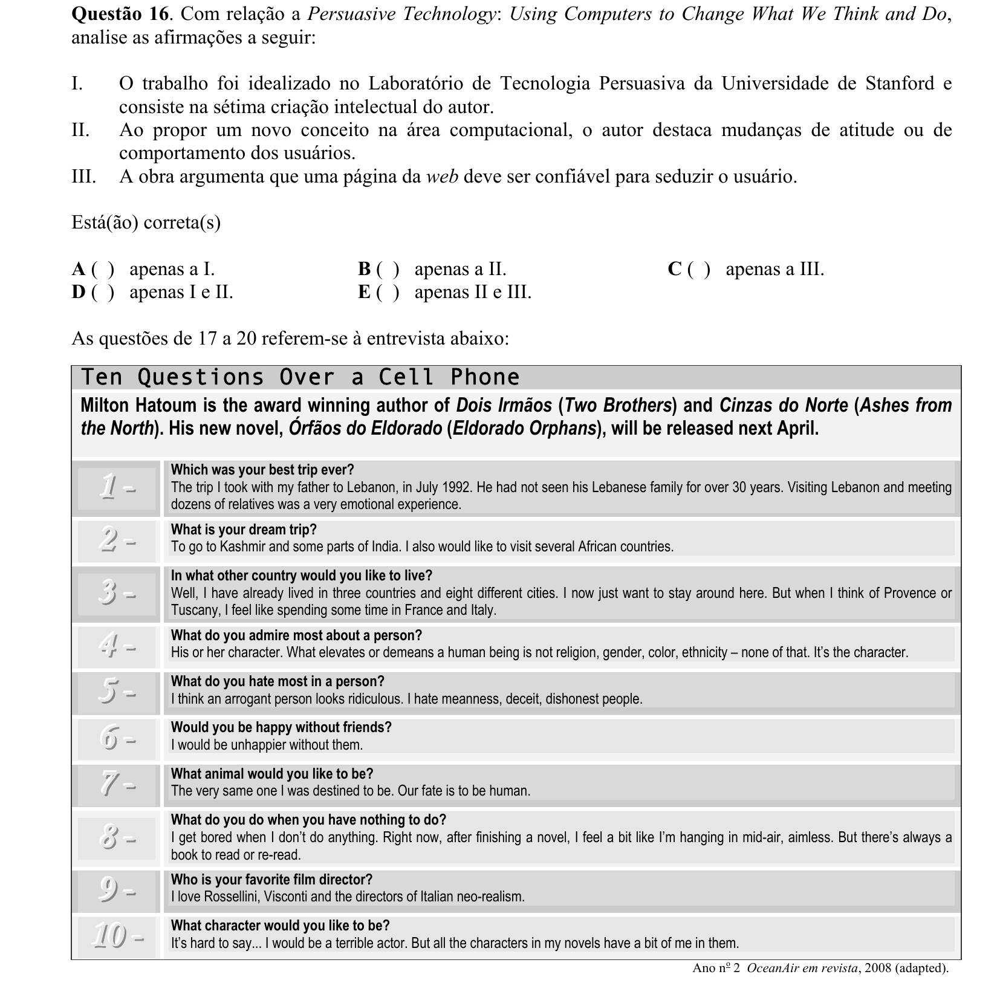

## Q17
**Assunto:** leitura e interpretação
**Competências:** detail, inference
**Tipo:** múltipla escolha

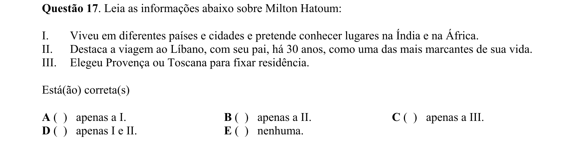

## Q18
**Assunto:** leitura e interpretação
**Competências:** detail, inference
**Tipo:** múltipla escolha

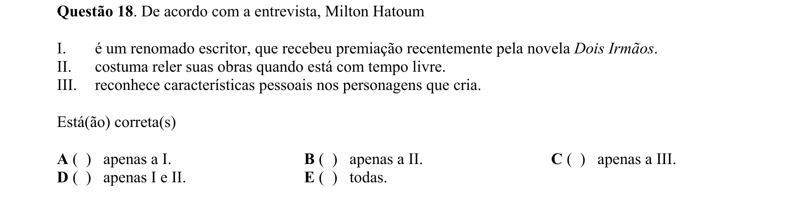

## Q19
**Assunto:** vocabulário
**Competências:** vocabulary in context, synonyms
**Tipo:** múltipla escolha

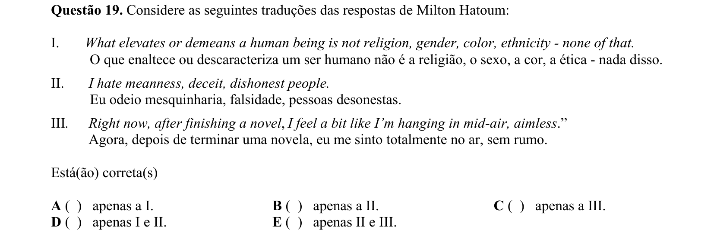

## Q20
**Assunto:** leitura e interpretação
**Competências:** inference, reference (pronouns)
**Tipo:** múltipla escolha

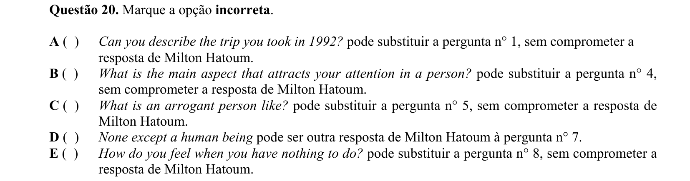
