# Inglês — ITA 2010

> 20 questões múltipla escolha.

## Q01
**Assunto:** leitura e interpretação
**Competências:** detail, scanning
**Tipo:** múltipla escolha

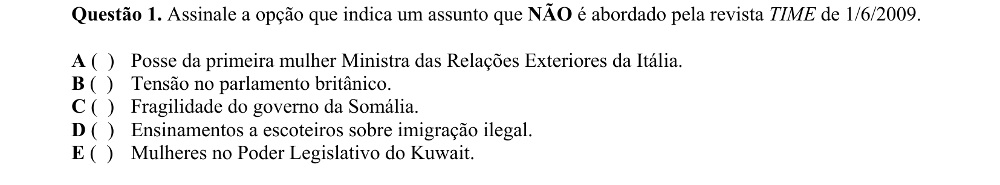

## Q02
**Assunto:** leitura e interpretação
**Competências:** detail, scanning
**Tipo:** múltipla escolha

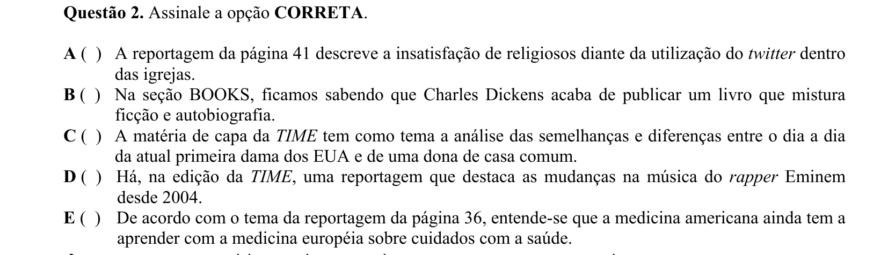

## Q03
**Assunto:** vocabulário
**Competências:** translation, vocabulary in context
**Tipo:** múltipla escolha

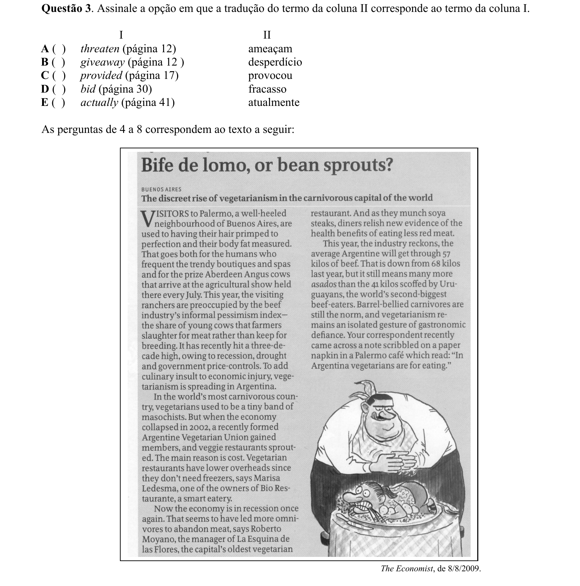

## Q04
**Assunto:** leitura e interpretação
**Competências:** detail, inference
**Tipo:** múltipla escolha

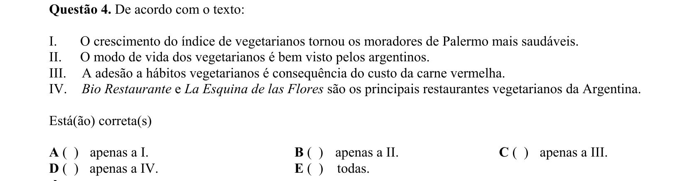

## Q05
**Assunto:** leitura e interpretação
**Competências:** detail, inference
**Tipo:** múltipla escolha

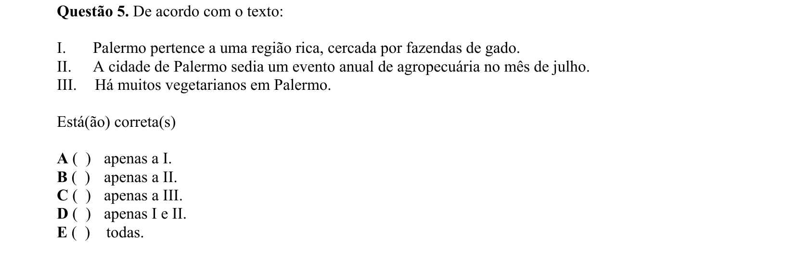

## Q06
**Assunto:** leitura e interpretação
**Competências:** detail, inference
**Tipo:** múltipla escolha

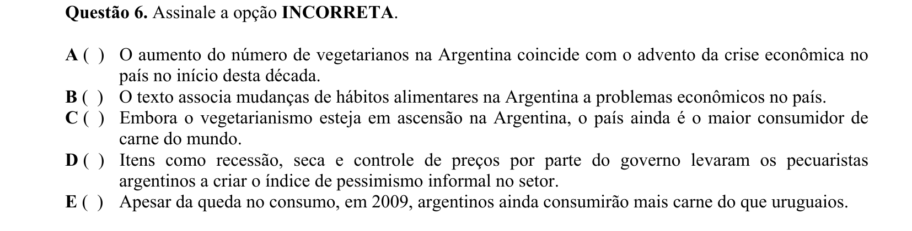

## Q07
**Assunto:** vocabulário
**Competências:** synonyms, vocabulary in context
**Tipo:** múltipla escolha

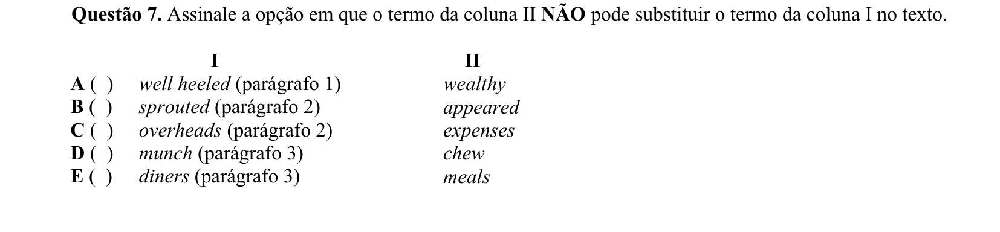

## Q08
**Assunto:** gramática
**Competências:** conjunctions, connectives
**Tipo:** múltipla escolha

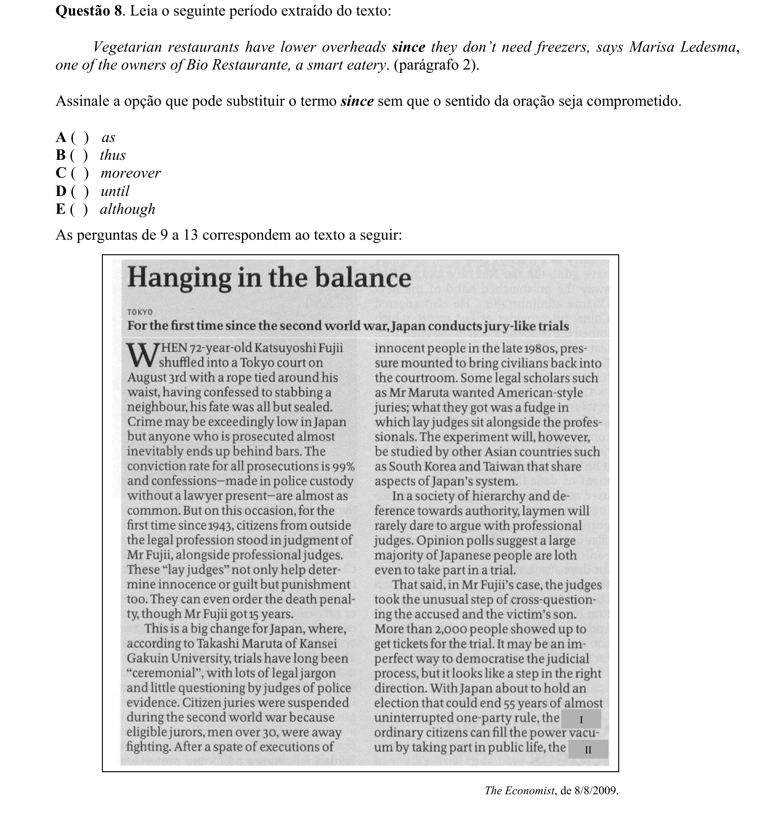

## Q09
**Assunto:** gramática
**Competências:** comparatives, superlatives
**Tipo:** múltipla escolha

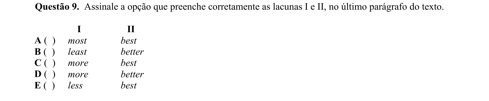

## Q10
**Assunto:** leitura e interpretação
**Competências:** translation, detail
**Tipo:** múltipla escolha

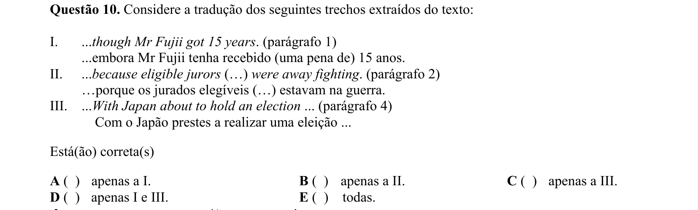

## Q11
**Assunto:** leitura e interpretação
**Competências:** detail, inference
**Tipo:** múltipla escolha

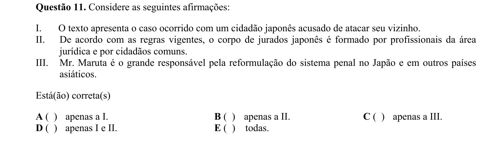

## Q12
**Assunto:** leitura e interpretação
**Competências:** detail, inference
**Tipo:** múltipla escolha

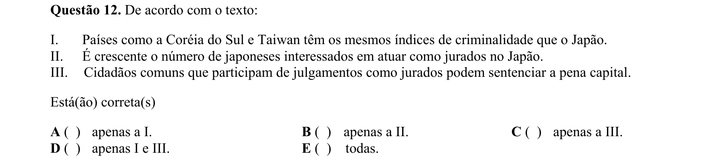

## Q13
**Assunto:** leitura e interpretação
**Competências:** detail, inference
**Tipo:** múltipla escolha

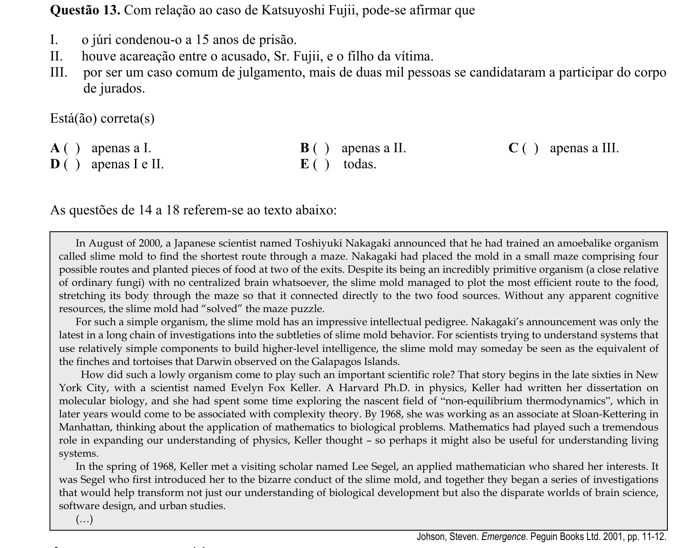

## Q14
**Assunto:** leitura e interpretação
**Competências:** main idea, detail
**Tipo:** múltipla escolha

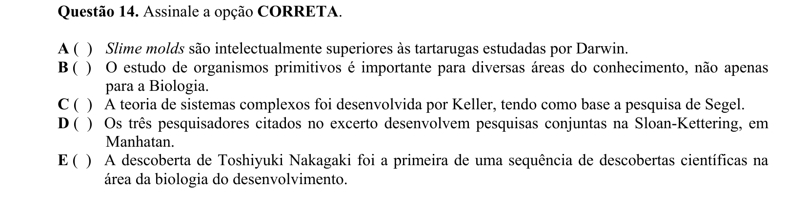

## Q15
**Assunto:** leitura e interpretação
**Competências:** detail, inference
**Tipo:** múltipla escolha

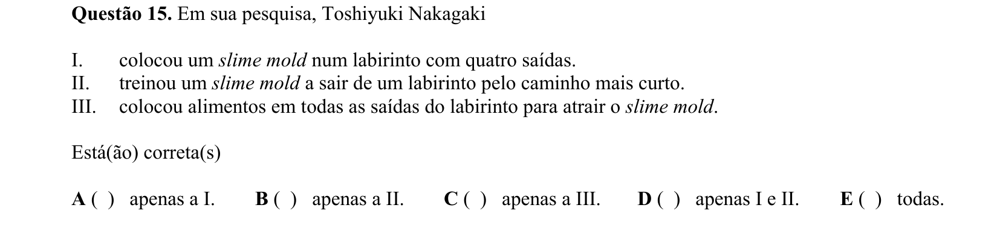

## Q16
**Assunto:** leitura e interpretação
**Competências:** detail, inference
**Tipo:** múltipla escolha

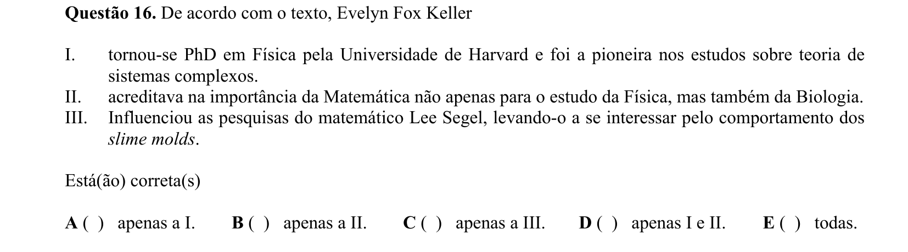

## Q17
**Assunto:** leitura e interpretação
**Competências:** detail, scanning
**Tipo:** múltipla escolha

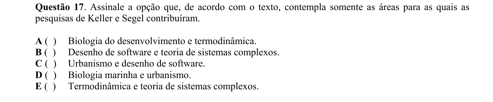

## Q18
**Assunto:** gramática
**Competências:** paraphrase, connectives, concession
**Tipo:** múltipla escolha

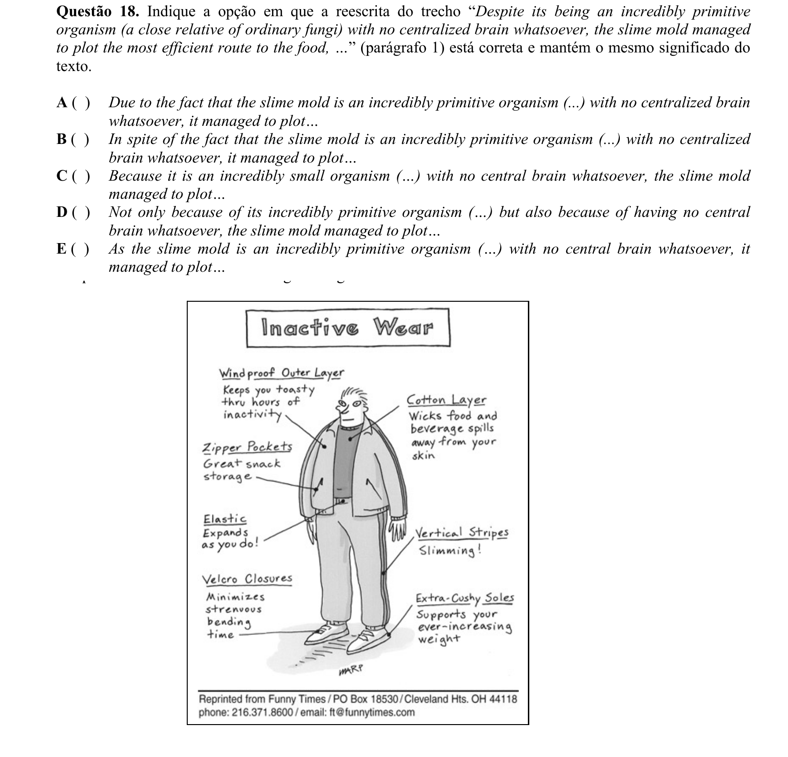

## Q19
**Assunto:** leitura e interpretação
**Competências:** detail, visual interpretation
**Tipo:** múltipla escolha

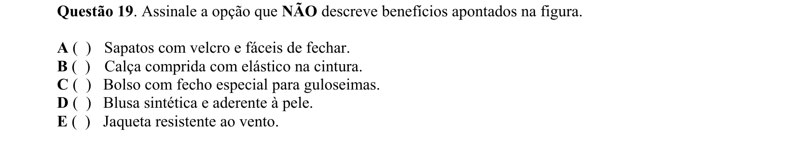

## Q20
**Assunto:** leitura e interpretação
**Competências:** detail, visual interpretation, inference
**Tipo:** múltipla escolha

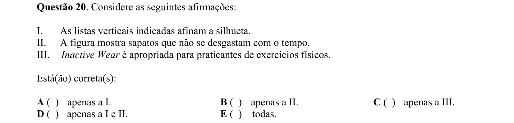
