# Inglês — ITA 2011

> 20 questões múltipla escolha.

## Q01
**Assunto:** leitura e interpretação
**Competências:** identificação de tese, justificativa de título, compreensão global
**Tipo:** múltipla escolha

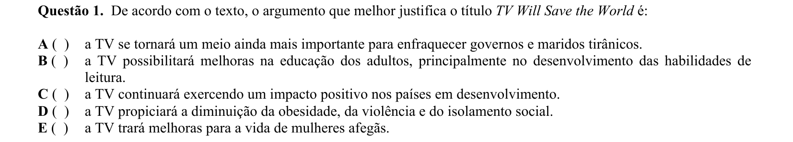

## Q02
**Assunto:** leitura e interpretação
**Competências:** compreensão de detalhes, dados específicos, inferência
**Tipo:** múltipla escolha

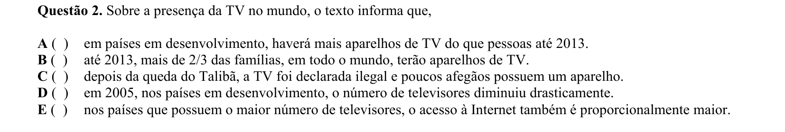

## Q03
**Assunto:** leitura e interpretação
**Competências:** compreensão de detalhes, impacto social, inferência
**Tipo:** múltipla escolha

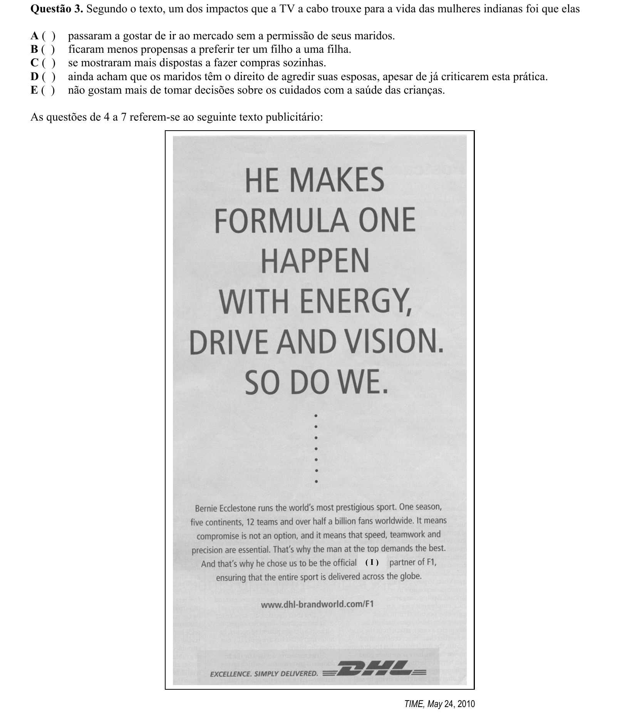

## Q04
**Assunto:** leitura e interpretação
**Competências:** anúncio publicitário, identificação de serviço, preenchimento de lacuna
**Tipo:** múltipla escolha

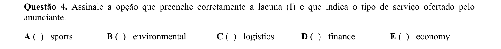

## Q05
**Assunto:** leitura e interpretação
**Competências:** identificação de características, exclusão, compreensão de anúncio
**Tipo:** múltipla escolha

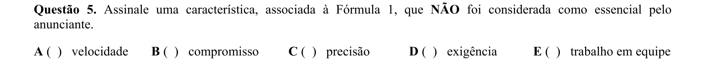

## Q06
**Assunto:** vocabulário
**Competências:** sinônimos, função gramatical, polissemia
**Tipo:** múltipla escolha

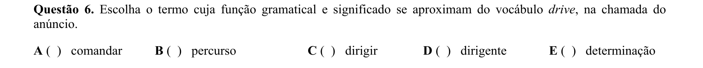

## Q07
**Assunto:** leitura e interpretação
**Competências:** identificação de informação explícita, compreensão de detalhes
**Tipo:** múltipla escolha

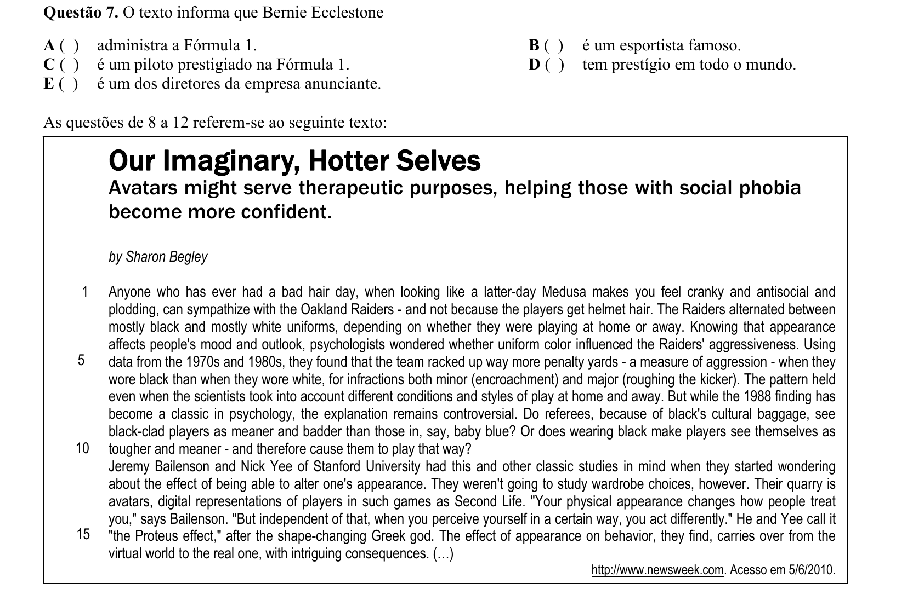

## Q08
**Assunto:** leitura e interpretação
**Competências:** compreensão de título e subtítulo, ideia central
**Tipo:** múltipla escolha

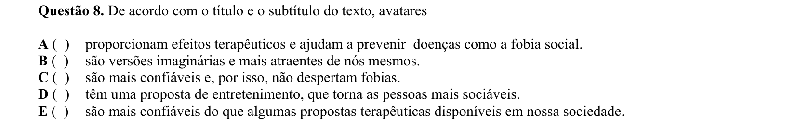

## Q09
**Assunto:** leitura e interpretação
**Competências:** compreensão global, identificação de afirmação correta, inferência
**Tipo:** múltipla escolha

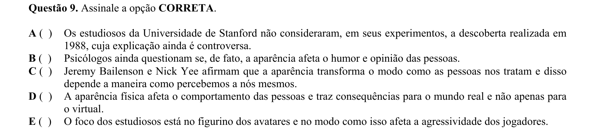

## Q10
**Assunto:** gramática
**Competências:** referência pronominal, coesão, identificação de referente
**Tipo:** múltipla escolha

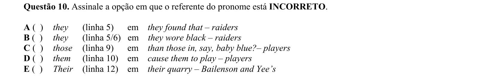

## Q11
**Assunto:** leitura e interpretação
**Competências:** valor semântico, exemplificação vs. explicação, coesão textual
**Tipo:** múltipla escolha

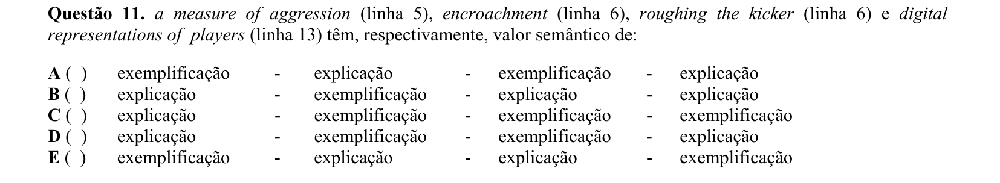

## Q12
**Assunto:** gramática
**Competências:** função gramatical de -ing, gerúndio, particípio
**Tipo:** múltipla escolha

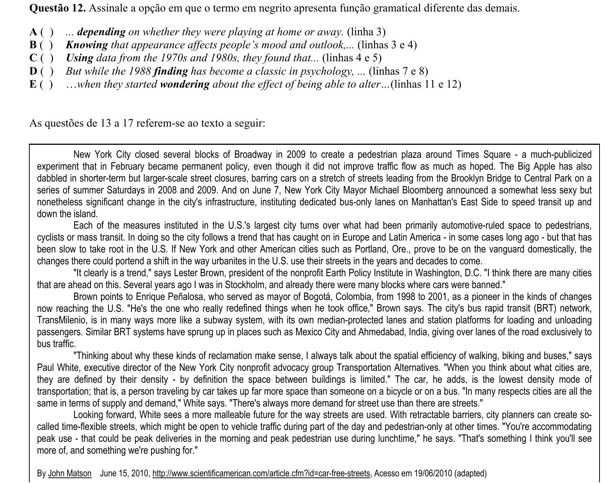

## Q13
**Assunto:** leitura e interpretação
**Competências:** identificação de título, tema central, síntese
**Tipo:** múltipla escolha

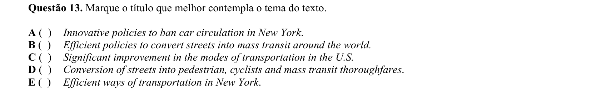

## Q14
**Assunto:** leitura e interpretação
**Competências:** identificação de afirmação correta, compreensão de detalhes
**Tipo:** múltipla escolha

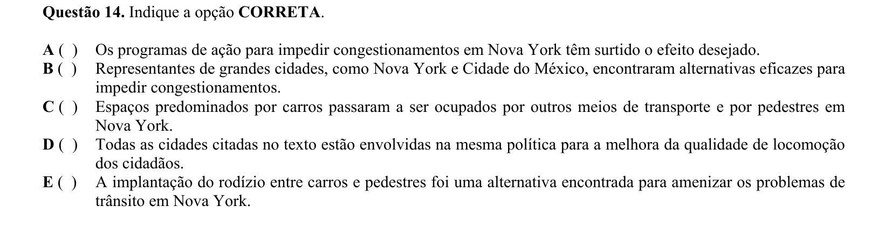

## Q15
**Assunto:** leitura e interpretação
**Competências:** compreensão de detalhes, dados específicos, inferência
**Tipo:** múltipla escolha

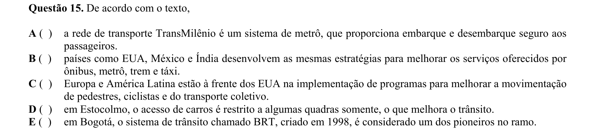

## Q16
**Assunto:** leitura e interpretação
**Competências:** compreensão de detalhes, identificação de informações específicas
**Tipo:** múltipla escolha

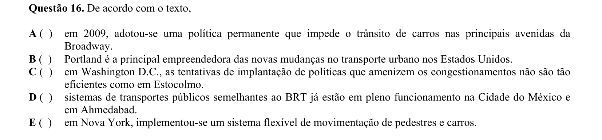

## Q17
**Assunto:** gramática
**Competências:** conjunções, conectivos, relações lógicas (concessão e contraste)
**Tipo:** múltipla escolha

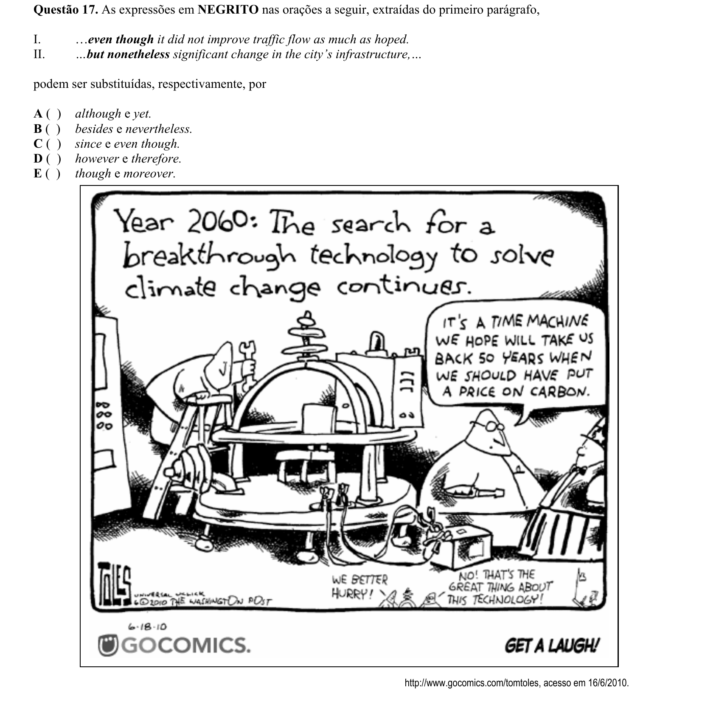

## Q18
**Assunto:** vocabulário
**Competências:** sinônimos, significado contextual
**Tipo:** múltipla escolha

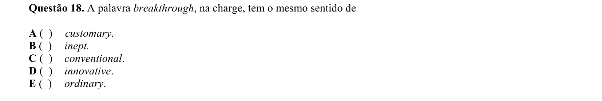

## Q19
**Assunto:** leitura e interpretação
**Competências:** interpretação de charge, mensagem implícita, exclusão
**Tipo:** múltipla escolha

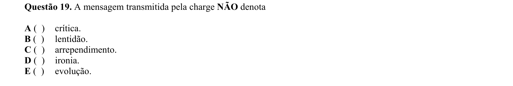

## Q20
**Assunto:** leitura e interpretação
**Competências:** ideia central, interpretação de provérbio, síntese
**Tipo:** múltipla escolha

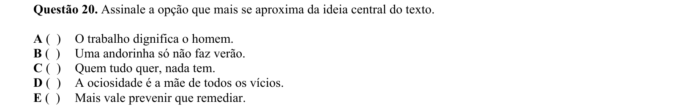
