# Inglês — ITA 2012

> 20 questões múltipla escolha.

## Q01
**Assunto:** gramática
**Competências:** sufixação, formação de palavras, advérbios
**Tipo:** múltipla escolha

## Q02
**Assunto:** vocabulário
**Competências:** definição contextual, significado de palavra, empathy
**Tipo:** múltipla escolha

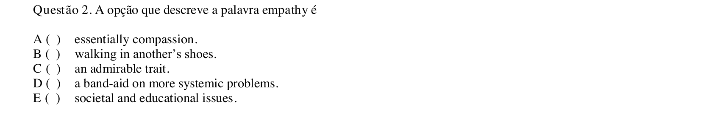

## Q03
**Assunto:** leitura e interpretação
**Competências:** compreensão de detalhes, inferência, identificação de afirmação correta
**Tipo:** múltipla escolha

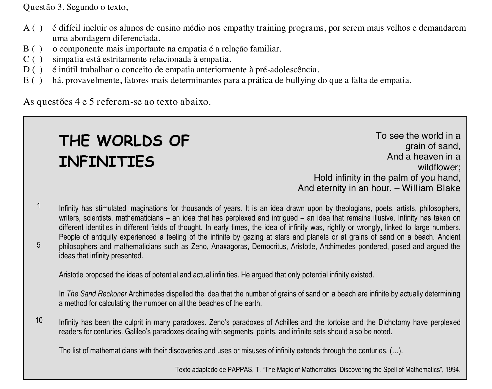

## Q04
**Assunto:** leitura e interpretação
**Competências:** ideia central, compreensão global, identificação de afirmação correta
**Tipo:** múltipla escolha

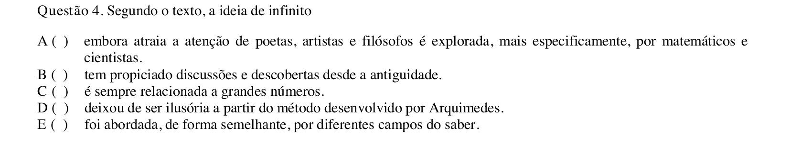

## Q05
**Assunto:** leitura e interpretação
**Competências:** identificação de informação explícita, paradoxos, compreensão de detalhes
**Tipo:** múltipla escolha

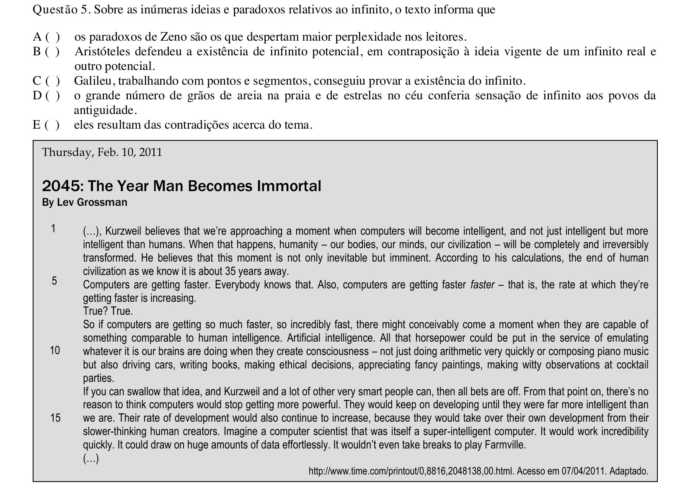

## Q06
**Assunto:** leitura e interpretação
**Competências:** compreensão de detalhes, inferência, identificação de afirmação correta
**Tipo:** múltipla escolha

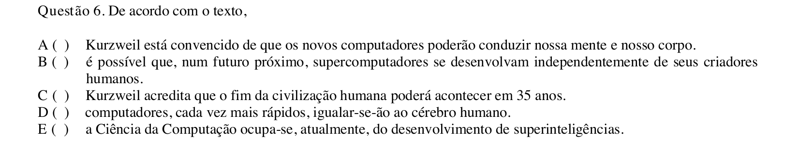

## Q07
**Assunto:** gramática
**Competências:** referência pronominal, coesão, identificação de referente
**Tipo:** múltipla escolha

## Q08
**Assunto:** vocabulário
**Competências:** sinônimos, significado contextual, intensificador
**Tipo:** múltipla escolha

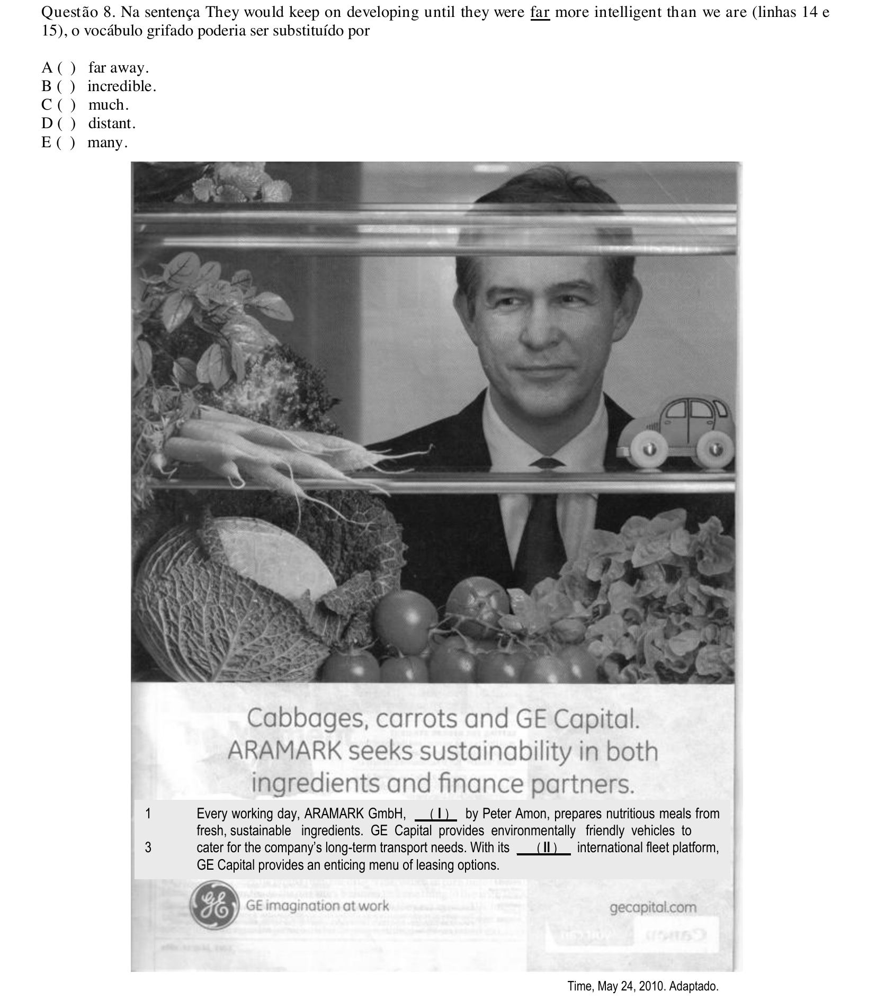

## Q09
**Assunto:** gramática
**Competências:** preenchimento de lacuna, formas verbais, particípio e gerúndio
**Tipo:** múltipla escolha

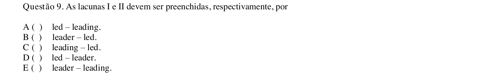

## Q10
**Assunto:** leitura e interpretação
**Competências:** anúncio publicitário, relação texto-imagem, compreensão global
**Tipo:** múltipla escolha

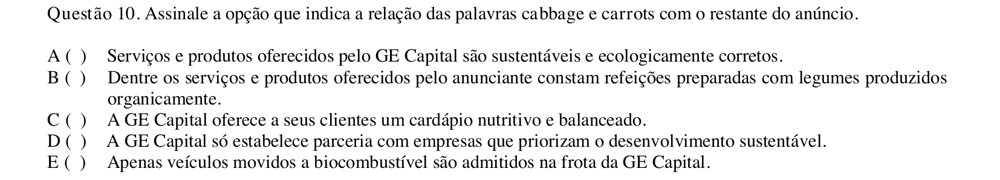

## Q11
**Assunto:** leitura e interpretação
**Competências:** tradução, compreensão de expressão, significado contextual
**Tipo:** múltipla escolha

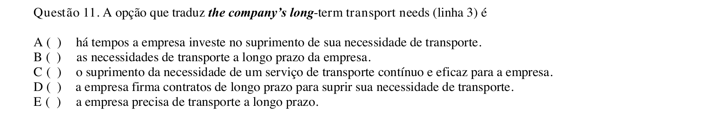

## Q12
**Assunto:** leitura e interpretação
**Competências:** identificação de serviço, compreensão de anúncio, ideia central
**Tipo:** múltipla escolha

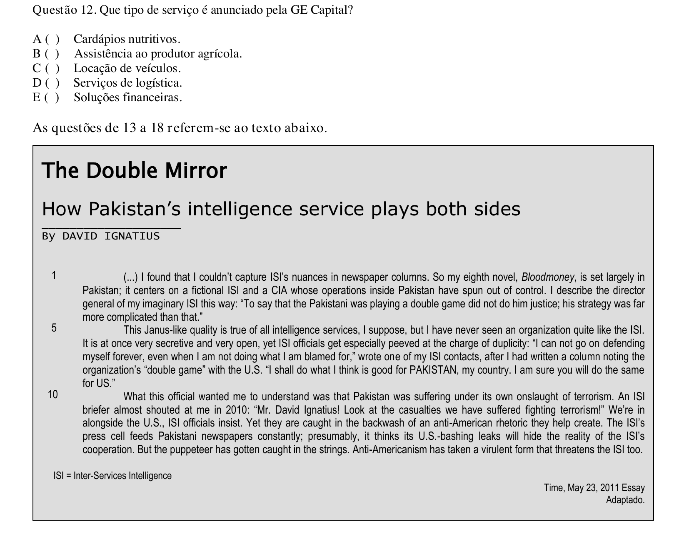

## Q13
**Assunto:** leitura e interpretação
**Competências:** identificação de afirmação correta, compreensão de detalhes, inferência
**Tipo:** múltipla escolha

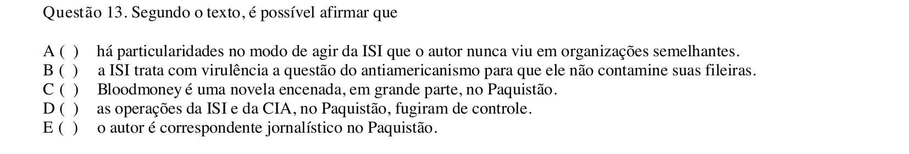

## Q14
**Assunto:** leitura e interpretação
**Competências:** caracterização, síntese, compreensão global
**Tipo:** múltipla escolha

## Q15
**Assunto:** vocabulário
**Competências:** sinônimos, significado contextual, peeved
**Tipo:** múltipla escolha

## Q16
**Assunto:** vocabulário
**Competências:** sinônimos, significado contextual, substituição lexical
**Tipo:** múltipla escolha

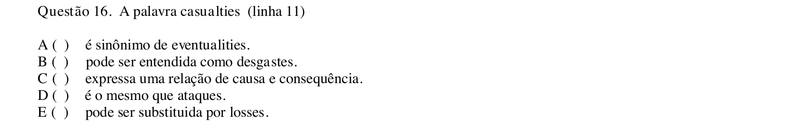

## Q17
**Assunto:** leitura e interpretação
**Competências:** inferência, interpretação de sentença, sentido implícito
**Tipo:** múltipla escolha

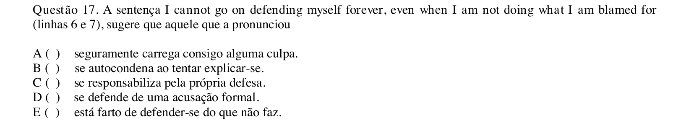

## Q18
**Assunto:** vocabulário
**Competências:** expressões idiomáticas, provérbios, equivalência semântica
**Tipo:** múltipla escolha

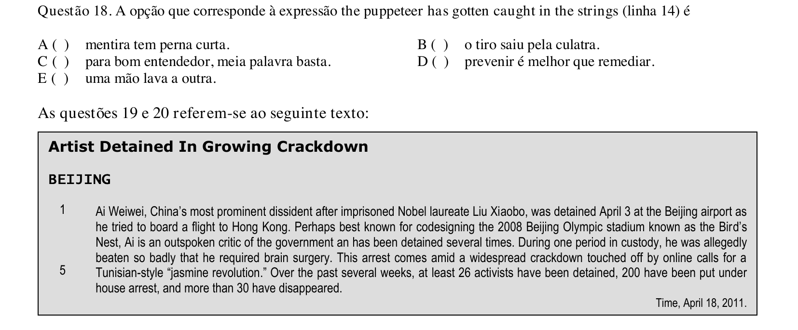

## Q19
**Assunto:** leitura e interpretação
**Competências:** compreensão de detalhes, identificação de afirmação correta, inferência
**Tipo:** múltipla escolha

## Q20
**Assunto:** leitura e interpretação
**Competências:** compreensão de detalhes, identificação de afirmação correta, inferência
**Tipo:** múltipla escolha

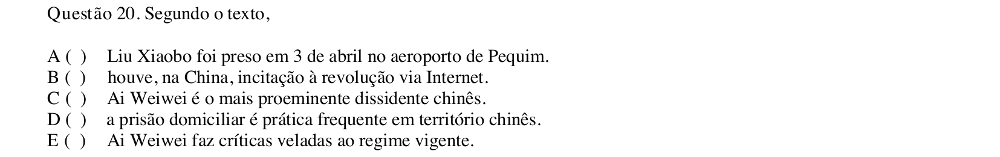
