# Inglês — ITA 2013

> 20 questões múltipla escolha.

## Q01
**Assunto:** leitura e interpretação
**Competências:** tirinha, interpretação contextual, significado de expressão
**Tipo:** múltipla escolha

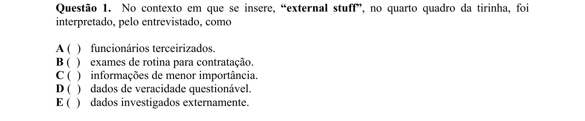

## Q02
**Assunto:** leitura e interpretação
**Competências:** tirinha, compreensão global, identificação de afirmação correta
**Tipo:** múltipla escolha

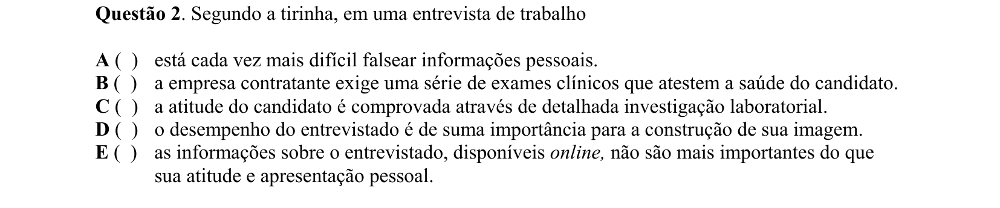

## Q03
**Assunto:** leitura e interpretação
**Competências:** tirinha, referência contextual, significado de expressão
**Tipo:** múltipla escolha

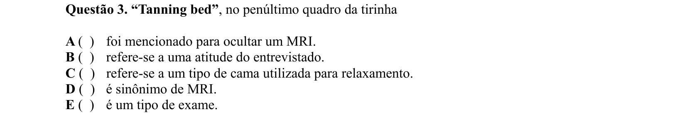

## Q04
**Assunto:** vocabulário
**Competências:** sinônimos, significado contextual, substituição lexical
**Tipo:** múltipla escolha

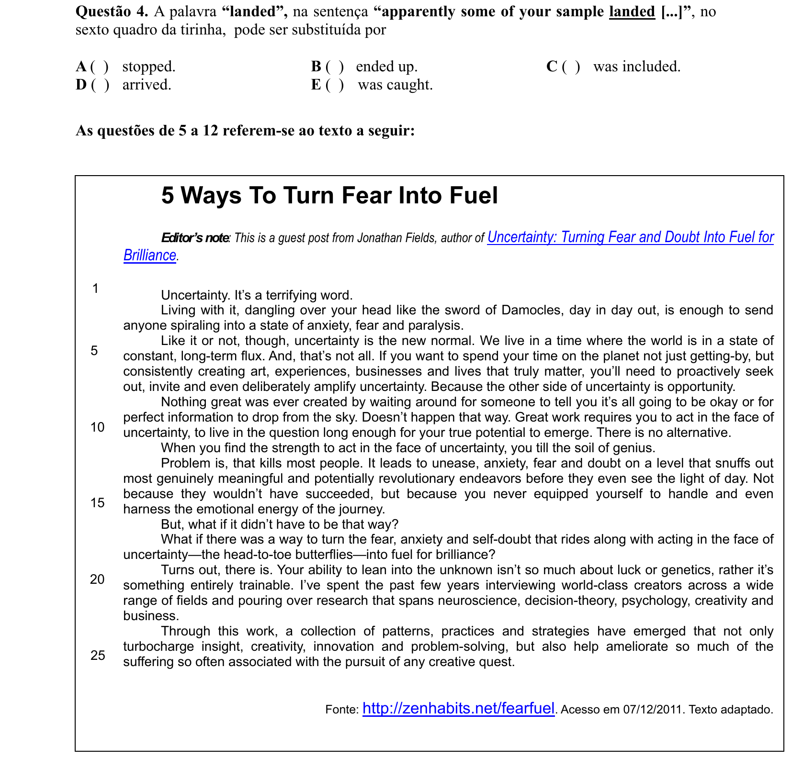

## Q05
**Assunto:** leitura e interpretação
**Competências:** ideia central, compreensão global, identificação de afirmação correta
**Tipo:** múltipla escolha

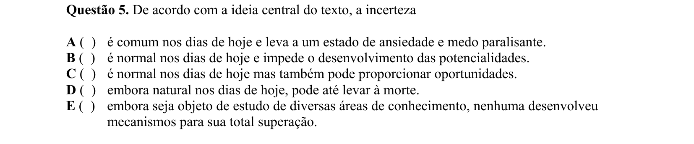

## Q06
**Assunto:** vocabulário
**Competências:** sinônimos, significado contextual, polissemia
**Tipo:** múltipla escolha

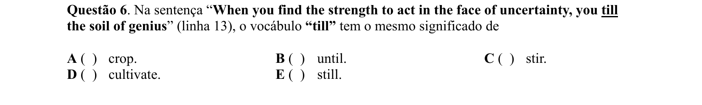

## Q07
**Assunto:** gramática
**Competências:** pronome relativo, referência, coesão textual
**Tipo:** múltipla escolha

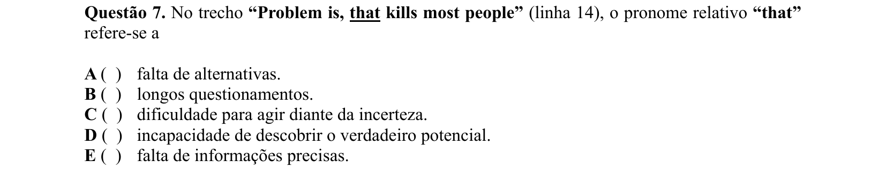

## Q08
**Assunto:** leitura e interpretação
**Competências:** paráfrase, equivalência semântica, compreensão de sentença
**Tipo:** múltipla escolha

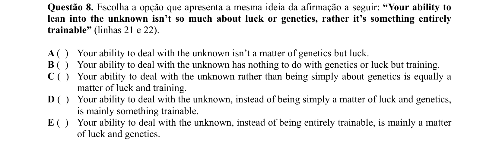

## Q09
**Assunto:** vocabulário
**Competências:** expressões idiomáticas, significado contextual, head-to-toe butterflies
**Tipo:** múltipla escolha

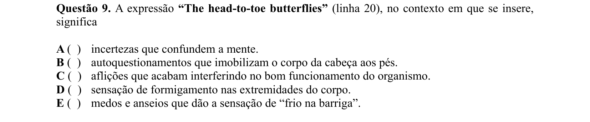

## Q10
**Assunto:** leitura e interpretação
**Competências:** compreensão de detalhes, vocabulário contextual, identificação de afirmação correta
**Tipo:** múltipla escolha

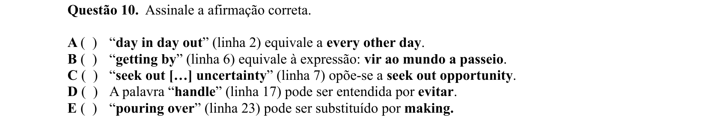

## Q11
**Assunto:** leitura e interpretação
**Competências:** inferência, interpretação de sentença, sentido implícito
**Tipo:** múltipla escolha

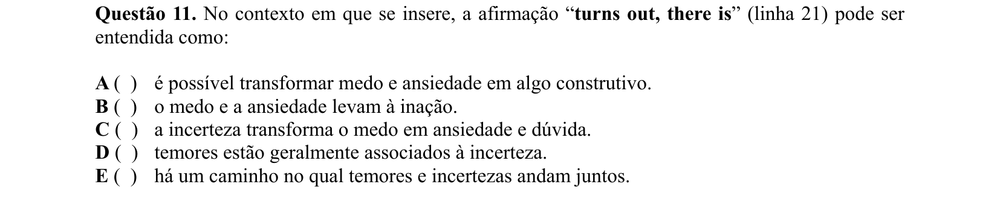

## Q12
**Assunto:** leitura e interpretação
**Competências:** referência contextual, significado de expressão, coesão textual
**Tipo:** múltipla escolha

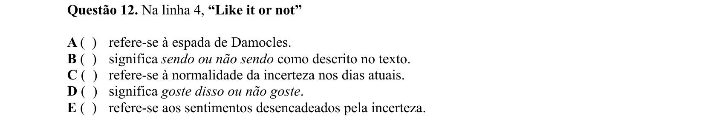

## Q13
**Assunto:** leitura e interpretação
**Competências:** anúncio publicitário, paráfrase, compreensão global
**Tipo:** múltipla escolha

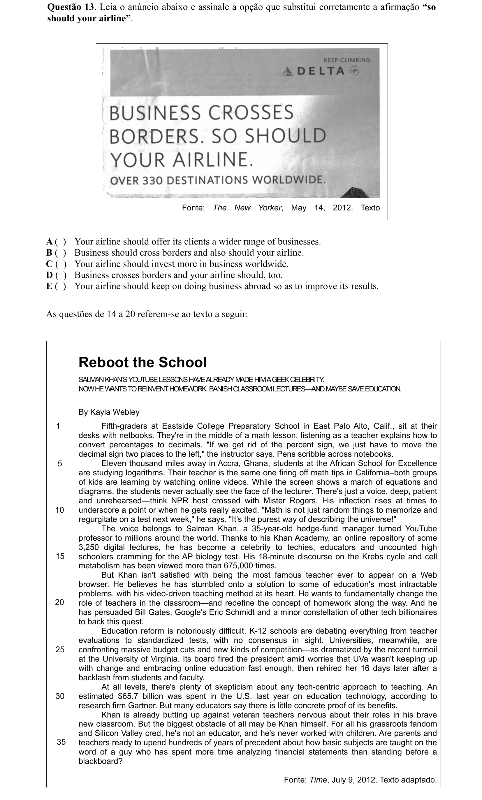

## Q14
**Assunto:** leitura e interpretação
**Competências:** compreensão de detalhes, identificação de afirmação correta, inferência
**Tipo:** múltipla escolha

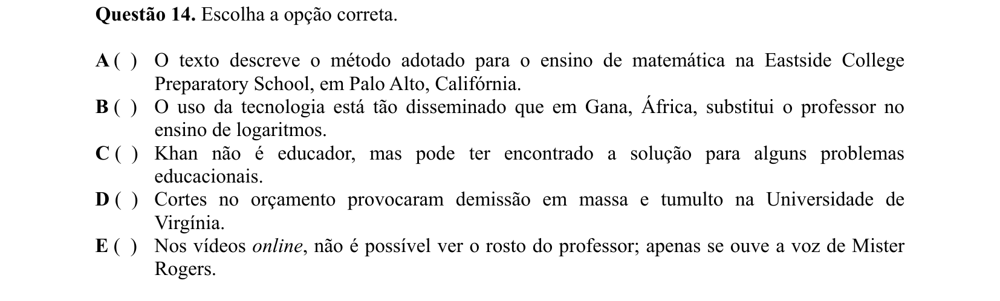

## Q15
**Assunto:** vocabulário
**Competências:** phrasal verbs, sinônimos, substituição lexical
**Tipo:** múltipla escolha

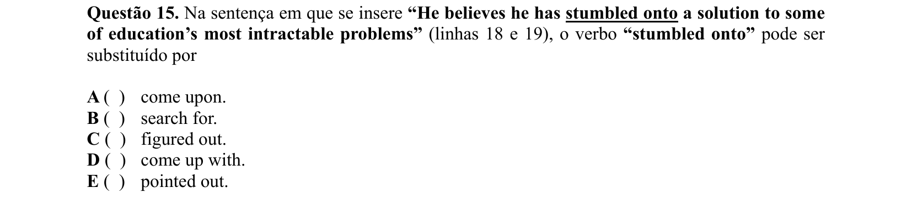

## Q16
**Assunto:** gramática
**Competências:** função gramatical, formação de palavras, gerúndio e substantivo
**Tipo:** múltipla escolha

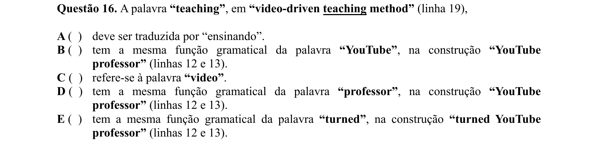

## Q17
**Assunto:** leitura e interpretação
**Competências:** referência pronominal, identificação de referente, coesão textual
**Tipo:** múltipla escolha

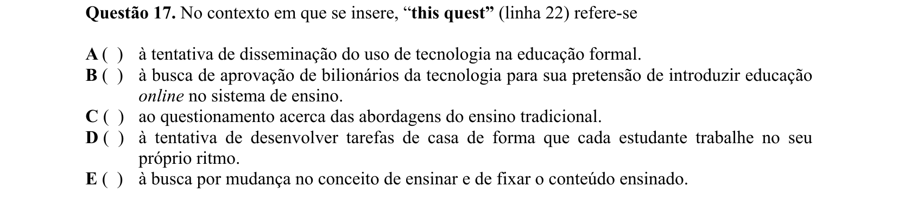

## Q18
**Assunto:** vocabulário
**Competências:** phrasal verbs, polissemia, significado contextual
**Tipo:** múltipla escolha

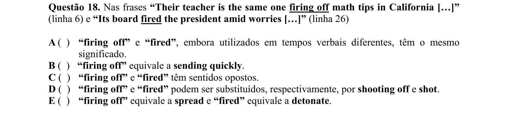

## Q19
**Assunto:** leitura e interpretação
**Competências:** compreensão de detalhes, identificação de afirmação correta, inferência
**Tipo:** múltipla escolha

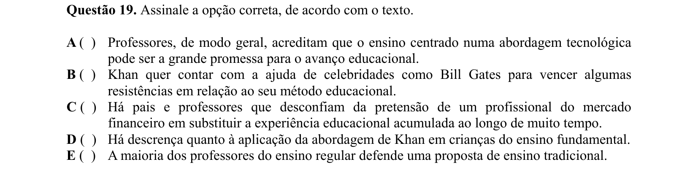

## Q20
**Assunto:** vocabulário
**Competências:** falsos cognatos, significado contextual, sinônimos
**Tipo:** múltipla escolha

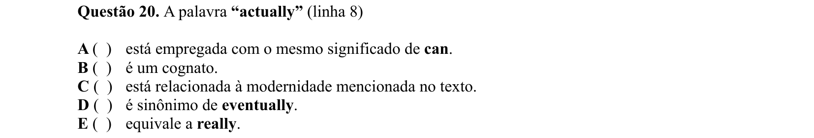
