# Inglês — ITA 2014

> 20 questões múltipla escolha.

## Q01
**Assunto:** leitura e interpretação
**Competências:** identificação de gênero textual, compreensão global, inferência
**Tipo:** múltipla escolha

## Q02
**Assunto:** leitura e interpretação
**Competências:** compreensão global, identificação de informação explícita, inferência
**Tipo:** múltipla escolha

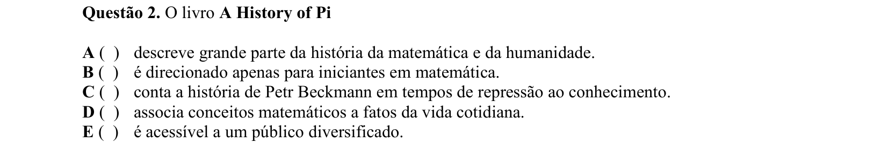

## Q03
**Assunto:** vocabulário
**Competências:** inferência lexical, sinônimos, uso contextual
**Tipo:** múltipla escolha

## Q04
**Assunto:** leitura e interpretação
**Competências:** identificação de informação explícita, compreensão de detalhes
**Tipo:** múltipla escolha

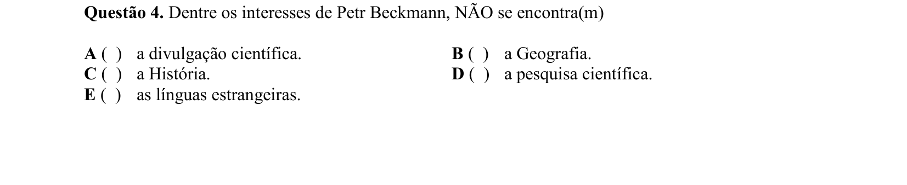

## Q05
**Assunto:** vocabulário
**Competências:** sinônimos, substituição lexical, uso contextual
**Tipo:** múltipla escolha

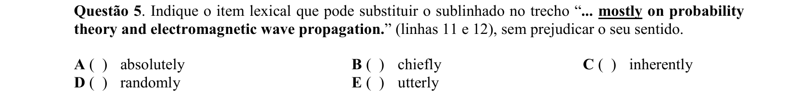

## Q06
**Assunto:** gramática
**Competências:** voz passiva, tempos verbais, reescritura
**Tipo:** múltipla escolha

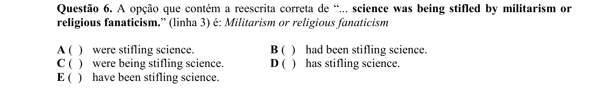

## Q07
**Assunto:** leitura e interpretação
**Competências:** referência textual, coesão, identificação de informação explícita
**Tipo:** múltipla escolha

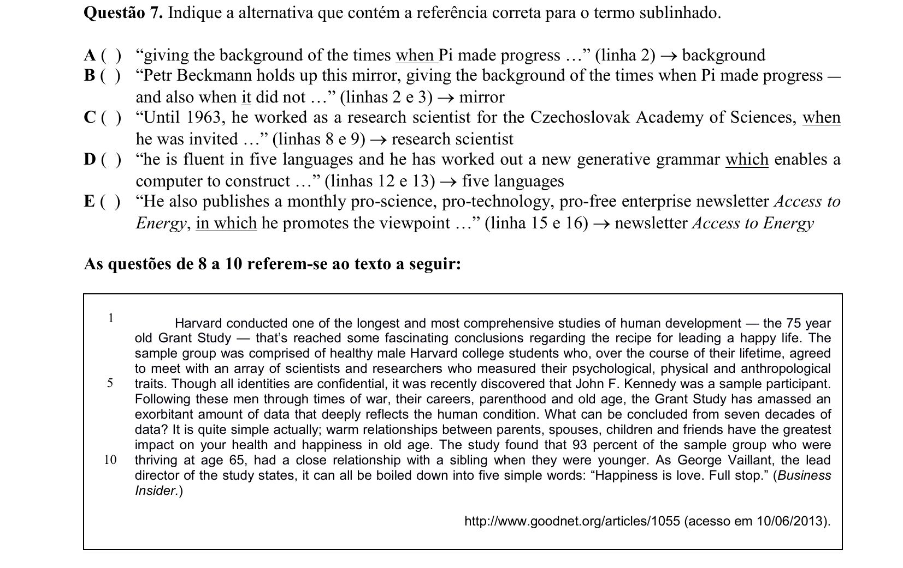

## Q08
**Assunto:** leitura e interpretação
**Competências:** compreensão global, identificação de informação explícita, inferência
**Tipo:** múltipla escolha

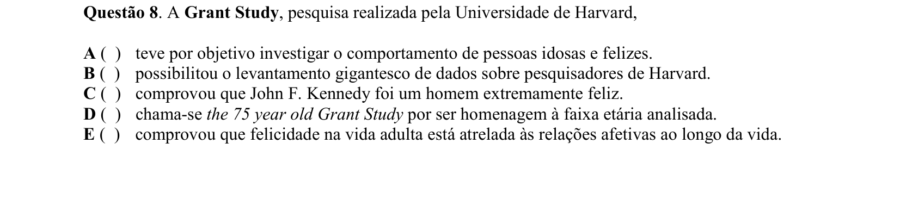

## Q09
**Assunto:** gramática
**Competências:** conectivos de concessão, reescritura, equivalência semântica
**Tipo:** múltipla escolha

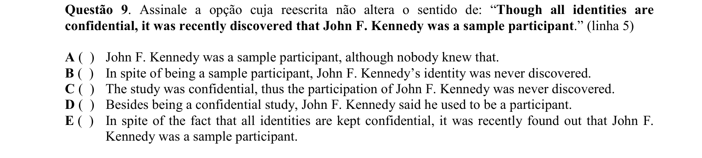

## Q10
**Assunto:** gramática
**Competências:** grau dos adjetivos, superlativo, comparativo
**Tipo:** múltipla escolha

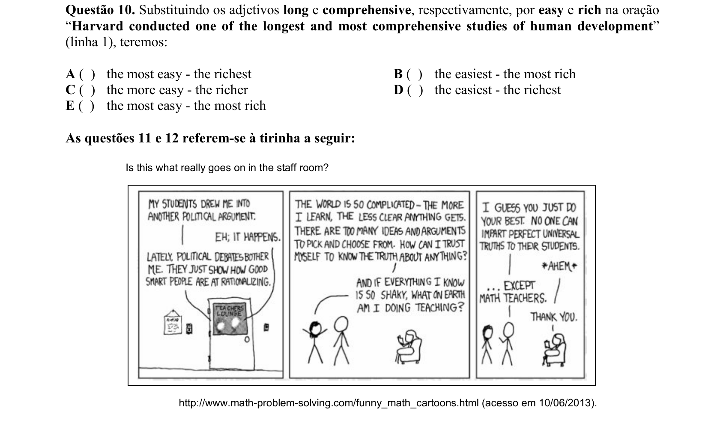

## Q11
**Assunto:** leitura e interpretação
**Competências:** inferência, compreensão de contexto, identificação de personagens
**Tipo:** múltipla escolha

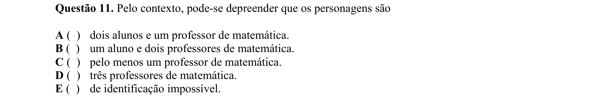

## Q12
**Assunto:** gramática
**Competências:** estruturas comparativas, paralelismo, equivalência semântica
**Tipo:** múltipla escolha

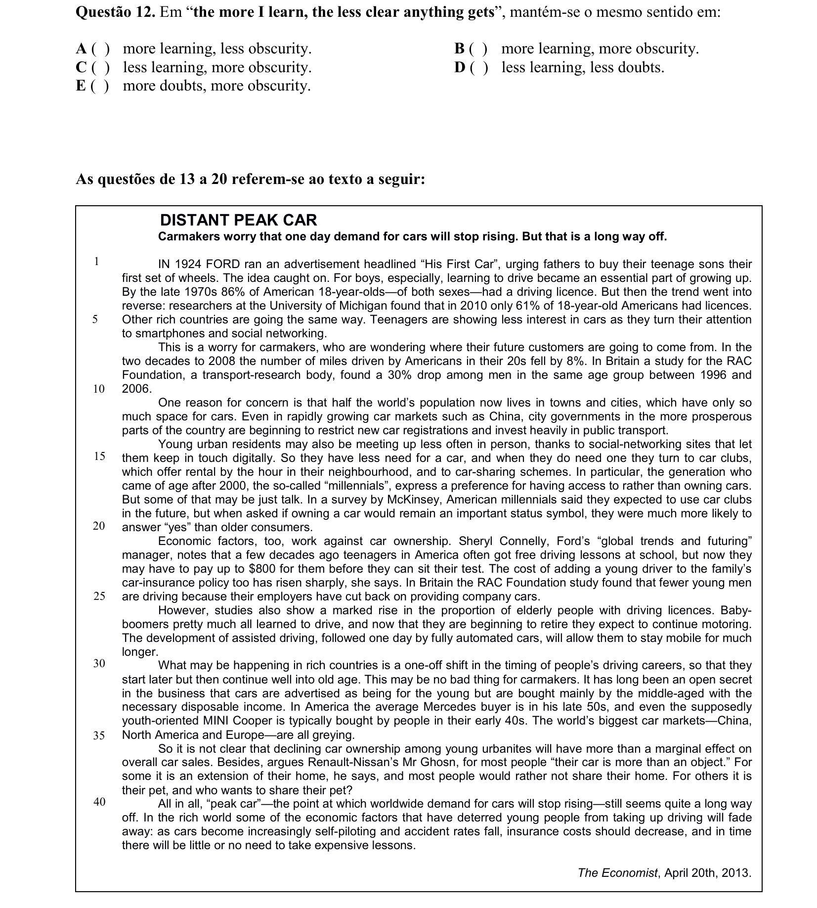

## Q13
**Assunto:** leitura e interpretação
**Competências:** identificação de causa, compreensão de detalhes
**Tipo:** múltipla escolha

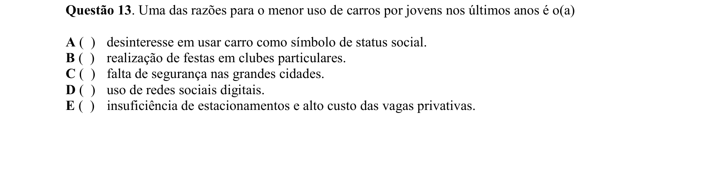

## Q14
**Assunto:** gramática
**Competências:** advérbios, função sintática, análise contextual
**Tipo:** múltipla escolha

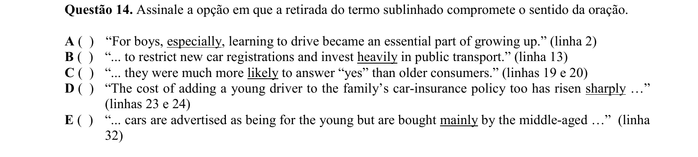

## Q15
**Assunto:** leitura e interpretação
**Competências:** julgamento de afirmações, compreensão de detalhes, inferência
**Tipo:** múltipla escolha

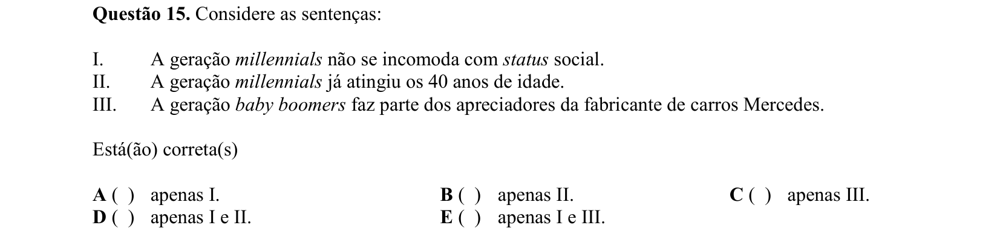

## Q16
**Assunto:** leitura e interpretação
**Competências:** identificação de informação correta, compreensão global, análise de detalhes
**Tipo:** múltipla escolha

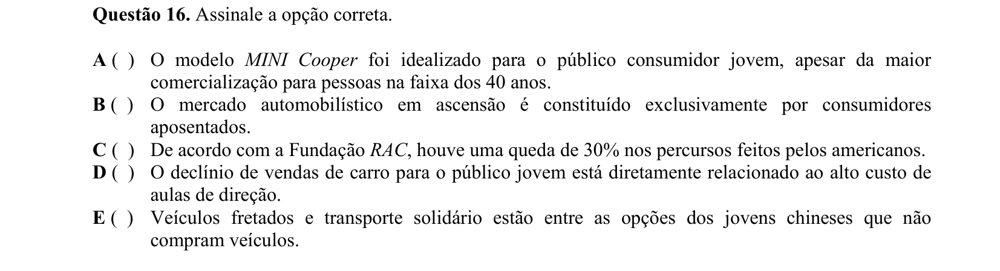

## Q17
**Assunto:** gramática
**Competências:** função sintática de "that", pronome relativo, conjunção
**Tipo:** múltipla escolha

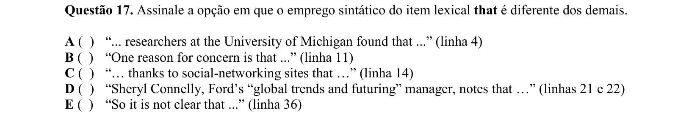

## Q18
**Assunto:** vocabulário
**Competências:** expressões idiomáticas, inferência lexical, uso contextual
**Tipo:** múltipla escolha

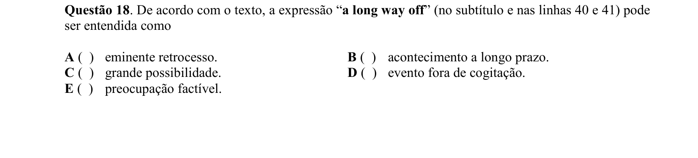

## Q19
**Assunto:** leitura e interpretação
**Competências:** referência anafórica, coesão, compreensão contextual
**Tipo:** múltipla escolha

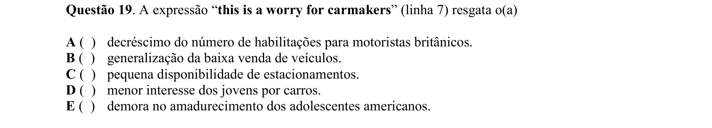

## Q20
**Assunto:** leitura e interpretação
**Competências:** julgamento de afirmações, compreensão de detalhes, inferência
**Tipo:** múltipla escolha

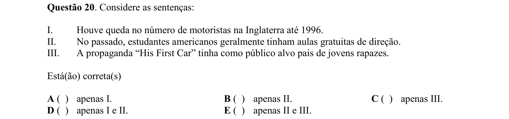
