# Inglês — ITA 2015

> 20 questões múltipla escolha.

## Q01
**Assunto:** leitura e interpretação
**Competências:** tipologia textual, foco narrativo, análise discursiva
**Tipo:** múltipla escolha

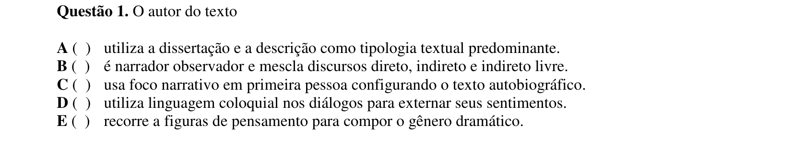

## Q02
**Assunto:** leitura e interpretação
**Competências:** compreensão textual, identificação de informações explícitas
**Tipo:** múltipla escolha

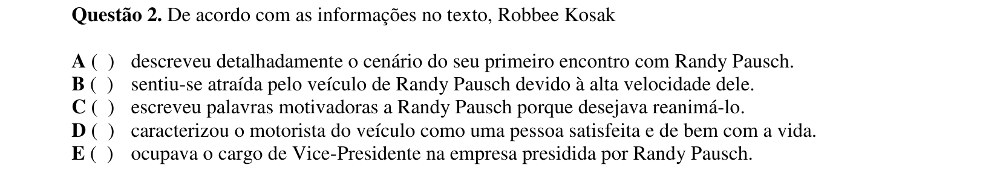

## Q03
**Assunto:** gramática
**Competências:** adjetivos, qualificadores, análise sintática
**Tipo:** múltipla escolha

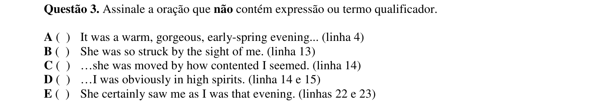

## Q04
**Assunto:** leitura e interpretação
**Competências:** interpretação de expressão, inferência, análise discursiva
**Tipo:** múltipla escolha

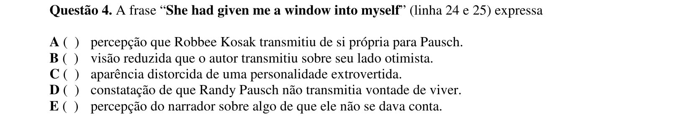

## Q05
**Assunto:** gramática
**Competências:** caso possessivo, classes de palavras, advérbios, conjunções
**Tipo:** múltipla escolha

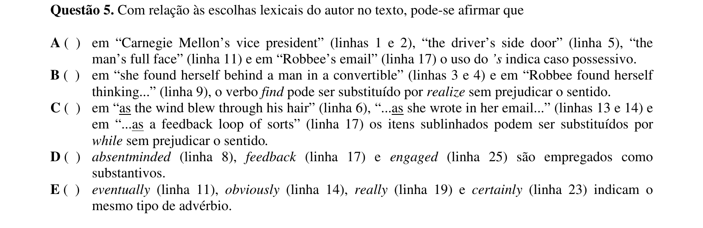

## Q06
**Assunto:** gramática
**Competências:** discurso direto e indireto, tempos verbais, past perfect
**Tipo:** múltipla escolha

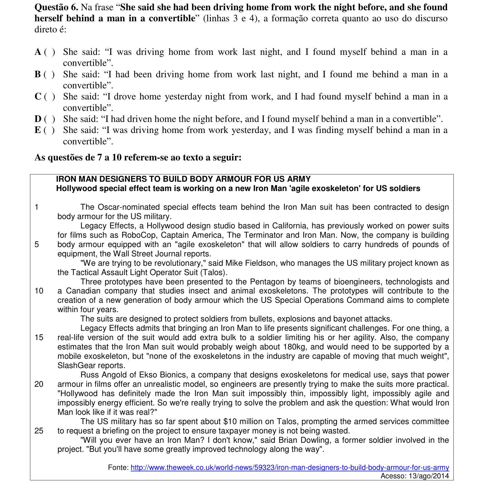

## Q07
**Assunto:** leitura e interpretação
**Competências:** compreensão textual, identificação de informações específicas
**Tipo:** múltipla escolha

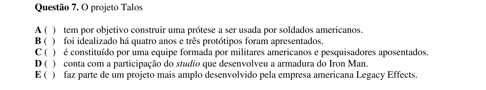

## Q08
**Assunto:** leitura e interpretação
**Competências:** compreensão textual, identificação de detalhes
**Tipo:** múltipla escolha

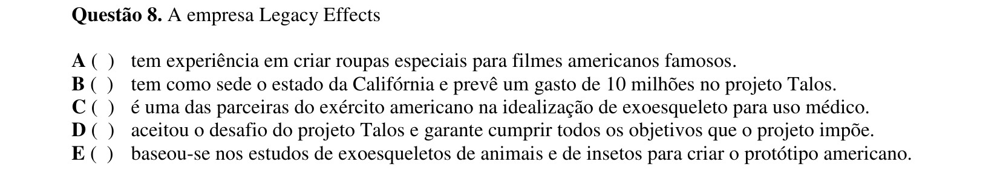

## Q09
**Assunto:** vocabulário
**Competências:** sinônimos, paráfrase, expressões idiomáticas
**Tipo:** múltipla escolha

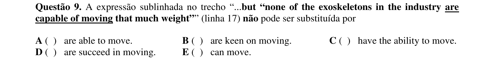

## Q10
**Assunto:** leitura e interpretação
**Competências:** compreensão textual, identificação de condições específicas
**Tipo:** múltipla escolha

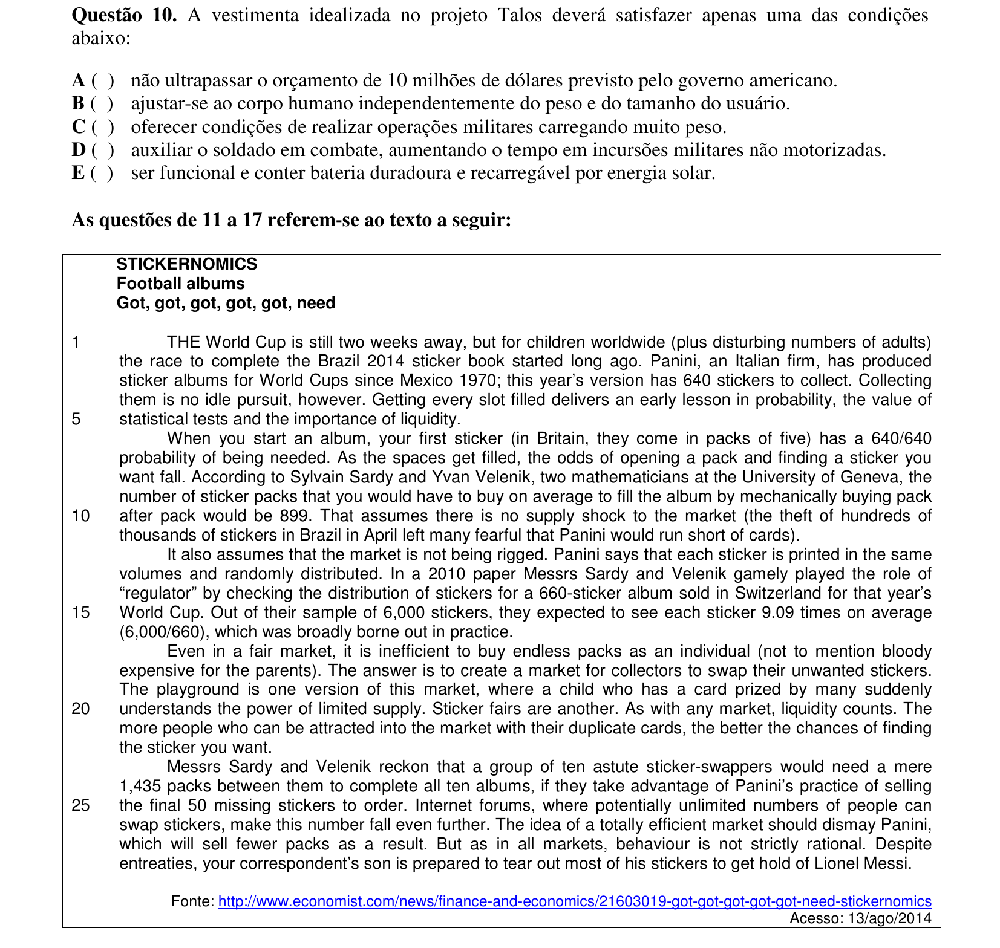

## Q11
**Assunto:** leitura e interpretação
**Competências:** ideia central, intenção autoral, análise discursiva
**Tipo:** múltipla escolha

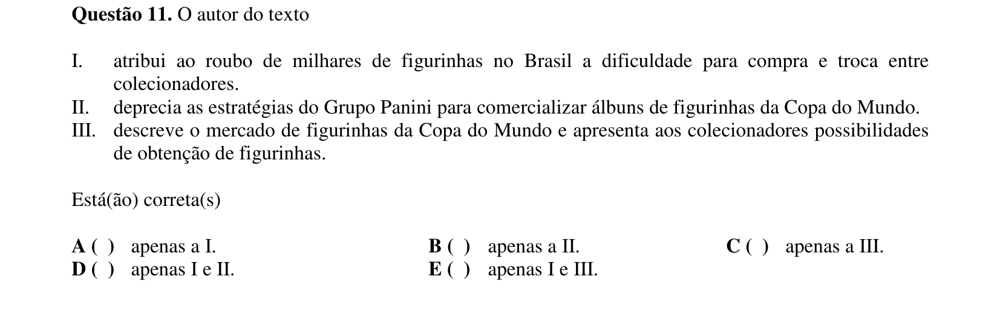

## Q12
**Assunto:** leitura e interpretação
**Competências:** compreensão textual, identificação de informações explícitas
**Tipo:** múltipla escolha

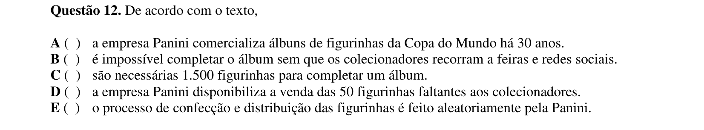

## Q13
**Assunto:** gramática
**Competências:** voz ativa e passiva, análise verbal
**Tipo:** múltipla escolha

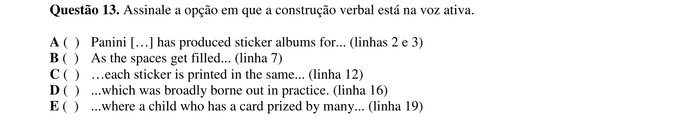

## Q14
**Assunto:** gramática
**Competências:** formas em -ing, gerúndio, particípio presente, ação contínua
**Tipo:** múltipla escolha

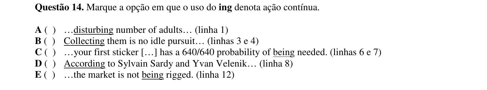

## Q15
**Assunto:** gramática
**Competências:** coesão textual, pronomes, referência anafórica
**Tipo:** múltipla escolha

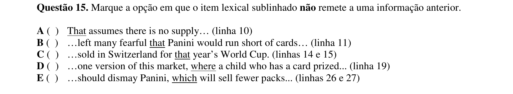

## Q16
**Assunto:** leitura e interpretação
**Competências:** compreensão textual, identificação de informações específicas
**Tipo:** múltipla escolha

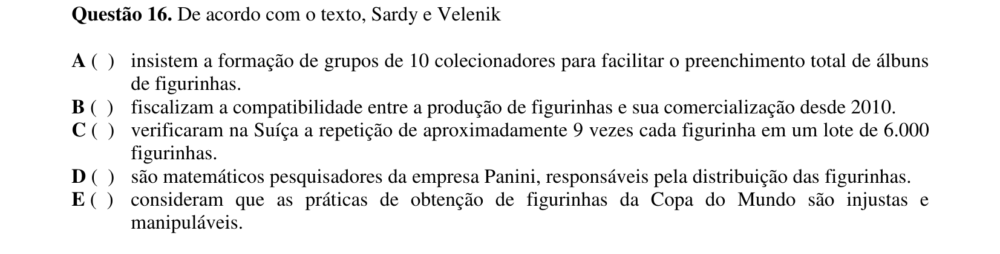

## Q17
**Assunto:** leitura e interpretação
**Competências:** inferência, intenção autoral, compreensão textual
**Tipo:** múltipla escolha

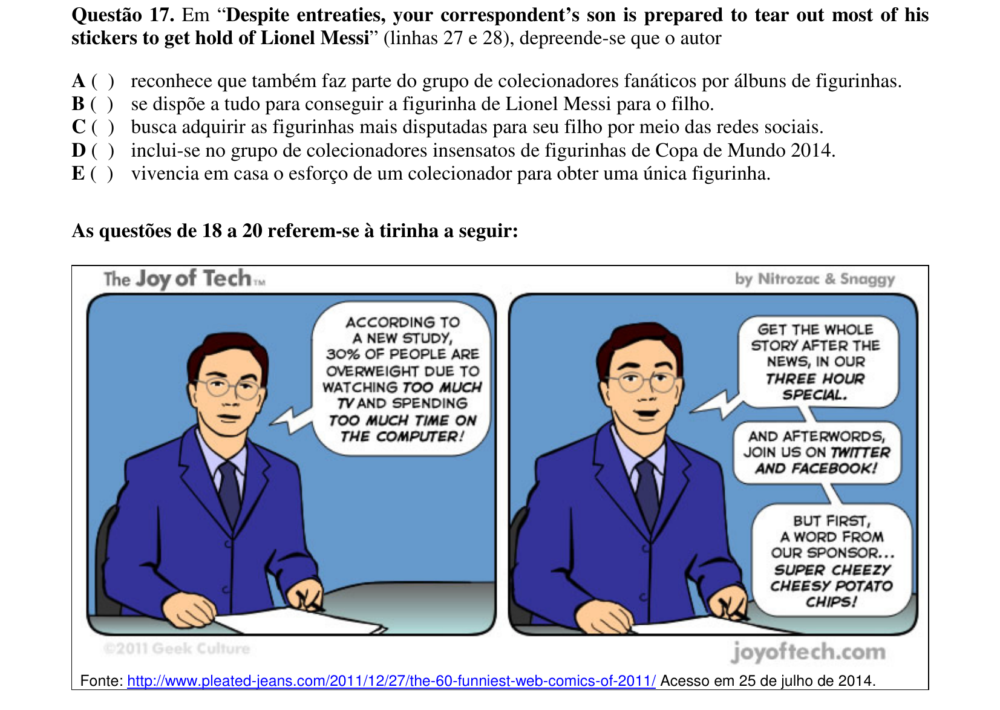

## Q18
**Assunto:** vocabulário
**Competências:** sinônimos, conectivos, expressões de causa
**Tipo:** múltipla escolha

## Q19
**Assunto:** vocabulário
**Competências:** relações semânticas, sinônimos, antônimos
**Tipo:** múltipla escolha

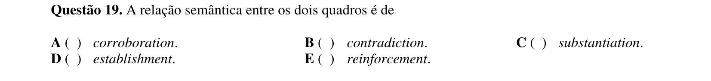

## Q20
**Assunto:** leitura e interpretação
**Competências:** interpretação de tirinha, inferência, intenção autoral
**Tipo:** múltipla escolha

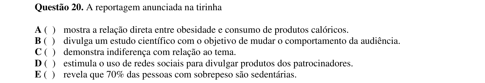
