# Inglês — ITA 2016

> 20 questões múltipla escolha.

## Q01
**Assunto:** leitura e interpretação
**Competências:** identificação de tópicos, compreensão global, eliminação de alternativas
**Tipo:** múltipla escolha

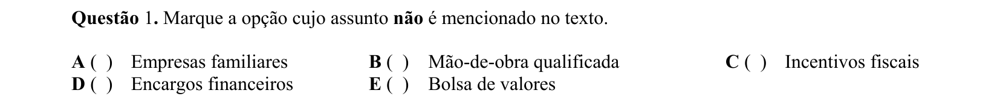

## Q02
**Assunto:** leitura e interpretação
**Competências:** compreensão detalhada, inferência, análise textual
**Tipo:** múltipla escolha

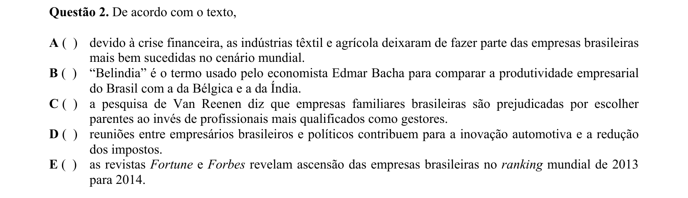

## Q03
**Assunto:** gramática
**Competências:** pontuação, aposto explicativo, análise sintática
**Tipo:** múltipla escolha

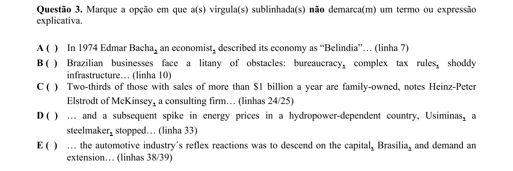

## Q04
**Assunto:** vocabulário
**Competências:** sinônimos, substituição lexical, contexto
**Tipo:** múltipla escolha

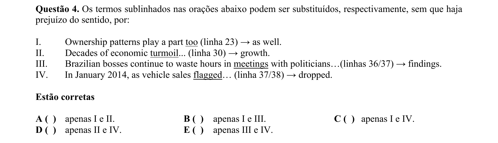

## Q05
**Assunto:** leitura e interpretação
**Competências:** identificação de posicionamento autoral, tom, argumentação
**Tipo:** múltipla escolha

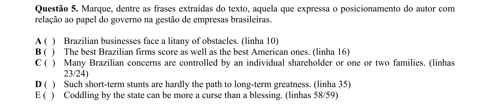

## Q06
**Assunto:** leitura e interpretação
**Competências:** compreensão detalhada, identificação de exemplos
**Tipo:** múltipla escolha

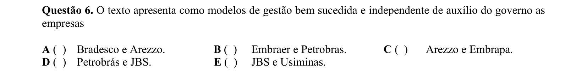

## Q07
**Assunto:** gramática
**Competências:** referência pronominal, voz passiva, análise sintática, coesão
**Tipo:** múltipla escolha

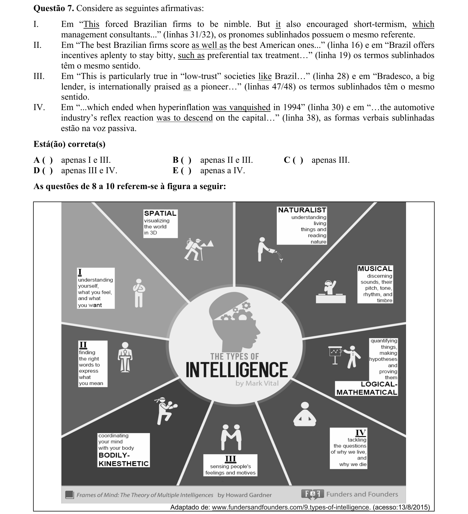

## Q08
**Assunto:** leitura e interpretação
**Competências:** interpretação de figura, associação imagem-texto, vocabulário
**Tipo:** múltipla escolha

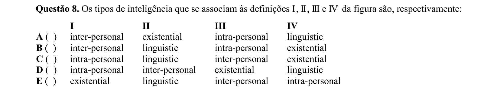

## Q09
**Assunto:** leitura e interpretação
**Competências:** compreensão de definições, associação conceitual
**Tipo:** múltipla escolha

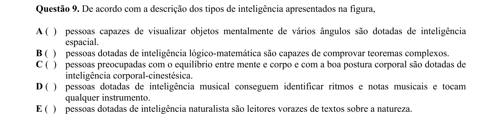

## Q10
**Assunto:** gramática
**Competências:** uso de -ing, pronomes (you/we/your/yourself), função do "why"
**Tipo:** múltipla escolha

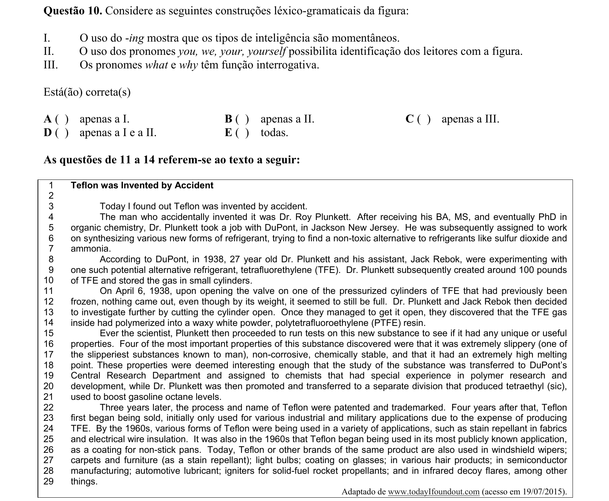

## Q11
**Assunto:** leitura e interpretação
**Competências:** compreensão detalhada, identificação de informação específica
**Tipo:** múltipla escolha

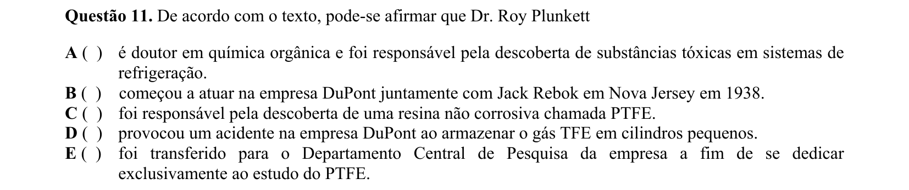

## Q12
**Assunto:** leitura e interpretação
**Competências:** compreensão detalhada, vocabulário técnico, eliminação
**Tipo:** múltipla escolha

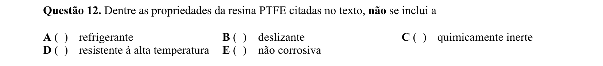

## Q13
**Assunto:** leitura e interpretação
**Competências:** compreensão global, inferência, identificação de causa
**Tipo:** múltipla escolha

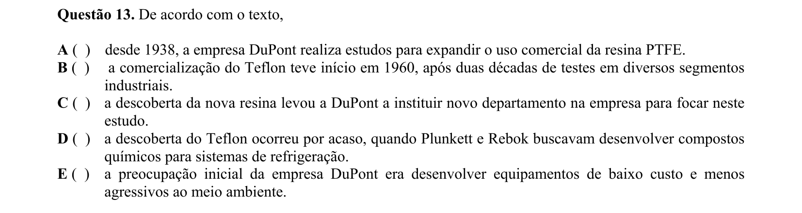

## Q14
**Assunto:** leitura e interpretação
**Competências:** compreensão global, identificação de tópico negativo
**Tipo:** múltipla escolha

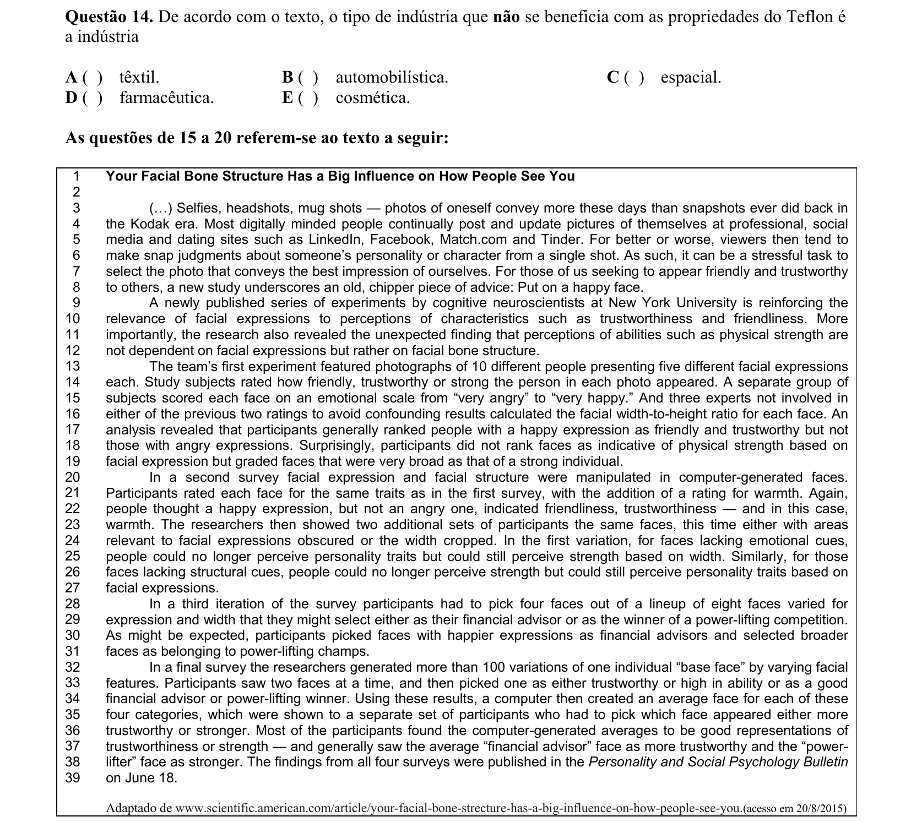

## Q15
**Assunto:** leitura e interpretação
**Competências:** compreensão detalhada, análise metodológica
**Tipo:** múltipla escolha

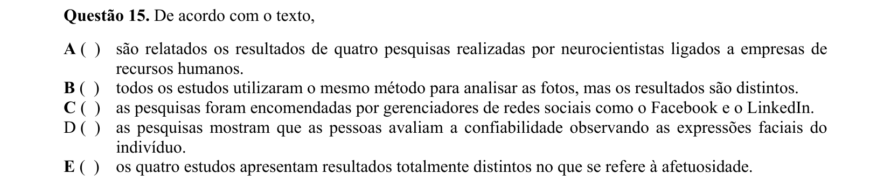

## Q16
**Assunto:** leitura e interpretação
**Competências:** compreensão detalhada, inferência
**Tipo:** múltipla escolha

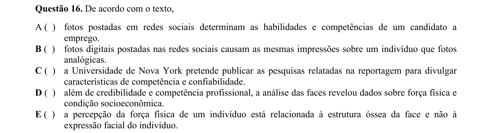

## Q17
**Assunto:** leitura e interpretação
**Competências:** compreensão detalhada, análise de estudos, julgamento de afirmações
**Tipo:** múltipla escolha

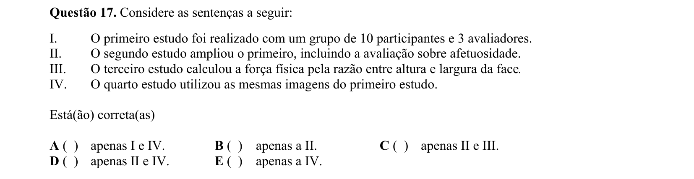

## Q18
**Assunto:** leitura e interpretação
**Competências:** compreensão detalhada, relação causa-efeito
**Tipo:** múltipla escolha

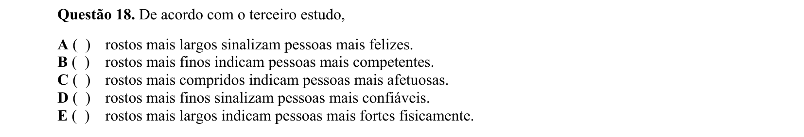

## Q19
**Assunto:** gramática
**Competências:** advérbios, qualificadores, classes de palavras
**Tipo:** múltipla escolha

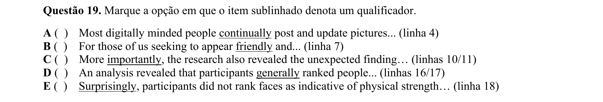

## Q20
**Assunto:** gramática
**Competências:** adjetivos, grau comparativo/superlativo, flexão
**Tipo:** múltipla escolha

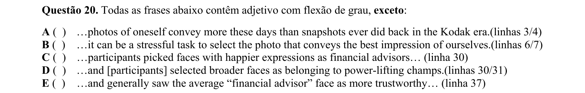
