# Inglês — ITA 2017

> 20 questões múltipla escolha.

## Q01
**Assunto:** leitura e interpretação
**Competências:** gênero textual, tipologia textual, compreensão global
**Tipo:** múltipla escolha

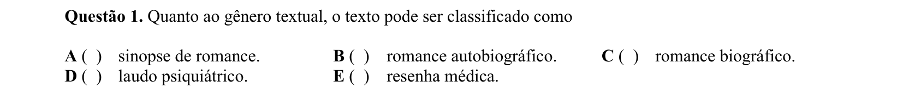

## Q02
**Assunto:** leitura e interpretação
**Competências:** narrador, foco narrativo, análise literária
**Tipo:** múltipla escolha

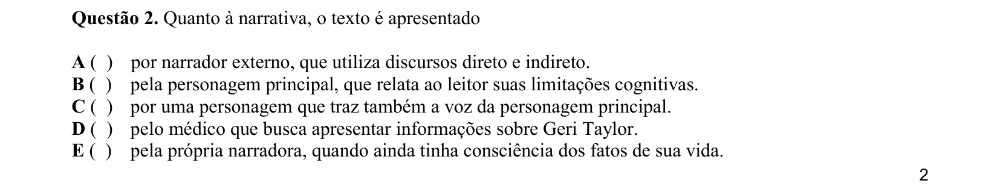

## Q03
**Assunto:** leitura e interpretação
**Competências:** compreensão detalhada, identificação de informação
**Tipo:** múltipla escolha

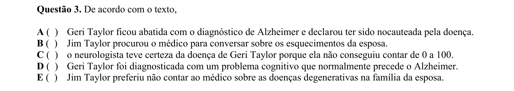

## Q04
**Assunto:** leitura e interpretação
**Competências:** compreensão detalhada, identificação de informação específica
**Tipo:** múltipla escolha

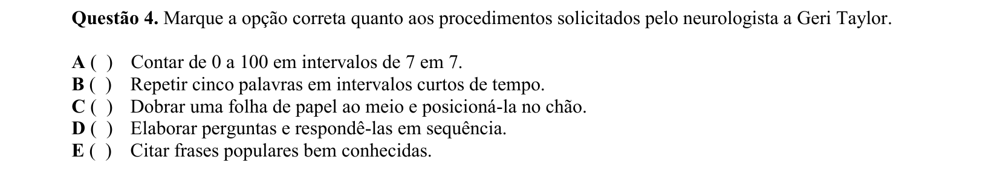

## Q05
**Assunto:** leitura e interpretação
**Competências:** relações de causa, compreensão detalhada
**Tipo:** múltipla escolha

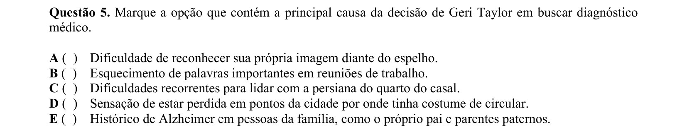

## Q06
**Assunto:** gramática
**Competências:** classes de palavras, advérbios, análise morfológica
**Tipo:** múltipla escolha

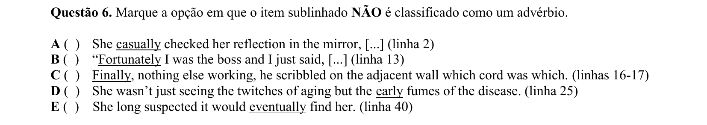

## Q07
**Assunto:** vocabulário
**Competências:** sinônimos, contexto, phrasal verbs
**Tipo:** múltipla escolha

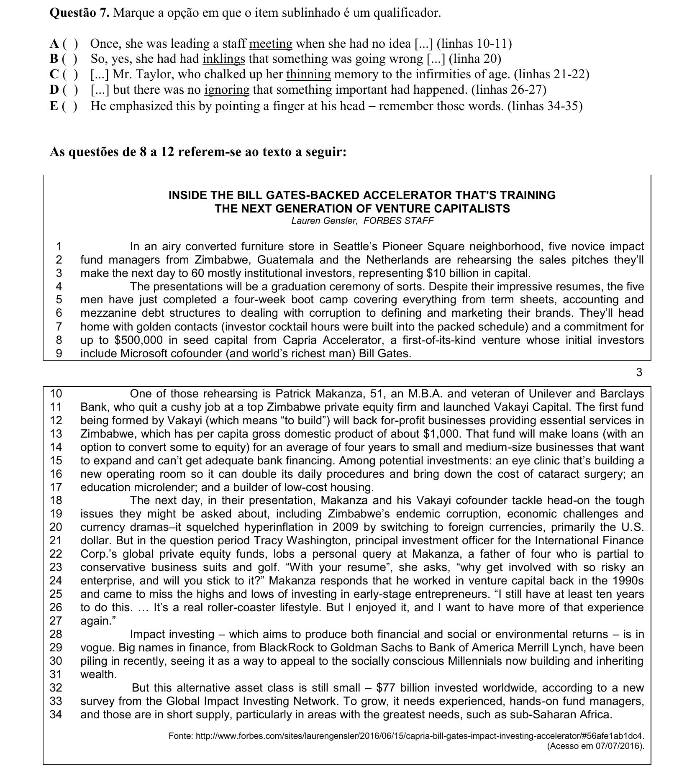

## Q08
**Assunto:** leitura e interpretação
**Competências:** compreensão global, identificação de informação
**Tipo:** múltipla escolha

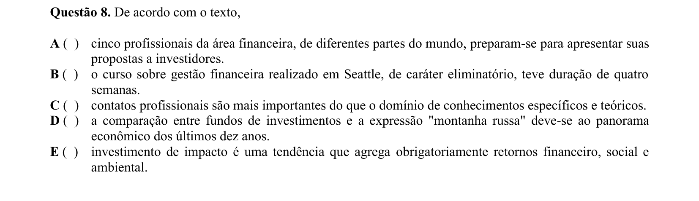

## Q09
**Assunto:** leitura e interpretação
**Competências:** compreensão detalhada, identificação de informação incorreta
**Tipo:** múltipla escolha

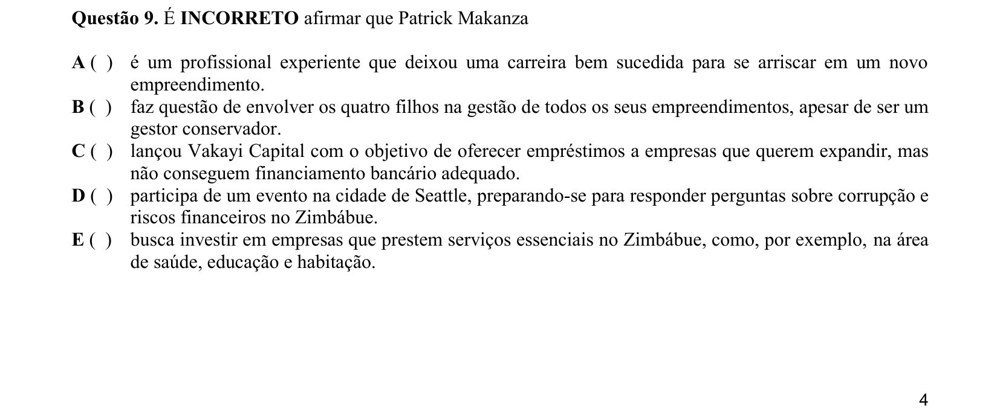

## Q10
**Assunto:** gramática
**Competências:** conjunções, conectivos, relações de concessão
**Tipo:** múltipla escolha

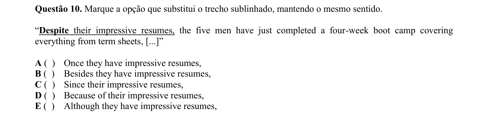

## Q11
**Assunto:** gramática
**Competências:** pronomes relativos, sintaxe, função de sujeito
**Tipo:** múltipla escolha

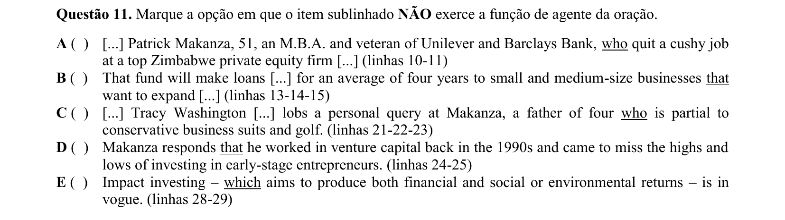

## Q12
**Assunto:** gramática
**Competências:** pronomes relativos, referência, sintaxe
**Tipo:** múltipla escolha

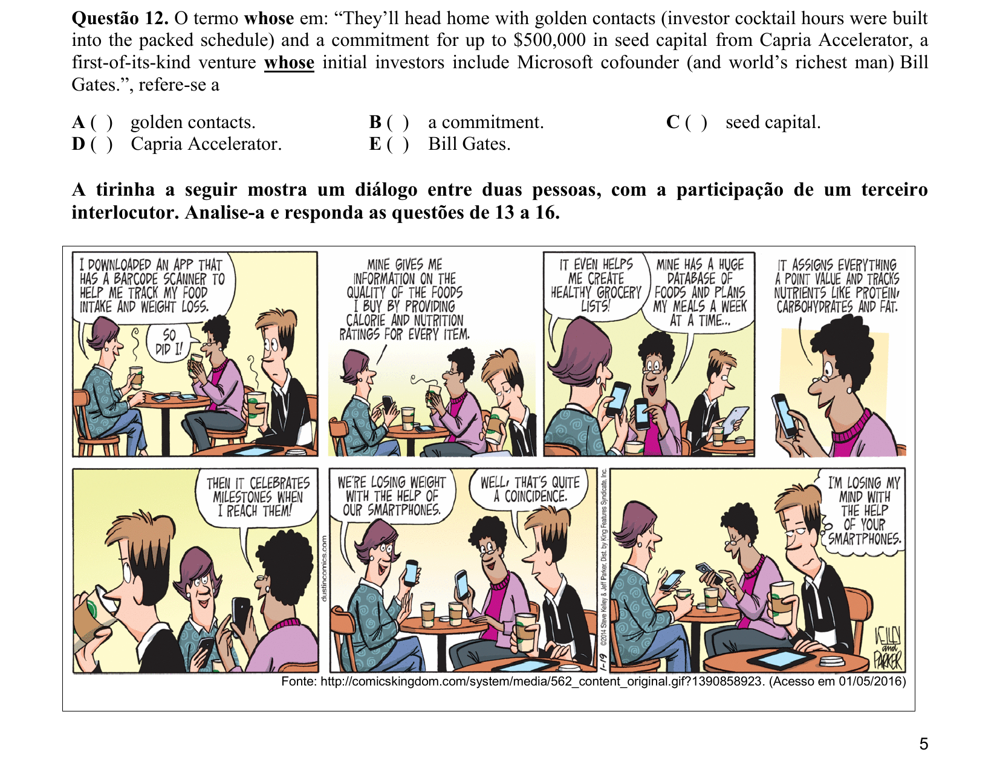

## Q13
**Assunto:** leitura e interpretação
**Competências:** compreensão de tirinha, inferência, linguagem visual
**Tipo:** múltipla escolha

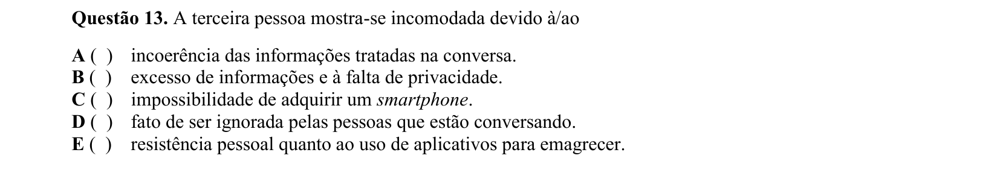

## Q14
**Assunto:** leitura e interpretação
**Competências:** inferência, compreensão de tirinha
**Tipo:** múltipla escolha

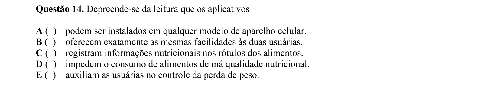

## Q15
**Assunto:** gramática
**Competências:** pronomes, referência, coesão textual
**Tipo:** múltipla escolha

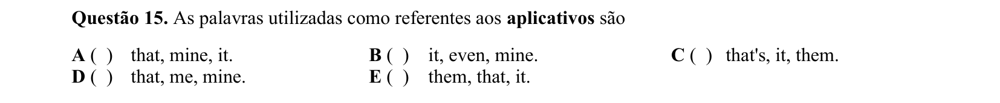

## Q16
**Assunto:** gramática
**Competências:** classificação gramatical, classes de palavras, sintaxe
**Tipo:** múltipla escolha

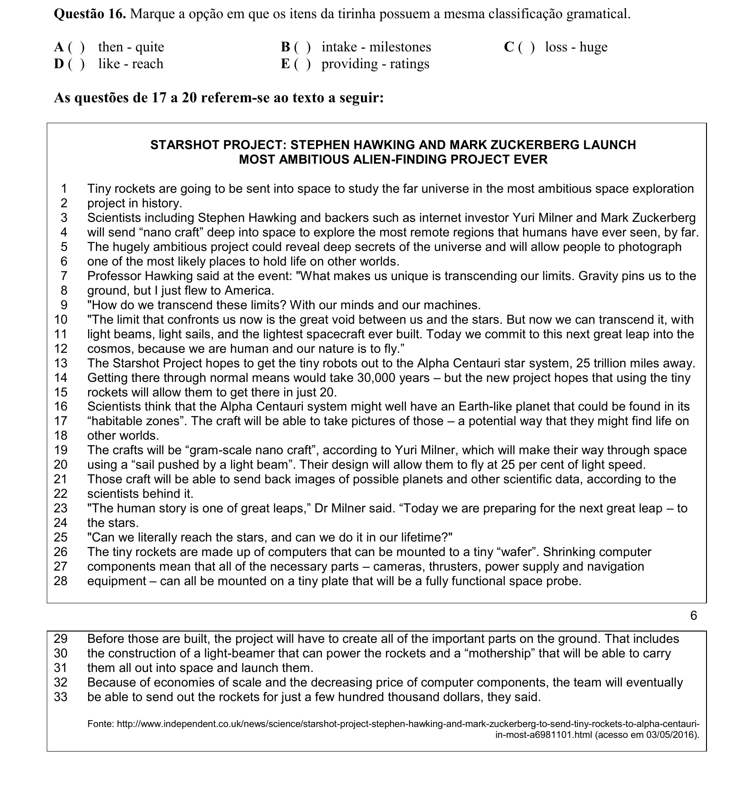

## Q17
**Assunto:** leitura e interpretação
**Competências:** compreensão global, identificação de objetivo, ideia principal
**Tipo:** múltipla escolha

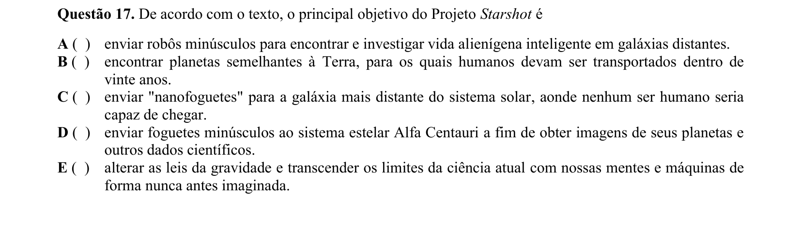

## Q18
**Assunto:** leitura e interpretação
**Competências:** compreensão detalhada, identificação de informação
**Tipo:** múltipla escolha

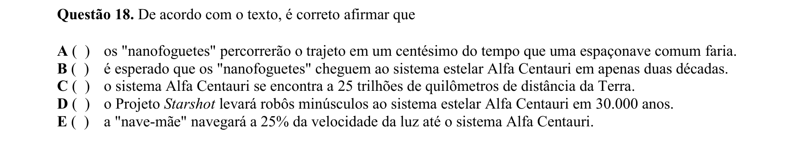

## Q19
**Assunto:** leitura e interpretação
**Competências:** compreensão detalhada, identificação de informação específica
**Tipo:** múltipla escolha

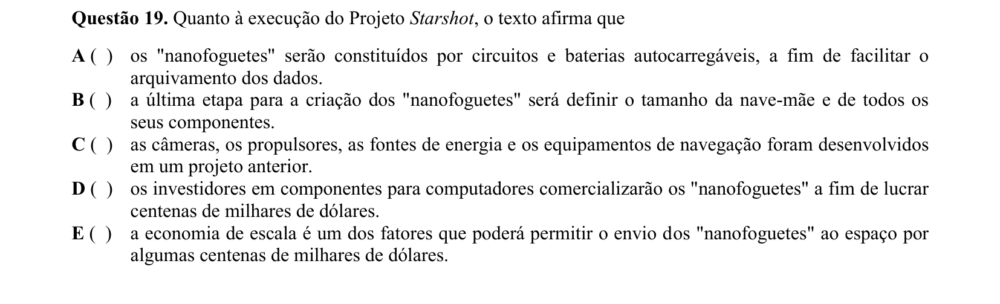

## Q20
**Assunto:** gramática
**Competências:** adjetivos, graus de comparação, análise morfológica
**Tipo:** múltipla escolha

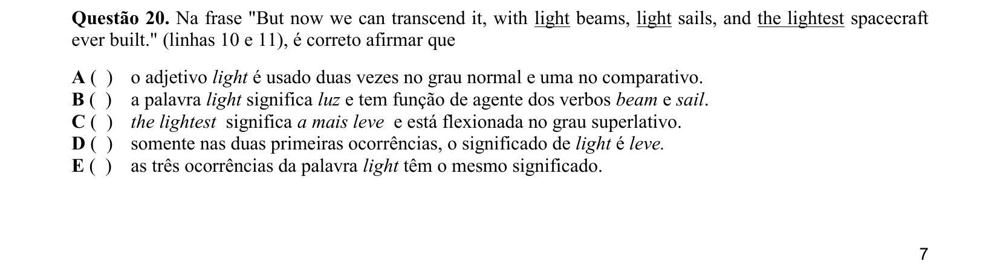
