# Inglês — ITA 2018

> 20 questões múltipla escolha.

## Q01
**Assunto:** leitura e interpretação
**Competências:** compreensão detalhada, identificação de informação específica
**Tipo:** múltipla escolha

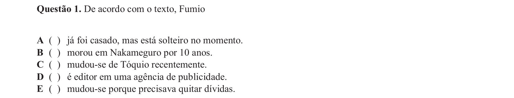

## Q02
**Assunto:** leitura e interpretação
**Competências:** compreensão detalhada, relação causa-efeito, inferência
**Tipo:** múltipla escolha

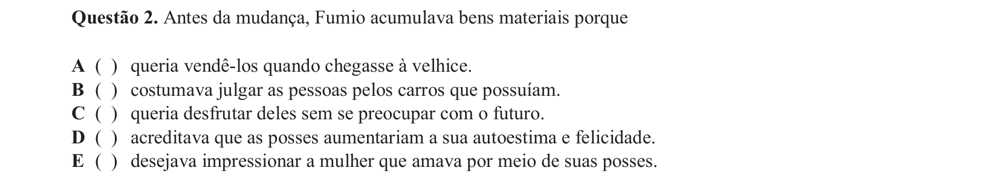

## Q03
**Assunto:** leitura e interpretação
**Competências:** compreensão global, identificação de informação
**Tipo:** múltipla escolha

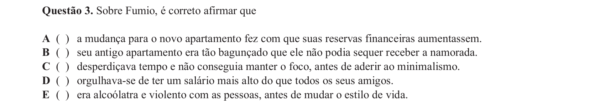

## Q04
**Assunto:** gramática
**Competências:** grau comparativo, adjetivos, análise sintática
**Tipo:** múltipla escolha

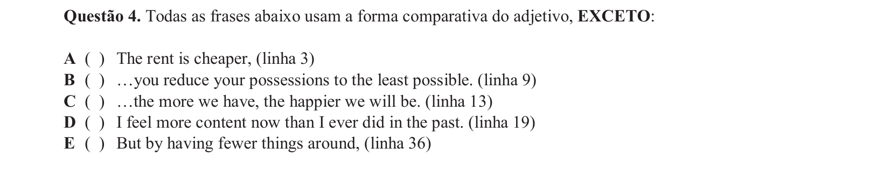

## Q05
**Assunto:** gramática
**Competências:** pronomes, referenciação, coesão textual
**Tipo:** múltipla escolha

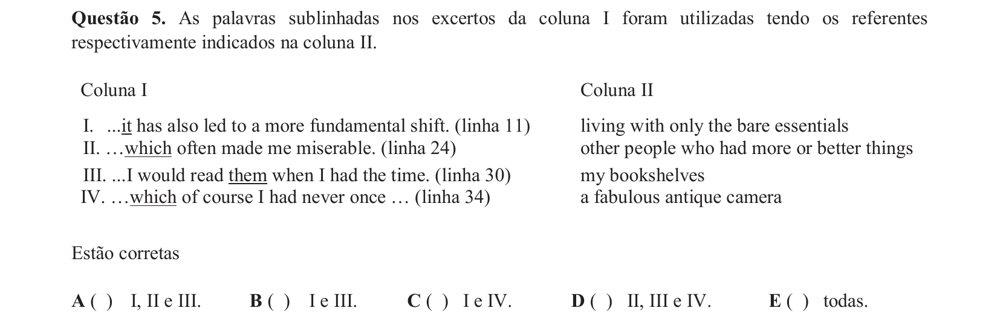

## Q06
**Assunto:** gramática
**Competências:** verbos modais, modalidade, semântica verbal
**Tipo:** múltipla escolha

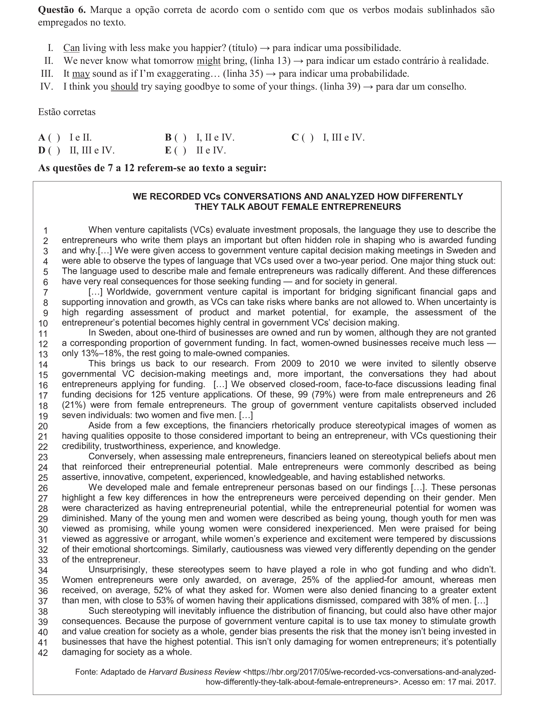

## Q07
**Assunto:** leitura e interpretação
**Competências:** compreensão detalhada, interpretação de dados numéricos
**Tipo:** múltipla escolha

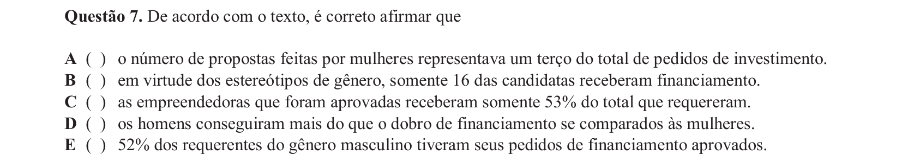

## Q08
**Assunto:** leitura e interpretação
**Competências:** compreensão detalhada, identificação de informação
**Tipo:** múltipla escolha

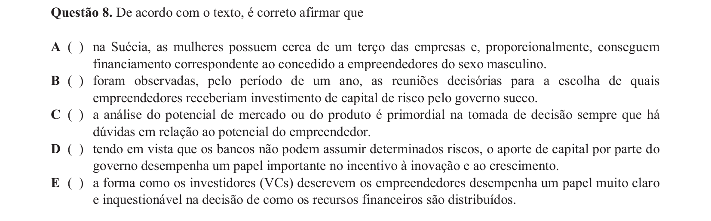

## Q09
**Assunto:** leitura e interpretação
**Competências:** compreensão detalhada, inferência, estereótipos de gênero
**Tipo:** múltipla escolha

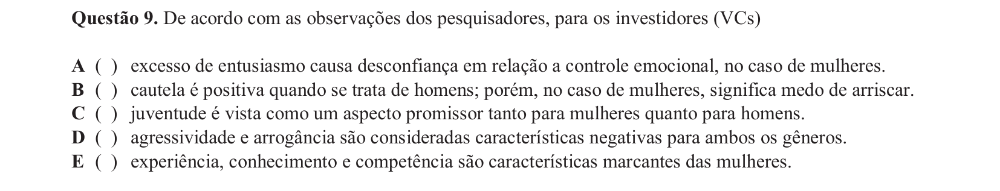

## Q10
**Assunto:** leitura e interpretação
**Competências:** compreensão detalhada, identificação de informação específica
**Tipo:** múltipla escolha

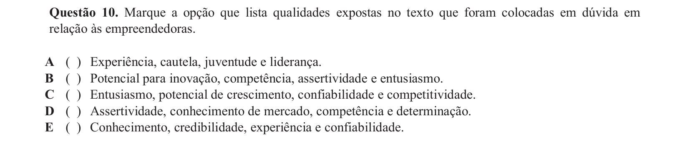

## Q11
**Assunto:** vocabulário
**Competências:** conectores, sinônimos, conjunções
**Tipo:** múltipla escolha

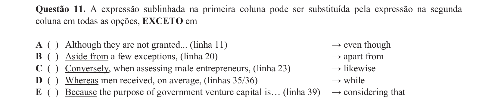

## Q12
**Assunto:** vocabulário
**Competências:** conjunções, sinônimos, coesão
**Tipo:** múltipla escolha

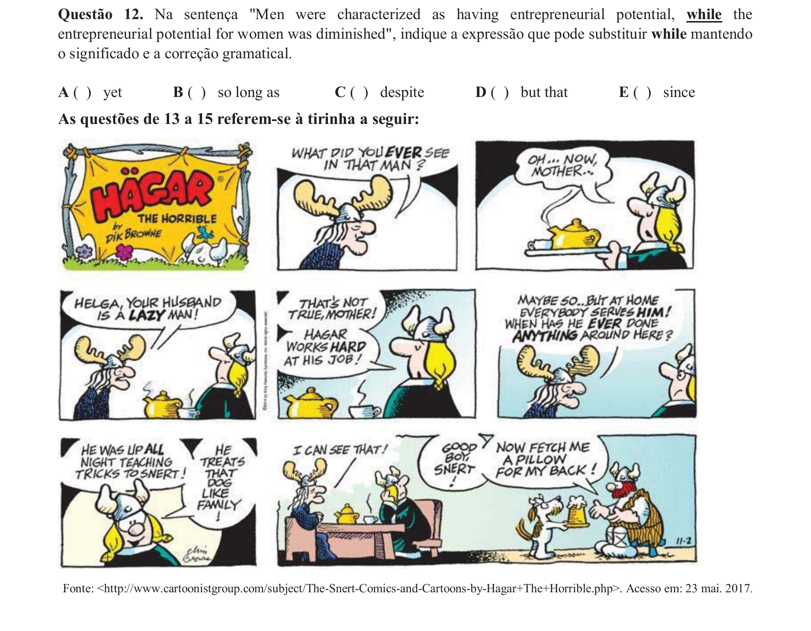

## Q13
**Assunto:** leitura e interpretação
**Competências:** interpretação de história em quadrinhos, inferência, humor
**Tipo:** múltipla escolha

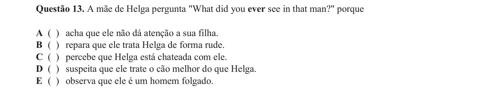

## Q14
**Assunto:** leitura e interpretação
**Competências:** interpretação de história em quadrinhos, inferência, pragmática
**Tipo:** múltipla escolha

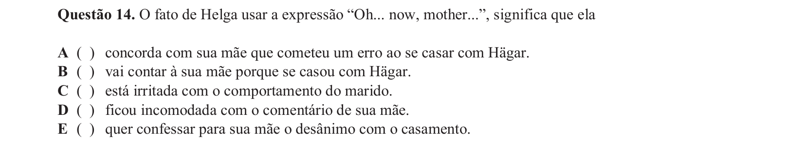

## Q15
**Assunto:** leitura e interpretação
**Competências:** ironia, inferência, análise de tirinha
**Tipo:** múltipla escolha

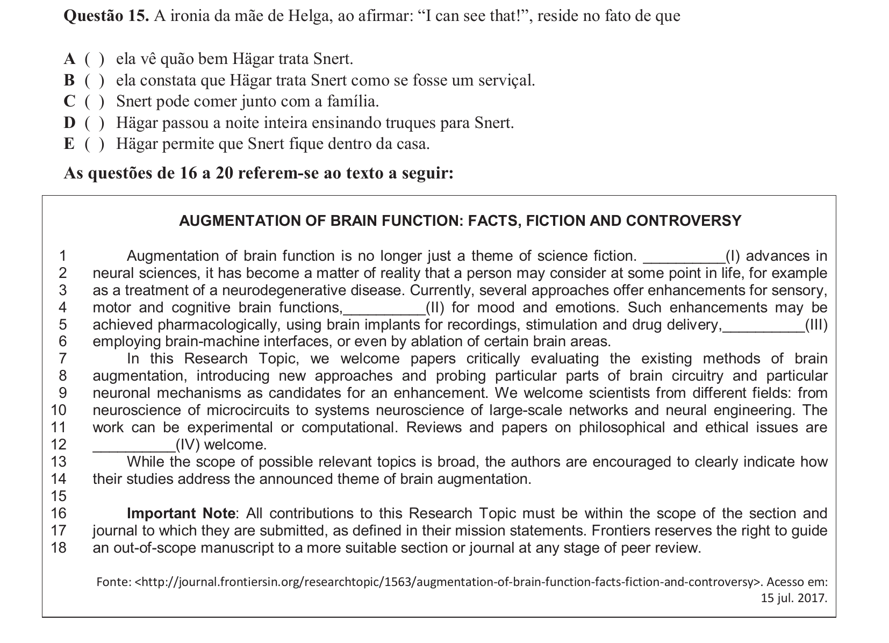

## Q16
**Assunto:** vocabulário
**Competências:** conectores, preposições, coesão textual
**Tipo:** múltipla escolha

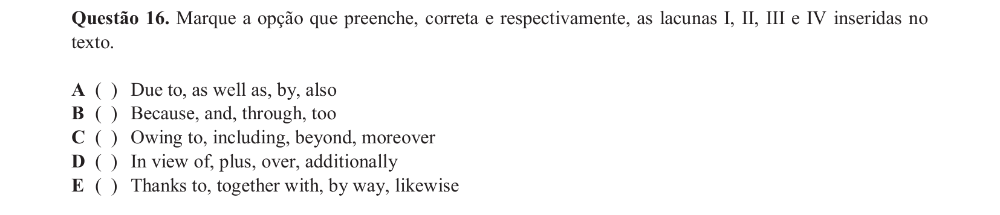

## Q17
**Assunto:** leitura e interpretação
**Competências:** gênero textual, tipologia textual, função comunicativa
**Tipo:** múltipla escolha

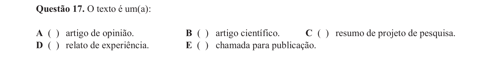

## Q18
**Assunto:** leitura e interpretação
**Competências:** compreensão detalhada, julgamento de afirmações
**Tipo:** múltipla escolha

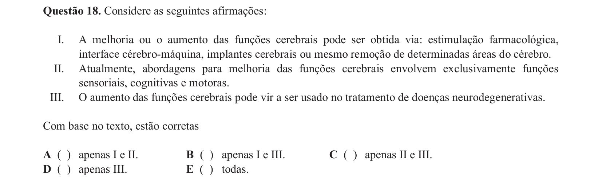

## Q19
**Assunto:** leitura e interpretação
**Competências:** compreensão detalhada, identificação de informação
**Tipo:** múltipla escolha

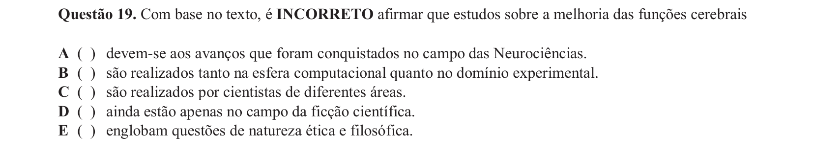

## Q20
**Assunto:** gramática
**Competências:** pronomes, referenciação, coesão textual
**Tipo:** múltipla escolha

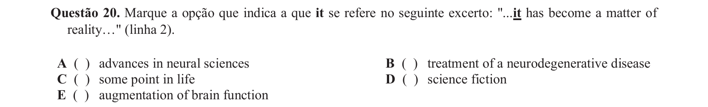
