# Inglês — ITA 2019 (1ª fase)

> 12 questões múltipla escolha.

## Q25
**Assunto:** leitura e interpretação
**Competências:** comparação 1976 vs. atualidade no texto sobre obesidade
**Tipo:** múltipla escolha

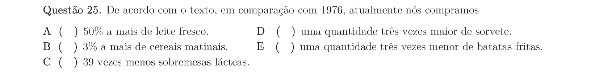

## Q26
**Assunto:** leitura e interpretação
**Competências:** identificação de afirmação correta sobre o texto
**Tipo:** múltipla escolha

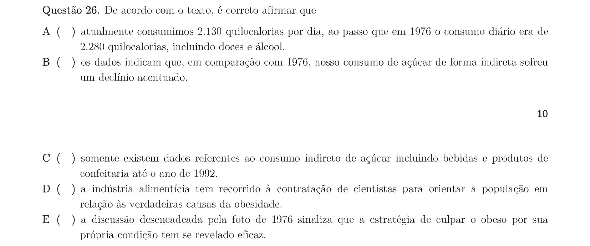

## Q27
**Assunto:** leitura e interpretação
**Competências:** posicionamento dos legisladores sobre obesidade
**Tipo:** múltipla escolha

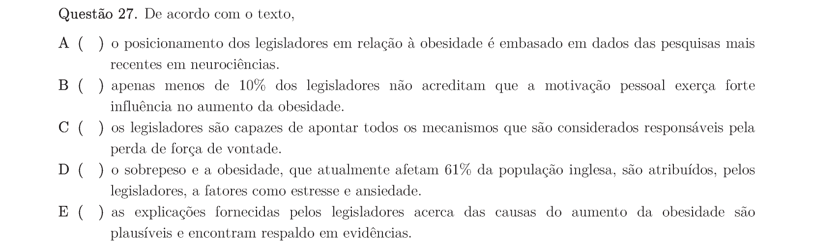

## Q28
**Assunto:** leitura e interpretação
**Competências:** tese do autor sobre causas da obesidade
**Tipo:** múltipla escolha

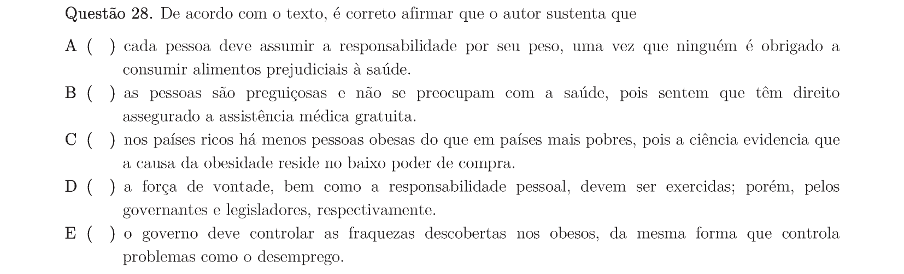

## Q29
**Assunto:** gramática, vocabulário
**Competências:** substituição de conjunção 'as' mantendo sentido
**Tipo:** múltipla escolha

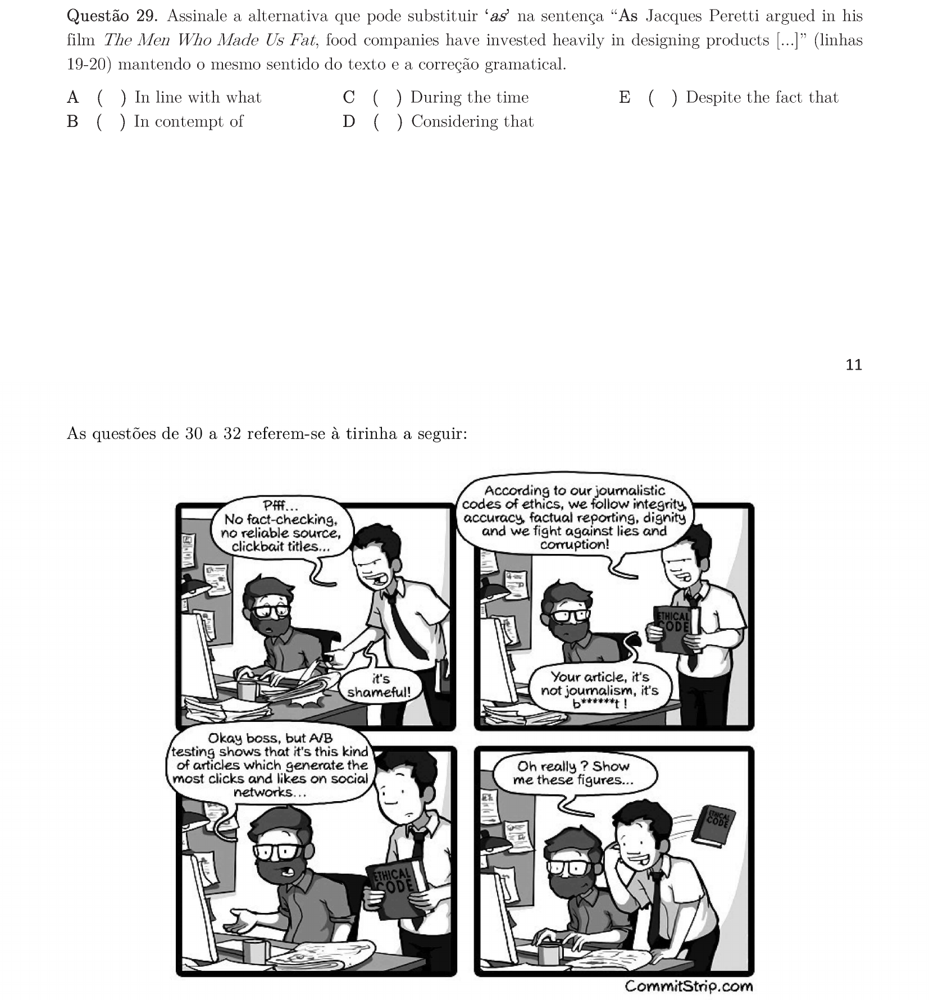

## Q30
**Assunto:** leitura e interpretação
**Competências:** interpretação de tirinha sobre jornalismo
**Tipo:** múltipla escolha

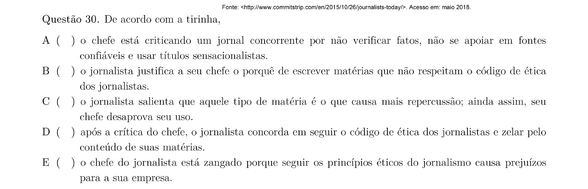

## Q31
**Assunto:** leitura e interpretação
**Competências:** análise do último quadrinho da tirinha
**Tipo:** múltipla escolha

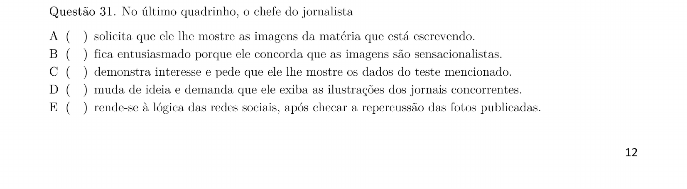

## Q32
**Assunto:** gramática
**Competências:** classes gramaticais; identificar a exceção
**Tipo:** múltipla escolha

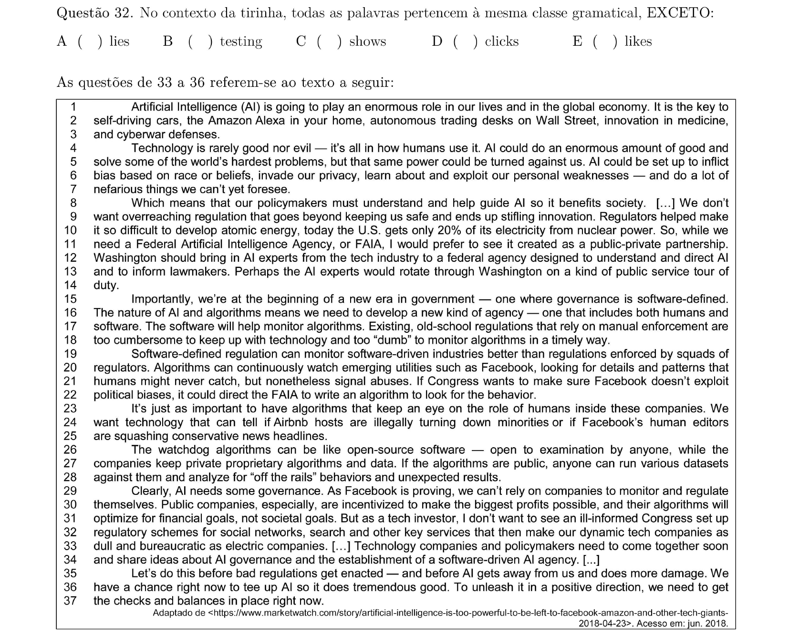

## Q33
**Assunto:** leitura e interpretação
**Competências:** identificar afirmação INCORRETA sobre texto de IA
**Tipo:** múltipla escolha

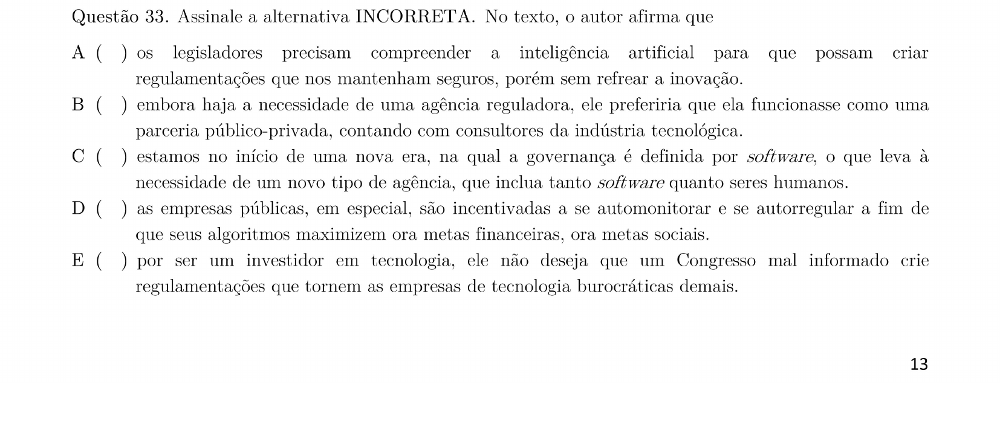

## Q34
**Assunto:** leitura e interpretação
**Competências:** justificativas para regulação por software
**Tipo:** múltipla escolha

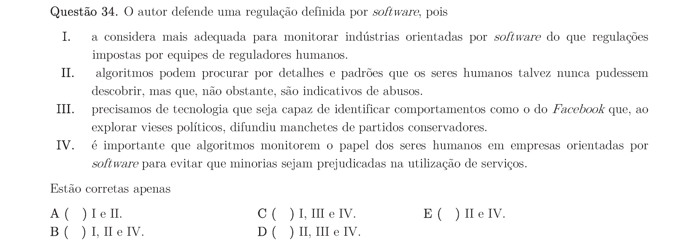

## Q35
**Assunto:** vocabulário
**Competências:** substituição de palavras/expressões mantendo sentido
**Tipo:** múltipla escolha

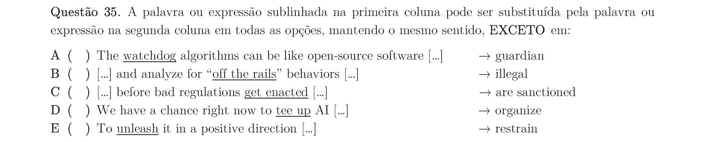

## Q36
**Assunto:** gramática, vocabulário
**Competências:** usos da palavra 'so' em diferentes contextos
**Tipo:** múltipla escolha

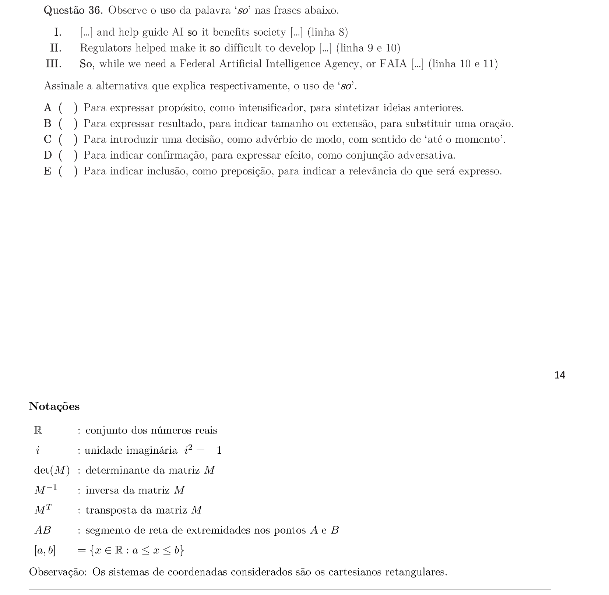
