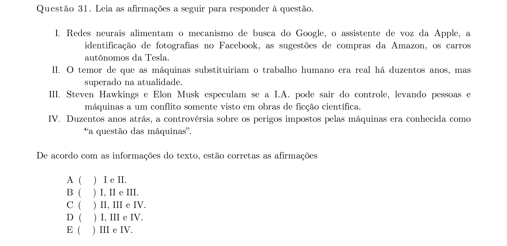
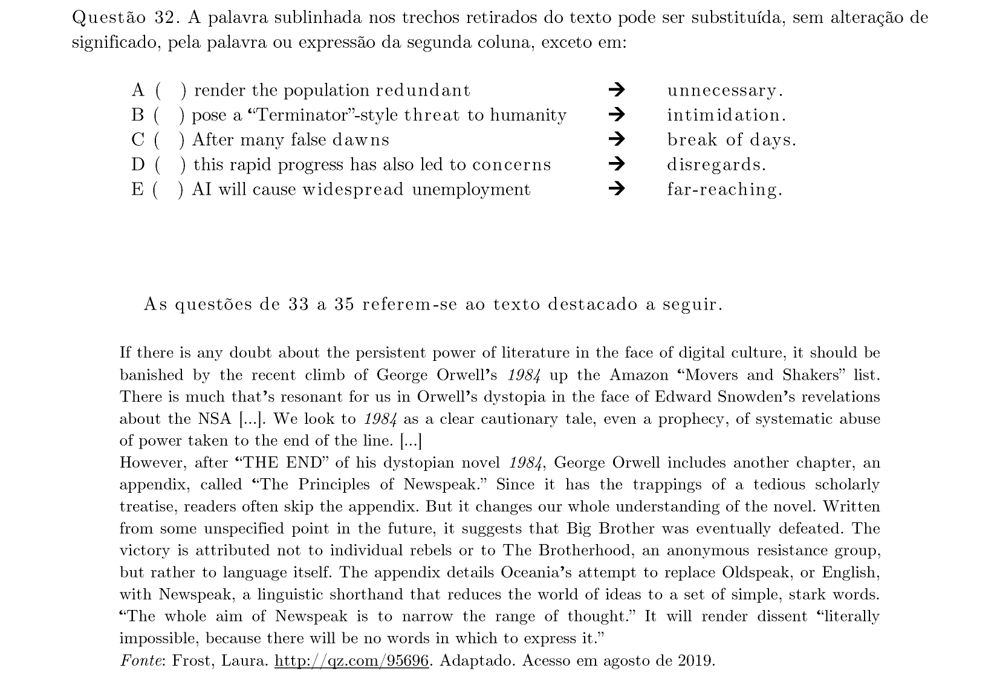
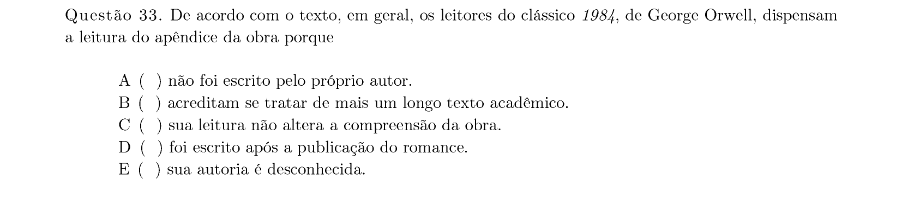
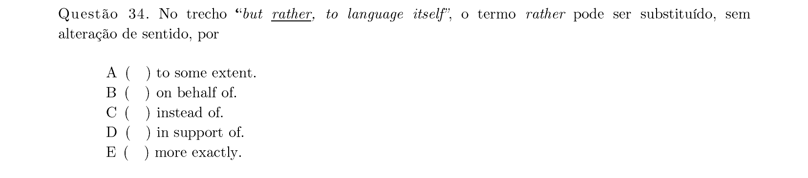
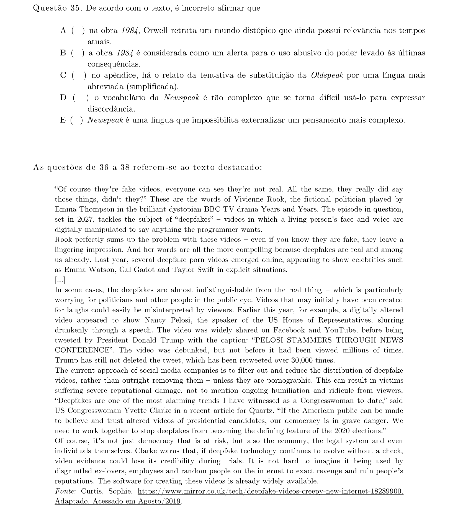
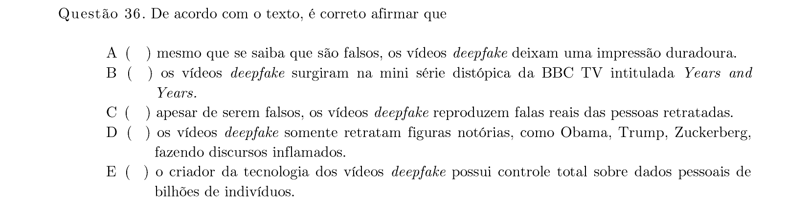
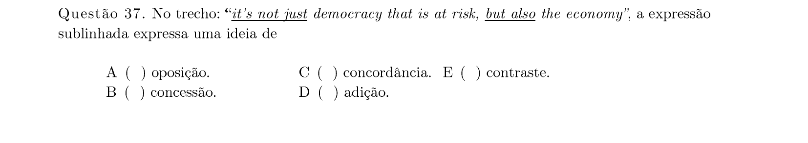
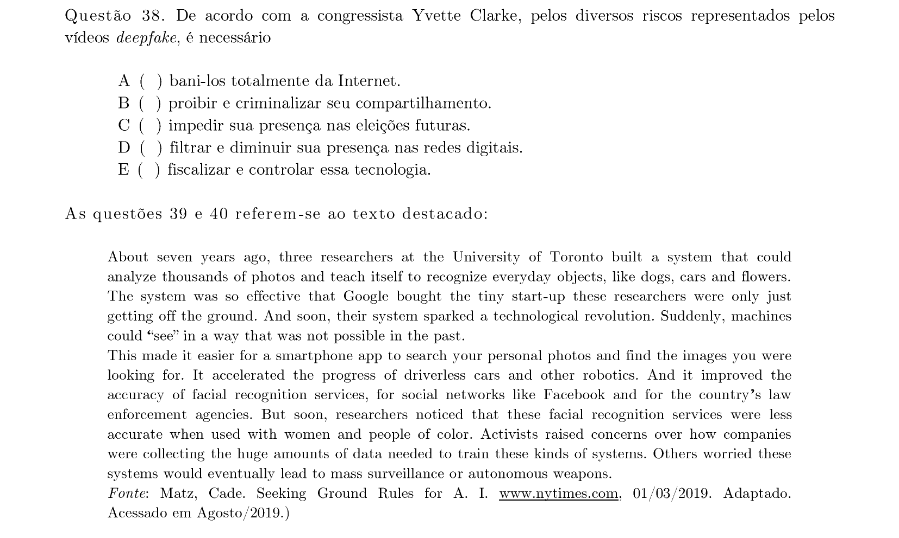
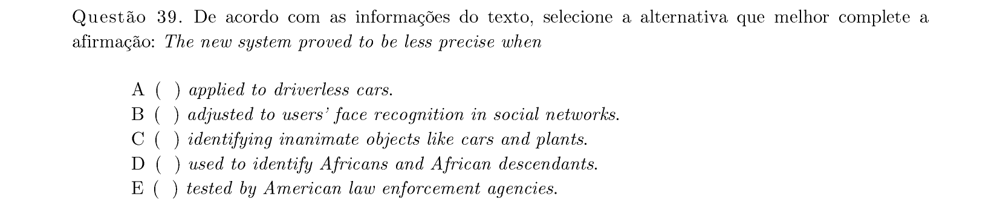
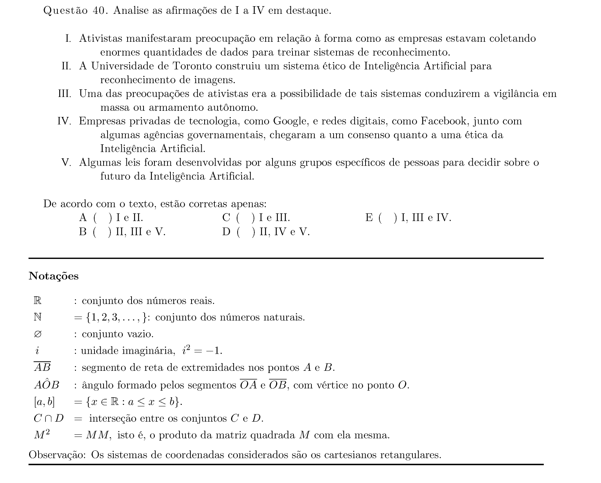

# Inglês — ITA 2020 (1ª fase)

> 10 questões múltipla escolha.

## Q31
**Assunto:** leitura, redes neurais e IA
**Competências:** análise de afirmações sobre aplicações de redes neurais
**Tipo:** múltipla escolha

## Q32
**Assunto:** vocabulário, sinônimos contextuais
**Competências:** substituição de palavras sublinhadas sem alteração de sentido
**Tipo:** múltipla escolha

## Q33
**Assunto:** leitura, compreensão textual (1984 de Orwell)
**Competências:** identificação de motivo no texto
**Tipo:** múltipla escolha

## Q34
**Assunto:** vocabulário, conectivos
**Competências:** substituição do termo "rather" em contexto
**Tipo:** múltipla escolha

## Q35
**Assunto:** leitura, compreensão textual
**Competências:** identificação de afirmação incorreta sobre o texto
**Tipo:** múltipla escolha

## Q36
**Assunto:** leitura, compreensão textual (deepfakes)
**Competências:** identificação de afirmação correta sobre o texto
**Tipo:** múltipla escolha

## Q37
**Assunto:** gramática, conectivos
**Competências:** sentido de "but also" em trecho; relação semântica
**Tipo:** múltipla escolha

## Q38
**Assunto:** leitura, compreensão textual
**Competências:** identificação de proposta sobre deepfakes
**Tipo:** múltipla escolha

## Q39
**Assunto:** leitura, compreensão textual
**Competências:** completar afirmação conforme informações do texto
**Tipo:** múltipla escolha

## Q40
**Assunto:** leitura, compreensão textual
**Competências:** análise de afirmações I a IV sobre o texto
**Tipo:** múltipla escolha

