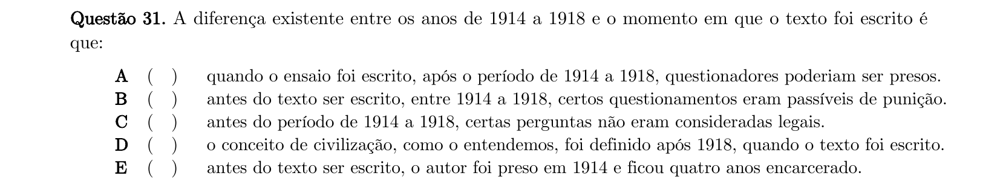
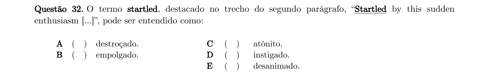
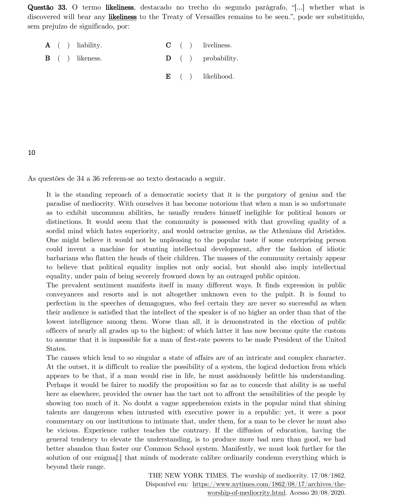
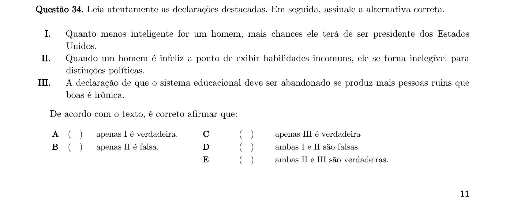
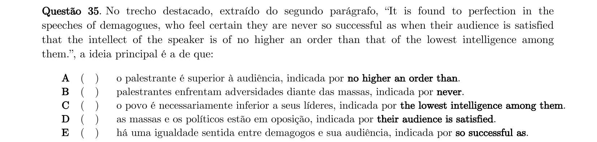
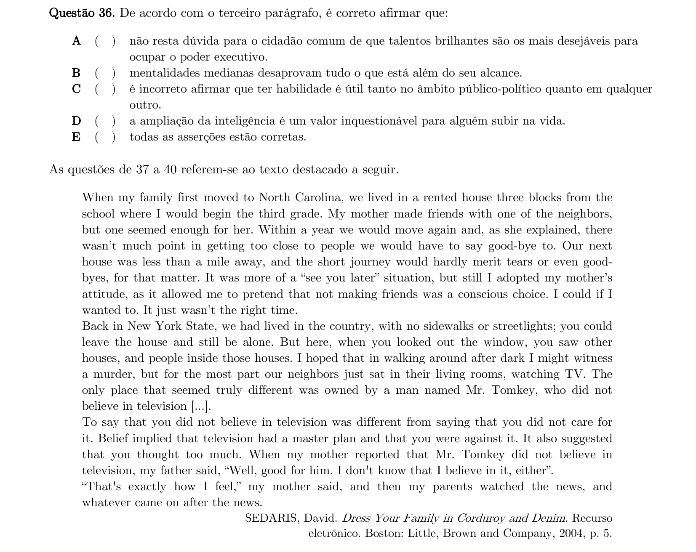
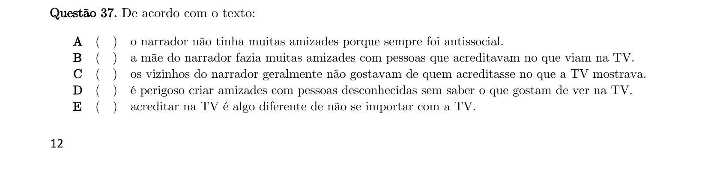
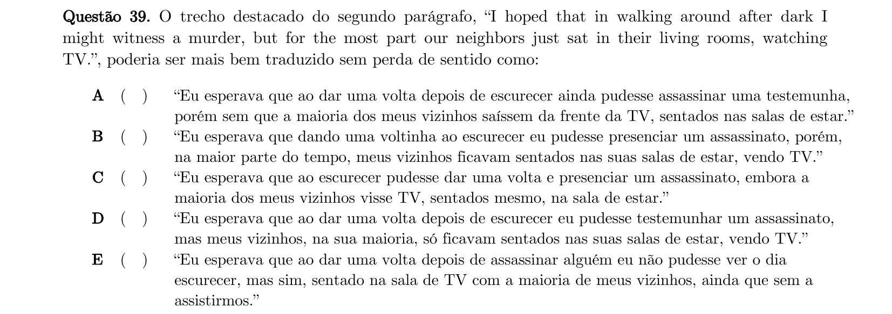
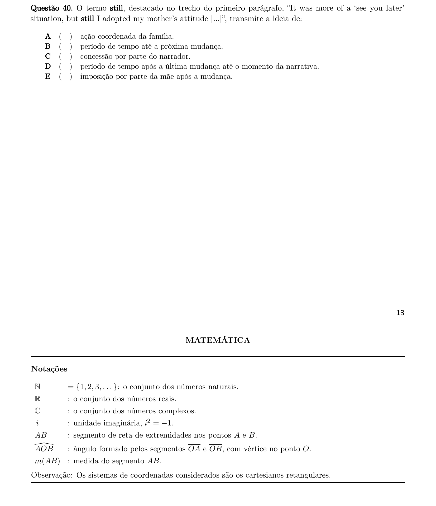

# Inglês — ITA 2021 (1ª fase)

> 10 questões múltipla escolha.

## Q31
**Assunto:** compreensão de texto, Civilization (Clive Bell)
**Competências:** contraste entre o período da Grande Guerra e o pós-guerra, contexto histórico
**Tipo:** múltipla escolha

## Q32
**Assunto:** vocabulário
**Competências:** significado de "startled" em contexto
**Tipo:** múltipla escolha

## Q33
**Assunto:** vocabulário, sinonímia
**Competências:** substituição de "likeliness" sem perda de sentido
**Tipo:** múltipla escolha

## Q34
**Assunto:** compreensão de texto, The Worship of Mediocrity (NYT, 1862)
**Competências:** análise de afirmativas, ironia, mediocridade na política
**Tipo:** múltipla escolha

## Q35
**Assunto:** interpretação de texto
**Competências:** ideia principal sobre demagogos e audiência, marcadores textuais
**Tipo:** múltipla escolha

## Q36
**Assunto:** interpretação de texto
**Competências:** análise do terceiro parágrafo, mentalidade mediana e condenação do superior
**Tipo:** múltipla escolha

## Q37
**Assunto:** compreensão de texto, Dress Your Family in Corduroy and Denim (David Sedaris)
**Competências:** compreensão geral, distinção entre não acreditar e não se importar
**Tipo:** múltipla escolha

## Q38
**Assunto:** figuras de linguagem
**Competências:** identificação de ironia e sarcasmo em parágrafos
**Tipo:** múltipla escolha

## Q39
**Assunto:** tradução
**Competências:** tradução de trecho preservando sentido, modalizadores
**Tipo:** múltipla escolha

## Q40
**Assunto:** vocabulário, semântica
**Competências:** significado de "still" em contexto, ideia de concessão
**Tipo:** múltipla escolha

