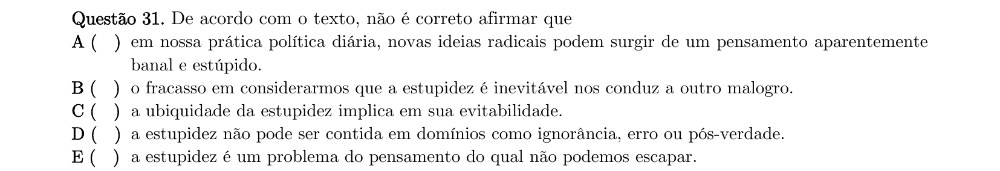
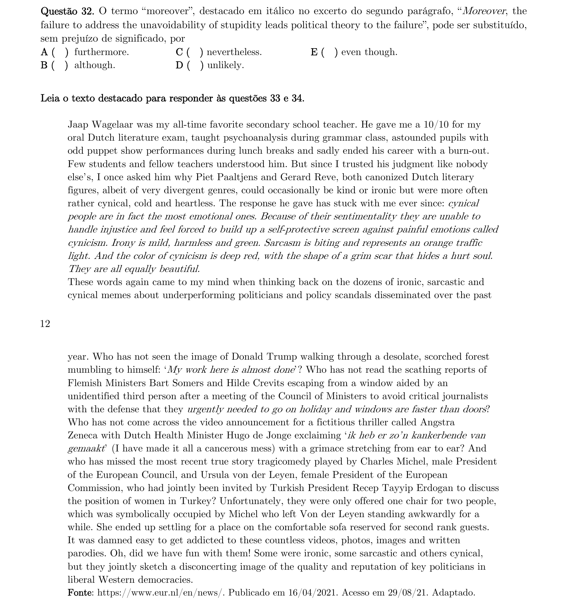
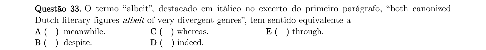
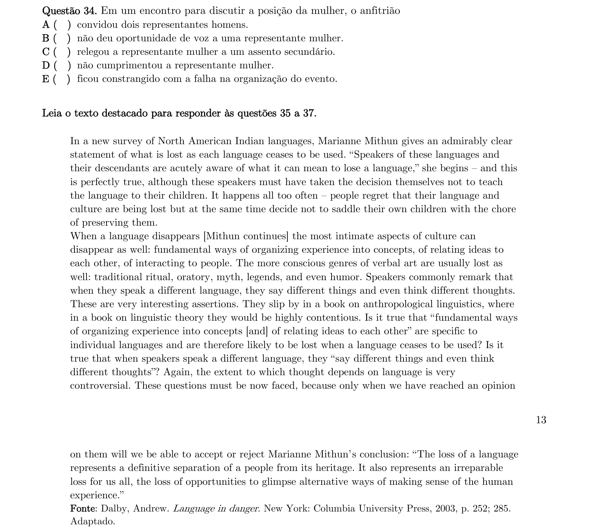
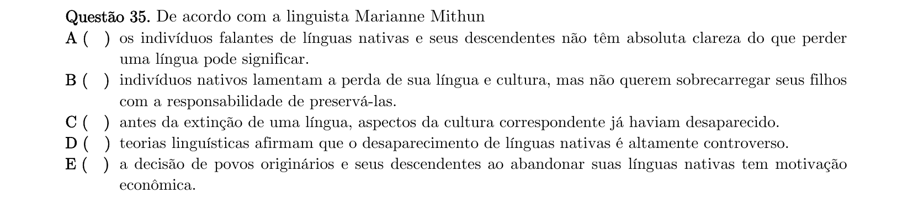
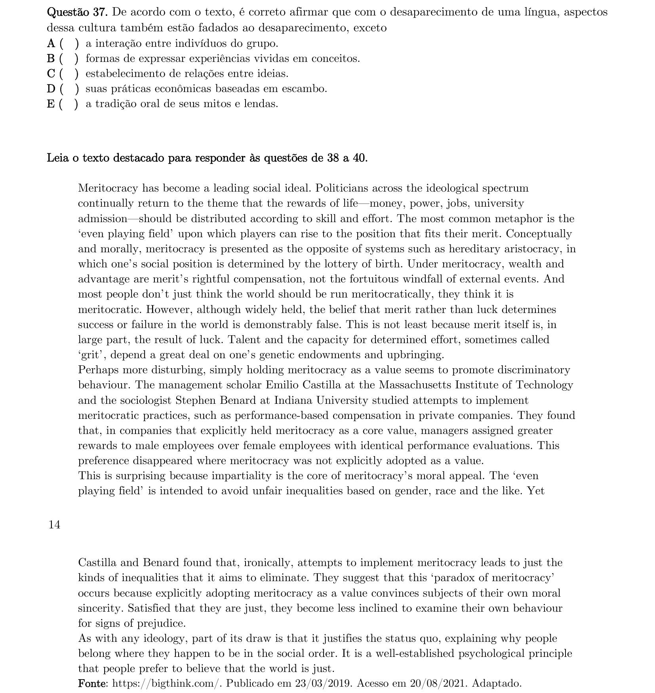
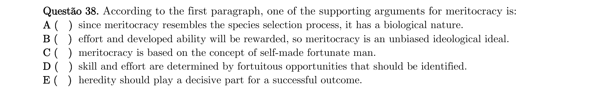
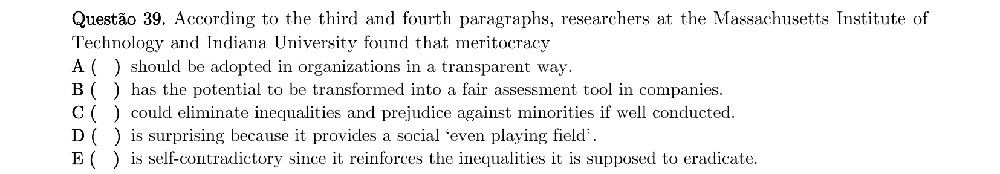
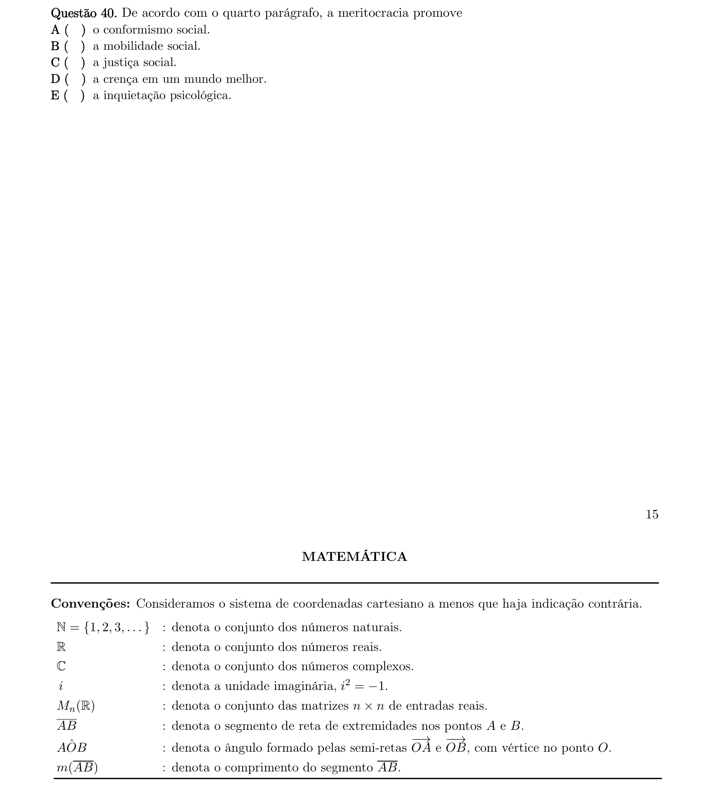

# Inglês — ITA 2022 (1ª fase)

> 10 questões múltipla escolha.

## Q31
**Assunto:** compreensão textual
**Competências:** texto sobre estupidez na política (Otobe), identificar afirmação incorreta
**Tipo:** múltipla escolha

## Q32
**Assunto:** vocabulário, conectivos
**Competências:** sinônimo de "moreover", relações de adição
**Tipo:** múltipla escolha

## Q33
**Assunto:** vocabulário, conjunções
**Competências:** sinônimo de "albeit", concessão
**Tipo:** múltipla escolha

## Q34
**Assunto:** compreensão textual
**Competências:** texto sobre cinismo e memes políticos, episódio Michel/Von der Leyen, hierarquia de assentos
**Tipo:** múltipla escolha

## Q35
**Assunto:** compreensão textual
**Competências:** texto sobre desaparecimento de línguas (Mithun/Dalby), atitude dos falantes nativos
**Tipo:** múltipla escolha

## Q36
**Assunto:** gramática, verbos modais
**Competências:** substituição de "must" sem alterar significado, equivalência com "ought to"
**Tipo:** múltipla escolha

## Q37
**Assunto:** compreensão textual
**Competências:** texto sobre línguas, aspectos culturais perdidos com extinção linguística
**Tipo:** múltipla escolha

## Q38
**Assunto:** compreensão textual
**Competências:** texto sobre meritocracia, argumentos a favor, recompensa por esforço
**Tipo:** múltipla escolha

## Q39
**Assunto:** compreensão textual
**Competências:** paradoxo da meritocracia, pesquisa de Castilla e Benard, contradição interna
**Tipo:** múltipla escolha

## Q40
**Assunto:** compreensão textual
**Competências:** meritocracia como justificadora do status quo, conformismo social
**Tipo:** múltipla escolha

