# Inglês — ITA 2023 (1ª fase)

> 12 questões múltipla escolha (Q25–Q36 da prova consolidada).

## Q25
**Assunto:** leitura e interpretação
**Competências:** texto sobre Estados não reconhecidos, compreensão geral
**Tipo:** múltipla escolha

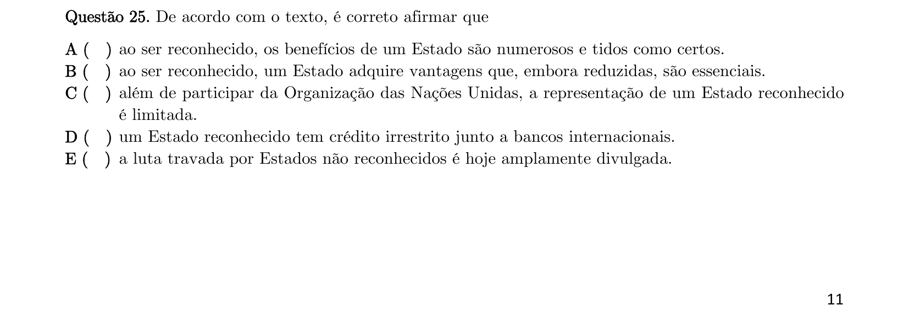

## Q26
**Assunto:** leitura e interpretação
**Competências:** populações de Estados não reconhecidos, identificação de afirmação incorreta
**Tipo:** múltipla escolha

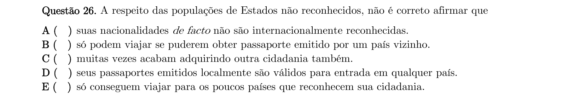

## Q27
**Assunto:** vocabulário, gramática
**Competências:** conector "Although", relação de contraste
**Tipo:** múltipla escolha

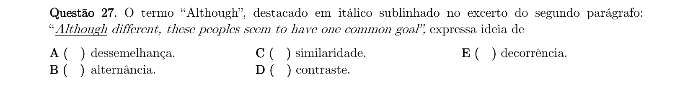

## Q28
**Assunto:** vocabulário, gramática
**Competências:** conector "whereas", sinônimos
**Tipo:** múltipla escolha

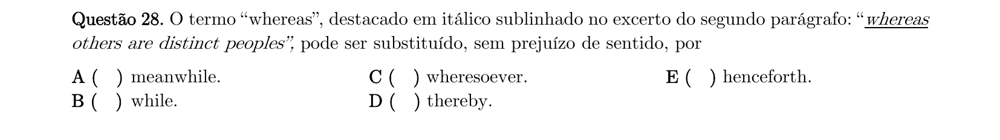

## Q29
**Assunto:** vocabulário
**Competências:** significado de "allegiance", sinônimos
**Tipo:** múltipla escolha

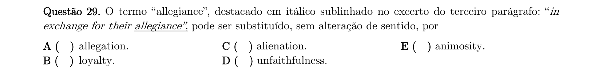

## Q30
**Assunto:** gramática
**Competências:** uso enfático do auxiliar "do"
**Tipo:** múltipla escolha

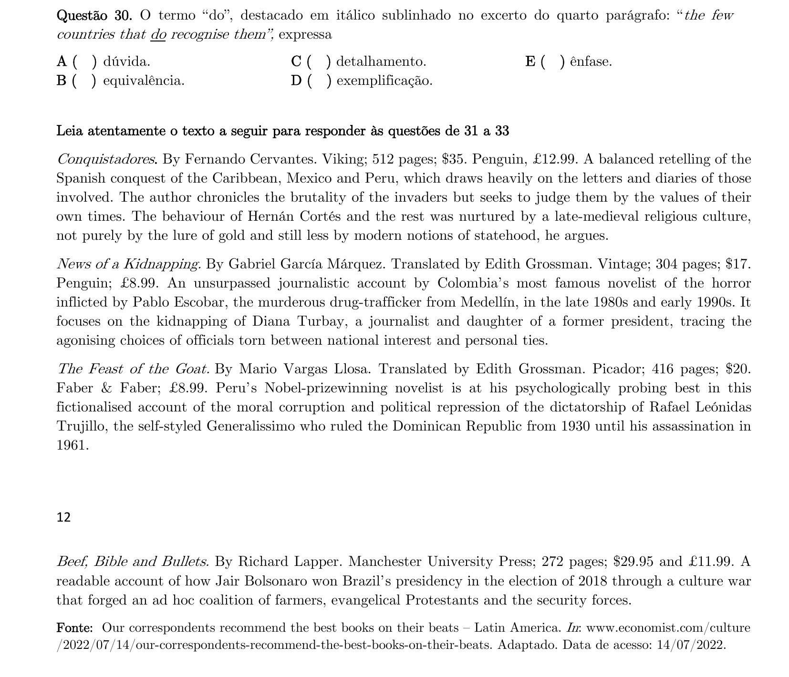

## Q31
**Assunto:** leitura e interpretação
**Competências:** resenhas de livros sobre América Latina, identificação de enredos do século XX
**Tipo:** múltipla escolha

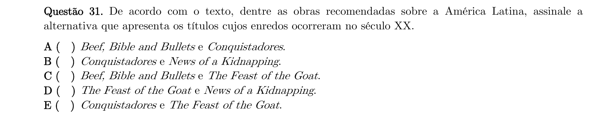

## Q32
**Assunto:** leitura e interpretação
**Competências:** texto sobre Conquistadores de Fernando Cervantes
**Tipo:** múltipla escolha

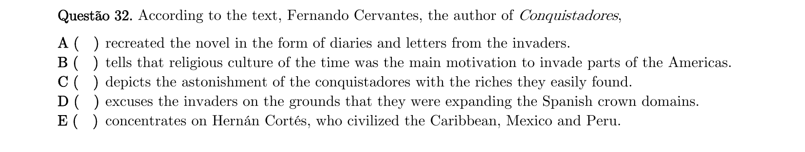

## Q33
**Assunto:** vocabulário, leitura e interpretação
**Competências:** expressão "self-styled", significado contextual
**Tipo:** múltipla escolha

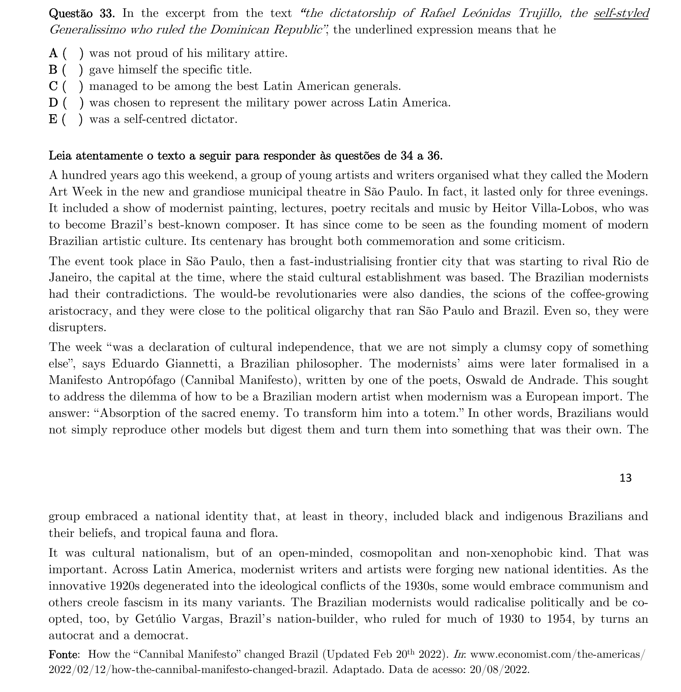

## Q34
**Assunto:** leitura e interpretação
**Competências:** Semana de Arte Moderna, expressão "Even so"
**Tipo:** múltipla escolha

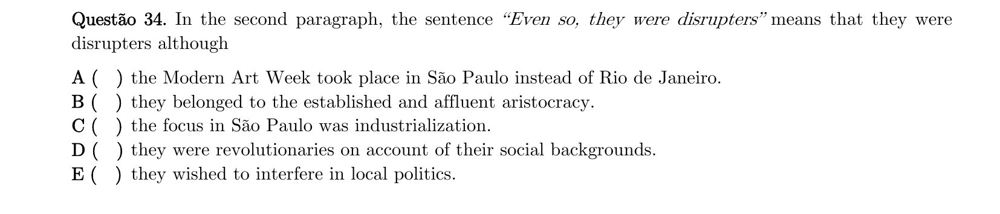

## Q35
**Assunto:** leitura e interpretação
**Competências:** análise do Manifesto Antropófago, ideia principal de parágrafo
**Tipo:** múltipla escolha

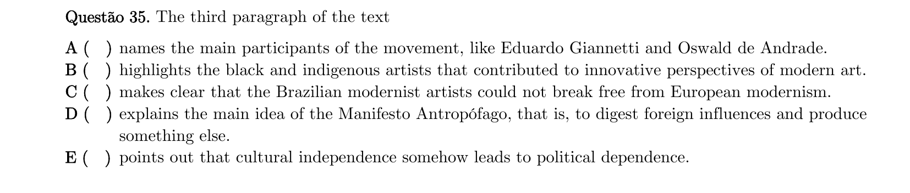

## Q36
**Assunto:** gramática, leitura e interpretação
**Competências:** referência do pronome "that", coesão textual
**Tipo:** múltipla escolha

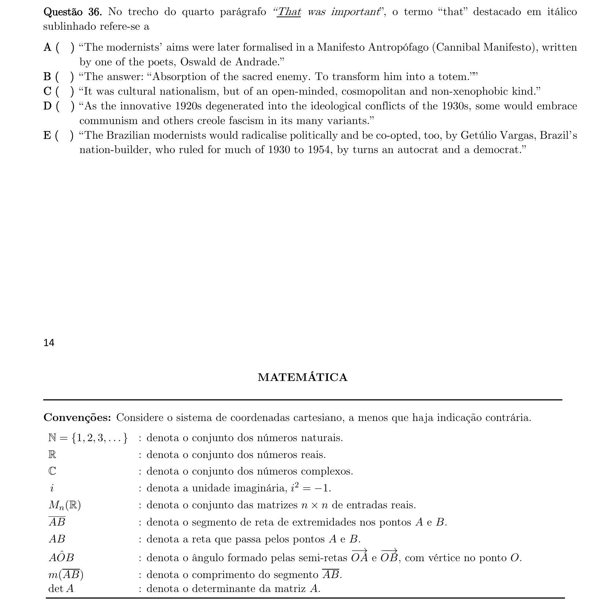
