# Inglês — ITA 2024 (1ª fase)

> 12 questões múltipla escolha (Q25–Q36 da prova consolidada). Dois textos-base: "Read Your Way Through Salvador" (Itamar Vieira Junior, NYT, 2023) para Q25–30; e texto sobre o Woolf Social Club / feminismo na Coreia do Sul (The Economist, 2022) para Q31–36.

## Q25
**Assunto:** interpretação de texto (Read Your Way Through Salvador)
**Competências:** identificação da intenção principal do autor
**Tipo:** múltipla escolha

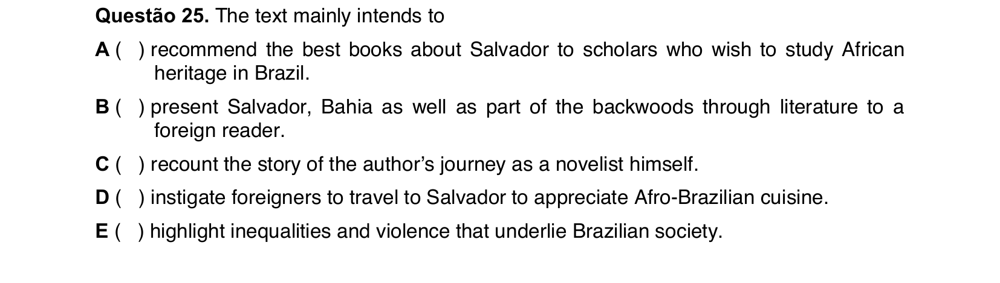

## Q26
**Assunto:** interpretação de texto (Read Your Way Through Salvador)
**Competências:** compreensão de recomendação textual, propósito de citação de livro
**Tipo:** múltipla escolha

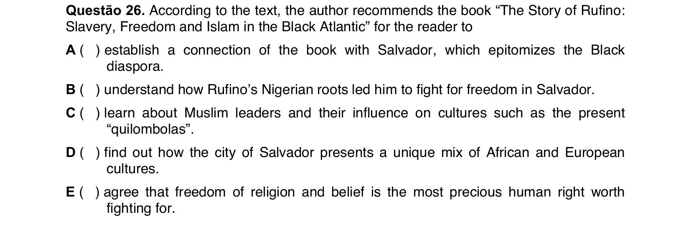

## Q27
**Assunto:** interpretação de texto (Read Your Way Through Salvador)
**Competências:** comparação entre livros citados, personagens principais
**Tipo:** múltipla escolha

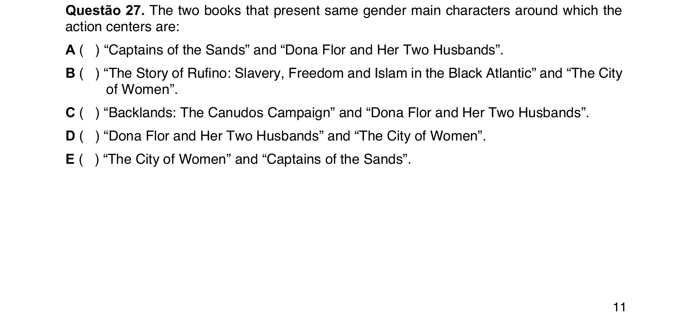

## Q28
**Assunto:** vocabulário / morfologia
**Competências:** prefixos de negação em inglês (dis-, il-, ir-, un-)
**Tipo:** múltipla escolha

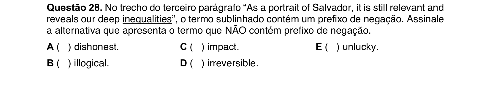

## Q29
**Assunto:** vocabulário / conectivos
**Competências:** substituição de "while" por sinônimo contextual
**Tipo:** múltipla escolha

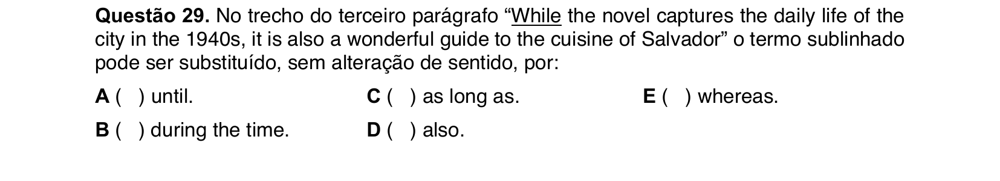

## Q30
**Assunto:** interpretação de texto (Read Your Way Through Salvador)
**Competências:** compreensão da função dos livros citados, paisagem e literatura
**Tipo:** múltipla escolha

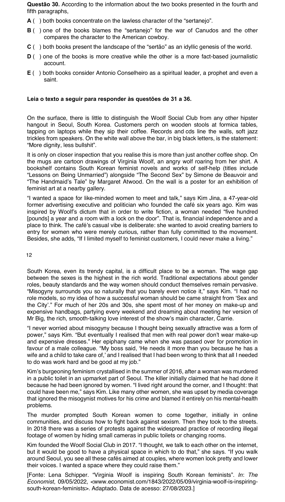

## Q31
**Assunto:** interpretação de texto (Woolf Social Club / Coreia do Sul)
**Competências:** propósito do espaço Woolf Social Club, contexto sociocultural
**Tipo:** múltipla escolha

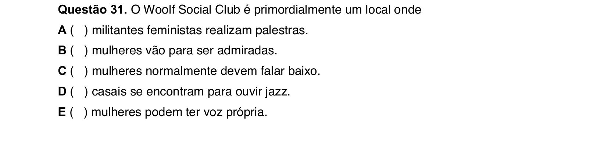

## Q32
**Assunto:** vocabulário
**Competências:** significado de "alongside" em contexto
**Tipo:** múltipla escolha

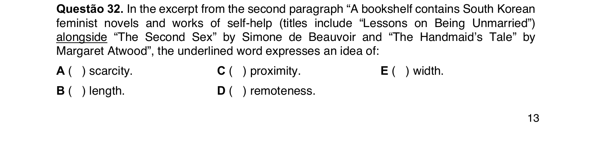

## Q33
**Assunto:** interpretação de texto (Woolf Social Club)
**Competências:** motivação da fundadora, referências a Virginia Woolf
**Tipo:** múltipla escolha

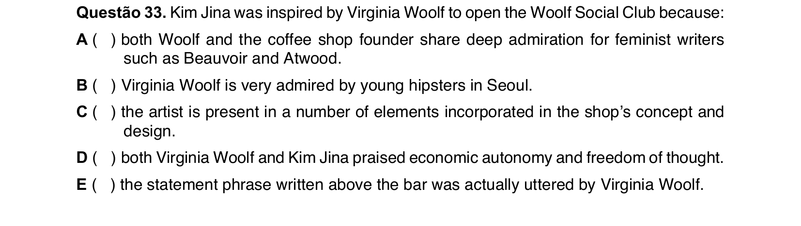

## Q34
**Assunto:** vocabulário
**Competências:** significado de "like-minded" em contexto
**Tipo:** múltipla escolha

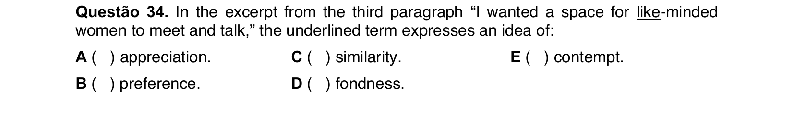

## Q35
**Assunto:** interpretação de texto (Coreia do Sul, feminismo)
**Competências:** dificuldades enfrentadas pelas mulheres coreanas, leitura crítica
**Tipo:** múltipla escolha (EXCETO)

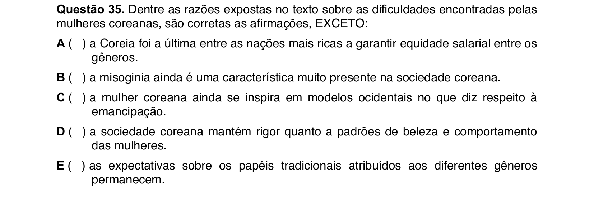

## Q36
**Assunto:** interpretação de texto (Coreia do Sul, feminismo)
**Competências:** análise de parágrafos específicos, estopim das manifestações anti-sexismo
**Tipo:** múltipla escolha

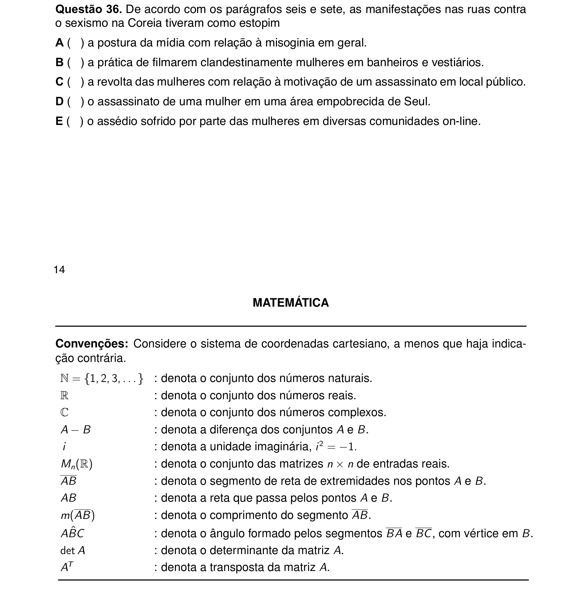
