# Matemática — ITA 2008

> 30 questões. Q01–Q20 múltipla escolha; Q21–Q30 discursivas.

## Q01
**Assunto:** probabilidade
**Competências:** probabilidade condicional, teorema de Bayes, eventos compostos
**Tipo:** múltipla escolha

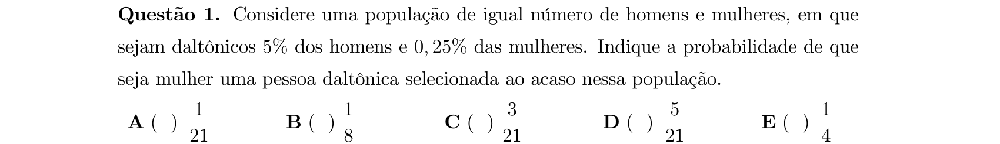

## Q02
**Assunto:** números complexos
**Competências:** módulo de complexo, operações algébricas, identidades com complexos
**Tipo:** múltipla escolha

## Q03
**Assunto:** sistemas lineares
**Competências:** discussão de sistemas, determinantes, escalonamento, parâmetros
**Tipo:** múltipla escolha

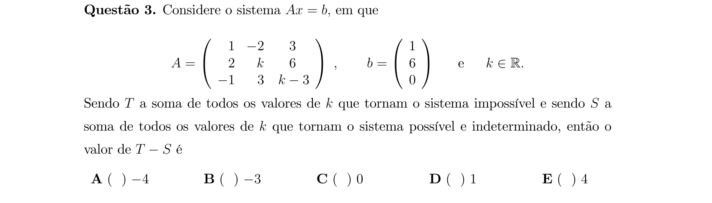

## Q04
**Assunto:** determinantes
**Competências:** propriedades de determinantes, matriz inversa, matriz transposta
**Tipo:** múltipla escolha

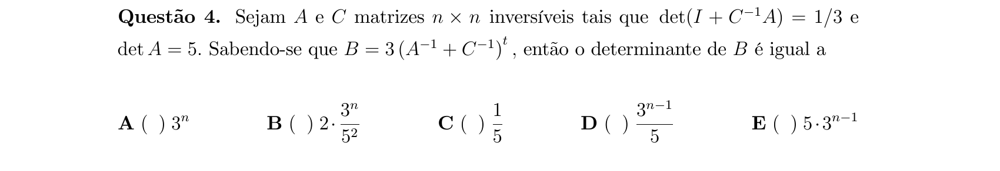

## Q05
**Assunto:** progressões
**Competências:** progressão geométrica, soma de termos, polinômios e graus
**Tipo:** múltipla escolha

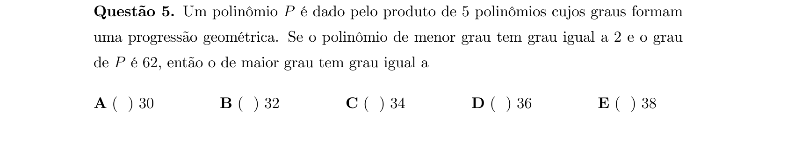

## Q06
**Assunto:** geometria espacial
**Competências:** esfera inscrita, diedro, volume da esfera, relações trigonométricas no espaço
**Tipo:** múltipla escolha

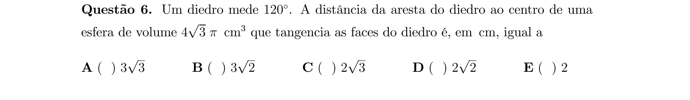

## Q07
**Assunto:** geometria plana
**Competências:** quadrado, semelhança, progressão geométrica, áreas
**Tipo:** múltipla escolha

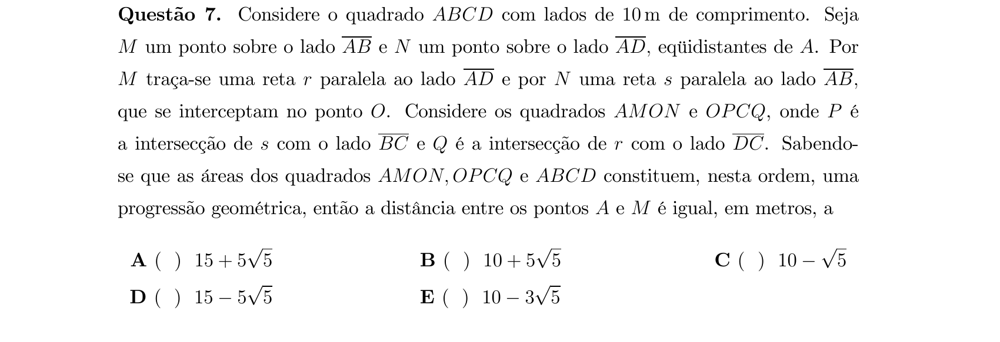

## Q08
**Assunto:** polinômios
**Competências:** raízes de polinômio, progressão aritmética, valor numérico
**Tipo:** múltipla escolha

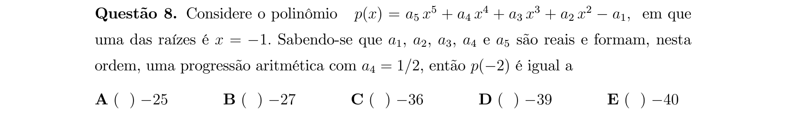

## Q09
**Assunto:** equações algébricas
**Competências:** raízes complexas conjugadas, relações de Girard, raízes inteiras
**Tipo:** múltipla escolha

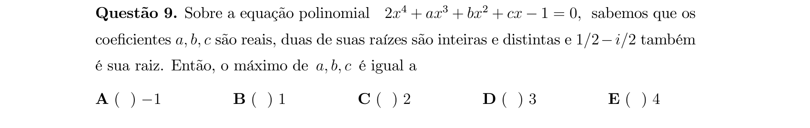

## Q10
**Assunto:** equações algébricas
**Competências:** equação recíproca, raízes, sistemas de equações
**Tipo:** múltipla escolha

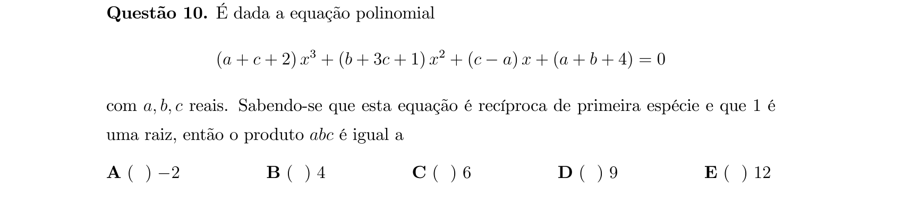

## Q11
**Assunto:** trigonometria
**Competências:** funções inversas trigonométricas, cosseno da soma, arcsen e arccos
**Tipo:** múltipla escolha

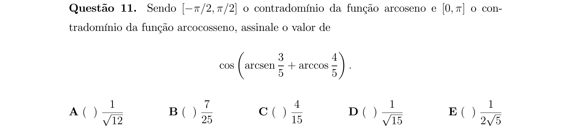

## Q12
**Assunto:** geometria analítica
**Competências:** hipérbole, reta tangente, reta perpendicular, derivada implícita
**Tipo:** múltipla escolha

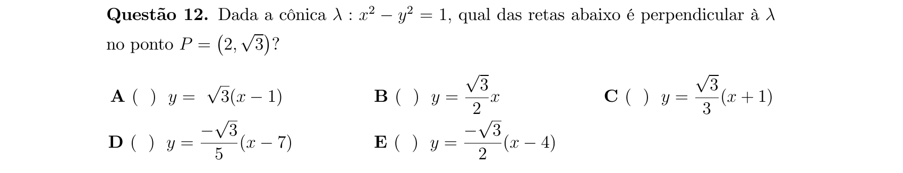

## Q13
**Assunto:** trigonometria
**Competências:** identidades trigonométricas, período de função, conjunto imagem
**Tipo:** múltipla escolha

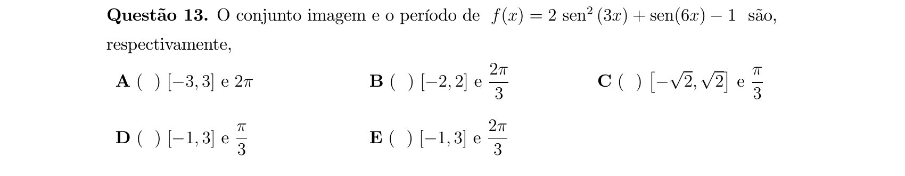

## Q14
**Assunto:** logaritmos
**Competências:** equações exponenciais, mudança de variável, módulo, logaritmo na base 5
**Tipo:** múltipla escolha

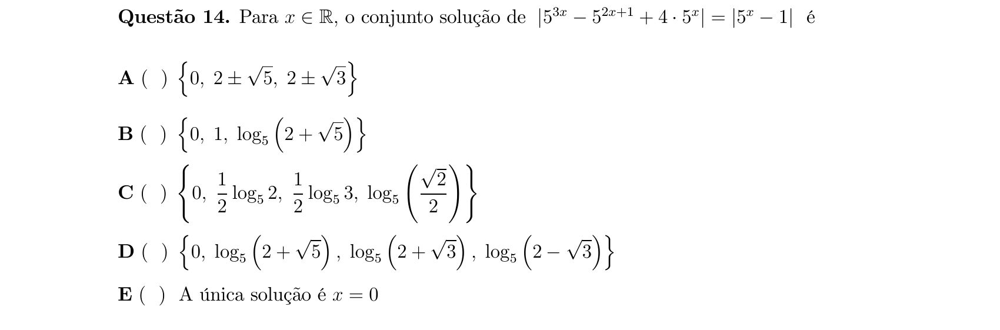

## Q15
**Assunto:** funções
**Competências:** injetividade, domínio, logaritmo natural, função composta
**Tipo:** múltipla escolha

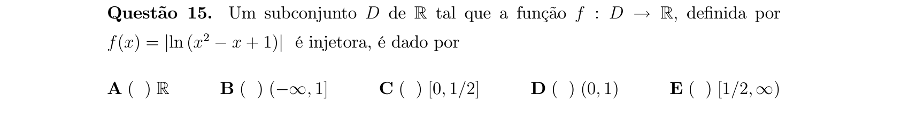

## Q16
**Assunto:** trigonometria
**Competências:** equação trigonométrica, soma de cossenos, transformação em produto
**Tipo:** múltipla escolha

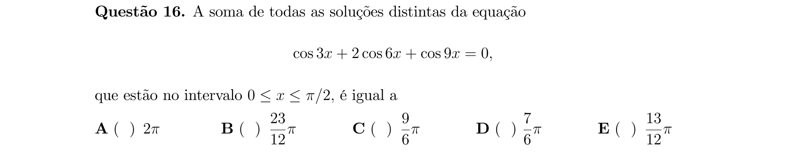

## Q17
**Assunto:** análise combinatória
**Competências:** combinações, probabilidade clássica, contagem de pares com soma fixa
**Tipo:** múltipla escolha

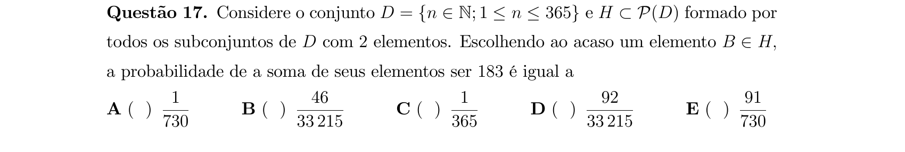

## Q18
**Assunto:** geometria plana
**Competências:** triângulo isósceles, soma de ângulos, ângulos internos
**Tipo:** múltipla escolha

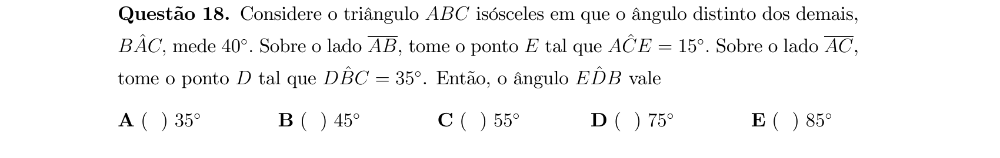

## Q19
**Assunto:** números reais
**Competências:** teoria de conjuntos, operações com conjuntos, diferença e interseção
**Tipo:** múltipla escolha

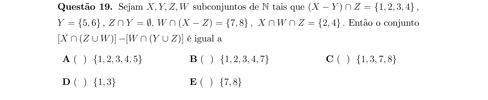

## Q20
**Assunto:** geometria plana
**Competências:** triângulo equilátero, distância ponto-reta, área e perímetro
**Tipo:** múltipla escolha

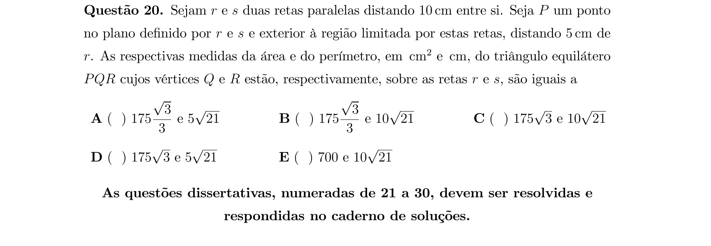

## Q21
**Assunto:** números reais
**Competências:** inequações com radicais, sinal de expressão, intervalos da reta
**Tipo:** discursiva

## Q22
**Assunto:** números complexos
**Competências:** raízes da unidade, forma polar, lugar geométrico no plano complexo
**Tipo:** discursiva

## Q23
**Assunto:** funções
**Competências:** decomposição par/ímpar, logaritmo, propriedade ln(a)+ln(b)=ln(ab)
**Tipo:** discursiva

## Q24
**Assunto:** polinômios
**Competências:** multiplicidade de raiz, sistemas lineares em parâmetros, coeficientes
**Tipo:** discursiva

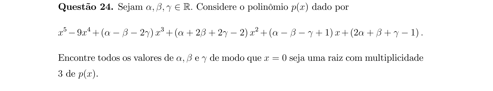

## Q25
**Assunto:** matrizes
**Competências:** matriz ortogonal, matriz simétrica, transposta, classificação
**Tipo:** discursiva

## Q26
**Assunto:** equações algébricas
**Competências:** equação biquadrada, discriminante, tangente, raízes reais distintas
**Tipo:** discursiva

## Q27
**Assunto:** probabilidade
**Competências:** independência, probabilidade condicional, união e interseção de eventos
**Tipo:** discursiva

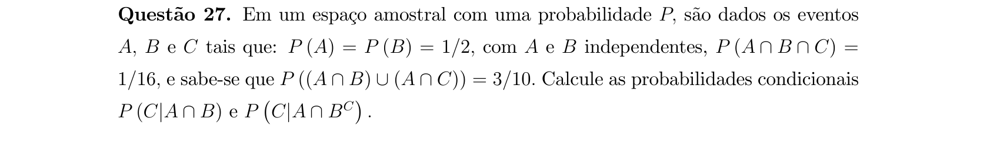

## Q28
**Assunto:** geometria plana
**Competências:** triângulo inscrito, lei dos senos, área de triângulo
**Tipo:** discursiva

## Q29
**Assunto:** geometria espacial
**Competências:** sólido de revolução, volume, triângulo equilátero inscrito, circunferência
**Tipo:** discursiva

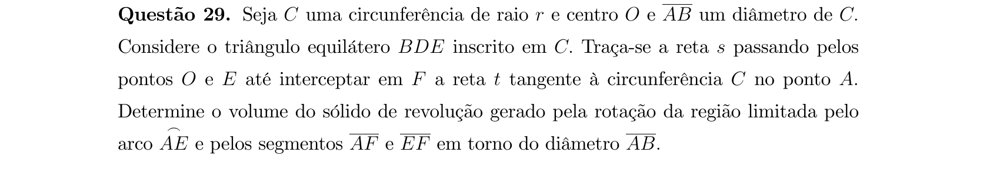

## Q30
**Assunto:** geometria analítica
**Competências:** parábola, reta tangente, progressão aritmética, distância ponto-reta
**Tipo:** discursiva

