# Matemática — ITA 2009

> 30 questões. Q01–Q20 múltipla escolha; Q21–Q30 discursivas.

## Q01
**Assunto:** combinatória
**Competências:** teoria dos conjuntos, operações com conjuntos, conjunto das partes, cardinalidade
**Tipo:** múltipla escolha

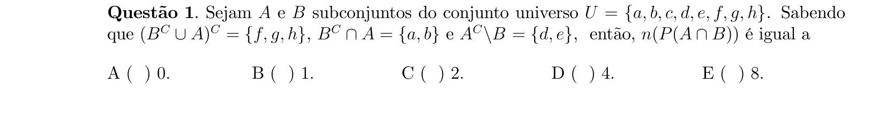

## Q02
**Assunto:** combinatória
**Competências:** princípio da inclusão-exclusão, contagem com porcentagens, raciocínio lógico
**Tipo:** múltipla escolha

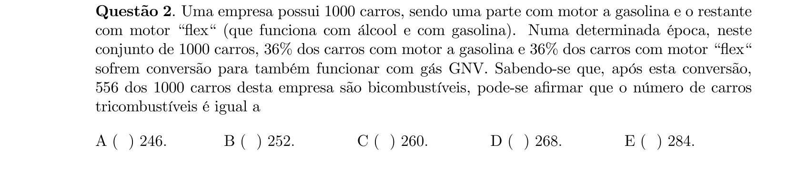

## Q03
**Assunto:** funções
**Competências:** equações funcionais, injetividade, paridade, sobrejetividade
**Tipo:** múltipla escolha

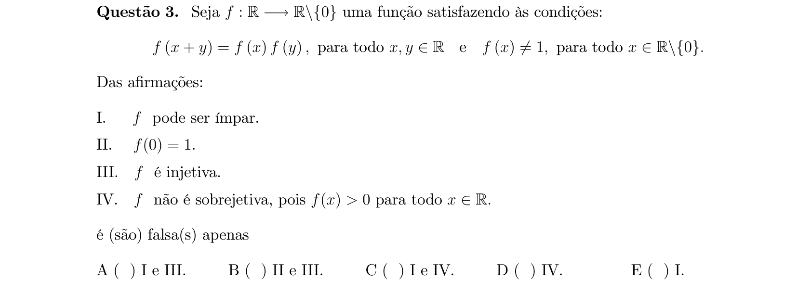

## Q04
**Assunto:** números complexos
**Competências:** forma trigonométrica, fórmula de De Moivre, potenciação de complexos, identidades trigonométricas
**Tipo:** múltipla escolha

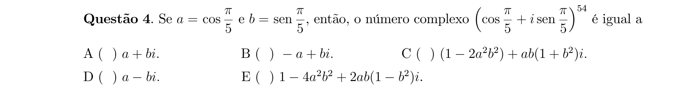

## Q05
**Assunto:** polinômios
**Competências:** funções pares, identificação de coeficientes, raízes de polinômio, soma de módulos
**Tipo:** múltipla escolha

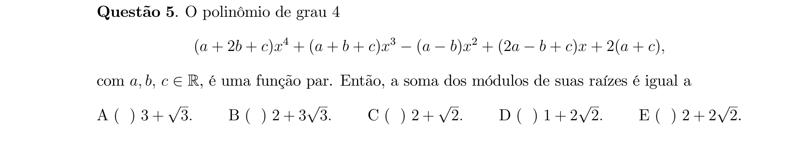

## Q06
**Assunto:** polinômios
**Competências:** composição de funções, raízes complexas, multiplicidade de raízes, fatoração
**Tipo:** múltipla escolha

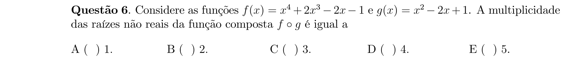

## Q07
**Assunto:** polinômios
**Competências:** equações recíprocas, raízes complexas conjugadas, propriedades de raízes
**Tipo:** múltipla escolha

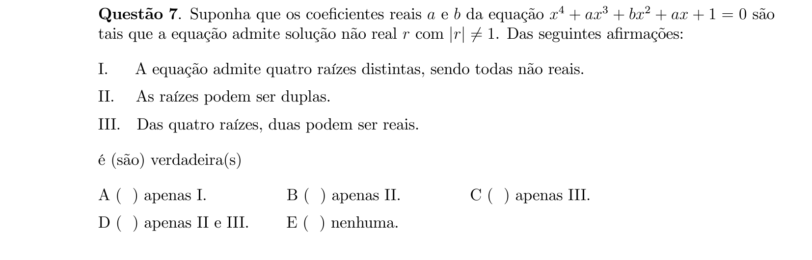

## Q08
**Assunto:** polinômios
**Competências:** relações de Girard, progressão geométrica, raízes em PG
**Tipo:** múltipla escolha

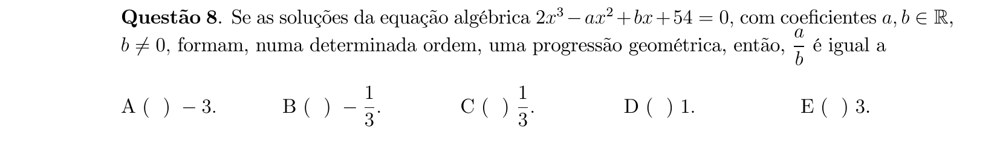

## Q09
**Assunto:** matrizes
**Competências:** mínimos quadrados, sistemas sobredeterminados, equações normais, álgebra matricial
**Tipo:** múltipla escolha

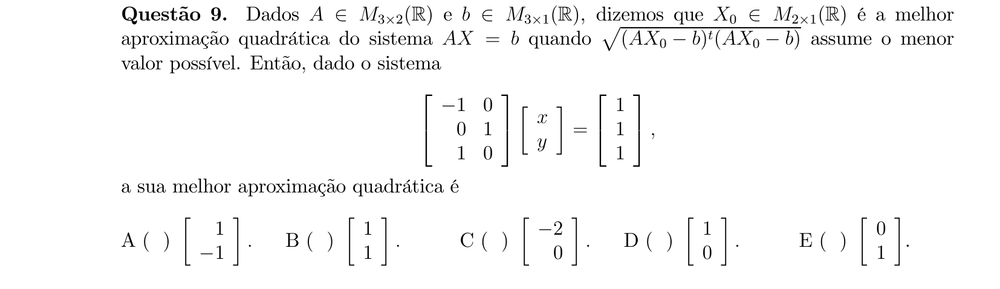

## Q10
**Assunto:** matrizes
**Competências:** classificação de sistemas, ortogonalidade, discussão de soluções
**Tipo:** múltipla escolha

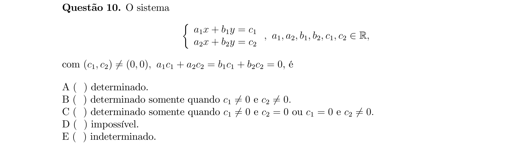

## Q11
**Assunto:** matrizes
**Competências:** matrizes simétricas, autovalores, progressão geométrica, traço de matriz
**Tipo:** múltipla escolha

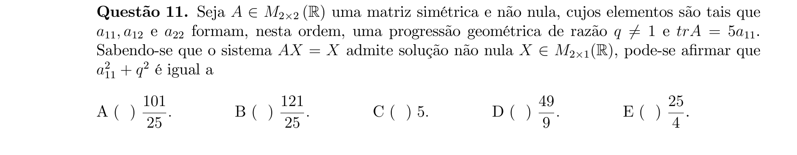

## Q12
**Assunto:** combinatória
**Competências:** teorema de Bayes, probabilidade condicional, probabilidade total
**Tipo:** múltipla escolha

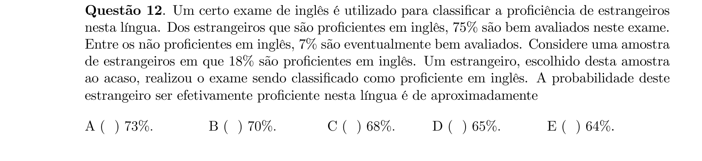

## Q13
**Assunto:** trigonometria
**Competências:** lei dos cossenos, raiz dupla em equação quadrática, triângulo retângulo
**Tipo:** múltipla escolha

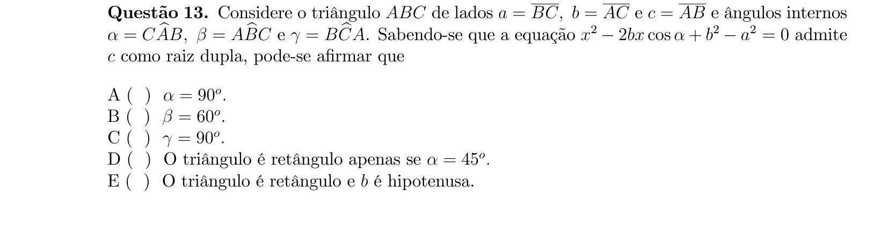

## Q14
**Assunto:** geometria analítica
**Competências:** lugar geométrico, distância ponto-reta, distância entre pontos, equação da circunferência
**Tipo:** múltipla escolha

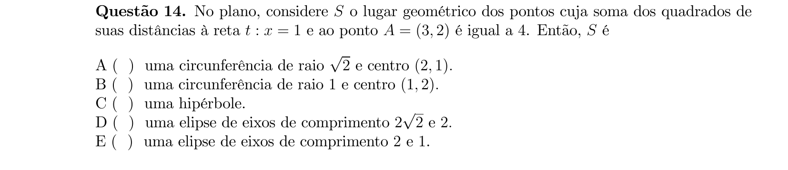

## Q15
**Assunto:** geometria plana
**Competências:** triângulo inscrito, lei dos senos, raio da circunferência inscrita, área de triângulo
**Tipo:** múltipla escolha

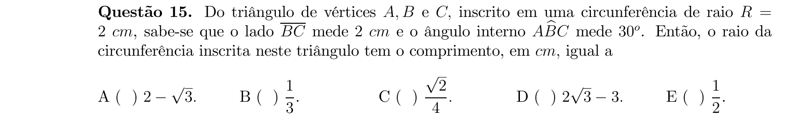

## Q16
**Assunto:** geometria analítica
**Competências:** parábola, equação reduzida, vértice e foco, parâmetro da parábola
**Tipo:** múltipla escolha

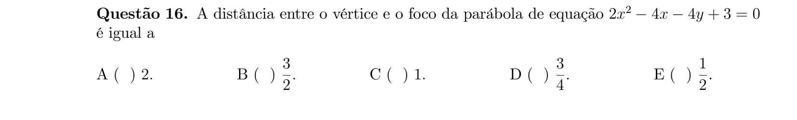

## Q17
**Assunto:** trigonometria
**Competências:** identidades trigonométricas, arco metade, redução ao primeiro quadrante, simplificação
**Tipo:** múltipla escolha

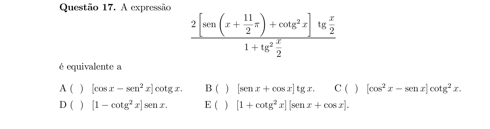

## Q18
**Assunto:** geometria analítica
**Competências:** circunferência, corda e ponto médio, retas perpendiculares, equação da reta
**Tipo:** múltipla escolha

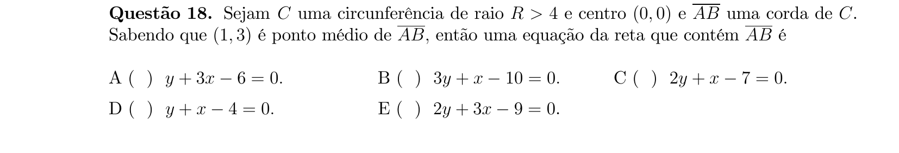

## Q19
**Assunto:** geometria espacial
**Competências:** cone reto, esfera inscrita, volume de sólidos, semelhança e trigonometria
**Tipo:** múltipla escolha

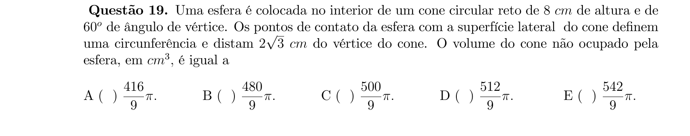

## Q20
**Assunto:** geometria espacial
**Competências:** cubo, octaedro regular, pontos médios das faces, área lateral
**Tipo:** múltipla escolha

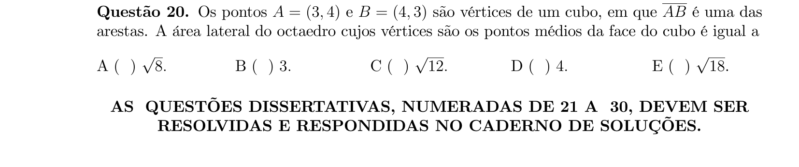

## Q21
**Assunto:** funções
**Competências:** inequações com logaritmo, base variável, domínio do logaritmando, complemento de conjunto
**Tipo:** discursiva

## Q22
**Assunto:** números complexos
**Competências:** parte real e imaginária, regiões no plano, inequações em R^2, esboço de conjuntos
**Tipo:** discursiva

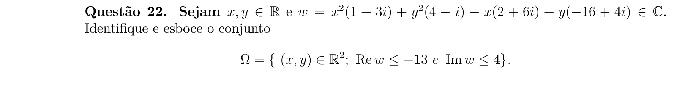

## Q23
**Assunto:** funções
**Competências:** função racional, injetividade, imagem da função, função inversa
**Tipo:** discursiva

## Q24
**Assunto:** polinômios
**Competências:** raízes complexas conjugadas, progressão aritmética, relações de Girard, polinômios com coeficientes reais
**Tipo:** discursiva

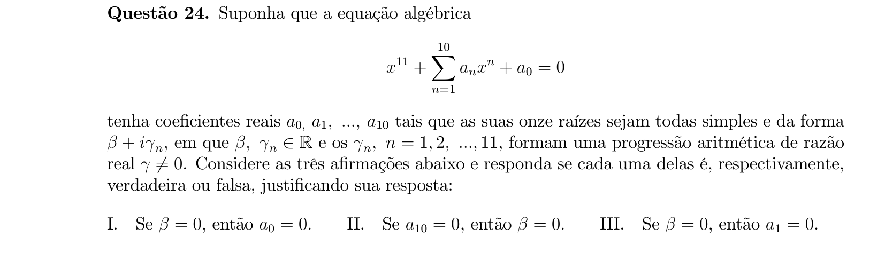

## Q25
**Assunto:** combinatória
**Competências:** distribuição binomial, prova de Bernoulli, cálculo de probabilidade cumulativa
**Tipo:** discursiva

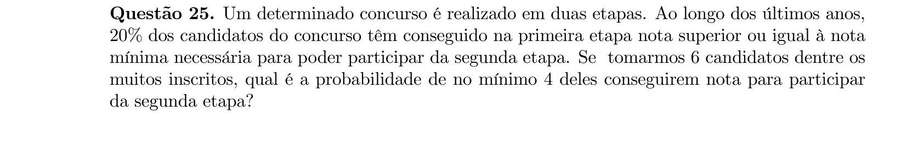

## Q26
**Assunto:** matrizes
**Competências:** matriz nula, demonstração, produto de matrizes, determinante e singularidade
**Tipo:** discursiva

## Q27
**Assunto:** trigonometria
**Competências:** equação trigonométrica, tangente de soma, intervalo de solução, seno de arco
**Tipo:** discursiva

## Q28
**Assunto:** geometria analítica
**Competências:** circunferência, reta tangente, ângulo entre retas, distância ponto-reta
**Tipo:** discursiva

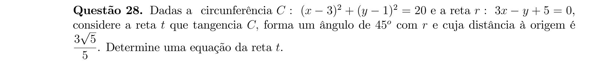

## Q29
**Assunto:** geometria analítica
**Competências:** feixe de retas, progressão aritmética de coeficientes angulares, reta tangente a circunferência, distância do centro à reta
**Tipo:** discursiva

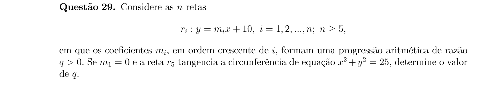

## Q30
**Assunto:** geometria espacial
**Competências:** pirâmide regular octogonal, apótema, área lateral e da base, volume de pirâmide
**Tipo:** discursiva

