# Matemática — ITA 2010

> 30 questões. Q01–Q20 múltipla escolha; Q21–Q30 discursivas.

## Q01
**Assunto:** conjuntos
**Competências:** teoria dos conjuntos, operações com conjuntos, diferença simétrica, leis de De Morgan
**Tipo:** múltipla escolha

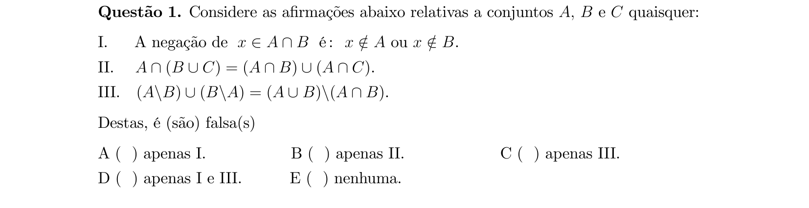

## Q02
**Assunto:** funções
**Competências:** domínio de funções reais, função logarítmica, função raiz quadrada, inequações, intersecção de intervalos
**Tipo:** múltipla escolha

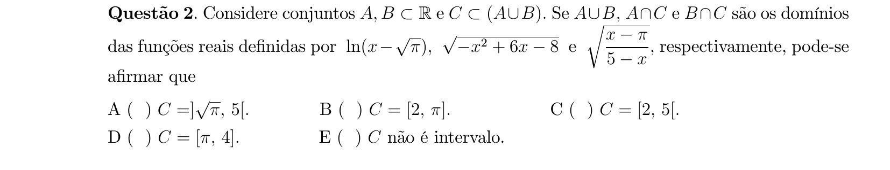

## Q03
**Assunto:** números complexos
**Competências:** módulo de complexo, conjugado, forma trigonométrica, potenciação de complexos
**Tipo:** múltipla escolha

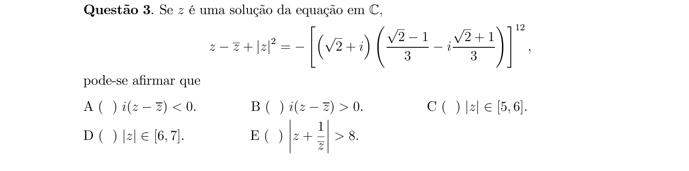

## Q04
**Assunto:** números complexos
**Competências:** argumento principal, equações em C, parte real e imaginária, conjugado
**Tipo:** múltipla escolha

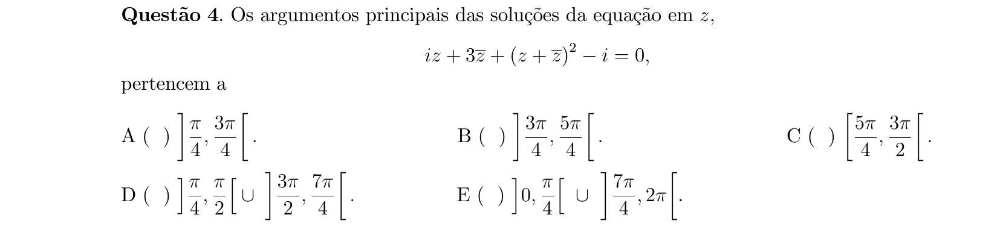

## Q05
**Assunto:** sequências e progressões
**Competências:** progressão aritmética, soma de termos, sistema linear, fórmula da soma de PA
**Tipo:** múltipla escolha

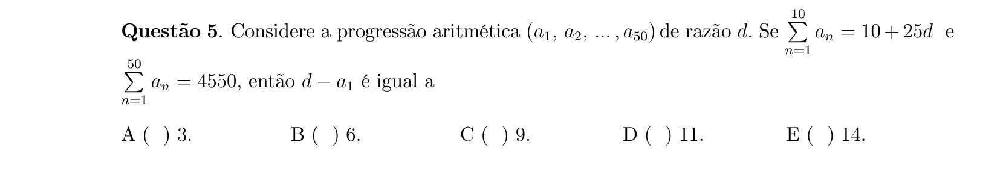

## Q06
**Assunto:** funções
**Competências:** funções pares e ímpares, composição de funções, produto de funções, paridade
**Tipo:** múltipla escolha

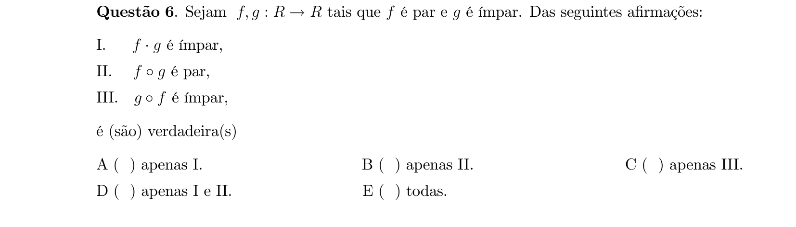

## Q07
**Assunto:** trigonometria
**Competências:** funções trigonométricas inversas, arctg, arccotg, equações transcendentes, análise de soluções
**Tipo:** múltipla escolha

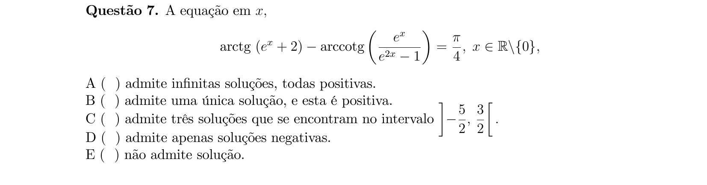

## Q08
**Assunto:** polinômios
**Competências:** raízes complexas conjugadas, multiplicidade de raízes, fatoração, polinômios com coeficientes reais
**Tipo:** múltipla escolha

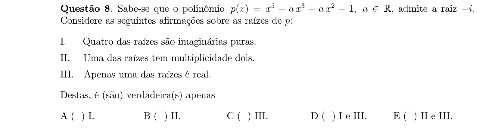

## Q09
**Assunto:** polinômios
**Competências:** raízes múltiplas, sistemas lineares, relações de Girard, avaliação polinomial
**Tipo:** múltipla escolha

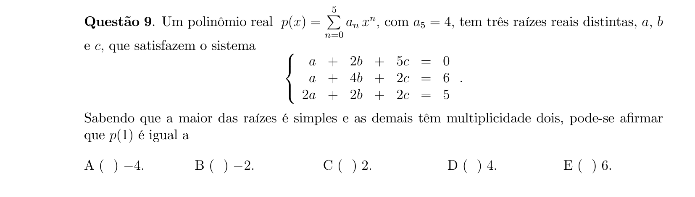

## Q10
**Assunto:** polinômios
**Competências:** recorrência, coeficientes complexos, módulo de polinômios, avaliação em valor específico
**Tipo:** múltipla escolha

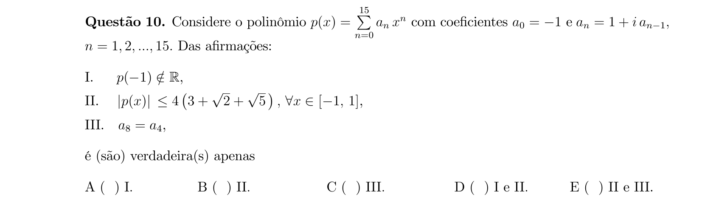

## Q11
**Assunto:** combinatória
**Competências:** binômio de Newton, simplificação de radicais, expansão de potências
**Tipo:** múltipla escolha

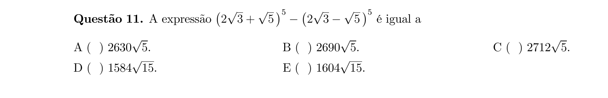

## Q12
**Assunto:** combinatória
**Competências:** distribuição binomial, ensaios independentes, combinações, soma de probabilidades
**Tipo:** múltipla escolha

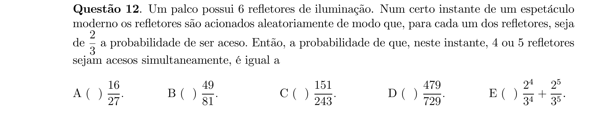

## Q13
**Assunto:** matrizes
**Competências:** matriz triangular, determinante como produto da diagonal, progressão aritmética, equações algébricas
**Tipo:** múltipla escolha

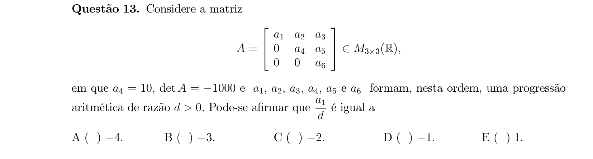

## Q14
**Assunto:** matrizes
**Competências:** matriz inversa, determinante, progressão geométrica, cofatores, propriedade det(A⁻¹) = 1/det(A)
**Tipo:** múltipla escolha

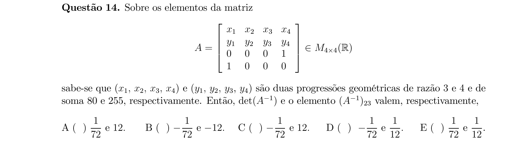

## Q15
**Assunto:** trigonometria
**Competências:** somatórios trigonométricos, produto em soma, soma telescópica, identidades trigonométricas
**Tipo:** múltipla escolha

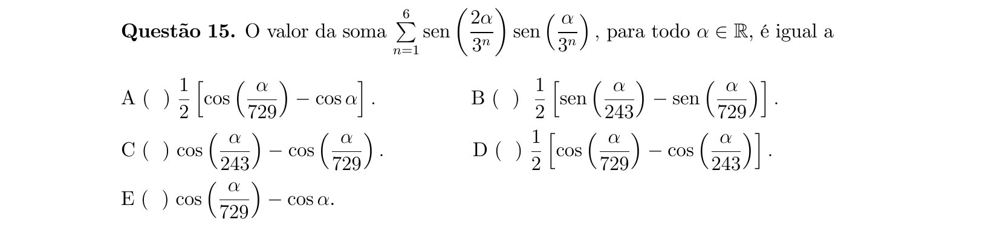

## Q16
**Assunto:** trigonometria
**Competências:** otimização trigonométrica, identidade soma de senos, derivada/análise de máximo, restrição linear
**Tipo:** múltipla escolha

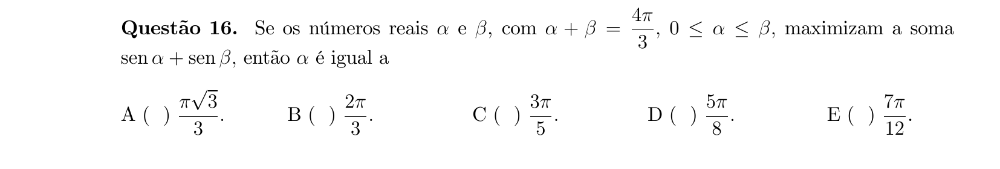

## Q17
**Assunto:** geometria analítica
**Competências:** equação da circunferência, tangente interna, distância entre pontos, triângulos semelhantes
**Tipo:** múltipla escolha

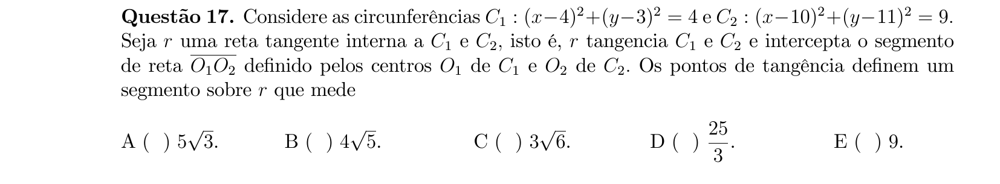

## Q18
**Assunto:** geometria espacial
**Competências:** tetraedro regular, cilindro inscrito, volume de cilindro, geometria de sólidos
**Tipo:** múltipla escolha

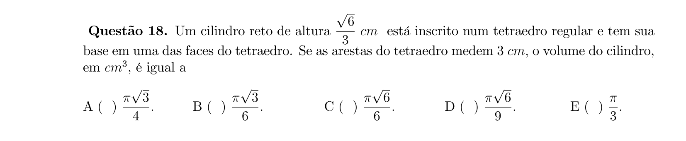

## Q19
**Assunto:** geometria analítica
**Competências:** triângulo equilátero, mediatriz, circunferência circunscrita, equação da reta, intersecção de curvas
**Tipo:** múltipla escolha

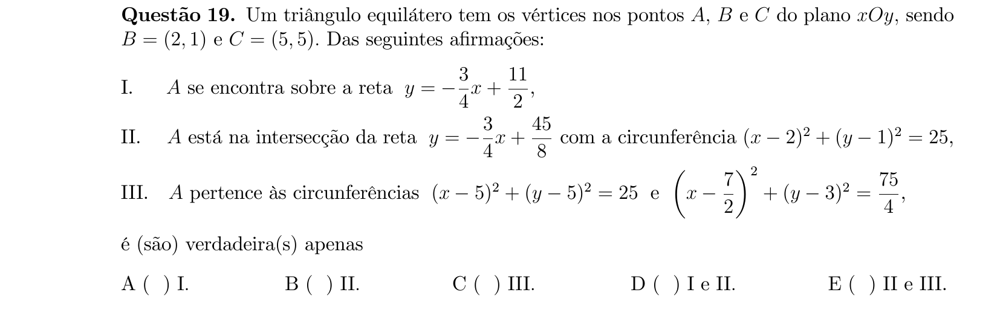

## Q20
**Assunto:** geometria espacial
**Competências:** tetraedro regular, ponto médio, área de triângulo, distância no espaço
**Tipo:** múltipla escolha

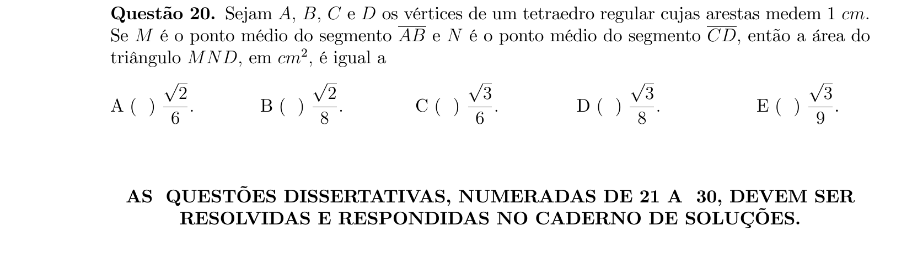

## Q21
**Assunto:** combinatória
**Competências:** cardinalidade de conjuntos, princípio inclusão-exclusão, progressão geométrica, conjunto das partes
**Tipo:** discursiva

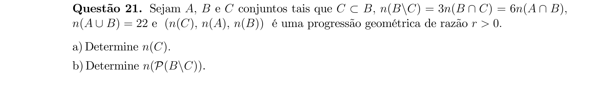

## Q22
**Assunto:** sequências e progressões
**Competências:** progressão geométrica infinita, soma de PG, subsequências, razão negativa
**Tipo:** discursiva

## Q23
**Assunto:** funções
**Competências:** função bijetora, função exponencial, função inversa, monotonicidade, função seno hiperbólico
**Tipo:** discursiva

## Q24
**Assunto:** funções
**Competências:** função bijetora, função ímpar, função inversa, demonstração formal
**Tipo:** discursiva

## Q25
**Assunto:** polinômios
**Competências:** raízes simétricas, raízes complexas conjugadas, polinômios pares/ímpares, análise de afirmações
**Tipo:** discursiva

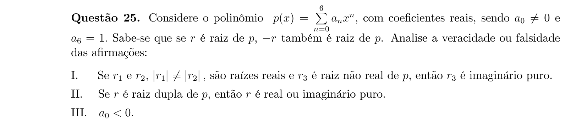

## Q26
**Assunto:** combinatória
**Competências:** equiprobabilidade, princípio da inclusão-exclusão, múltiplos, probabilidade condicional, probabilidade total
**Tipo:** discursiva

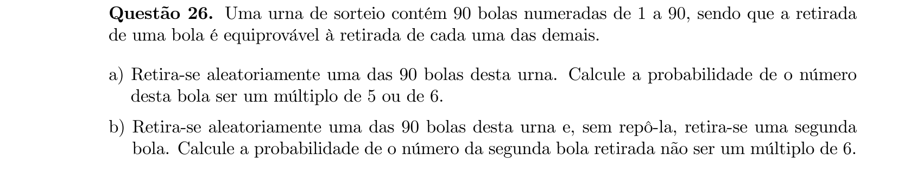

## Q27
**Assunto:** matrizes
**Competências:** existência e unicidade, determinante, sistema 4x4, escalonamento, condição sobre parâmetros
**Tipo:** discursiva

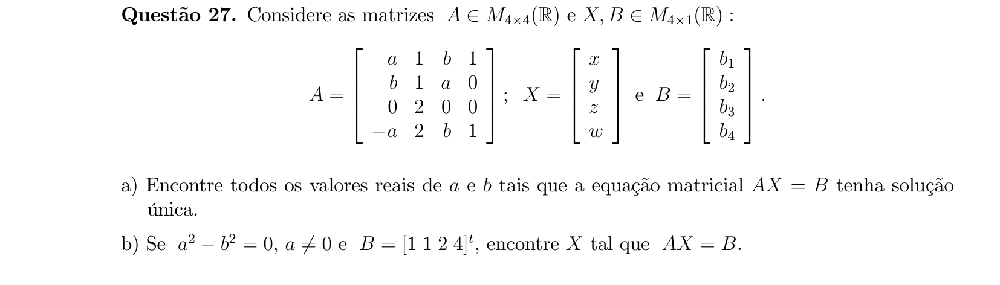

## Q28
**Assunto:** trigonometria
**Competências:** equação trigonométrica, identidades fundamentais, tangente do arco metade, cotangente
**Tipo:** discursiva

## Q29
**Assunto:** geometria analítica
**Competências:** circunferência inscrita, incentro, distância ponto-reta, equações de bissetrizes
**Tipo:** discursiva

## Q30
**Assunto:** geometria espacial
**Competências:** esferas ortogonais, distância entre centros, calota esférica, área de superfície
**Tipo:** discursiva

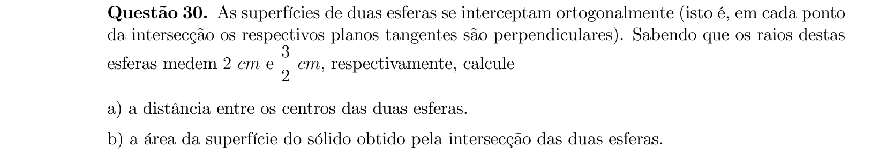
