# Matemática — ITA 2011

> 30 questões. Q01–Q20 múltipla escolha; Q21–Q30 discursivas.

## Q01
**Assunto:** números complexos
**Competências:** forma trigonométrica, potências de complexos, soma de progressão geométrica, raízes da unidade
**Tipo:** múltipla escolha

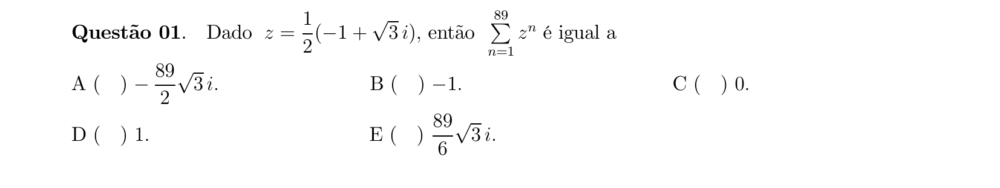

## Q02
**Assunto:** números complexos
**Competências:** módulo, conjugado, desigualdade triangular, forma polar, inverso
**Tipo:** múltipla escolha

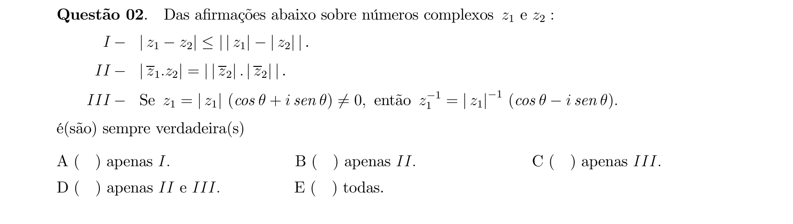

## Q03
**Assunto:** números complexos
**Competências:** equação em C, parte real e imaginária, módulo, soma de raízes
**Tipo:** múltipla escolha

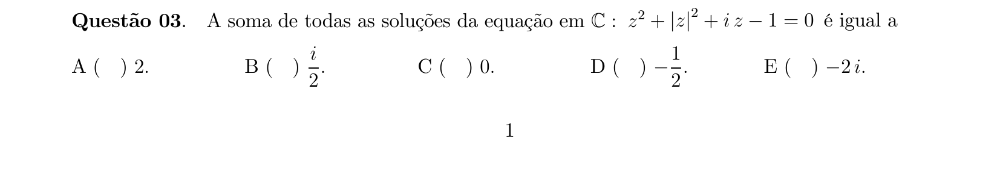

## Q04
**Assunto:** probabilidade
**Competências:** probabilidade condicional, teorema de Bayes, eventos compostos
**Tipo:** múltipla escolha

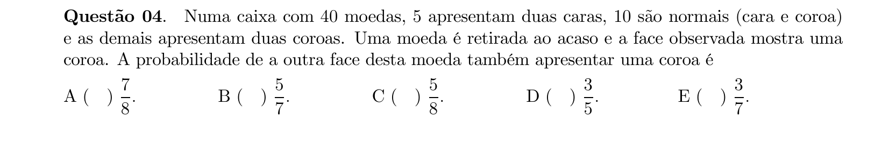

## Q05
**Assunto:** análise combinatória
**Competências:** conjuntos, subconjuntos, cardinalidade, contagem de partes
**Tipo:** múltipla escolha

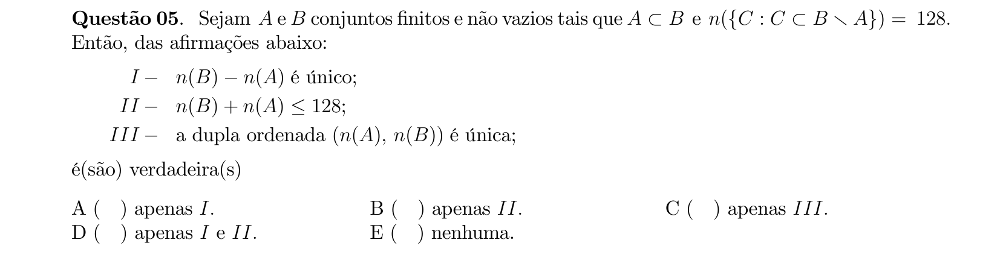

## Q06
**Assunto:** sistemas lineares
**Competências:** discussão de sistema linear, determinante, condição de compatibilidade
**Tipo:** múltipla escolha

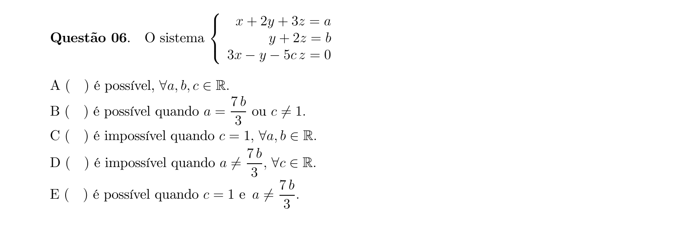

## Q07
**Assunto:** matrizes
**Competências:** matriz inversível, determinante, propriedades de produto matricial, autovetores
**Tipo:** múltipla escolha

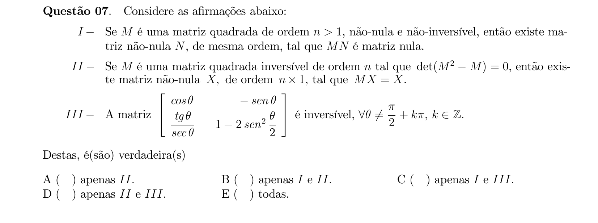

## Q08
**Assunto:** polinômios
**Competências:** raiz múltipla, derivada de polinômio, relações de Girard
**Tipo:** múltipla escolha

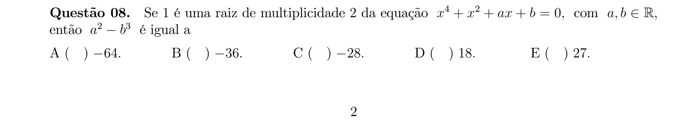

## Q09
**Assunto:** equações algébricas
**Competências:** equações modulares, casos por sinal, produto de raízes
**Tipo:** múltipla escolha

## Q10
**Assunto:** polinômios
**Competências:** progressão geométrica, raízes complexas, relações de Girard, fatoração
**Tipo:** múltipla escolha

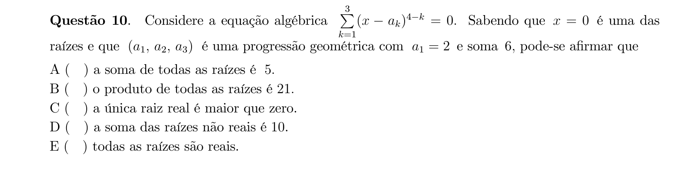

## Q11
**Assunto:** funções
**Competências:** função exponencial, completar quadrados, conjunto solução, equação no plano
**Tipo:** múltipla escolha

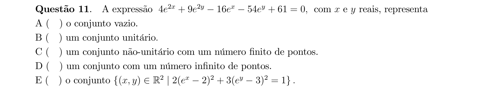

## Q12
**Assunto:** polinômios
**Competências:** raízes racionais, fatoração, divisibilidade polinomial, classificação em Q/Z/R
**Tipo:** múltipla escolha

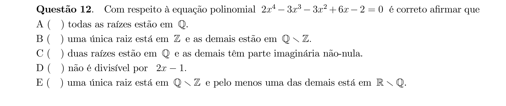

## Q13
**Assunto:** geometria analítica
**Competências:** equação da circunferência, centro e raio, interseção com eixos, área de triângulo
**Tipo:** múltipla escolha

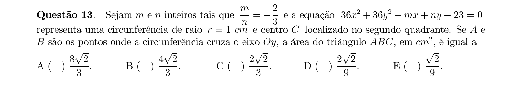

## Q14
**Assunto:** trigonometria
**Competências:** velocidade angular, movimento circular, frações de volta, radianos
**Tipo:** múltipla escolha

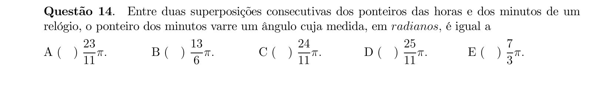

## Q15
**Assunto:** geometria plana
**Competências:** triângulo retângulo, triângulo isósceles, teorema de Pitágoras, relações métricas
**Tipo:** múltipla escolha

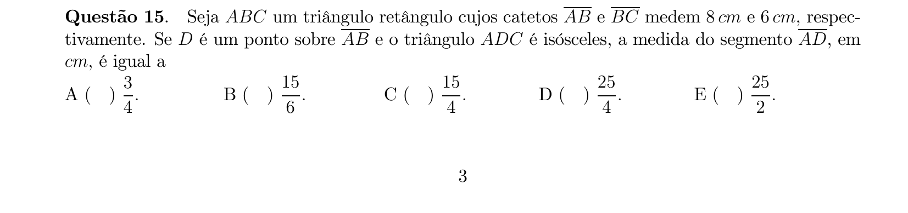

## Q16
**Assunto:** geometria plana
**Competências:** áreas (quadrado, trapézio, triângulo), progressão aritmética, equações
**Tipo:** múltipla escolha

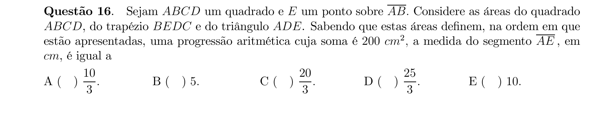

## Q17
**Assunto:** trigonometria
**Competências:** lei dos senos, lei dos cossenos, soma de arcos, ângulo obtuso
**Tipo:** múltipla escolha

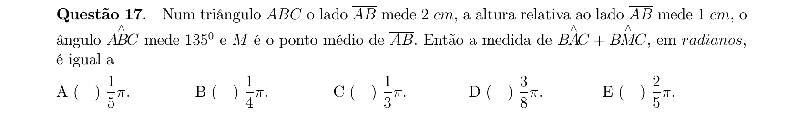

## Q18
**Assunto:** geometria plana
**Competências:** triângulo inscrito, bissetriz, áreas, interseção de regiões
**Tipo:** múltipla escolha

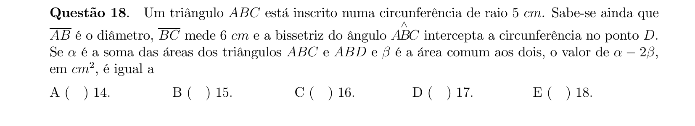

## Q19
**Assunto:** geometria espacial
**Competências:** pirâmide hexagonal regular, esfera inscrita, apótema, semelhança de triângulos
**Tipo:** múltipla escolha

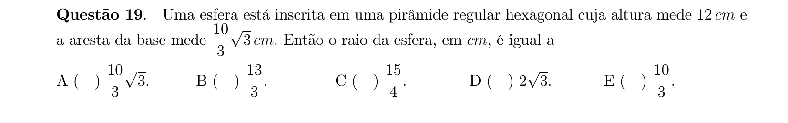

## Q20
**Assunto:** geometria espacial
**Competências:** triedros, ângulos poliédricos, relação de Euler, soma de ângulos das faces
**Tipo:** múltipla escolha

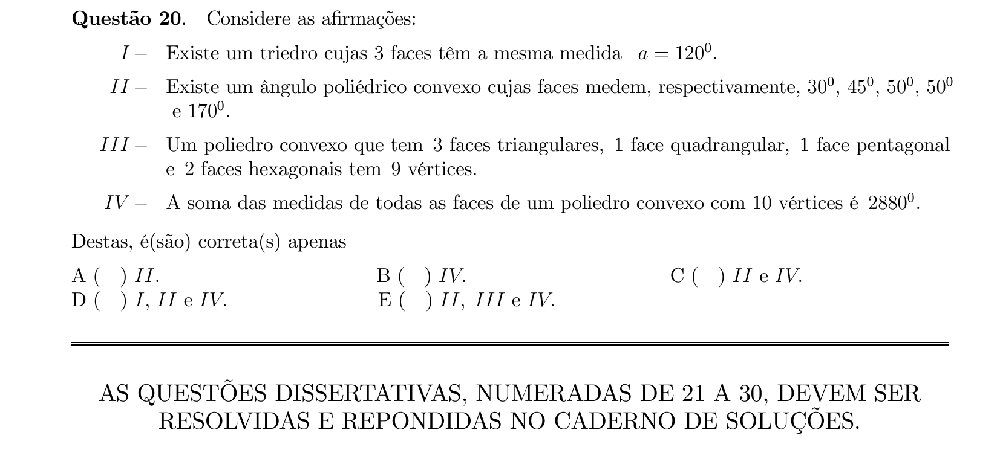

## Q21
**Assunto:** análise combinatória
**Competências:** teoria de conjuntos, diferença simétrica, prova de existência
**Tipo:** discursiva

## Q22
**Assunto:** números complexos
**Competências:** raízes n-ésimas da unidade, módulo de diferenças, simetria, contagem
**Tipo:** discursiva

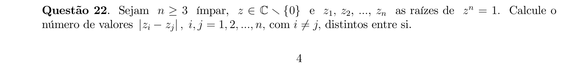

## Q23
**Assunto:** análise combinatória
**Competências:** permutações, agrupamentos, probabilidade de eventos com restrições
**Tipo:** discursiva

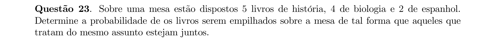

## Q24
**Assunto:** logaritmos
**Competências:** propriedades de logaritmos, base fracionária, inequação exponencial, inequação quadrática
**Tipo:** discursiva

## Q25
**Assunto:** matrizes
**Competências:** comutatividade matricial, matrizes 2x2, sistema de equações, matriz escalar
**Tipo:** discursiva

## Q26
**Assunto:** equações algébricas
**Competências:** discriminante, soma e produto de raízes, condições para raízes reais positivas, sinal
**Tipo:** discursiva

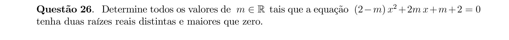

## Q27
**Assunto:** geometria espacial
**Competências:** esfera, cunha esférica, secção plana, área de setor circular
**Tipo:** discursiva

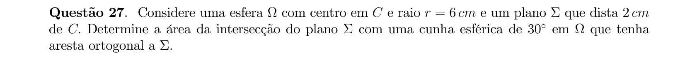

## Q28
**Assunto:** trigonometria
**Competências:** identidades trigonométricas, fórmulas de arco duplo, produto em soma, ângulo notável
**Tipo:** discursiva

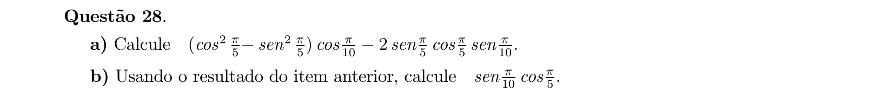

## Q29
**Assunto:** geometria plana
**Competências:** lei dos cossenos, lei dos senos, circunferência, triângulo isósceles, ângulos inscritos
**Tipo:** discursiva

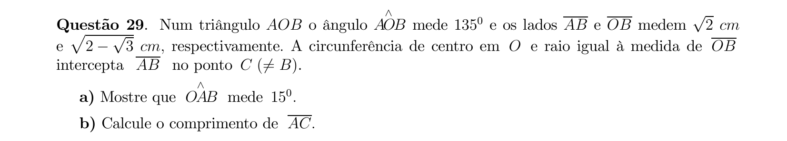

## Q30
**Assunto:** geometria plana
**Competências:** triângulo equilátero, baricentro, círculos tangentes, áreas, distância ao vértice
**Tipo:** discursiva

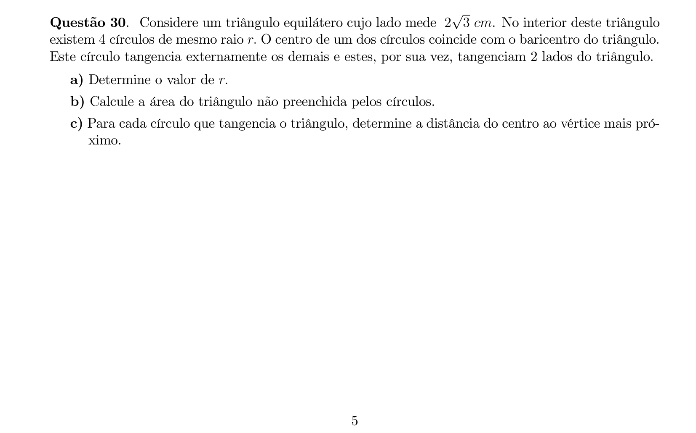
