# Matemática — ITA 2012

> 30 questões. Q01–Q20 múltipla escolha; Q21–Q30 discursivas.

## Q01
**Assunto:** combinatória
**Competências:** contagem de soluções inteiras não-negativas, partições, troca de moedas
**Tipo:** múltipla escolha

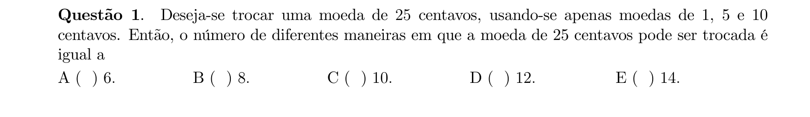

## Q02
**Assunto:** combinatória
**Competências:** eventos independentes, probabilidade do complementar, união de eventos
**Tipo:** múltipla escolha

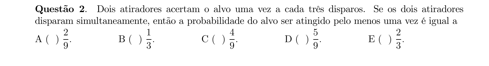

## Q03
**Assunto:** números complexos
**Competências:** forma trigonométrica, fórmula de De Moivre, divisão de complexos, argumento real
**Tipo:** múltipla escolha

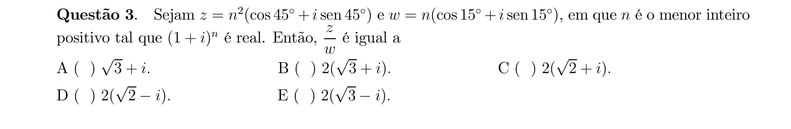

## Q04
**Assunto:** números complexos
**Competências:** argumento, multiplicação por imaginário, propriedades do argumento
**Tipo:** múltipla escolha

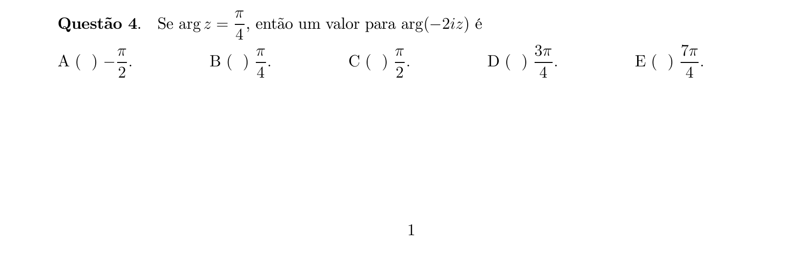

## Q05
**Assunto:** números reais
**Competências:** racionais e irracionais, fechamento, análise de proposições
**Tipo:** múltipla escolha

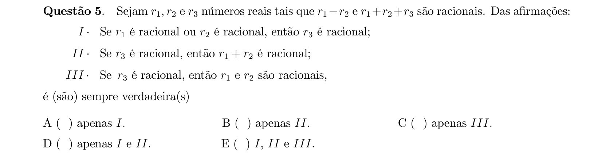

## Q06
**Assunto:** polinômios
**Competências:** relações de Girard, sistema linear nas raízes, polinômio cúbico
**Tipo:** múltipla escolha

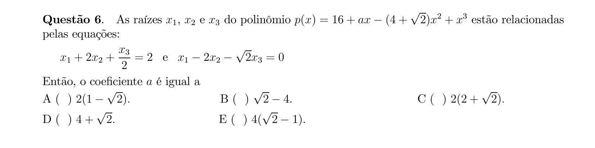

## Q07
**Assunto:** sequências e progressões
**Competências:** progressão aritmética, razão constante, sistema linear
**Tipo:** múltipla escolha

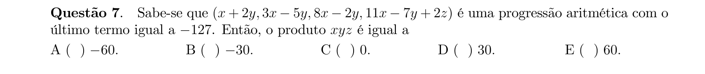

## Q08
**Assunto:** polinômios
**Competências:** raízes complexas conjugadas, divisibilidade, avaliação polinomial, coeficientes reais
**Tipo:** múltipla escolha

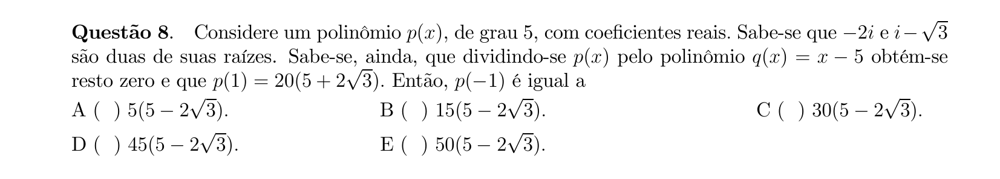

## Q09
**Assunto:** geometria plana
**Competências:** triângulo, círculo ex-inscrito, fórmula do raio, semiperímetro, área
**Tipo:** múltipla escolha

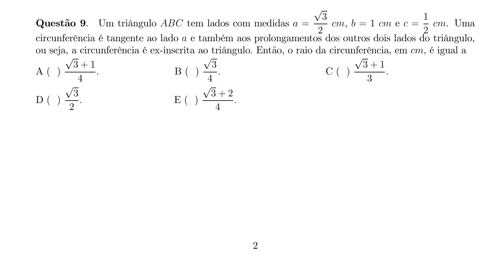

## Q10
**Assunto:** geometria analítica
**Competências:** baricentro, distância entre pontos, coordenadas no plano
**Tipo:** múltipla escolha

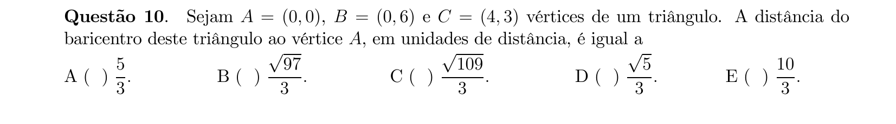

## Q11
**Assunto:** geometria analítica
**Competências:** retas no plano, interseções, área de quadrilátero
**Tipo:** múltipla escolha

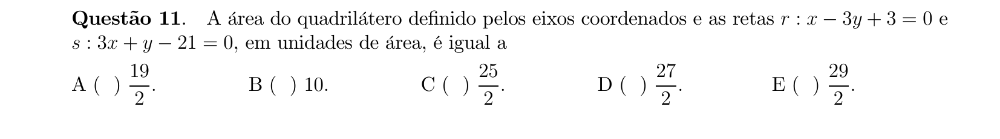

## Q12
**Assunto:** geometria analítica
**Competências:** bissetriz interna, distância ponto-reta, equação de reta paralela
**Tipo:** múltipla escolha

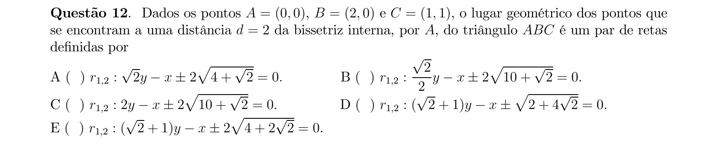

## Q13
**Assunto:** combinatória
**Competências:** operações com conjuntos, complementar, leis de De Morgan, álgebra de conjuntos
**Tipo:** múltipla escolha

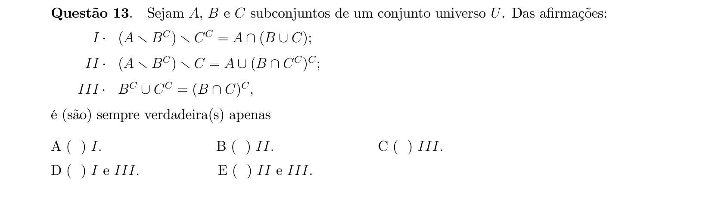

## Q14
**Assunto:** combinatória
**Competências:** cardinalidade, conjunto das partes, conjuntos disjuntos, contagem
**Tipo:** múltipla escolha

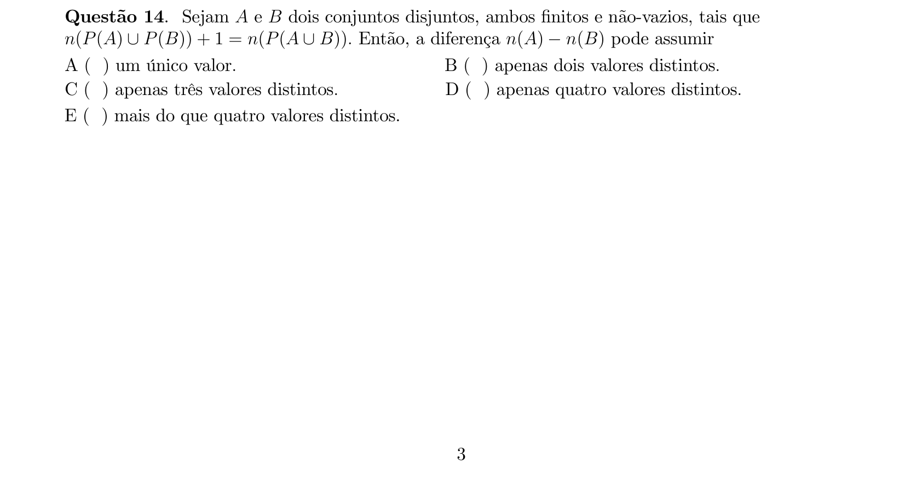

## Q15
**Assunto:** funções
**Competências:** equação exponencial, função quadrática auxiliar, discriminante, análise de proposições
**Tipo:** múltipla escolha

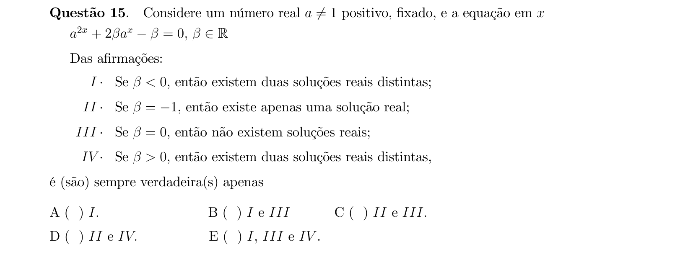

## Q16
**Assunto:** trigonometria
**Competências:** funções inversas, arcsen e arccos, identidade arcsen+arccos, domínio
**Tipo:** múltipla escolha

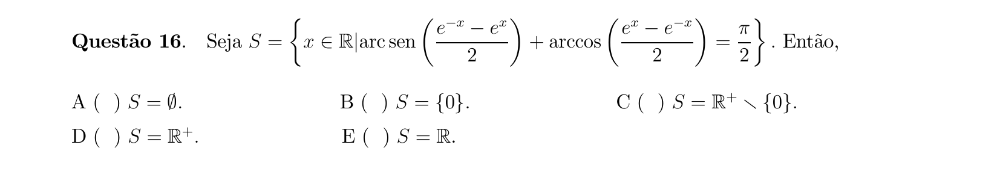

## Q17
**Assunto:** trigonometria
**Competências:** identidade do arco duplo, equação trigonométrica, soma e produto de raízes
**Tipo:** múltipla escolha

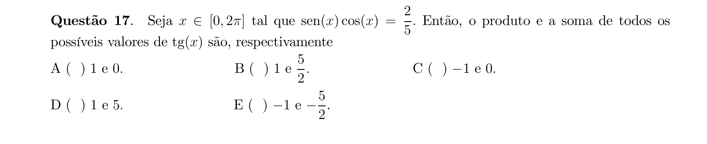

## Q18
**Assunto:** trigonometria
**Competências:** soma de cossenos, alternância de sinais, paridade do índice, somatório
**Tipo:** múltipla escolha

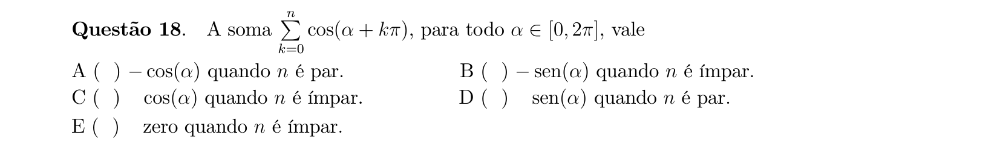

## Q19
**Assunto:** geometria espacial
**Competências:** cone reto, semelhança, volume do cone, volume do cubo
**Tipo:** múltipla escolha

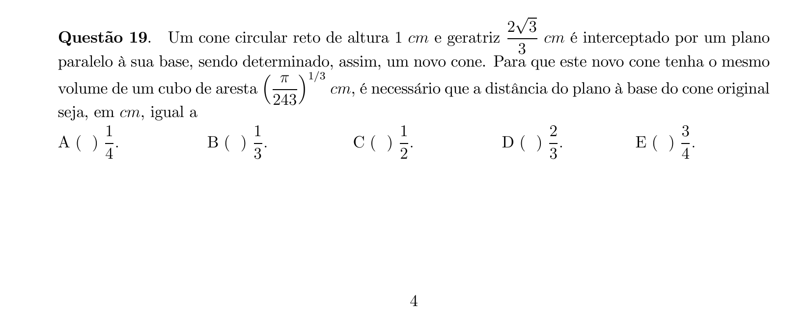

## Q20
**Assunto:** geometria espacial
**Competências:** cone reto, planificação, setor circular, área total, volume
**Tipo:** múltipla escolha

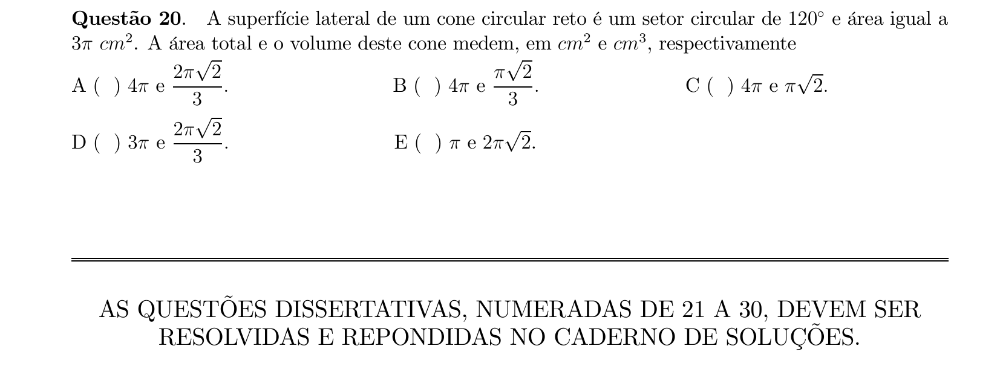

## Q21
**Assunto:** combinatória
**Competências:** combinações, espaço amostral equiprovável, contagem de partições
**Tipo:** discursiva

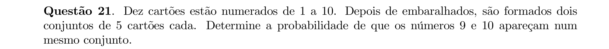

## Q22
**Assunto:** trigonometria
**Competências:** combinação linear de sen e cos, redução à forma R·sen(x+φ), máximo
**Tipo:** discursiva

## Q23
**Assunto:** matrizes
**Competências:** determinante de matriz especial, progressão geométrica, produto telescópico
**Tipo:** discursiva

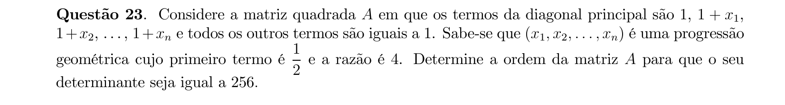

## Q24
**Assunto:** matrizes
**Competências:** propriedades de logaritmos, determinante 3x3, matriz inversa, cofatores
**Tipo:** discursiva

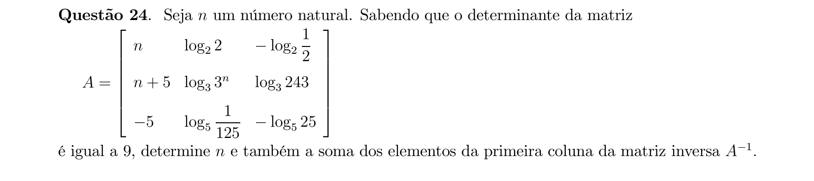

## Q25
**Assunto:** geometria espacial
**Competências:** sólido de revolução, tronco de cone, área de superfície, volume
**Tipo:** discursiva

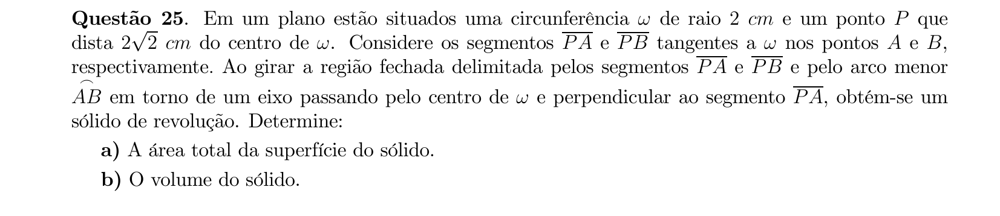

## Q26
**Assunto:** geometria analítica
**Competências:** interseção de retas, vértices de triângulo, área e perímetro, prisma reto
**Tipo:** discursiva

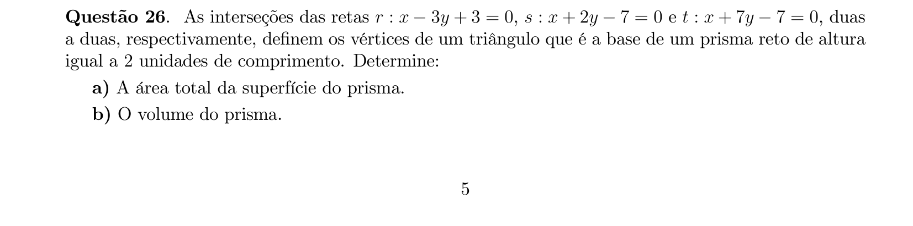

## Q27
**Assunto:** combinatória
**Competências:** princípio inclusão-exclusão, diagrama de Venn, porcentagem
**Tipo:** discursiva

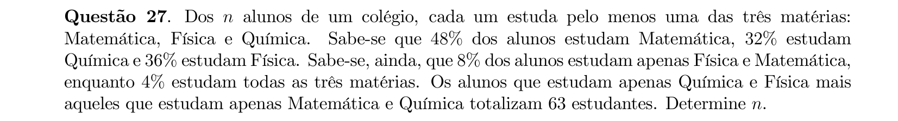

## Q28
**Assunto:** funções
**Competências:** função definida por partes, bijetividade, função inversa
**Tipo:** discursiva

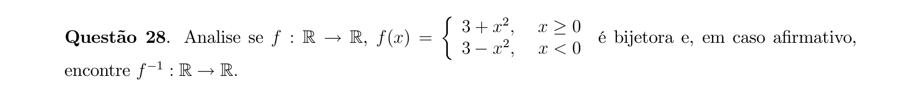

## Q29
**Assunto:** funções
**Competências:** inequação logarítmica, base variável, análise de sinais, trigonometria
**Tipo:** discursiva

## Q30
**Assunto:** geometria plana
**Competências:** tangente e secante a círculo, potência de ponto, arco e ângulo central, área de setor
**Tipo:** discursiva

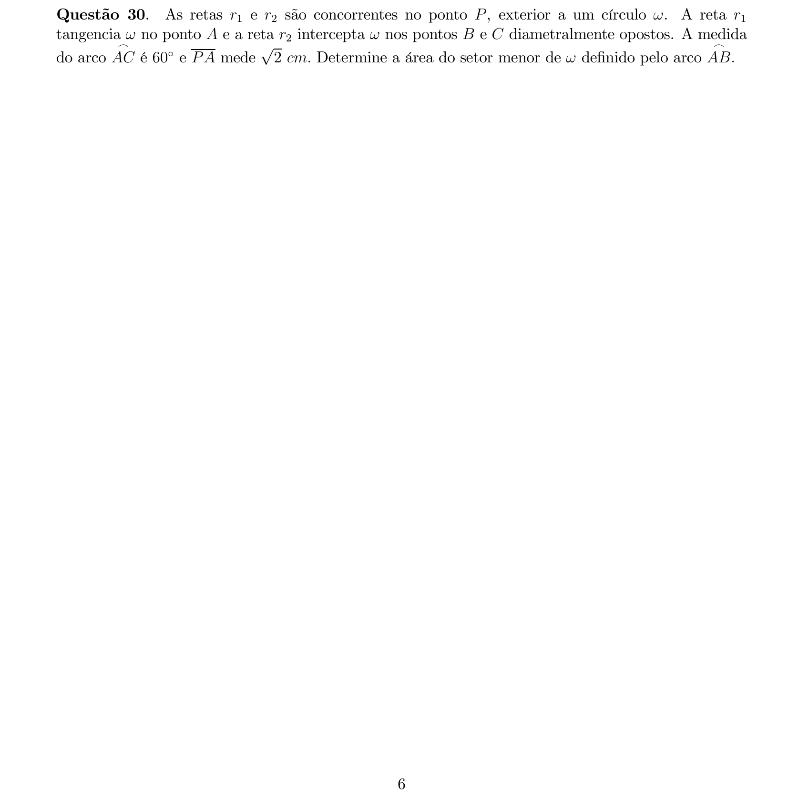
