# Matemática — ITA 2013

> 30 questões. Q01–Q20 múltipla escolha; Q21–Q30 discursivas.

## Q01
**Assunto:** conjuntos
**Competências:** teoria dos conjuntos, operações entre conjuntos, complementar, diferença de conjuntos
**Tipo:** múltipla escolha

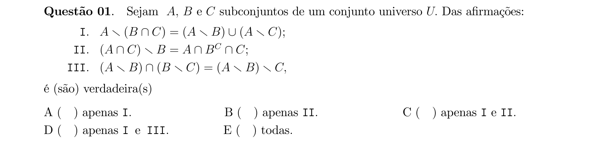

## Q02
**Assunto:** números complexos
**Competências:** equações em C, módulo de número complexo, raízes de equações biquadradas, soma de raízes
**Tipo:** múltipla escolha

## Q03
**Assunto:** números complexos
**Competências:** raízes da unidade, argumento principal, módulo de número complexo, forma polar
**Tipo:** múltipla escolha

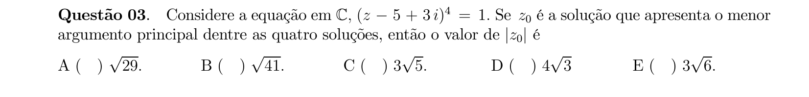

## Q04
**Assunto:** funções
**Competências:** equações exponenciais, mudança de variável, fatoração, soma de raízes
**Tipo:** múltipla escolha

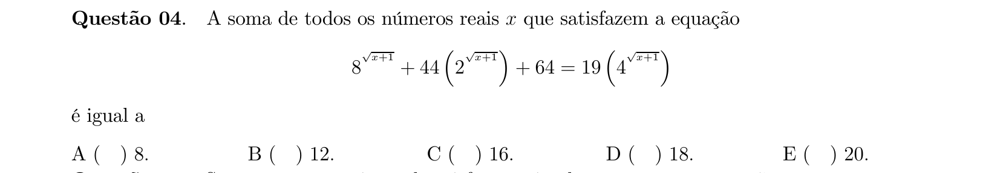

## Q05
**Assunto:** funções
**Competências:** sistemas com radicais, propriedades do logaritmo natural, manipulação algébrica
**Tipo:** múltipla escolha

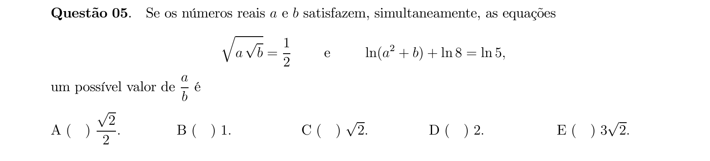

## Q06
**Assunto:** funções
**Competências:** função composta, função exponencial, função logarítmica, domínio, zeros de função
**Tipo:** múltipla escolha

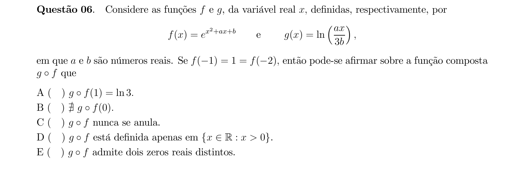

## Q07
**Assunto:** funções
**Competências:** funções injetoras, funções sobrejetoras, soma de funções, contraexemplos
**Tipo:** múltipla escolha

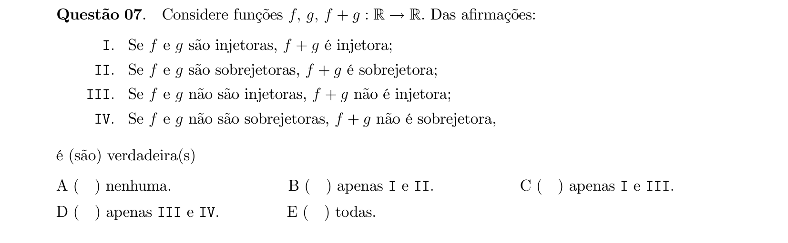

## Q08
**Assunto:** teoria dos números
**Competências:** divisibilidade, divisão euclidiana, paridade, aritmética modular
**Tipo:** múltipla escolha

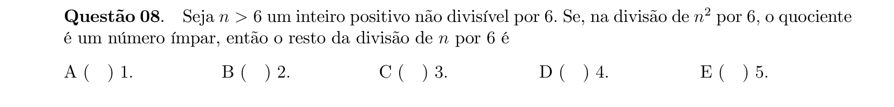

## Q09
**Assunto:** polinômios
**Competências:** progressão geométrica, relações de Girard, soma de raízes, soma dos coeficientes
**Tipo:** múltipla escolha

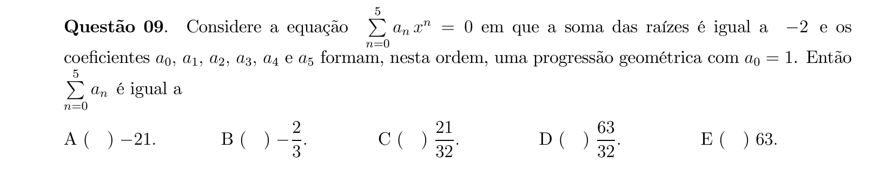

## Q10
**Assunto:** números complexos
**Competências:** equações com radicais, raízes complexas, parte real positiva, soma de raízes
**Tipo:** múltipla escolha

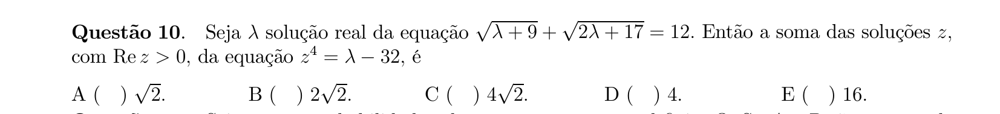

## Q11
**Assunto:** combinatória
**Competências:** espaço amostral finito, eventos, união e interseção, complementar, leis de De Morgan
**Tipo:** múltipla escolha

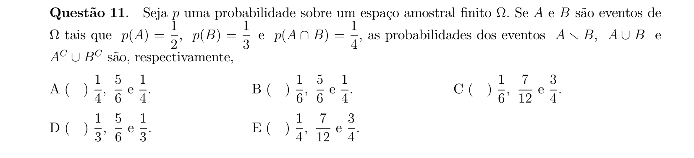

## Q12
**Assunto:** combinatória
**Competências:** distribuição binomial, lançamentos independentes, comparação de probabilidades
**Tipo:** múltipla escolha

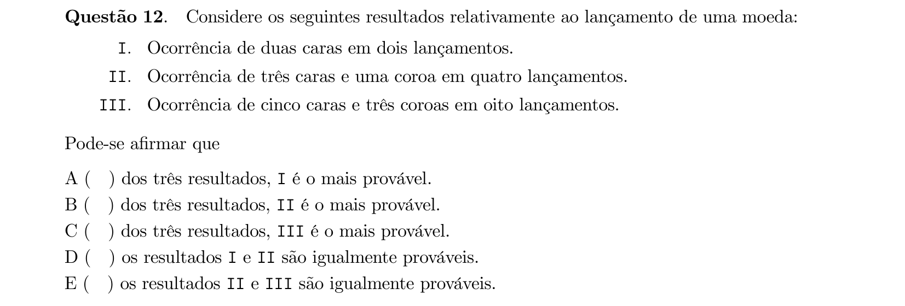

## Q13
**Assunto:** matrizes
**Competências:** propriedades de determinante, determinante de produto, determinante de transposta, escalar
**Tipo:** múltipla escolha

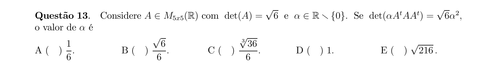

## Q14
**Assunto:** trigonometria
**Competências:** identidades trigonométricas, equações trigonométricas, intervalo fundamental, contagem de soluções
**Tipo:** múltipla escolha

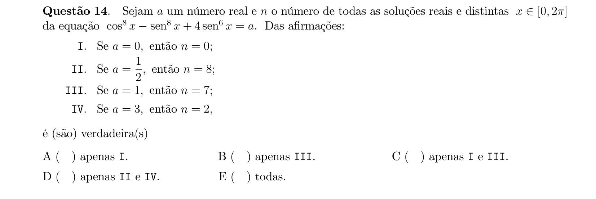

## Q15
**Assunto:** trigonometria
**Competências:** identidades trigonométricas, cossecante e secante, cotangente, arco duplo
**Tipo:** múltipla escolha

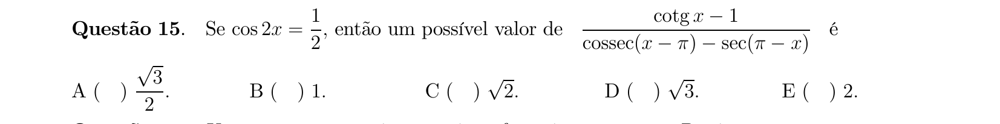

## Q16
**Assunto:** geometria plana
**Competências:** circunferência, reta tangente, ângulo inscrito, triângulo isósceles, soma de ângulos
**Tipo:** múltipla escolha

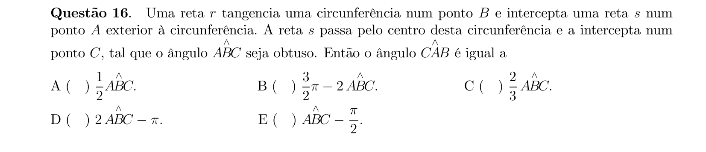

## Q17
**Assunto:** geometria analítica
**Competências:** cônicas, parábola, identificação de cônica degenerada, reta tangente, vértice
**Tipo:** múltipla escolha

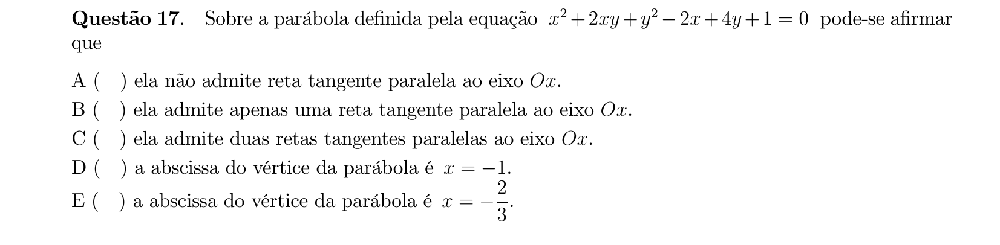

## Q18
**Assunto:** geometria espacial
**Competências:** posições relativas de retas, retas reversas, retas coplanares, quadrilátero reverso
**Tipo:** múltipla escolha

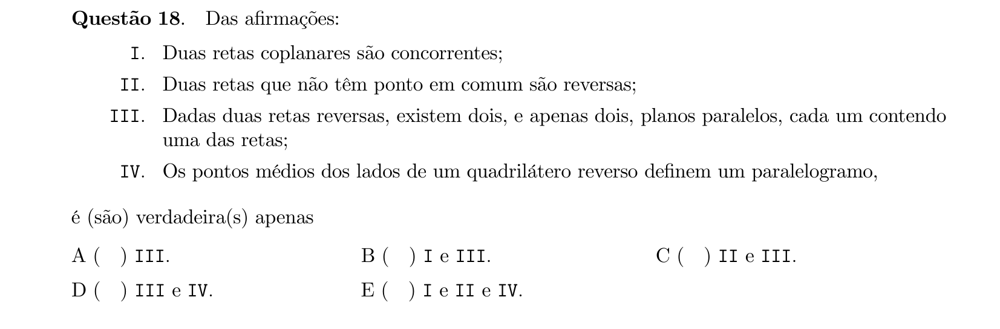

## Q19
**Assunto:** geometria espacial
**Competências:** triedro trirretângulo, volume de tetraedro, teorema de Pitágoras, área de triângulo
**Tipo:** múltipla escolha

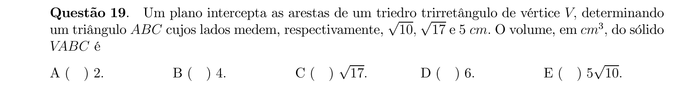

## Q20
**Assunto:** geometria analítica
**Competências:** triângulo no plano, área, perímetro, cilindro circular reto, razão volume/área
**Tipo:** múltipla escolha

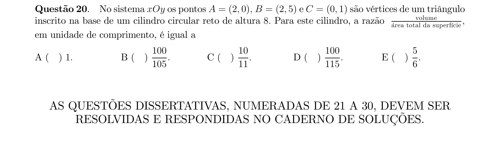

## Q21
**Assunto:** números complexos
**Competências:** forma trigonométrica, potências de complexos, argumento principal, parametrização
**Tipo:** discursiva

## Q22
**Assunto:** funções
**Competências:** domínio de função logarítmica, base do logaritmo, identidades trigonométricas, inequações
**Tipo:** discursiva

## Q23
**Assunto:** polinômios
**Competências:** relações de Girard, polinômio do segundo grau, raízes em intervalo, teorema de Bolzano
**Tipo:** discursiva

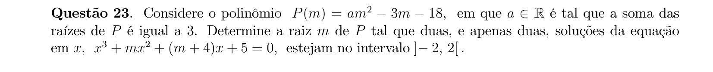

## Q24
**Assunto:** combinatória
**Competências:** contagem com simetrias, grupo de rotações do tetraedro, permutações distinguíveis
**Tipo:** discursiva

## Q25
**Assunto:** polinômios
**Competências:** sistemas não lineares, equações polinomiais, soluções reais, parâmetros
**Tipo:** discursiva

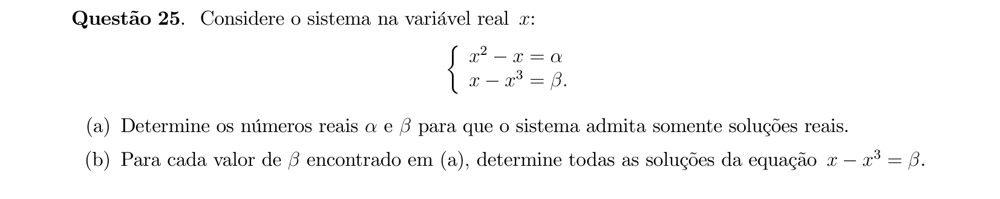

## Q26
**Assunto:** matrizes
**Competências:** discussão de sistemas, determinante, sistema possível e determinado, sistema impossível, trigonometria
**Tipo:** discursiva

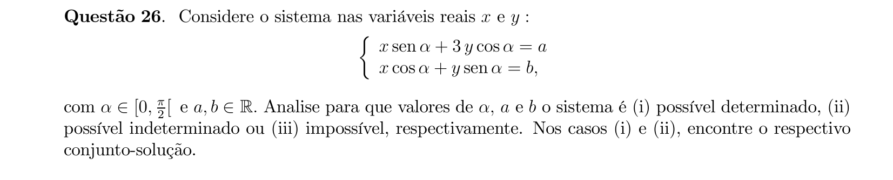

## Q27
**Assunto:** trigonometria
**Competências:** identidades trigonométricas, equações trigonométricas, tangente e cotangente, soma de arcos
**Tipo:** discursiva

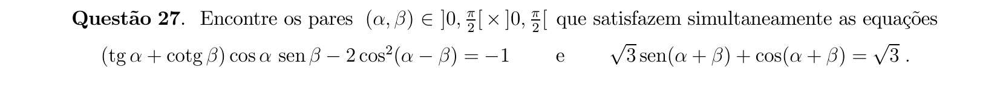

## Q28
**Assunto:** geometria analítica
**Competências:** equação reduzida de circunferência, par de retas, área entre curvas, intersecções
**Tipo:** discursiva

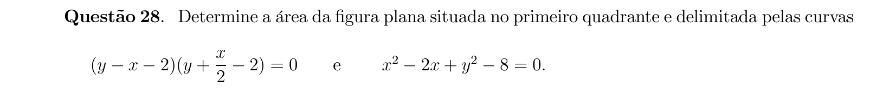

## Q29
**Assunto:** geometria plana
**Competências:** cevianas em triângulo, altura, bissetriz, mediana, relações métricas, ângulos
**Tipo:** discursiva

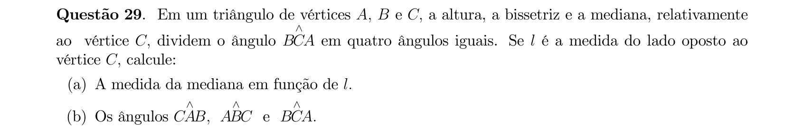

## Q30
**Assunto:** geometria espacial
**Competências:** paralelepípedo retângulo, progressão aritmética, volume de pirâmide, área total da superfície
**Tipo:** discursiva

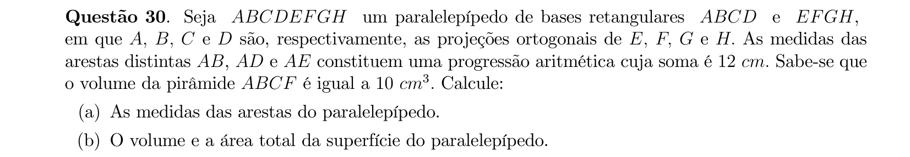
