# Matemática — ITA 2014

> 30 questões. Q01–Q20 múltipla escolha; Q21–Q30 discursivas.

## Q01
**Assunto:** números reais
**Competências:** irracionais, operações com racionais e irracionais, funções sobrejetoras e injetoras, análise de afirmações
**Tipo:** múltipla escolha

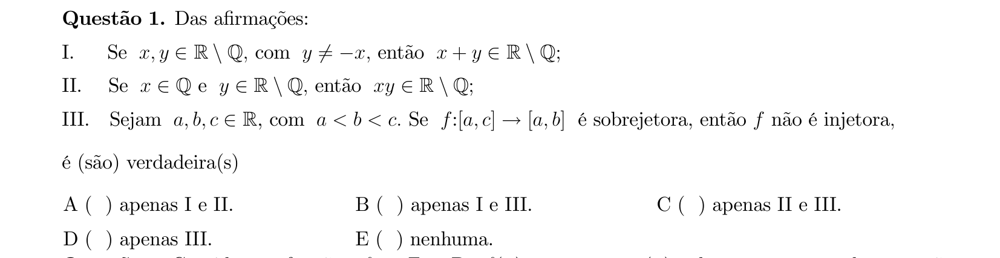

## Q02
**Assunto:** funções
**Competências:** funções afins, imagem de função, igualdade de funções, análise de afirmações
**Tipo:** múltipla escolha

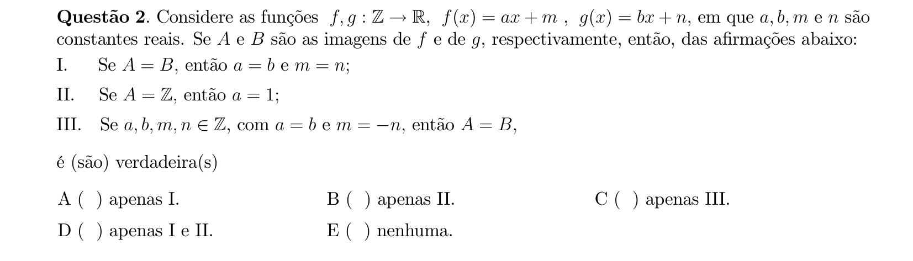

## Q03
**Assunto:** logaritmos
**Competências:** propriedades de logaritmos, mudança de base, somatórios
**Tipo:** múltipla escolha

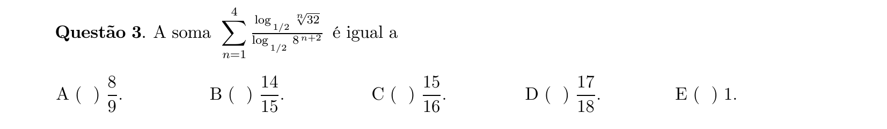

## Q04
**Assunto:** números complexos
**Competências:** conjugado, módulo, manipulação algébrica com complexos
**Tipo:** múltipla escolha

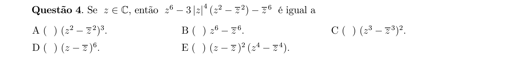

## Q05
**Assunto:** números complexos
**Competências:** módulo, conjugado, identidade do paralelogramo, análise de afirmações
**Tipo:** múltipla escolha

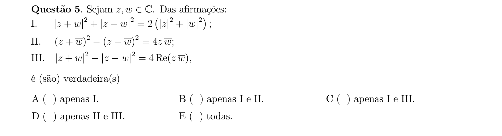

## Q06
**Assunto:** polinômios
**Competências:** raízes em progressão aritmética, relações de Girard, polinômio de grau 5
**Tipo:** múltipla escolha

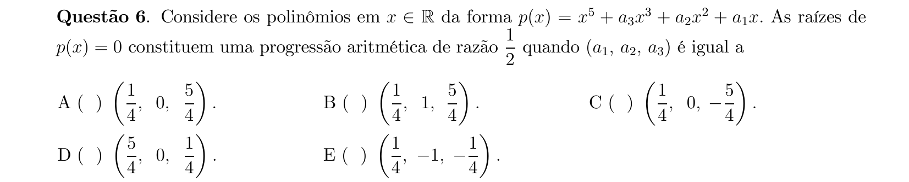

## Q07
**Assunto:** análise combinatória
**Competências:** coeficientes binomiais, identidades binomiais, somatório
**Tipo:** múltipla escolha

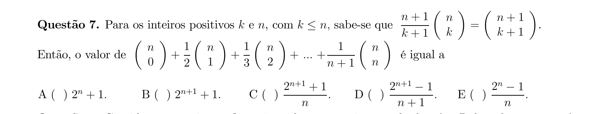

## Q08
**Assunto:** matrizes
**Competências:** matriz antissimétrica, matriz inversível, determinantes, paridade de ordem
**Tipo:** múltipla escolha

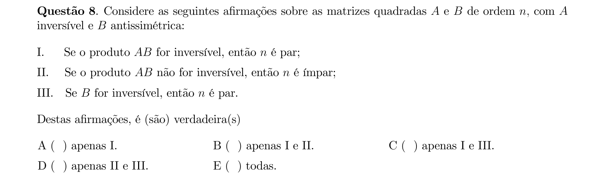

## Q09
**Assunto:** matrizes
**Competências:** matriz antissimétrica, produto de matrizes, sistemas lineares homogêneos, análise de afirmações
**Tipo:** múltipla escolha

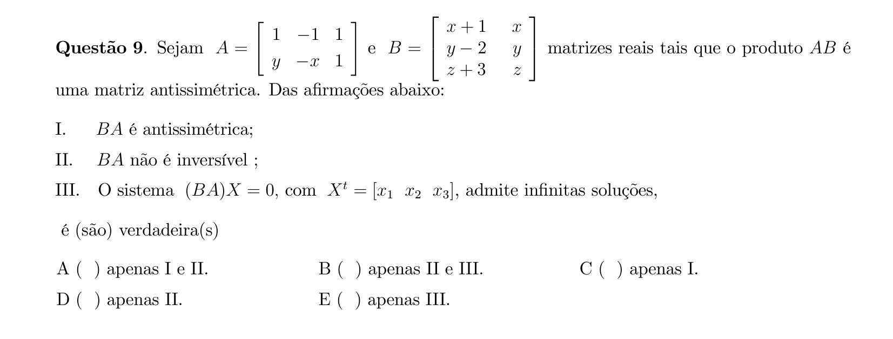

## Q10
**Assunto:** determinantes
**Competências:** propriedades de determinantes, determinante de matriz inversa, determinante de múltiplo escalar
**Tipo:** múltipla escolha

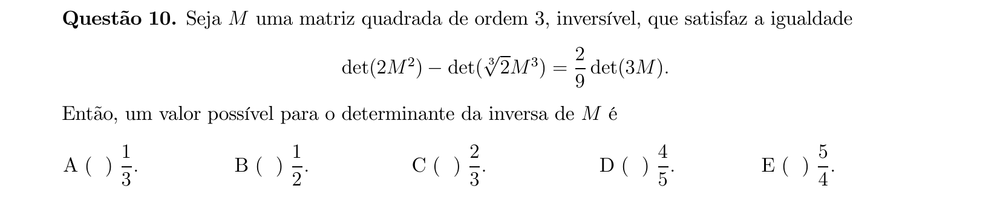

## Q11
**Assunto:** sistemas lineares
**Competências:** sistema 3x3, determinante paramétrico, regra de Cramer, manipulação com exponenciais
**Tipo:** múltipla escolha

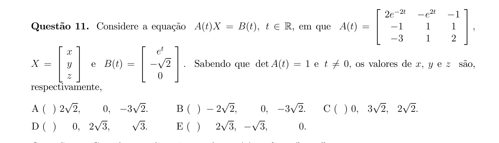

## Q12
**Assunto:** polinômios
**Competências:** raízes complexas, coeficientes complexos, divisão polinomial
**Tipo:** múltipla escolha

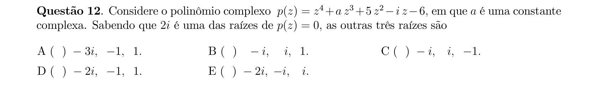

## Q13
**Assunto:** trigonometria
**Competências:** identidades trigonométricas, fórmulas de arco duplo, manipulação algébrica
**Tipo:** múltipla escolha

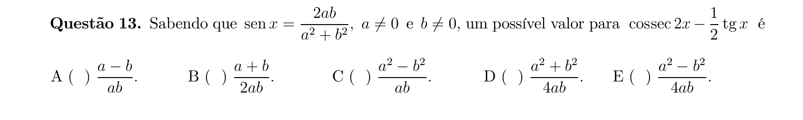

## Q14
**Assunto:** geometria plana
**Competências:** triângulo retângulo, altura e mediana relativas à hipotenusa, relações métricas
**Tipo:** múltipla escolha

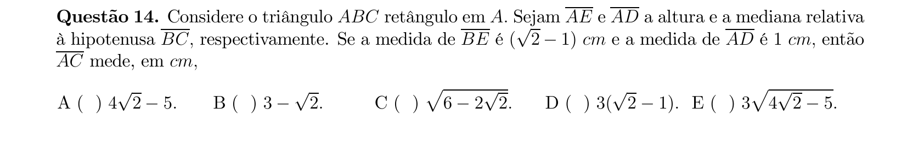

## Q15
**Assunto:** geometria analítica
**Competências:** circunferência circunscrita, distância entre pontos, raio circunscrito
**Tipo:** múltipla escolha

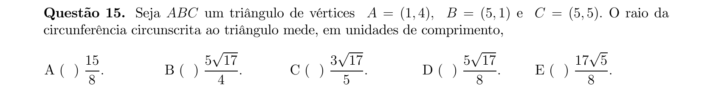

## Q16
**Assunto:** geometria plana
**Competências:** triângulo isósceles, mediana, baricentro, área, análise de afirmações
**Tipo:** múltipla escolha

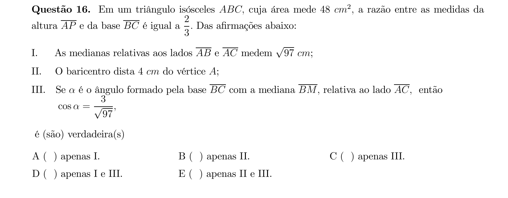

## Q17
**Assunto:** geometria plana
**Competências:** trapézio, pontos médios de diagonais, base média
**Tipo:** múltipla escolha

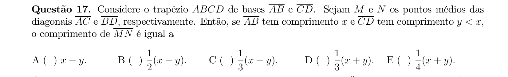

## Q18
**Assunto:** geometria espacial
**Competências:** pirâmide, volume, decomposição em triângulos, progressão aritmética
**Tipo:** múltipla escolha

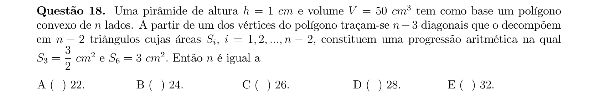

## Q19
**Assunto:** geometria analítica
**Competências:** equação de circunferência, tangência a retas, distância de ponto a reta
**Tipo:** múltipla escolha

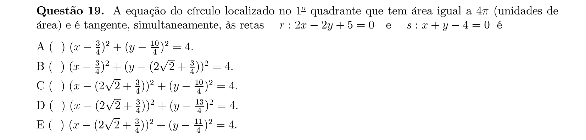

## Q20
**Assunto:** geometria espacial
**Competências:** sólido de revolução, triângulo isósceles, volume por rotação, teorema de Pappus
**Tipo:** múltipla escolha

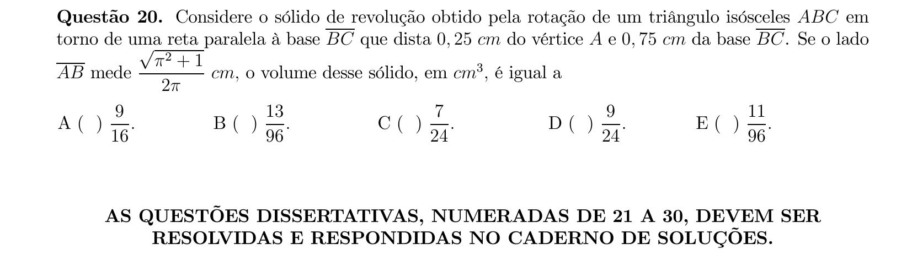

## Q21
**Assunto:** funções
**Competências:** função exponencial, função raiz quadrada, composição de funções, inequação
**Tipo:** discursiva

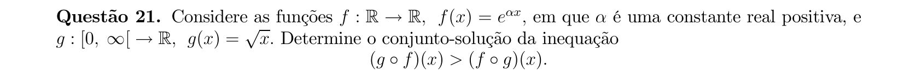

## Q22
**Assunto:** logaritmos
**Competências:** propriedades de logaritmos, mudança de base, equação logarítmica
**Tipo:** discursiva

## Q23
**Assunto:** números complexos
**Competências:** módulo, lugar geométrico no plano complexo, máximo de distância
**Tipo:** discursiva

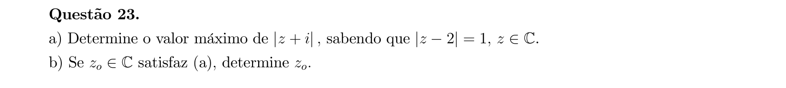

## Q24
**Assunto:** probabilidade
**Competências:** espaço amostral, lançamento de dados, contagem de eventos, probabilidade clássica
**Tipo:** discursiva

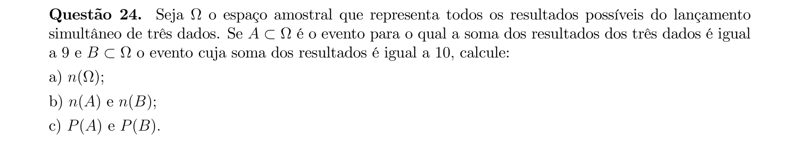

## Q25
**Assunto:** análise combinatória
**Competências:** contagem de paralelepípedos, combinação com repetição, arestas inteiras
**Tipo:** discursiva

## Q26
**Assunto:** sistemas lineares
**Competências:** sistema homogêneo paramétrico, trigonometria (sen, cos2θ), condição de infinitas soluções
**Tipo:** discursiva

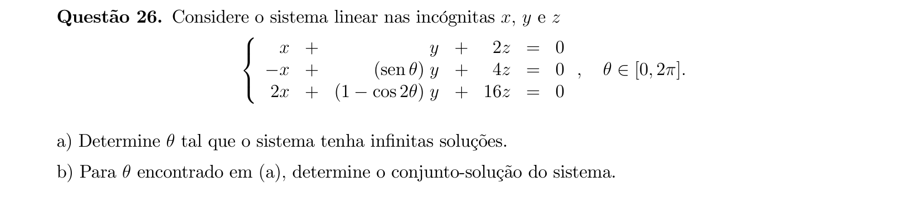

## Q27
**Assunto:** trigonometria
**Competências:** inequações trigonométricas, identidades, sistema de inequações
**Tipo:** discursiva

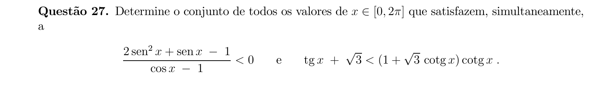

## Q28
**Assunto:** geometria espacial
**Competências:** esferas tangentes, hexágono regular, distâncias em 3D, geometria de esferas
**Tipo:** discursiva

## Q29
**Assunto:** geometria plana
**Competências:** circunferências tangentes, progressão geométrica, área de triângulo, sólido de revolução
**Tipo:** discursiva

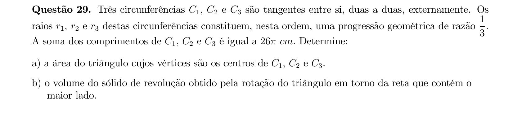

## Q30
**Assunto:** geometria espacial
**Competências:** cilindro, secção plana, geometria analítica de circunferência, área de superfície
**Tipo:** discursiva

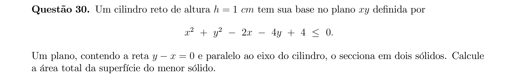
