# Matemática — ITA 2015

> 30 questões. Q01–Q20 múltipla escolha; Q21–Q30 discursivas.

## Q01
**Assunto:** números reais
**Competências:** expansão decimal e racionais, séries geométricas, logaritmos (mudança de base), análise de afirmações
**Tipo:** múltipla escolha

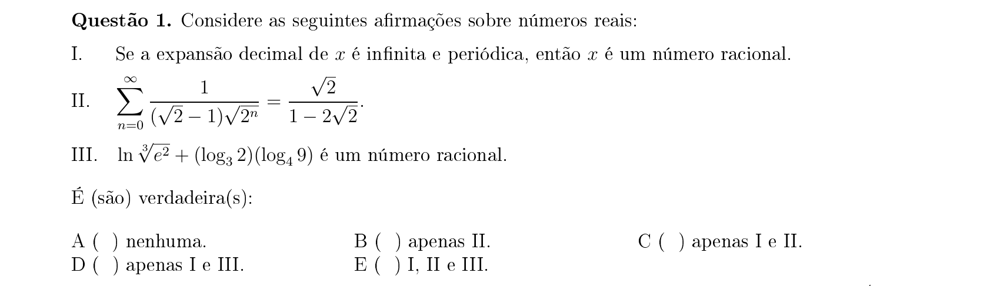

## Q02
**Assunto:** números complexos
**Competências:** representação geométrica no plano de Argand, módulo e distância, operações com conjuntos, equação quadrática complexa
**Tipo:** múltipla escolha

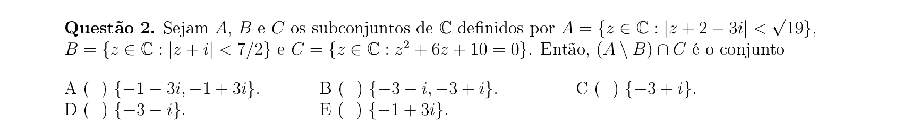

## Q03
**Assunto:** números complexos
**Competências:** forma polar, potências de complexos, arcsen e arctg
**Tipo:** múltipla escolha

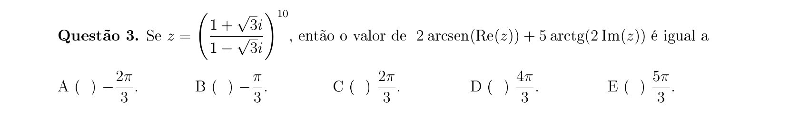

## Q04
**Assunto:** geometria analítica
**Competências:** circunferência tangente a duas retas paralelas, distância ponto–reta, área do círculo
**Tipo:** múltipla escolha

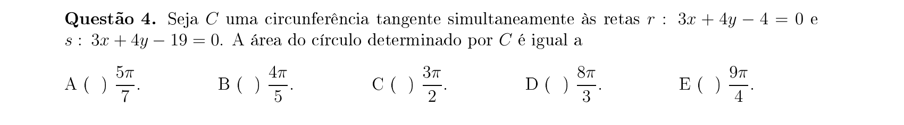

## Q05
**Assunto:** sequências e progressões
**Competências:** sequência de Fibonacci, progressão geométrica, divisibilidade, análise de afirmações
**Tipo:** múltipla escolha

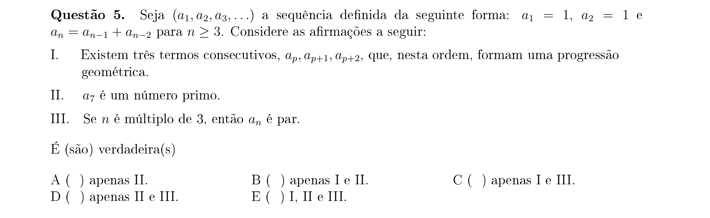

## Q06
**Assunto:** polinômios
**Competências:** equação racional, restrições de domínio, análise de afirmações
**Tipo:** múltipla escolha

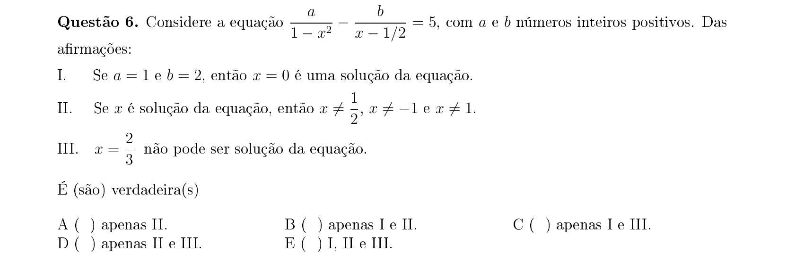

## Q07
**Assunto:** polinômios
**Competências:** raiz dupla, relações de Girard, derivada de polinômio
**Tipo:** múltipla escolha

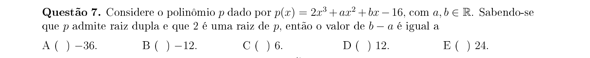

## Q08
**Assunto:** polinômios
**Competências:** raízes complexas conjugadas, teorema do resto, divisão polinomial
**Tipo:** múltipla escolha

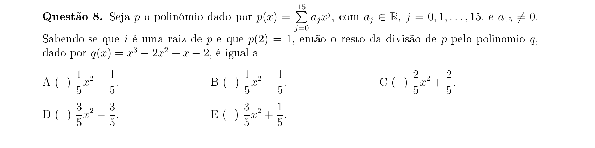

## Q09
**Assunto:** trigonometria
**Competências:** triângulo retângulo, teorema de Pitágoras, arctg
**Tipo:** múltipla escolha

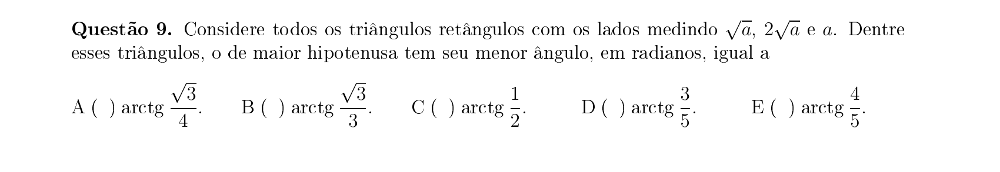

## Q10
**Assunto:** trigonometria
**Competências:** equação trigonométrica linear (a·sen x + b·cos x), arcsen/arccos
**Tipo:** múltipla escolha

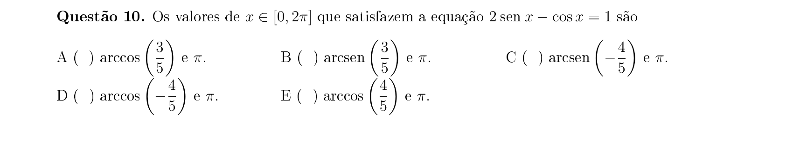

## Q11
**Assunto:** trigonometria
**Competências:** identidades trigonométricas, cos(α+β), equações trigonométricas
**Tipo:** múltipla escolha

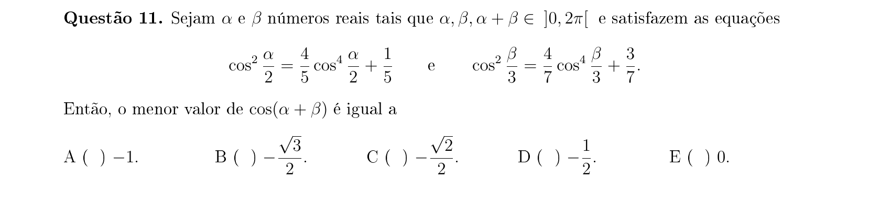

## Q12
**Assunto:** matrizes
**Competências:** construção de matriz por lei de formação, determinante, traço
**Tipo:** múltipla escolha

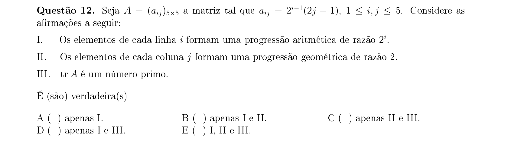

## Q13
**Assunto:** matrizes
**Competências:** matriz 2×2 por lei de formação, potências de matriz
**Tipo:** múltipla escolha

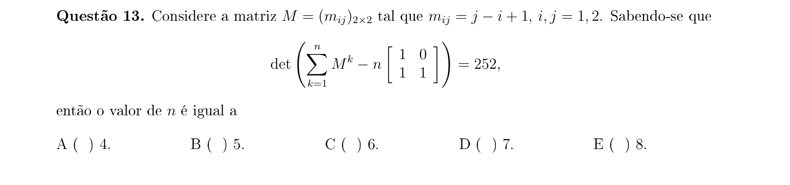

## Q14
**Assunto:** geometria analítica
**Competências:** ponto e reta no plano, equação da reta, distância
**Tipo:** múltipla escolha

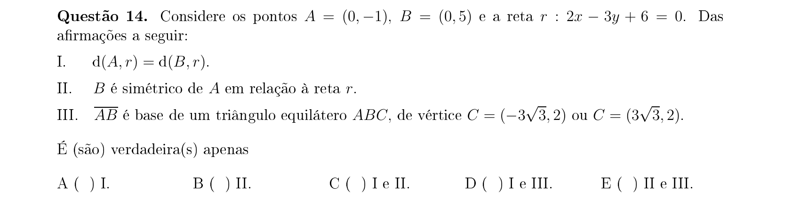

## Q15
**Assunto:** geometria analítica
**Competências:** triângulo no plano, reta dada, área/perímetro
**Tipo:** múltipla escolha

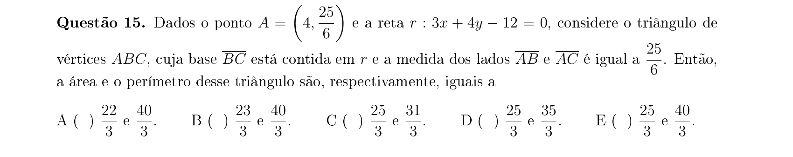

## Q16
**Assunto:** análise de afirmações
**Competências:** verdadeiro/falso, raciocínio dedutivo
**Tipo:** múltipla escolha

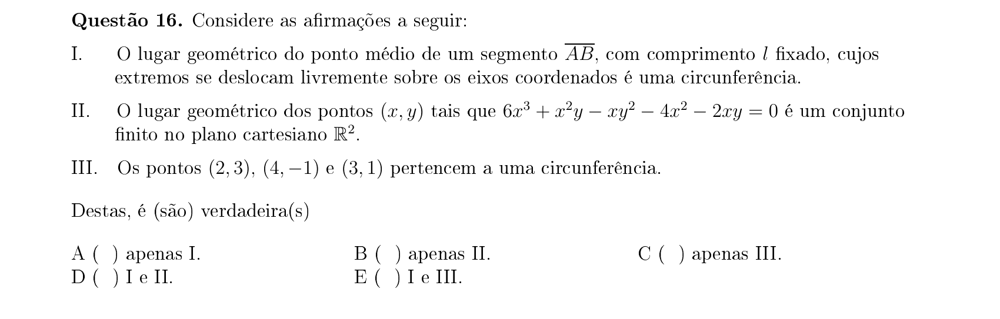

## Q17
**Assunto:** geometria plana
**Competências:** trapézio isósceles, ângulo reto inscrito, distância entre lado e ponto de encontro de diagonais
**Tipo:** múltipla escolha

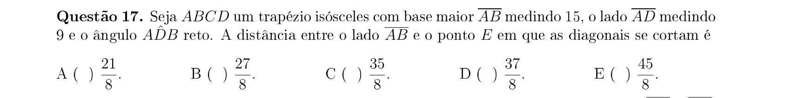

## Q18
**Assunto:** geometria plana
**Competências:** triângulo com pontos em lados, teorema de Menelaus/Ceva, razão de áreas
**Tipo:** múltipla escolha

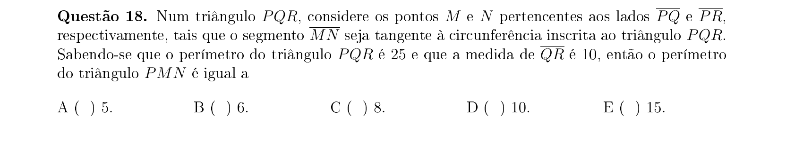

## Q19
**Assunto:** geometria analítica
**Competências:** circunferência tangente a eixo e reta, primeiro quadrante
**Tipo:** múltipla escolha

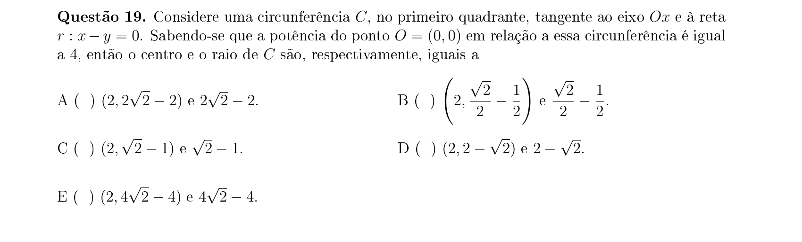

## Q20
**Assunto:** geometria espacial
**Competências:** cone circular reto, volume, taça/líquido
**Tipo:** múltipla escolha

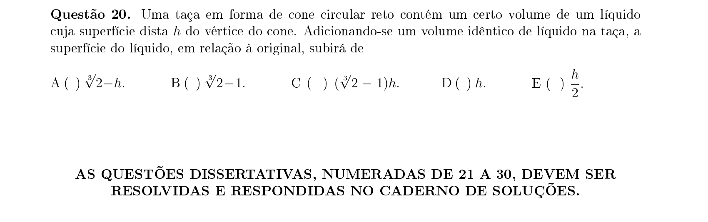

## Q21
**Assunto:** funções
**Competências:** função modular, máximo entre funções, equações com módulo
**Tipo:** discursiva

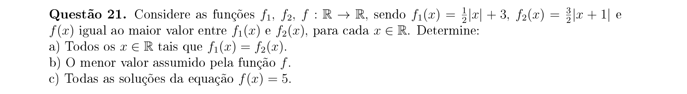

## Q22
**Assunto:** polinômios
**Competências:** polinômio de grau 3 com parâmetro real, raízes
**Tipo:** discursiva

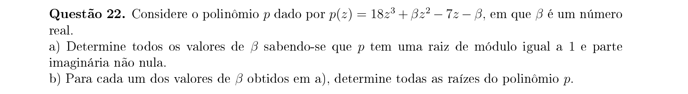

## Q23
**Assunto:** sequências e progressões
**Competências:** progressões, sistema de equações com cinco incógnitas
**Tipo:** discursiva

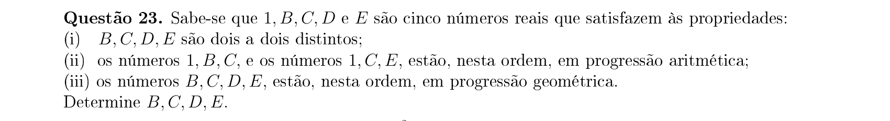

## Q24
**Assunto:** números complexos
**Competências:** módulo, conjuntos no plano complexo, otimização
**Tipo:** discursiva

## Q25
**Assunto:** polinômios
**Competências:** polinômio de grau 4, coeficientes inteiros, contagem
**Tipo:** discursiva

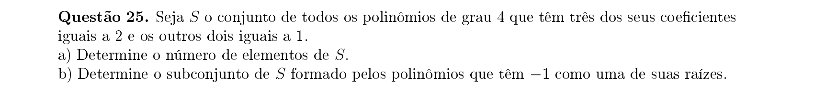

## Q26
**Assunto:** combinatória
**Competências:** experimento aleatório, contagem de casos, probabilidade condicional
**Tipo:** discursiva

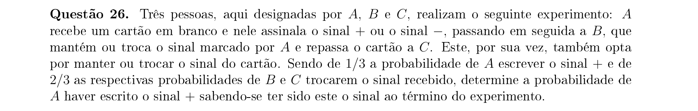

## Q27
**Assunto:** trigonometria
**Competências:** identidade do arco metade, valores especiais de seno
**Tipo:** discursiva

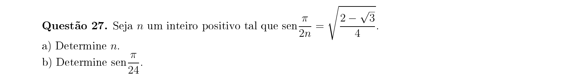

## Q28
**Assunto:** funções
**Competências:** determinação de parâmetros, função afim/quadrática
**Tipo:** discursiva

## Q29
**Assunto:** geometria analítica
**Competências:** equação geral do segundo grau, decomposição em duas retas, cônicas degeneradas
**Tipo:** discursiva

## Q30
**Assunto:** geometria espacial
**Competências:** tetraedro, dobradura de papel, ângulo reto entre faces, medidas das arestas
**Tipo:** discursiva

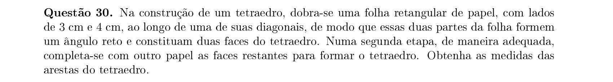
