# Matemática — ITA 2016

> 30 questões. Q01–Q20 múltipla escolha; Q21–Q30 discursivas.

## Q01
**Assunto:** logaritmos
**Competências:** monotonicidade de função logarítmica, equações exponenciais, existência de raízes
**Tipo:** múltipla escolha

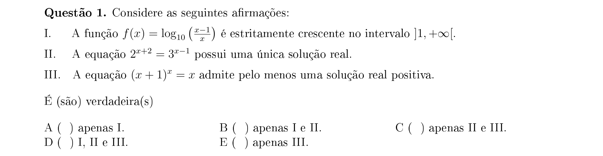

## Q02
**Assunto:** logaritmos
**Competências:** estimativa de número de dígitos, log10, parte inteira de raiz, ordem de grandeza
**Tipo:** múltipla escolha

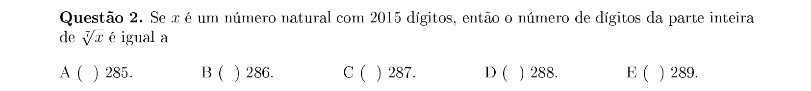

## Q03
**Assunto:** probabilidade
**Competências:** contagem de progressões geométricas com inteiros, combinações, espaço amostral
**Tipo:** múltipla escolha

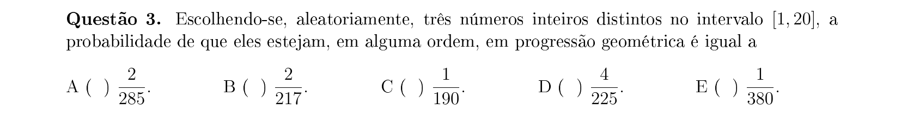

## Q04
**Assunto:** trigonometria
**Competências:** identidades trigonométricas, sen(3x), determinação de quadrante, tg→sen/cos
**Tipo:** múltipla escolha

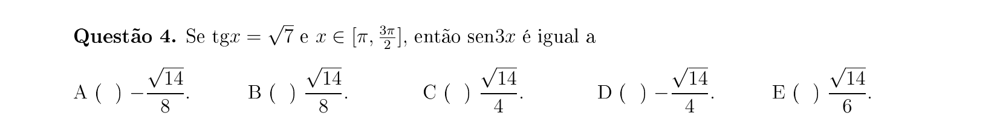

## Q05
**Assunto:** sequências
**Competências:** sequência recursiva, logaritmo, monotonicidade, limites, análise de afirmações
**Tipo:** múltipla escolha

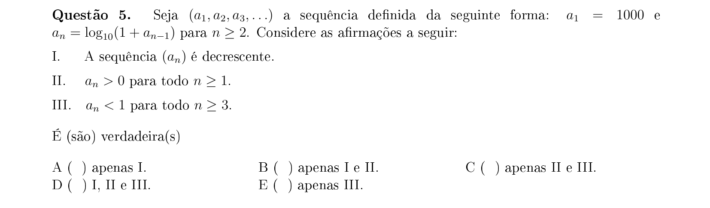

## Q06
**Assunto:** geometria plana
**Competências:** polígonos regulares, círculo inscrito e circunscrito, apótema, comprimento de lado
**Tipo:** múltipla escolha

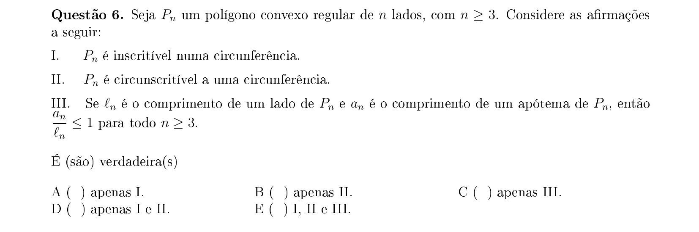

## Q07
**Assunto:** geometria plana
**Competências:** triângulo inscrito, lei dos senos, área de triângulo, relações métricas
**Tipo:** múltipla escolha

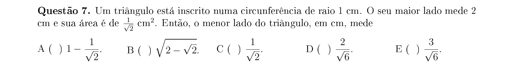

## Q08
**Assunto:** sistemas lineares
**Competências:** sistema impossível, escalonamento, condições sobre parâmetros, posto de matriz
**Tipo:** múltipla escolha

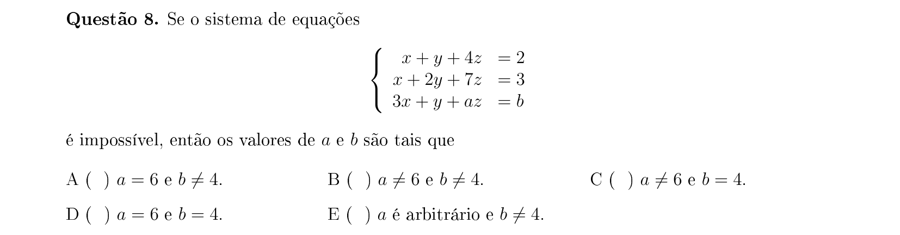

## Q09
**Assunto:** geometria analítica
**Competências:** intersecção reta-circunferência, ângulo central, produto escalar, cosseno
**Tipo:** múltipla escolha

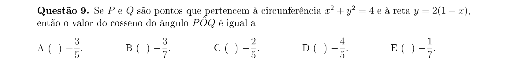

## Q10
**Assunto:** trigonometria
**Competências:** triângulo retângulo, relações métricas, perímetro, sen(β−α), identidades
**Tipo:** múltipla escolha

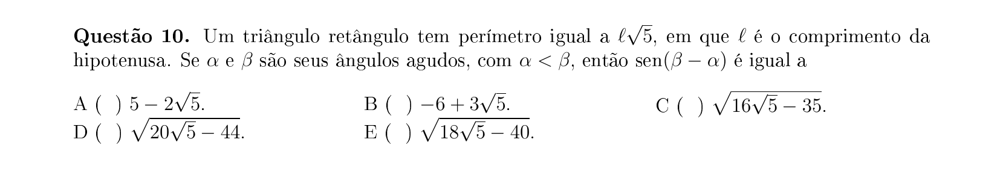

## Q11
**Assunto:** matrizes
**Competências:** transposta, inversa de matriz 2x2, produto de matrizes, operações matriciais
**Tipo:** múltipla escolha

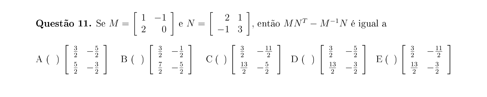

## Q12
**Assunto:** números complexos
**Competências:** sistemas com complexos, módulo, forma polar, potenciação de complexos
**Tipo:** múltipla escolha

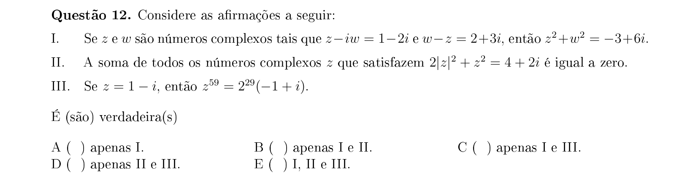

## Q13
**Assunto:** geometria plana
**Competências:** circunferência, tangentes, corda, área de triângulo, relações métricas
**Tipo:** múltipla escolha

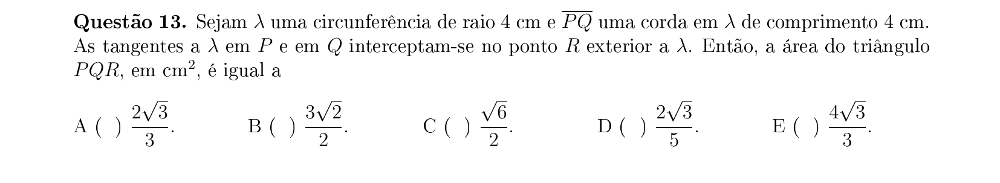

## Q14
**Assunto:** geometria analítica
**Competências:** área de quadrilátero, integração geométrica, divisão de região por reta vertical
**Tipo:** múltipla escolha

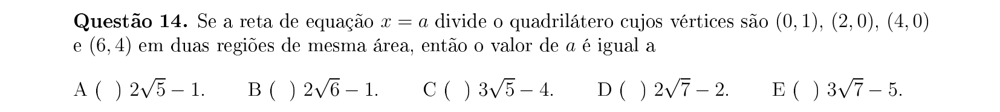

## Q15
**Assunto:** polinômios
**Competências:** progressão geométrica de expoentes, raízes múltiplas, fatoração, raízes complexas
**Tipo:** múltipla escolha

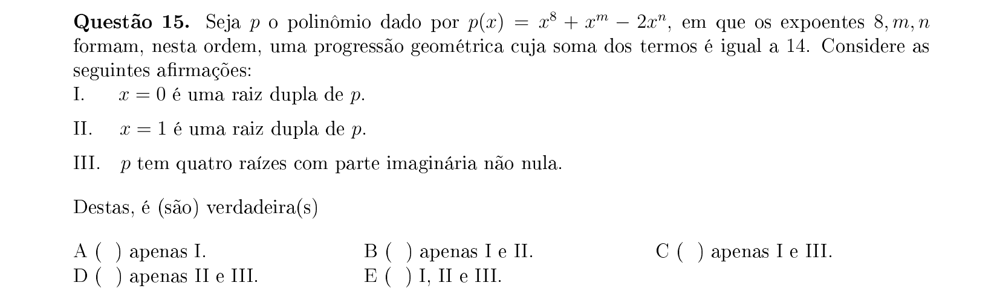

## Q16
**Assunto:** trigonometria
**Competências:** triângulo equilátero, lei dos cossenos, soma de ângulos, geometria plana
**Tipo:** múltipla escolha

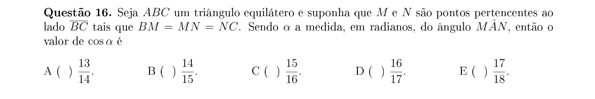

## Q17
**Assunto:** geometria espacial
**Competências:** cone circular reto, esferas inscritas, semelhança de triângulos, volume
**Tipo:** múltipla escolha

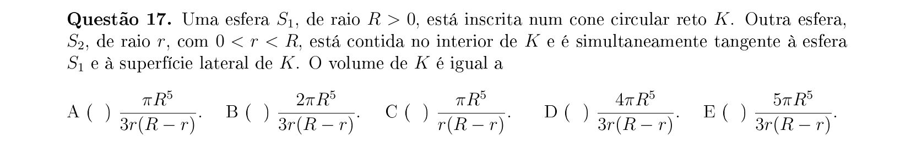

## Q18
**Assunto:** polinômios
**Competências:** polinômio com coeficientes complexos, fatoração, módulo de raízes, relações de Girard
**Tipo:** múltipla escolha

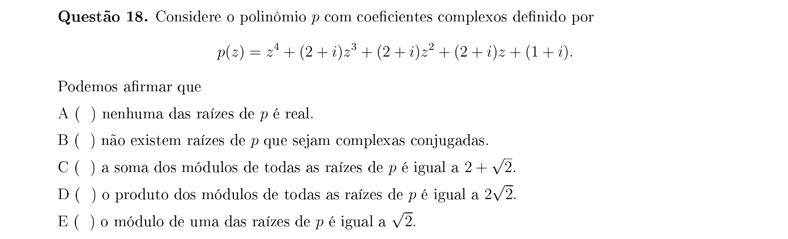

## Q19
**Assunto:** análise combinatória
**Competências:** colorações de cubo, grupo de rotações, contagem com simetrias
**Tipo:** múltipla escolha

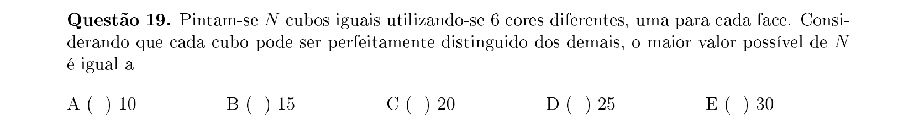

## Q20
**Assunto:** geometria plana
**Competências:** triângulo equilátero, bissetriz, teorema da bissetriz, lei dos cossenos
**Tipo:** múltipla escolha

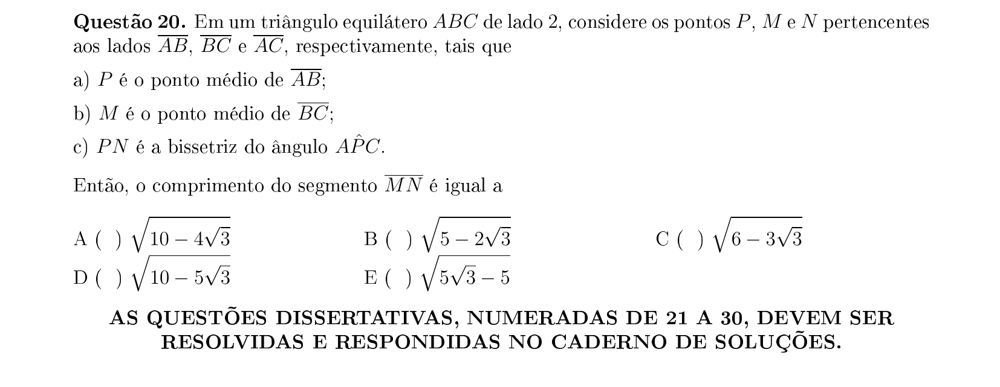

## Q21
**Assunto:** logaritmos
**Competências:** domínio de função logarítmica, base variável, inequações logarítmicas, equações
**Tipo:** discursiva

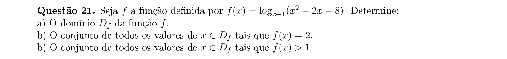

## Q22
**Assunto:** trigonometria
**Competências:** sistema trigonométrico, soma de senos e cossenos, intervalos, identidades
**Tipo:** discursiva

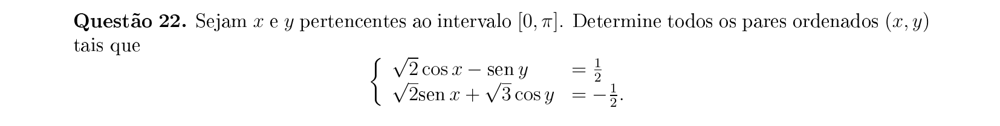

## Q23
**Assunto:** geometria plana
**Competências:** polígonos regulares inscritos, área de hexágono e triângulo, razão de raios
**Tipo:** discursiva

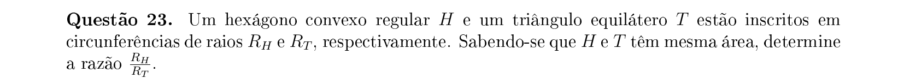

## Q24
**Assunto:** matrizes
**Competências:** matriz inversa à esquerda, sistemas lineares, matrizes ortogonais
**Tipo:** discursiva

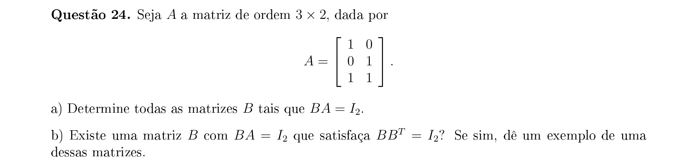

## Q25
**Assunto:** probabilidade
**Competências:** passeio aleatório no plano, contagem, distribuição multinomial, retorno à origem
**Tipo:** discursiva

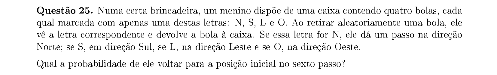

## Q26
**Assunto:** geometria analítica
**Competências:** distância ponto-conjunto, lugar geométrico, parábola, equidistância
**Tipo:** discursiva

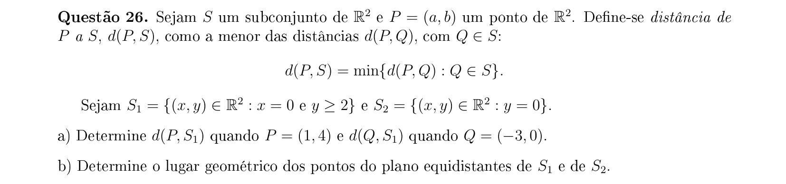

## Q27
**Assunto:** equações algébricas
**Competências:** equação recíproca, mudança de variável, equação do 2º grau, raízes
**Tipo:** discursiva

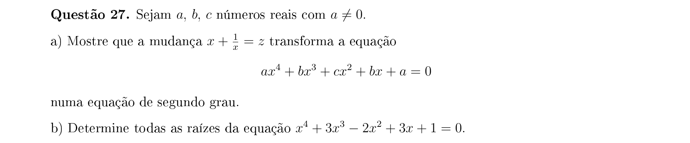

## Q28
**Assunto:** geometria analítica
**Competências:** circunferências, corda comum, tangência reta-circunferência, sistemas de equações
**Tipo:** discursiva

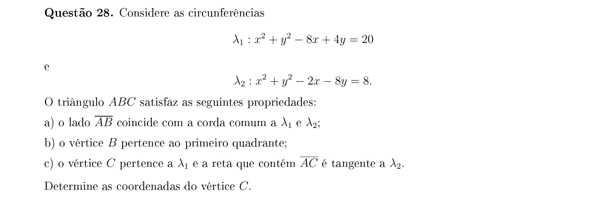

## Q29
**Assunto:** polinômios
**Competências:** divisão de polinômios, binômio de Newton, resto, expansão multinomial
**Tipo:** discursiva

## Q30
**Assunto:** geometria espacial
**Competências:** cone circular reto, tetraedro regular inscrito, volume, relações métricas espaciais
**Tipo:** discursiva

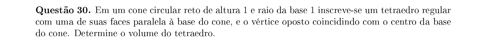
